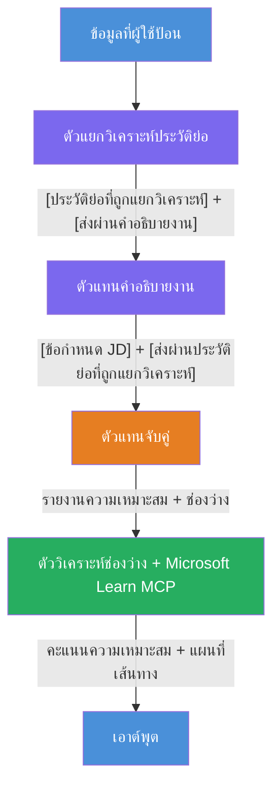

# แล็บ 02 - การทำงานแบบหลายเอเจนต์: ประเมินความเหมาะสมงานจากเรซูเม่

## ภาพรวม

ในแล็บเชิงปฏิบัตินี้ คุณจะสร้าง **แอปแบบหลายเอเจนต์ที่เน้นเวิร์กโฟลว์เป็นหลัก** โดยใช้ Foundry Toolkit ใน VS Code และปรับใช้กับ Microsoft Foundry Agent Service

**สิ่งที่จะสร้าง:** ตัวประเมินความเหมาะสมระหว่างเรซูเม่ → งานที่จะทำ โดยการแยกวิเคราะห์เรซูเม่และคำอธิบายงาน, ให้คะแนนความตรงกัน และสร้างแผนการเรียนรู้เฉพาะบุคคลโดยใช้แหล่งข้อมูลจาก Microsoft Learn

---

## สถาปัตยกรรม

```mermaid
flowchart TD
    A["ข้อมูลที่ผู้ใช้ป้อน"] --> B["ตัวแยกวิเคราะห์ประวัติย่อ"]
    B -->|"[ประวัติย่อที่ถูกแยกวิเคราะห์] + [ส่งผ่านคำอธิบายงาน]"| C["ตัวแทนคำอธิบายงาน"]
    C -->|"[ข้อกำหนด JD] + [ส่งผ่านประวัติย่อที่ถูกแยกวิเคราะห์]"| D["ตัวแทนจับคู่"]
    D -->|รายงานความเหมาะสม + ช่องว่าง| E["ตัววิเคราะห์ช่องว่าง + Microsoft Learn MCP"]
    E -->|คะแนนความเหมาะสม + แผนที่เส้นทาง| F["เอาต์พุต"]

    style A fill:#4A90D9,color:#fff
    style B fill:#7B68EE,color:#fff
    style C fill:#7B68EE,color:#fff
    style D fill:#E67E22,color:#fff
    style E fill:#27AE60,color:#fff
    style F fill:#4A90D9,color:#fff
```

**การทำงาน:**
1. ผู้ใช้แปะเรซูเม่และคำบรรยายงาน
2. **ResumeParser** จะแยกวิเคราะห์เรซูเม่และคัดลอกคำอธิบายงานอย่างตรงตัวลงในส่วน `[JOB DESCRIPTION PASS-THROUGH]`
3. **JD Agent** ดึงข้อกำหนดเชิงโครงสร้างจากส่วน pass-through และส่งต่อ `[PARSED RESUME]` เป็น `[PARSED RESUME PASS-THROUGH]`
4. **MatchingAgent** เปรียบเทียบ `[PARSED RESUME PASS-THROUGH]` กับ `[JD REQUIREMENTS]` และออกคะแนนความเหมาะสม
5. **GapAnalyzer** แปลงช่องว่างเป็นแผนที่การเรียนรู้ที่ใช้งานได้จริง พร้อมดึงลิงก์ Microsoft Learn จริงผ่าน MCP

---

## สิ่งที่ต้องเตรียมก่อน

ให้ทำแล็บ 01 ให้เสร็จก่อน:

- [แล็บ 01 - เอเจนต์เดียว](../lab01-single-agent/README.md)

---

## ส่วนที่ 1: อ่านโมดูลตามลำดับ

ดูเส้นทางการเรียนรู้ทั้งหมดได้ที่:

- [เอกสารแล็บ 2 - สิ่งที่ต้องเตรียม](docs/00-prerequisites.md)
- [เอกสารแล็บ 2 - เส้นทางการเรียนรู้เต็มรูปแบบ](docs/README.md)
- [คู่มือการใช้งาน PersonalCareerCopilot](PersonalCareerCopilot/README.md)

---

## ส่วนที่ 2: สร้างและทดสอบเวิร์กโฟลว์

1. ใช้วิซาร์ดจาก Foundry Toolkit เพื่อสร้างโครงงานแบบเวิร์กโฟลว์
2. คัดลอกบล็อกคำสั่งและกราฟเวิร์กโฟลว์จาก `PersonalCareerCopilot/main.py` ลงในพื้นที่ทำงานของคุณ
3. รันแบบโลคอลด้วย Agent Inspector และตรวจสอบว่าเอเจนต์ทั้งสี่ตัวและเครื่องมือ MCP ทำงานครบถ้วน
4. ปรับใช้เอเจนต์โฮสต์ไปยัง Foundry เมื่อการทดสอบโลคอลผ่าน

---

## แบบแผนการจัดการการทำงานร่วมกัน

แล็บ 02 มีการไหลของงานแบบ **fan-out → fan-in → sequential** ตามค่าเริ่มต้น และเอกสารยังอธิบายรูปแบบการจัดการอื่น ๆ สำหรับการทดลอง

- **Fan-out/Fan-in พร้อมน้ำหนักของความเห็นร่วม**
- **การผ่านการตรวจทาน/วิจารณ์ก่อนแผนที่สุดท้าย**
- **ตัวกำหนดเส้นทางตามเงื่อนไข** ขึ้นกับคะแนนความเหมาะสมและทักษะที่ขาด

ดูที่ [docs/04-orchestration-patterns.md](docs/04-orchestration-patterns.md)

---

**ก่อนหน้า:** [แล็บ 01 - เอเจนต์เดียว](../lab01-single-agent/README.md) · **กลับไปที่:** [หน้าหลักเวิร์กช็อป](../../README.md)

---

<!-- CO-OP TRANSLATOR DISCLAIMER START -->
**ปฏิเสธความรับผิดชอบ**:
เอกสารนี้ได้รับการแปลโดยใช้บริการแปลภาษา AI [Co-op Translator](https://github.com/Azure/co-op-translator) ขณะที่เราพยายามให้ความถูกต้อง โปรดทราบว่าการแปลโดยอัตโนมัติอาจมีข้อผิดพลาดหรือความไม่ถูกต้อง เอกสารต้นฉบับในภาษาต้นทางควรถูกพิจารณาเป็นแหล่งข้อมูลที่เชื่อถือได้ สำหรับข้อมูลที่สำคัญ แนะนำให้ใช้การแปลโดยมนุษย์มืออาชีพ เราไม่รับผิดชอบต่อความเข้าใจผิดหรือการตีความที่ผิดพลาดที่เกิดขึ้นจากการใช้การแปลนี้
<!-- CO-OP TRANSLATOR DISCLAIMER END -->