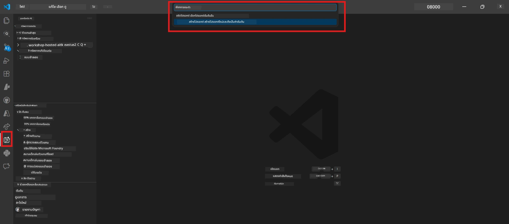

# Module 0 - ข้อกำหนดเบื้องต้น

ก่อนเริ่ม Lab 02 โปรดยืนยันว่าคุณได้ทำสิ่งต่อไปนี้เสร็จแล้ว แล็บนี้สร้างขึ้นบน Lab 01 โดยตรง ห้ามข้าม

---

## 1. ทำ Lab 01 ให้เสร็จสมบูรณ์

Lab 02 สมมติว่าคุณได้ทำสิ่งต่อไปนี้แล้ว:

- [x] ผ่านทุกโมดูล 8 โมดูลของ [Lab 01 - Single Agent](../../lab01-single-agent/README.md)
- [x] ติดตั้งตัวแทนเพียงตัวเดียวสำเร็จใน Foundry Agent Service
- [x] ตรวจสอบแล้วว่าตัวแทนทำงานได้ทั้งใน local Agent Inspector และ Foundry Playground

หากคุณยังไม่ได้ทำ Lab 01 กรุณากลับไปทำให้เสร็จตอนนี้: [Lab 01 Docs](../../lab01-single-agent/docs/00-prerequisites.md)

---

## 2. ตรวจสอบการติดตั้งปัจจุบัน

เครื่องมือทั้งหมดจาก Lab 01 ควรติดตั้งและใช้งานได้อยู่ ให้รันการตรวจสอบอย่างรวดเร็วเหล่านี้:

### 2.1 Azure CLI

```powershell
az account show --query "{name:name, id:id}" --output table
```

ที่คาดหวัง: แสดงชื่อและ ID การสมัครสมาชิกของคุณ หากล้มเหลว ให้รัน [`az login`](https://learn.microsoft.com/cli/azure/authenticate-azure-cli-interactively)

### 2.2 ส่วนขยาย VS Code

1. กด `Ctrl+Shift+P` → พิมพ์ **"Microsoft Foundry"** → ยืนยันว่าคุณเห็นคำสั่ง (เช่น `Microsoft Foundry: Create a New Hosted Agent`)
2. กด `Ctrl+Shift+P` → พิมพ์ **"Foundry Toolkit"** → ยืนยันว่าคุณเห็นคำสั่ง (เช่น `Foundry Toolkit: Open Agent Inspector`)

### 2.3 โครงการและโมเดล Foundry

1. คลิกไอคอน **Microsoft Foundry** ใน VS Code Activity Bar
2. ยืนยันว่าโครงการของคุณแสดงอยู่ (เช่น `workshop-agents`)
3. ขยายโครงการ → ตรวจสอบว่าโมเดลที่ติดตั้งมีอยู่ (เช่น `gpt-4.1-mini`) พร้อมสถานะ **Succeeded**

> **ถ้าการติดตั้งโมเดลของคุณหมดอายุ:** การติดตั้งฟรีบางส่วนหมดอายุอัตโนมัติ ให้ติดตั้งใหม่จาก [Model Catalog](https://learn.microsoft.com/azure/foundry/foundry-models/concepts/models-sold-directly-by-azure) (`Ctrl+Shift+P` → **Microsoft Foundry: Open Model Catalog**)



### 2.4 บทบาท RBAC

ตรวจสอบว่าคุณมีบทบาท **Azure AI User** บนโครงการ Foundry ของคุณ:

1. [Azure Portal](https://portal.azure.com) → ทรัพยากรโครงการ Foundry ของคุณ → **Access control (IAM)** → แท็บ **[Role assignments](https://learn.microsoft.com/azure/foundry/concepts/rbac-foundry)**
2. ค้นหาชื่อของคุณ → ยืนยันว่าแสดง **[Azure AI User](https://aka.ms/foundry-ext-project-role)**

---

## 3. เข้าใจแนวคิด multi-agent (ใหม่สำหรับ Lab 02)

Lab 02 แนะนำแนวคิดที่ไม่ได้ครอบคลุมใน Lab 01 โปรดอ่านก่อนดำเนินการต่อ:

### 3.1 workflow แบบ multi-agent คืออะไร?

แทนที่จะมีตัวแทนเพียงตัวเดียวจัดการทุกอย่าง **workflow แบบ multi-agent** จะแบ่งงานไปยังหลายตัวแทนที่มีความเชี่ยวชาญเฉพาะแต่ละด้าน ตัวแทนแต่ละตัวจะมี:

- **คำสั่ง** ของตัวเอง (system prompt)
- **บทบาท** ของตัวเอง (สิ่งที่ต้องรับผิดชอบ)
- **เครื่องมือ** ทางเลือก (ฟังก์ชันที่เรียกใช้ได้)

ตัวแทนสื่อสารผ่าน **orchestration graph** ซึ่งกำหนดวิธีการไหลของข้อมูลระหว่างกัน

### 3.2 WorkflowBuilder

คลาส [`WorkflowBuilder`](https://learn.microsoft.com/agent-framework/workflows/agents-in-workflows) จาก `agent_framework` คือคอมโพเนนต์ SDK ที่เชื่อมต่อตัวแทนเข้าด้วยกัน:

```python
from agent_framework import WorkflowBuilder

workflow = (
    WorkflowBuilder(
        name="MyWorkflow",
        start_executor=agent_a,
        output_executors=[agent_d],
    )
    .add_edge(agent_a, agent_b)
    .add_edge(agent_a, agent_c)
    .add_edge(agent_b, agent_d)
    .add_edge(agent_c, agent_d)
    .build()
)
```

- **`start_executor`** - ตัวแทนแรกที่รับข้อมูลจากผู้ใช้
- **`output_executors`** - ตัวแทนที่ผลลัพธ์ของพวกเขาจะเป็นการตอบกลับสุดท้าย
- **`add_edge(source, target)`** - กำหนดให้ `target` รับเอาท์พุตจาก `source`

### 3.3 เครื่องมือ MCP (Model Context Protocol)

Lab 02 ใช้ **เครื่องมือ MCP** ที่เรียกใช้ Microsoft Learn API เพื่อดึงทรัพยากรการเรียนรู้ [MCP (Model Context Protocol)](https://modelcontextprotocol.io/introduction) คือโปรโตคอลมาตรฐานสำหรับเชื่อมต่อโมเดล AI กับแหล่งข้อมูลและเครื่องมือภายนอก

| คำศัพท์ | คำจำกัดความ |
|------|-----------|
| **MCP server** | บริการที่เปิดเผยเครื่องมือ/ทรัพยากรผ่าน [MCP protocol](https://learn.microsoft.com/azure/foundry/agents/how-to/tools/model-context-protocol) |
| **MCP client** | โค้ดตัวแทนของคุณที่เชื่อมต่อกับ MCP server และเรียกใช้เครื่องมือของมัน |
| **[Streamable HTTP](https://learn.microsoft.com/agent-framework/agents/tools/hosted-mcp-tools)** | วิธีการขนส่งที่ใช้สื่อสารกับ MCP server |

### 3.4 ความแตกต่างระหว่าง Lab 02 กับ Lab 01

| ด้าน | Lab 01 (Single Agent) | Lab 02 (Multi-Agent) |
|--------|----------------------|---------------------|
| ตัวแทน | 1 | 4 (บทบาทเฉพาะทาง) |
| Orchestration | ไม่มี | WorkflowBuilder (พร้อมกัน + ตามลำดับ) |
| เครื่องมือ | ฟังก์ชัน `@tool` ทางเลือก | เครื่องมือ MCP (เรียก API ภายนอก) |
| ความซับซ้อน | prompt → ตอบสนองง่าย | Resume + JD → คะแนนความเหมาะสม → แผนที่วางแผน |
| การไหลของบริบท | ตรงไปตรงมา | มอบหมายกันระหว่างตัวแทน |

---

## 4. โครงสร้าง repository เวิร์กช็อปสำหรับ Lab 02

ตรวจสอบให้แน่ใจว่าคุณรู้ว่าไฟล์ Lab 02 อยู่ที่ไหน:

```
workshop/
└── lab02-multi-agent/
    ├── README.md                       ← Lab overview
    ├── docs/                           ← You are here
    │   ├── README.md                   ← Learning path index
    │   ├── 00-prerequisites.md         ← This file
    │   ├── 01-understand-multi-agent.md
    │   ├── ...
    │   └── 08-troubleshooting.md
    └── PersonalCareerCopilot/          ← The agent project
        ├── agent.yaml                  ← Agent definition
        ├── main.py                     ← 4-agent workflow code
        ├── Dockerfile                  ← Container configuration
        └── requirements.txt            ← Python dependencies
```

---

### จุดตรวจสอบ

- [ ] Lab 01 เสร็จสมบูรณ์ทั้งหมด (8 โมดูล, ตัวแทนติดตั้งและตรวจสอบแล้ว)
- [ ] `az account show` แสดงการสมัครสมาชิกของคุณ
- [ ] ติดตั้งส่วนขยาย Microsoft Foundry และ Foundry Toolkit และตอบสนองได้
- [ ] โครงการ Foundry มีโมเดลติดตั้งแล้ว (เช่น `gpt-4.1-mini`)
- [ ] คุณมีบทบาท **Azure AI User** บนโครงการ
- [ ] คุณได้อ่านส่วนแนวคิด multi-agent ข้างต้นและเข้าใจ WorkflowBuilder, MCP และ orchestration ของตัวแทน

---

**ต่อไป:** [01 - เข้าใจสถาปัตยกรรม Multi-Agent →](01-understand-multi-agent.md)

---

<!-- CO-OP TRANSLATOR DISCLAIMER START -->
**ข้อจำกัดความรับผิดชอบ**:  
เอกสารนี้ได้รับการแปลโดยใช้บริการแปลภาษาอัตโนมัติ [Co-op Translator](https://github.com/Azure/co-op-translator) แม้เราจะพยายามให้ความถูกต้องสูงสุด แต่โปรดทราบว่าการแปลโดยอัตโนมัติอาจมีข้อผิดพลาดหรือความไม่ถูกต้อง เอกสารต้นฉบับในภาษาต้นทางควรถูกพิจารณาเป็นแหล่งข้อมูลที่เชื่อถือได้ สำหรับข้อมูลที่สำคัญควรใช้การแปลโดยนักแปลมืออาชีพเท่านั้น เราไม่รับผิดชอบต่อความเข้าใจผิดหรือการตีความผิดที่เกิดขึ้นจากการใช้การแปลนี้
<!-- CO-OP TRANSLATOR DISCLAIMER END -->