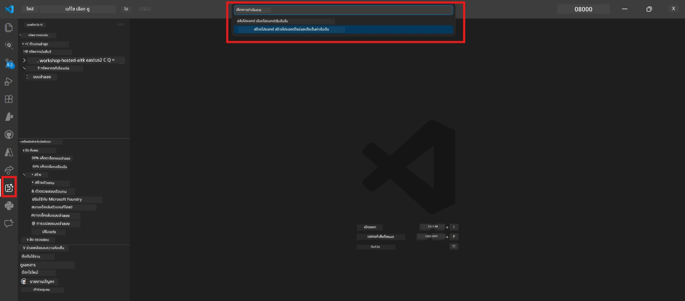

# โมดูล 0 - บทนำ

⏱️ ~10 นาที

> [!WARNING]
> **ตัวอย่างและข้อจำกัด:** [Hosted Agents](https://learn.microsoft.com/azure/foundry/agents/concepts/hosted-agents) ยังอยู่ในสถานะ **ตัวอย่างสาธารณะ** - ไม่แนะนำให้ใช้กับงานผลิตบางอย่าง ฟีเจอร์บางอย่างที่แสดงในเวิร์กช็อปนี้อาจมีการเปลี่ยนแปลงเมื่อตัวบริการเข้าสู่สถานะ GA

## สิ่งที่คุณจะสร้าง

ในแลปนี้ คุณจะขยายทักษะของเอเย่นต์เดี่ยวจากแลป 01 เพื่อสร้าง **เวิร์กโฟลว์หลายเอเย่นต์** - ตัวประเมินความเหมาะสมกับงานจากประวัติย่อ

คุณจะวาง **ประวัติย่อ** และ **คำอธิบายงาน** สี่เอเย่นต์ที่มีความเชี่ยวชาญจะแปรรูปอินพุตตามลำดับ แล้วส่งคืนผลดังนี้:
- คะแนนความเหมาะสม (0–100 พร้อมรายละเอียดการให้คะแนน)
- รายการช่องว่างทักษะและใบรับรอง
- แผนการเรียนรู้ส่วนบุคคลพร้อมลิงก์ Microsoft Learn ที่แท้จริงสำหรับแต่ละช่องว่าง

**เวิร์กโฟลว์นี้ใช้:**
- **Microsoft Agent Framework** - `WorkflowBuilder` สำหรับการจัดการลำดับกระบวนการแบบอนุกรม
- **Foundry Toolkit สำหรับ VS Code** - สร้างโครงสร้าง ทดสอบในเครื่อง และปรับใช้
- **โมเดล AI** (เช่น `gpt-4.1-mini`) - ใช้โดยเอเย่นต์ทั้งสี่ตัว
- **เครื่องแม่ข่าย Microsoft Learn MCP** - ให้ลิงก์ทรัพยากรการเรียนรู้ที่แท้จริงสำหรับช่องว่างทักษะแต่ละรายการ

---

## เลือกเส้นทางของคุณ

> ⚠️ **ดำเนินการต่อด้วยเส้นทางเดียวกับที่คุณใช้ในแลป 01**

<details open>
<summary><strong>🅰️ เส้นทาง A - คลาวด์ Azure (ต้องมีการสมัครใช้งาน Azure)</strong></summary>

| | รายละเอียด |
|---|---|
| **สำหรับใคร?** | คุณทำแลป 01 โดยใช้การสมัครใช้งาน Azure แล้ว |
| **โมเดล** | Azure OpenAI ผ่าน Foundry (เช่น `gpt-4.1-mini`) |
| **โมดูลที่ครอบคลุม** | ทุกโมดูล (00–09) |
| **ปรับใช้สู่คลาวด์?** | ✅ ใช่ - ปรับใช้อย่างครบวงจร |

</details>

<details open>
<summary><strong>🅱️ เส้นทาง B - Foundry Local (ไม่ต้องใช้การสมัคร Azure)</strong></summary>

| | รายละเอียด |
|---|---|
| **สำหรับใคร?** | คุณทำแลป 01 โดยใช้ Foundry Local |
| **โมเดล** | Foundry Local (ฟรี ทำงานบนเครื่องของคุณ) |
| **โมดูลที่ครอบคลุม** | โมดูล 00–05 (ข้าม 06–07 - ปรับใช้ & ยืนยันคลาวด์) |
| **ปรับใช้สู่คลาวด์?** | ❌ ไม่ - ทดสอบในเครื่องเท่านั้นผ่าน Agent Inspector |

</details>

---

## ตรวจสอบแลป 01

แลป 02 สร้างต่อจากแลป 01 โดยตรง กรุณาทำแลป 01 ให้เสร็จก่อนเริ่มต้นที่นี่

ยังไม่ได้ทำแลป 01 หรือ? เริ่มที่นี่: [Lab 01 - Introduction](../../lab01-single-agent/docs/00-prerequisites.md)

<details open>
<summary><strong>🅰️ เส้นทาง A - คลาวด์ Azure</strong></summary>

```powershell
az account show --query "{name:name, id:id}" --output table
```

ถ้าล้มเหลว ให้รัน `az login` จากนั้นยืนยันใน VS Code:

1. กด `Ctrl+Shift+P` → พิมพ์ **Foundry Toolkit** → ยืนยันว่ามีคำสั่งปรากฏ
2. คลิกไอคอน **Foundry Toolkit** → โครงการและโมเดลที่ปรับใช้แสดงสถานะ **สำเร็จ**



> **RBAC:** คุณได้มอบหมายบทบาท **Foundry User** ในแลป 01 แล้ว หากต้องการมอบหมายใหม่ ดูที่ [แลป 01, โมดูล 1](../../lab01-single-agent/docs/01-setup.md#deploy-a-model--assign-rbac) บทบาทนี้เดิมชื่อ **Azure AI User** - มีสิทธิ์เหมือนกัน

</details>

<details open>
<summary><strong>🅱️ เส้นทาง B - Foundry Local</strong></summary>

```powershell
Invoke-WebRequest -Uri "http://localhost:5273/v1/health" -UseBasicParsing | Select-Object StatusCode
```

คาดหวัง: `StatusCode: 200` หากไม่ใช่ ให้รีสตาร์ท Foundry Local จากแถบ Foundry Toolkit

> การประมวลผลทั้งหมดรันบนเครื่องของคุณ การเรียกขาออกเพียงอย่างเดียวคือเครื่องมือ MCP ไปยัง `https://learn.microsoft.com/api/mcp`

</details>

---

## อะไรใหม่ในแลป 02

| | แลป 01 | แลป 02 |
|--|--------|--------|
| เอเย่นต์ | 1 | 4 (เชื่อมต่อกับ WorkflowBuilder) |
| แบบร่างสเกเลตัน | เบื้องต้น - Agent Framework | เวิร์กโฟลว์ - Agent Framework |
| แพ็คเกจใหม่ | - | `mcp` |
| การจัดลำดับ | เอเย่นต์สนทนาเดี่ยว | ท่ออนุกรม (WorkflowBuilder) |
| เครื่องมือใหม่ | - | `search_microsoft_learn_for_plan` (MCP) |

---

**ถัดไป:** [01 - เข้าใจสถาปัตยกรรม →](01-understand-multi-agent.md)

---

<!-- CO-OP TRANSLATOR DISCLAIMER START -->
**ปฏิเสธความรับผิดชอบ**:
เอกสารนี้ได้รับการแปลโดยใช้บริการแปลภาษา AI [Co-op Translator](https://github.com/Azure/co-op-translator) ขณะที่เราพยายามให้ความถูกต้อง โปรดทราบว่าการแปลโดยอัตโนมัติอาจมีข้อผิดพลาดหรือความไม่ถูกต้อง เอกสารต้นฉบับในภาษาต้นทางควรถูกพิจารณาเป็นแหล่งข้อมูลที่เชื่อถือได้ สำหรับข้อมูลที่สำคัญ แนะนำให้ใช้การแปลโดยมนุษย์มืออาชีพ เราไม่รับผิดชอบต่อความเข้าใจผิดหรือการตีความที่ผิดพลาดที่เกิดขึ้นจากการใช้การแปลนี้
<!-- CO-OP TRANSLATOR DISCLAIMER END -->