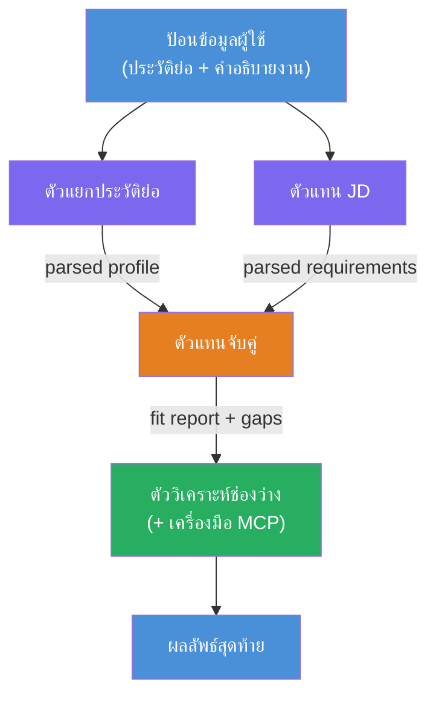
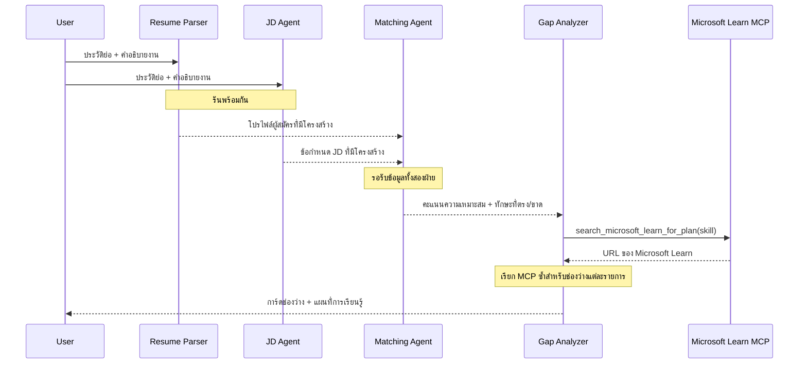
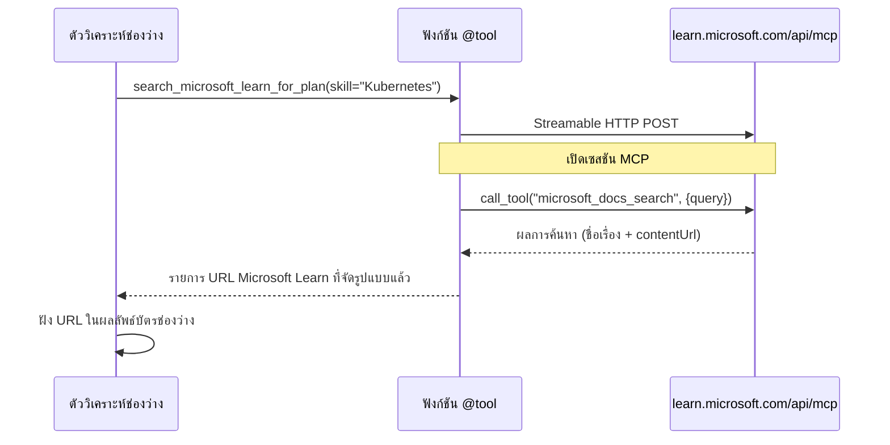

# Module 1 - ทำความเข้าใจสถาปัตยกรรม Multi-Agent

ในโมดูลนี้ คุณจะได้เรียนรู้สถาปัตยกรรมของ Resume → Job Fit Evaluator ก่อนที่จะเขียนโค้ด การเข้าใจกราฟการประสานงาน บทบาทของเอเจนต์ และการไหลของข้อมูลเป็นสิ่งสำคัญสำหรับการดีบักและการขยาย [workflows แบบ multi-agent](https://learn.microsoft.com/azure/architecture/ai-ml/idea/multiple-agent-workflow-automation)

---

## ปัญหาที่แก้ไข

การจับคู่เรซูเม่กับคำอธิบายงานต้องใช้ทักษะหลายอย่างที่แตกต่างกัน:

1. **Parsing** - การสกัดข้อมูลแบบมีโครงสร้างจากข้อความที่ไม่มีโครงสร้าง (เรซูเม่)
2. **Analysis** - การดึงความต้องการจากคำอธิบายงาน
3. **Comparison** - การให้คะแนนการสอดคล้องระหว่างสองอย่าง
4. **Planning** - การวางแผนเส้นทางการเรียนรู้เพื่อเติมเต็มช่องว่าง

เอเจนต์เดียวที่ทำงานทั้งสี่อย่างในพรอมต์เดียวมักจะได้ผลลัพธ์ที่:
- การสกัดข้อมูลไม่สมบูรณ์ (รีบรุดไปรวดเร็วเพื่อไปถึงการให้คะแนน)
- การให้คะแนนตื้นเขิน (ไม่มีการแจกแจงที่อิงหลักฐาน)
- แผนที่เรียนรู้ทั่วไป (ไม่ปรับให้เหมาะกับช่องว่างเฉพาะ)

โดยการแยกเป็น **สี่เอเจนต์เฉพาะทาง** แต่ละตัวจะมุ่งเน้นที่งานของตัวเองด้วยคำสั่งเฉพาะ ส่งผลให้คุณภาพผลลัพธ์ดีขึ้นในทุกขั้นตอน

---

## สี่เอเจนต์

แต่ละเอเจนต์คือเอเจนต์ [Microsoft Foundry](https://learn.microsoft.com/azure/foundry/agents/concepts/hosted-agents) เต็มรูปแบบที่สร้างผ่าน `AzureAIAgentClient.as_agent()` พวกเขาแชร์การใช้งานแบบโมเดลเดียวกันแต่มีคำสั่งและ (ถ้ามี) เครื่องมือต่างกัน

| # | Agent Name | บทบาท | Input | Output |
|---|-----------|------|-------|--------|
| 1 | **ResumeParser** | ดึงข้อมูลโปรไฟล์แบบมีโครงสร้างจากข้อความเรซูเม่ | ข้อความเรซูเม่ดิบ (จากผู้ใช้) | โปรไฟล์ผู้สมัคร, ทักษะทางเทคนิค, ทักษะทางสังคม, ใบรับรอง, ประสบการณ์โดเมน, ความสำเร็จ |
| 2 | **JobDescriptionAgent** | ดึงความต้องการแบบมีโครงสร้างจาก JD | ข้อความ JD ดิบ (จากผู้ใช้, ส่งต่อโดย ResumeParser) | ภาพรวมบทบาท, ทักษะที่ต้องการ, ทักษะที่ต้องการอย่างยิ่ง, ประสบการณ์, ใบรับรอง, การศึกษา, หน้าที่รับผิดชอบ |
| 3 | **MatchingAgent** | คำนวณคะแนนการเหมาะสมที่อิงหลักฐาน | ผลลัพธ์จาก ResumeParser + JobDescriptionAgent | คะแนนความเหมาะสม (0-100 พร้อมแจกแจง), ทักษะที่ตรงกัน, ทักษะที่ขาด, ช่องว่าง |
| 4 | **GapAnalyzer** | สร้างแผนการเรียนรู้ส่วนบุคคล | ผลลัพธ์จาก MatchingAgent | การ์ดช่องว่าง (ต่อทักษะ), ลำดับการเรียนรู้, ระยะเวลา, แหล่งข้อมูลจาก Microsoft Learn |

---

## กราฟการประสานงาน

workflow นี้ใช้ **parallel fan-out** ตามด้วย **sequential aggregation**:


> **คำอธิบาย:** สีม่วง = เอเจนต์แบบขนาน, สีส้ม = จุดรวบรวมผล, สีเขียว = เอเจนต์ขั้นสุดท้ายที่มีเครื่องมือ

### การไหลของข้อมูล


1. **ผู้ใช้ส่ง** ข้อความที่มีเรซูเม่และคำอธิบายงาน
2. **ResumeParser** รับข้อมูลผู้ใช้ทั้งหมดและดึงโปรไฟล์ผู้สมัครแบบมีโครงสร้าง
3. **JobDescriptionAgent** รับข้อมูลผู้ใช้แบบขนานและดึงความต้องการแบบมีโครงสร้าง
4. **MatchingAgent** รับผลลัพธ์จากทั้ง ResumeParser และ JobDescriptionAgent (framework รอทั้งสองเสร็จก่อนเรียก MatchingAgent)
5. **GapAnalyzer** รับผลลัพธ์จาก MatchingAgent และเรียก **Microsoft Learn MCP tool** เพื่อดึงแหล่งทรัพยากรการเรียนรู้จริงสำหรับแต่ละช่องว่าง
6. **ผลลัพธ์สุดท้าย** คือการตอบกลับของ GapAnalyzer ซึ่งรวมคะแนนความเหมาะสม การ์ดช่องว่าง และแผนการเรียนรู้ครบถ้วน

### เพราะอะไร parallel fan-out จึงสำคัญ

ResumeParser และ JobDescriptionAgent ทำงาน **แบบขนาน** เพราะไม่มีการพึ่งพากัน นี่คือการ:
- ลดความหน่วงโดยรวม (ทั้งสองทำงานพร้อมกันแทนที่จะทำทีละอย่าง)
- เป็นการแยกงานตามธรรมชาติ (parsing เรซูเม่กับ parsing JD เป็นงานอิสระ)
- แสดงรูปแบบ common ของ multi-agent: **fan-out → aggregate → act**

---

## WorkflowBuilder ในโค้ด

นี่คือวิธีที่กราฟด้านบนแมปกับการเรียก [`WorkflowBuilder`](https://learn.microsoft.com/agent-framework/workflows/agents-in-workflows) ใน `main.py`:

```python
from agent_framework import WorkflowBuilder

workflow = (
    WorkflowBuilder(
        name="ResumeJobFitEvaluator",
        start_executor=resume_parser,       # ตัวแทนแรกที่รับข้อมูลจากผู้ใช้
        output_executors=[gap_analyzer],     # ตัวแทนสุดท้ายที่ส่งผลลัพธ์กลับ
    )
    .add_edge(resume_parser, jd_agent)      # ResumeParser → JobDescriptionAgent
    .add_edge(resume_parser, matching_agent) # ResumeParser → MatchingAgent
    .add_edge(jd_agent, matching_agent)      # JobDescriptionAgent → MatchingAgent
    .add_edge(matching_agent, gap_analyzer)  # MatchingAgent → GapAnalyzer
    .build()
)
```

**การเข้าใจขอบเชื่อม:**

| Edge | ความหมาย |
|------|--------------|
| `resume_parser → jd_agent` | JD Agent รับผลลัพธ์จาก ResumeParser |
| `resume_parser → matching_agent` | MatchingAgent รับผลลัพธ์จาก ResumeParser |
| `jd_agent → matching_agent` | MatchingAgent ยังรับผลลัพธ์จาก JD Agent (รอทั้งสองอย่างก่อน) |
| `matching_agent → gap_analyzer` | GapAnalyzer รับผลลัพธ์จาก MatchingAgent |

เนื่องจาก `matching_agent` มี **ขาเข้า 2 ขา** (`resume_parser` และ `jd_agent`) framework จะรอจนทั้งคู่เสร็จแล้วจึงเรียก MatchingAgent

---

## เครื่องมือ MCP

เอเจนต์ GapAnalyzer มีเครื่องมือหนึ่งตัวคือ `search_microsoft_learn_for_plan` ซึ่งเป็น **[MCP tool](https://learn.microsoft.com/agent-framework/agents/tools/hosted-mcp-tools)** ที่เรียก Microsoft Learn API เพื่อดึงแหล่งทรัพยากรการเรียนรู้ที่คัดสรรแล้ว

### วิธีทำงาน

```python
@tool
async def search_microsoft_learn_for_plan(
    skill: str, role: str = "", max_results: int = 5
) -> str:
    """Search Microsoft Learn MCP and return curated official links."""
    # เชื่อมต่อกับ https://learn.microsoft.com/api/mcp ผ่าน Streamable HTTP
    # เรียกใช้เครื่องมือ 'microsoft_docs_search' บนเซิร์ฟเวอร์ MCP
    # คืนค่ารายการ URL ของ Microsoft Learn ที่จัดรูปแบบแล้ว
```

### การเรียก MCP


1. GapAnalyzer ตัดสินใจว่าต้องการแหล่งทรัพยากรการเรียนรู้สำหรับทักษะหนึ่ง (เช่น "Kubernetes")
2. framework เรียก `search_microsoft_learn_for_plan(skill="Kubernetes")`
3. ฟังก์ชันเปิดการเชื่อมต่อ [Streamable HTTP](https://learn.microsoft.com/agent-framework/agents/tools/hosted-mcp-tools) ไปยัง `https://learn.microsoft.com/api/mcp`
4. มันเรียกใช้เครื่องมือ `microsoft_docs_search` บน [MCP server](https://learn.microsoft.com/azure/foundry/agents/how-to/tools/model-context-protocol)
5. MCP server ส่งผลการค้นหา (ชื่อ + URL) กลับมา
6. ฟังก์ชันจัดรูปแบบผลลัพธ์และส่งกลับเป็นสตริง
7. GapAnalyzer ใช้ URL ที่ได้รับในผลลัพธ์การ์ดช่องว่าง

### บันทึก MCP ที่คาดหวัง

เมื่อเครื่องมือทำงาน คุณจะเห็นรายการบันทึกเหมือน:

```
GET https://learn.microsoft.com/api/mcp → 405 (Method Not Allowed)
POST https://learn.microsoft.com/api/mcp → 200
DELETE https://learn.microsoft.com/api/mcp → 405 (Method Not Allowed)
```

**เรื่องปกติ.** เซิร์ฟเวอร์ MCP จะสืบค้นด้วย GET และ DELETE ในช่วงการเริ่มต้น - ซึ่งถ้าคืน 405 กลับมา ถือว่าเป็นพฤติกรรมปกติ การเรียกเครื่องมือจริงใช้ POST และคืน 200 เท่านั้น ให้กังวลก็เฉพาะเวลา POST ล้มเหลว

---

## รูปแบบการสร้างเอเจนต์

แต่ละเอเจนต์ถูกสร้างโดยใช้ **[`AzureAIAgentClient.as_agent()`](https://learn.microsoft.com/python/api/overview/azure/ai-agents-readme) async context manager** นี่คือรูปแบบ Foundry SDK สำหรับสร้างเอเจนต์ที่ถูกทำความสะอาดอัตโนมัติ:

```python
async with (
    get_credential() as credential,
    AzureAIAgentClient(
        project_endpoint=PROJECT_ENDPOINT,
        model_deployment_name=MODEL_DEPLOYMENT_NAME,
        credential=credential,
    ).as_agent(
        name="ResumeParser",
        instructions=RESUME_PARSER_INSTRUCTIONS,
    ) as resume_parser,
    # ... ทำซ้ำสำหรับตัวแทนแต่ละคน ...
):
    # ตัวแทนทั้งหมด 4 คนมีอยู่ที่นี่
    workflow = create_workflow(resume_parser, jd_agent, matching_agent, gap_analyzer)
```

**ประเด็นสำคัญ:**
- เอเจนต์แต่ละตัวจะมีอินสแตนซ์ `AzureAIAgentClient` ของตัวเอง (SDK ต้องการให้ชื่อเอเจนต์ถูกขอบเขตกับไคลเอนต์)
- เอเจนต์ทุกตัวแชร์ `credential`, `PROJECT_ENDPOINT`, และ `MODEL_DEPLOYMENT_NAME` เดียวกัน
- บล็อก `async with` ทำให้มั่นใจว่าเอเจนต์ทั้งหมดจะถูกทำความสะอาดเมื่อเซิร์ฟเวอร์ปิดตัว
- GapAnalyzer ได้รับนอกจากนี้ `tools=[search_microsoft_learn_for_plan]`

---

## การเริ่มต้นเซิร์ฟเวอร์

หลังจากสร้างเอเจนต์และสร้าง workflow แล้ว เซิร์ฟเวอร์จะเริ่มทำงาน:

```python
from azure.ai.agentserver.agentframework import from_agent_framework

agent = create_workflow(resume_parser, jd_agent, matching_agent, gap_analyzer)
await from_agent_framework(agent).run_async()
```

`from_agent_framework()` ทำการห่อ workflow เป็น HTTP server ที่เปิดใช้ endpoint `/responses` บนพอร์ต 8088 ซึ่งเป็นรูปแบบเดียวกับใน Lab 01 แต่ "เอเจนต์" ตอนนี้คือทั้ง [workflow graph](https://learn.microsoft.com/agent-framework/workflows/as-agents)

---

### เช็คลิสต์

- [ ] คุณเข้าใจสถาปัตยกรรม 4-agent และบทบาทของแต่ละเอเจนต์
- [ ] คุณสามารถติดตามการไหลของข้อมูล: ผู้ใช้ → ResumeParser → (แบบขนาน) JD Agent + MatchingAgent → GapAnalyzer → ผลลัพธ์
- [ ] คุณเข้าใจเหตุผลที่ MatchingAgent ต้องรอทั้ง ResumeParser และ JD Agent (สองขาเข้า)
- [ ] คุณเข้าใจเครื่องมือ MCP: ทำอะไร, เรียกอย่างไร, และบันทึก GET 405 เป็นเรื่องปกติ
- [ ] คุณเข้าใจรูปแบบ `AzureAIAgentClient.as_agent()` และเหตุผลที่แต่ละเอเจนต์มีไคลเอนต์ของตัวเอง
- [ ] คุณอ่านโค้ด `WorkflowBuilder` แล้วแมปกับกราฟภาพได้

---

**ก่อนหน้า:** [00 - Prerequisites](00-prerequisites.md) · **ถัดไป:** [02 - Scaffold the Multi-Agent Project →](02-scaffold-multi-agent.md)

---

<!-- CO-OP TRANSLATOR DISCLAIMER START -->
**คำปฏิเสธความรับผิดชอบ**:  
เอกสารนี้ได้รับการแปลโดยใช้บริการแปลภาษาด้วย AI [Co-op Translator](https://github.com/Azure/co-op-translator) ขณะที่เราพยายามให้ความถูกต้อง โปรดทราบว่าการแปลอัตโนมัติอาจมีข้อผิดพลาดหรือความคลาดเคลื่อน เอกสารต้นฉบับในภาษาต้นทางควรถือเป็นแหล่งข้อมูลที่ถูกต้องและเชื่อถือได้ สำหรับข้อมูลที่สำคัญ ขอแนะนำให้ใช้การแปลโดยมนุษย์มืออาชีพ เราจะไม่รับผิดชอบต่อความเข้าใจผิดหรือการตีความที่ผิดพลาดที่เกิดจากการใช้การแปลนี้
<!-- CO-OP TRANSLATOR DISCLAIMER END -->