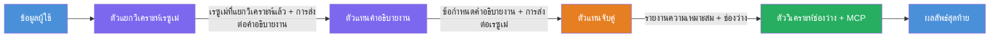

# โมดูล 1 - ทำความเข้าใจสถาปัตยกรรม

⏱️ ~5 นาที

ก่อนที่จะเขียนโค้ดใดๆ นี่คือภาพรวมโดยย่อเกี่ยวกับสิ่งที่คุณกำลังสร้างและวิธีการทำงานของมัน

---

## สิ่งที่คุณกำลังสร้าง

คุณวาง **เรซูเม่** และ **คำอธิบายงาน** เข้าไป กระบวนการจะส่งกลับ:

- คะแนนความเหมาะสม (0–100 พร้อมการแจกแจง)
- รายการช่องว่างของทักษะและใบรับรอง
- แผนที่การเรียนรู้ส่วนบุคคลพร้อมลิงก์ Microsoft Learn สำหรับแต่ละช่องว่าง

---

## สายงานตัวแทนทั้งสี่

ตัวแทนเดียวที่พยายามแยก วิเคราะห์คะแนน และวางแผนทั้งหมดในครั้งเดียวมักจะเร่งรีบและให้ผลลัพธ์ตื้นเขิน การแบ่งงานออกเป็นตัวแทนเฉพาะทางสี่คนให้ผลลัพธ์ที่ดีกว่า:

| ตัวแทน | สิ่งที่ทำ |
|-------|-------------|
| **ResumeParser** | แยกเรซูเม่; คัดลอก JD ตรงๆ ลงใน `[JOB DESCRIPTION PASS-THROUGH]` สำหรับตัวแทนถัดไป |
| **JobDescriptionAgent** | ดึงข้อกำหนด JD จากการส่งผ่าน; ส่งต่อ `[PARSED RESUME]` เป็น `[PARSED RESUME PASS-THROUGH]` |
| **MatchingAgent** | เปรียบเทียบทั้งสองส่วนที่ติดฉลาก; ผลิตคะแนนความเหมาะสม 0–100 และรายการช่องว่าง |
| **GapAnalyzer** | สร้างแผนที่การเรียนรู้; ค้นหา Microsoft Learn สำหรับแต่ละช่องว่าง |

---

## กราฟการประสานงาน

กระบวนการเป็น **สายงานแบบต่อเนื่อง** – ตัวแทนแต่ละคนส่งผลลัพธ์ไปยังตัวถัดไป:


```mermaid
flowchart LR
    A["ข้อมูลผู้ใช้"] --> B["ตัวแยกวิเคราะห์เรซูเม่"]
    B -- "เรซูเม่ที่แยกวิเคราะห์แล้ว + การส่งต่อคำอธิบายงาน" --> C["ตัวแทนคำอธิบายงาน"]
    C -- "ข้อกำหนดคำอธิบายงาน + การส่งต่อเรซูเม่" --> D["ตัวแทนจับคู่"]
    D -- "รายงานความเหมาะสม + ช่องว่าง" --> E["ตัววิเคราะห์ช่องว่าง + MCP"]
    E --> F["ผลลัพธ์สุดท้าย"]

    style A fill:#4A90D9,color:#fff
    style B fill:#7B68EE,color:#fff
    style C fill:#7B68EE,color:#fff
    style D fill:#E67E22,color:#fff
    style E fill:#27AE60,color:#fff
    style F fill:#4A90D9,color:#fff
```

1. **ResumeParser** รับข้อมูลจากผู้ใช้ แยกเรซูเม่ และคัดลอก JD ลงใน `[JOB DESCRIPTION PASS-THROUGH]`
2. **JD Agent** ดึงข้อกำหนดเชิงโครงสร้างและส่งต่อ `[PARSED RESUME PASS-THROUGH]` ไปข้างหน้า
3. **MatchingAgent** เปรียบเทียบทั้งสองส่วนและสร้างคะแนนความเหมาะสมพร้อมรายการช่องว่าง
4. **GapAnalyzer** สร้างแผนที่และเรียกใช้เครื่องมือ MCP ของ Microsoft Learn สำหรับแต่ละช่องว่าง

---

## การแมปสิ่งนี้กับโค้ด

ใน `main.py` คุณอธิบายกราฟนี้ด้วย `WorkflowBuilder`:

```python
workflow_agent = (
    WorkflowBuilder(
        start_executor=resume_executor,       # เอเย่นต์แรกที่รับข้อมูลจากผู้ใช้
        output_executors=[gap_executor],      # เอเย่นต์สุดท้าย - ข้อมูลออกของมันคือคำตอบ
    )
    .add_edge(resume_executor, jd_executor)       # ResumeParser → เอเย่นต์ JD
    .add_edge(jd_executor, matching_executor)     # เอเย่นต์ JD → MatchingAgent
    .add_edge(matching_executor, gap_executor)    # MatchingAgent → GapAnalyzer
    .build()
    .as_agent()
)
```

ตัวแทนแต่ละคนถูกห่อหุ้มภายใน `AgentExecutor` การเรียกใช้ `add_edge()` กำหนดสายงานแบบต่อเนื่องอย่างเคร่งครัด - ตัวแทนแต่ละคนจะได้รับผลลัพธ์เฉพาะจากตัวก่อนหน้าโดยตรงเท่านั้น

> `context_mode="last_agent"` หมายความว่าแต่ละผู้ดำเนินการจะเห็นแค่ผลลัพธ์ของตัวก่อนหน้าของตนเท่านั้น ResumeParser และ JD Agent ส่งผ่านข้อมูลในส่วนที่ติดป้ายกำกับเพื่อให้แต่ละตัวแทนข้างล่างมีสิ่งที่จำเป็นอย่างแม่นยำ

---

## เครื่องมือ MCP

GapAnalyzer มีเครื่องมือหนึ่งตัว: `search_microsoft_learn_for_plan` มันเชื่อมต่อกับ `https://learn.microsoft.com/api/mcp` และส่งกลับลิงก์ Microsoft Learn ที่แท้จริงสำหรับแต่ละช่องว่างทักษะ

เมื่อเครื่องมือทำงานคุณจะเห็นบันทึกเหล่านี้ - ทั้งหมดเป็นเรื่องปกติ:

```
GET  https://learn.microsoft.com/api/mcp → 405   ← connection probe, normal
POST https://learn.microsoft.com/api/mcp → 200   ← actual tool call
DELETE https://learn.microsoft.com/api/mcp → 405 ← cleanup probe, normal
```

ไม่ต้องกังวลถ้า `POST` ส่งกลับข้อผิดพลาด

---

**ก่อนหน้า:** [00 - ข้อกำหนดเบื้องต้น](00-prerequisites.md) · **ถัดไป:** [02 - สร้างโครงร่างโปรเจกต์ →](02-scaffold-multi-agent.md)

---

<!-- CO-OP TRANSLATOR DISCLAIMER START -->
**ปฏิเสธความรับผิดชอบ**:
เอกสารนี้ได้รับการแปลโดยใช้บริการแปลภาษา AI [Co-op Translator](https://github.com/Azure/co-op-translator) ขณะที่เราพยายามให้ความถูกต้อง โปรดทราบว่าการแปลโดยอัตโนมัติอาจมีข้อผิดพลาดหรือความไม่ถูกต้อง เอกสารต้นฉบับในภาษาต้นทางควรถูกพิจารณาเป็นแหล่งข้อมูลที่เชื่อถือได้ สำหรับข้อมูลที่สำคัญ แนะนำให้ใช้การแปลโดยมนุษย์มืออาชีพ เราไม่รับผิดชอบต่อความเข้าใจผิดหรือการตีความที่ผิดพลาดที่เกิดขึ้นจากการใช้การแปลนี้
<!-- CO-OP TRANSLATOR DISCLAIMER END -->