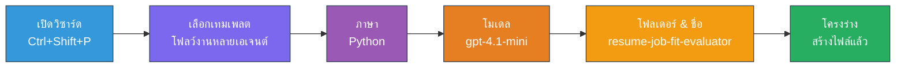
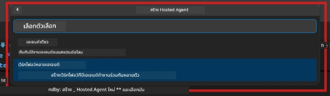

# Module 2 - โครงร่างโปรเจกต์ Multi-Agent

ในโมดูลนี้ คุณจะใช้ [ส่วนขยาย Microsoft Foundry](https://marketplace.visualstudio.com/items?itemName=TeamsDevApp.vscode-ai-foundry) เพื่อ **สร้างโครงร่างโปรเจกต์การทำงานแบบหลายเอเจนต์** ส่วนขยายจะสร้างโครงสร้างโปรเจกต์ทั้งหมด - `agent.yaml`, `main.py`, `Dockerfile`, `requirements.txt`, `.env` และการตั้งค่า debug จากนั้นคุณสามารถปรับแต่งไฟล์เหล่านี้ในโมดูล 3 และ 4

> **หมายเหตุ:** โฟลเดอร์ `PersonalCareerCopilot/` ในแลปนี้เป็นตัวอย่างโปรเจกต์ multi-agent ที่ปรับแต่งและใช้งานได้สมบูรณ์ คุณสามารถสร้างโปรเจกต์ใหม่ (แนะนำสำหรับการเรียนรู้) หรือศึกษาจากโค้ดที่มีอยู่โดยตรง

---

## ขั้นตอนที่ 1: เปิดตัวช่วยสร้าง Create Hosted Agent


1. กด `Ctrl+Shift+P` เพื่อเปิด **Command Palette**  
2. พิมพ์: **Microsoft Foundry: Create a New Hosted Agent** แล้วเลือก  
3. ตัวช่วยสร้างการสร้าง hosted agent จะเปิดขึ้น

> **ทางเลือก:** คลิกไอคอน **Microsoft Foundry** ใน Activity Bar → คลิกไอคอน **+** ข้างๆ **Agents** → **Create New Hosted Agent**

---

## ขั้นตอนที่ 2: เลือกเทมเพลต Multi-Agent Workflow

ตัวช่วยสร้างจะให้คุณเลือกเทมเพลต:

| เทมเพลต | คำอธิบาย | ใช้เมื่อไหร่ |
|----------|-------------|-------------|
| Single Agent | เอเจนต์เดียวที่มีคำสั่งและเครื่องมือเสริม | แลป 01 |
| **Multi-Agent Workflow** | หลายเอเจนต์ที่ทำงานร่วมกันผ่าน WorkflowBuilder | **แลปนี้ (แลป 02)** |

1. เลือก **Multi-Agent Workflow**  
2. คลิก **ถัดไป**



---

## ขั้นตอนที่ 3: เลือกภาษาโปรแกรม

1. เลือก **Python**  
2. คลิก **ถัดไป**

---

## ขั้นตอนที่ 4: เลือกรุ่นโมเดลของคุณ

1. ตัวช่วยสร้างจะแสดงโมเดลที่ติดตั้งในโปรเจกต์ Foundry ของคุณ  
2. เลือกรุ่นโมเดลเดียวกับที่ใช้ในแลป 01 (เช่น **gpt-4.1-mini**)  
3. คลิก **ถัดไป**

> **เคล็ดลับ:** [`gpt-4.1-mini`](https://learn.microsoft.com/azure/foundry/foundry-models/concepts/models-sold-directly-by-azure#gpt-41-series) แนะนำสำหรับการพัฒนา - เร็ว ราคาถูก และรองรับ Multi-Agent Workflow ดี เปลี่ยนเป็น `gpt-4.1` เมื่อต้องการใช้งานจริงเพื่อคุณภาพผลลัพธ์ที่สูงกว่า

---

## ขั้นตอนที่ 5: เลือกโฟลเดอร์และตั้งชื่อเอเจนต์

1. จะเปิดกล่องโต้ตอบเลือกไฟล์ เลือกโฟลเดอร์ปลายทาง:  
   - หากทำตาม repo ของเวิร์กช็อป: ไปที่ `workshop/lab02-multi-agent/` แล้วสร้างโฟลเดอร์ย่อยใหม่  
   - หากเริ่มจากศูนย์: เลือกโฟลเดอร์ใดก็ได้  
2. ใส่ **ชื่อ** ของ hosted agent (เช่น `resume-job-fit-evaluator`)  
3. คลิก **Create**

---

## ขั้นตอนที่ 6: รอการสร้างโครงร่างเสร็จสมบูรณ์

1. VS Code จะเปิดหน้าต่างใหม่ (หรือหน้าต่างปัจจุบันอัปเดต) ที่มีโปรเจกต์โครงร่าง  
2. คุณควรเห็นโครงสร้างไฟล์ดังนี้:

```
resume-job-fit-evaluator/
├── .env                ← Environment variables (placeholders)
├── .vscode/
│   └── launch.json     ← Debug configuration
├── agent.yaml          ← Agent definition (kind: hosted)
├── Dockerfile          ← Container configuration
├── main.py             ← Multi-agent workflow code (scaffold)
└── requirements.txt    ← Python dependencies
```

> **หมายเหตุเวิร์กช็อป:** ใน repo เวิร์กช็อป, โฟลเดอร์ `.vscode/` อยู่ที่ **รากของ workspace** พร้อมไฟล์ `launch.json` และ `tasks.json` ที่แชร์กัน การตั้งค่า debug สำหรับแลป 01 และแลป 02 มีครบ เมื่อกด F5 ให้เลือก **"Lab02 - Multi-Agent"** จากรายการดรอปดาวน์

---

## ขั้นตอนที่ 7: ทำความเข้าใจไฟล์โครงร่าง (เฉพาะ multi-agent)

โครงร่าง multi-agent แตกต่างจาก single-agent ในหลายจุดสำคัญ:

### 7.1 `agent.yaml` - คำจำกัดความเอเจนต์

```yaml
kind: hosted
name: resume-job-fit-evaluator
description: >
  A multi-agent workflow that evaluates resume-to-job fit.
metadata:
  authors:
    - Microsoft
  tags:
    - Multi-Agent Workflow
    - Resume Evaluator
protocols:
  - protocol: responses
    version: v1
environment_variables:
  - name: PROJECT_ENDPOINT
    value: ${PROJECT_ENDPOINT}
  - name: MODEL_DEPLOYMENT_NAME
    value: ${MODEL_DEPLOYMENT_NAME}
```

**ความแตกต่างหลักจากแลป 01:** ส่วน `environment_variables` อาจมีตัวแปรเพิ่มเติมสำหรับจุดเชื่อมต่อ MCP หรือการตั้งค่าเครื่องมืออื่นๆ ส่วน `name` และ `description` สะท้อนการใช้งาน multi-agent

### 7.2 `main.py` - โค้ด workflow multi-agent

โครงร่างรวมถึง:  
- **สตริงคำสั่งหลายเอเจนต์** (ค่าคงที่หนึ่งตัวต่อเอเจนต์)  
- **ตัวจัดการบริบท [`AzureAIAgentClient.as_agent()`](https://learn.microsoft.com/python/api/overview/azure/ai-agents-readme) หลายตัว** (หนึ่งตัวต่อเอเจนต์)  
- **[`WorkflowBuilder`](https://learn.microsoft.com/agent-framework/workflows/agents-in-workflows)** เพื่อเชื่อมโยงเอเจนต์เข้าด้วยกัน  
- **`from_agent_framework()`** เพื่อเสิร์ฟ workflow เป็น HTTP endpoint

```python
from agent_framework import WorkflowBuilder, tool
from agent_framework.azure import AzureAIAgentClient
from azure.ai.agentserver.agentframework import from_agent_framework
```

การนำเข้าเพิ่มเติม [`WorkflowBuilder`](https://learn.microsoft.com/agent-framework/workflows/agents-in-workflows) เป็นสิ่งใหม่เมื่อเทียบกับแลป 01

### 7.3 `requirements.txt` - การพึ่งพาเพิ่มเติม

โปรเจกต์ multi-agent ใช้แพ็กเกจพื้นฐานเหมือนแลป 01 พร้อมกับแพ็กเกจที่เกี่ยวข้องกับ MCP:

```
agent-framework-azure-ai==1.0.0rc3
agent-framework-core==1.0.0rc3
azure-ai-agentserver-agentframework==1.0.0b16
azure-ai-agentserver-core==1.0.0b16
debugpy
agent-dev-cli --pre
```

> **หมายเหตุสำคัญเรื่องเวอร์ชัน:** แพ็กเกจ `agent-dev-cli` ต้องมีแฟลก `--pre` ใน `requirements.txt` เพื่อการติดตั้งเวอร์ชันพรีวิวล่าสุด จำเป็นสำหรับความเข้ากันได้กับ Agent Inspector ใน `agent-framework-core==1.0.0rc3` ดูรายละเอียดเวอร์ชันใน [Module 8 - Troubleshooting](08-troubleshooting.md)

| แพ็กเกจ | เวอร์ชัน | จุดประสงค์ |
|---------|---------|---------|
| [`agent-framework-azure-ai`](https://learn.microsoft.com/agent-framework/overview/) | `1.0.0rc3` | การผนวกกับ Azure AI สำหรับ [Microsoft Agent Framework](https://github.com/microsoft/agent-framework) |
| [`agent-framework-core`](https://learn.microsoft.com/agent-framework/overview/) | `1.0.0rc3` | Core runtime (รวม WorkflowBuilder) |
| `azure-ai-agentserver-agentframework` | `1.0.0b16` | runtime เซิร์ฟเวอร์ hosted agent |
| `azure-ai-agentserver-core` | `1.0.0b16` | ส่วนฐานของเซิร์ฟเวอร์ agent |
| `debugpy` | ล่าสุด | การดีบัก Python (กด F5 ใน VS Code) |
| `agent-dev-cli` | `--pre` | คำสั่ง CLI สำหรับการพัฒนาท้องถิ่น + backend ของ Agent Inspector |

### 7.4 `Dockerfile` - เหมือนแลป 01

Dockerfile เหมือนกับในแลป 01 - คัดลอกไฟล์ ติดตั้ง dependencies จาก `requirements.txt` เปิดพอร์ต 8088 และรัน `python main.py`

```dockerfile
FROM python:3.14-slim
WORKDIR /app
COPY ./ .
RUN pip install --upgrade pip && \
    if [ -f requirements.txt ]; then \
        pip install -r requirements.txt; \
    else \
      echo "No requirements.txt found" >&2; exit 1; \
    fi
EXPOSE 8088
CMD ["python", "main.py"]
```

---

### จุดตรวจสอบ

- [ ] ตัวช่วยสร้างโครงร่างเสร็จสมบูรณ์ → โครงสร้างโปรเจกต์ใหม่แสดงผล  
- [ ] คุณเห็นไฟล์ทั้งหมด: `agent.yaml`, `main.py`, `Dockerfile`, `requirements.txt`, `.env`  
- [ ] `main.py` มีการนำเข้า `WorkflowBuilder` (ยืนยันว่าเลือกเทมเพลต multi-agent)  
- [ ] `requirements.txt` มีทั้ง `agent-framework-core` และ `agent-framework-azure-ai`  
- [ ] คุณเข้าใจความแตกต่างระหว่างโครงร่าง multi-agent กับ single-agent (หลายเอเจนต์, WorkflowBuilder, เครื่องมือ MCP)

---

**ก่อนหน้า:** [01 - Understand Multi-Agent Architecture](01-understand-multi-agent.md) · **ถัดไป:** [03 - Configure Agents & Environment →](03-configure-agents.md)

---

<!-- CO-OP TRANSLATOR DISCLAIMER START -->
**ข้อจำกัดความรับผิดชอบ**:  
เอกสารนี้ได้รับการแปลโดยใช้บริการแปลภาษา AI [Co-op Translator](https://github.com/Azure/co-op-translator) แม้เราจะพยายามให้ความถูกต้อง โปรดทราบว่าการแปลโดยอัตโนมัติอาจมีข้อผิดพลาดหรือความไม่ถูกต้อง เอกสารฉบับต้นฉบับในภาษาต้นทางถือเป็นแหล่งข้อมูลที่เชื่อถือได้ สำหรับข้อมูลที่สำคัญ ขอแนะนำให้ใช้บริการแปลโดยมนุษย์มืออาชีพ เราไม่รับผิดชอบต่อความเข้าใจผิดหรือการตีความผิดใด ๆ ที่เกิดขึ้นจากการใช้การแปลนี้
<!-- CO-OP TRANSLATOR DISCLAIMER END -->