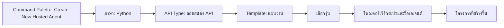
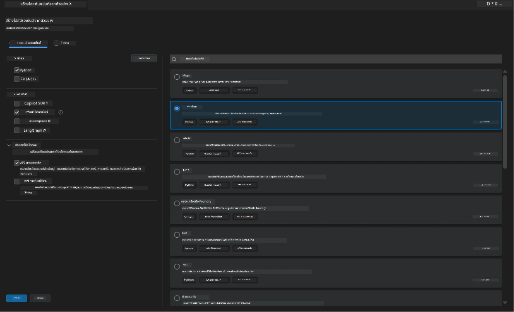
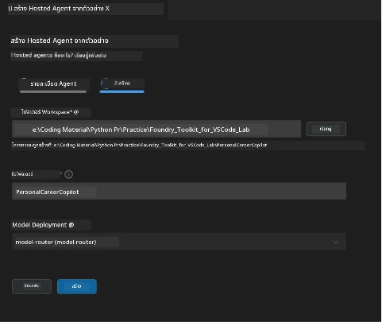

# โมดูล 2 - สร้างโครงร่างโปรเจกต์แบบ Multi-Agent

⏱️ ~5 นาที

ในโมดูลนี้ คุณจะใช้ [Foundry Toolkit for VS Code](https://aka.ms/foundrytk) เพื่อ **สร้างโครงร่างโปรเจกต์ multi-agent** ตัวช่วยสร้างจะสร้างไฟล์ `agent.yaml`, `main.py`, `Dockerfile`, `requirements.txt`, `.env`, และการตั้งค่าการดีบักใน VS Code - เพื่อคุณจะได้เน้นที่การเชื่อมต่อ workflow แบบ 4-agent ในโมดูล 3

> **แนวคิดหลัก:** โครงร่างคือโค้ดตัวอย่างที่ใช้งานได้ที่มีเอเย่นต์หนึ่งตัว คุณแทนที่ตรรกะที่เป็นตัวแทนด้วยกราฟ `WorkflowBuilder` ในโมดูล 3 คุณไม่ต้องเขียนโค้ดพื้นฐานตั้งแต่ต้น

> **ตัวอย่างอ้างอิง:** [`PersonalCareerCopilot/`](../../../../../workshop/lab02-multi-agent/PersonalCareerCopilot) เป็นตัวอย่างที่สมบูรณ์และทำงานได้ ใช้ตรวจสอบงานของคุณขณะดำเนินการ

### ขั้นตอนการใช้งานตัวช่วยสร้างโครงร่าง


```mermaid
flowchart LR
    A[Command Palette: Create New Hosted Agent] --> B[ภาษา: Python]
    B --> C[API Type: ตอบสนอง API]
    C --> D[Template: แผนงาน]
    D --> E[เลือกรุ่น]
    E --> F[โฟลเดอร์เวิร์กสเปซและชื่อเอเจนต์]
    F --> G[โครงการที่สร้างขึ้น]
```

---

## ขั้นตอนที่ 1: เปิดตัวช่วยสร้าง Create Hosted Agent

1. กด `Ctrl+Shift+P` เพื่อเปิด **Command Palette**
2. พิมพ์: **Foundry Toolkit: Create a New Hosted Agent** แล้วเลือกคำสั่งนี้
3. ตัวช่วยสร้างจะเปิดที่แท็บ **Agent Details**

> **ทางเลือก:** คลิกที่ไอคอน **Foundry Toolkit** ใน Activity Bar → คลิกไอคอน **+** ข้าง **Hosted Agents** → **Create New Hosted Agent**

---

## ขั้นตอนที่ 2: เลือกการตั้งค่า



1. ในส่วนเมนูด้านซ้าย เลือกดังนี้:

| เมนู | การเลือก | หมายเหตุ |
|--------|-----------|-------|
| **ภาษา** | Python | รองรับ C# (.NET) ด้วย |
| **เฟรมเวิร์ก** | Agent Framework | มี `Agent`, `AgentExecutor`, `WorkflowBuilder` |
| **ประเภท API** | Response API | `POST /responses` - ประวัติจัดการโดยแพลตฟอร์ม, รองรับสตรีมมิ่ง |
| **เทมเพลต** | **Workflows** | ประมวลผลคำขอผ่านเอเย่นต์หลายตัวตามลำดับ |

2. เลือกแล้ว คลิก **Next**



3. ในหน้าต่างถัดไป เลือกดังนี้:

| เมนู | การเลือก | หมายเหตุ |
|--------|-----------|-------|
| **โฟลเดอร์ Workspace** | เลือกโฟลเดอร์เป้าหมาย | เช่น `workshop/lab02-multi-agent/` ในรีโปนี้ |
| **ชื่อเอเย่นต์** | `PersonalCareerCopilot` | ชื่อนี้จะเป็นชื่อไดเรกทอรีโปรเจกต์ |
| **Model Deployment** | เลือกรุ่นที่คุณได้ปล่อยใช้งาน | เช่น `gpt-4.1-mini` จาก Lab 01 |

4. คลิก **Create** เพื่อสร้างโครงร่างโปรเจกต์ VS Code จะสร้างไฟล์และเปิดโฟลเดอร์ให้อัตโนมัติ

> **คำแนะนำ:** [`gpt-4.1-mini`](https://learn.microsoft.com/azure/foundry/foundry-models/concepts/models-sold-directly-by-azure#gpt-41-series) สมดุลระหว่างความเร็วและคุณภาพได้ดีสำหรับการพัฒนา multi-agent

---

## ขั้นตอนที่ 3: ตรวจสอบโปรเจกต์ที่สร้าง

หลังจากสร้างโครงร่างเสร็จ ตรวจสอบว่าคุณเห็นไฟล์ดังนี้ใน Explorer (`Ctrl+Shift+E`):

```
📂 <your-agent-name>/
├── .azdignore          ← Files excluded from Azure Developer CLI deployments
├── .dockerignore       ← Files excluded from Docker builds
├── .env                ← Environment variables (placeholders - fill in Module 3)
├── .vscode/
│   ├── launch.json     ← Debug config (F5 → run + Agent Inspector)
│   └── tasks.json      ← VS Code task definitions
├── agent.yaml          ← Agent definition (kind: hosted, protocol: responses)
├── Dockerfile          ← Container config for deployment
├── main.py             ← Stub agent entry point (replace with WorkflowBuilder in Module 3)
└── requirements.txt    ← Python dependencies
```

> **ข้อสำคัญ:** เปิดโฟลเดอร์ที่โครงร่างนี้สร้างขึ้นโดยตรงใน VS Code เพื่อให้ `.vscode/launch.json` และ `tasks.json` ทำงานถูกต้องสำหรับการดีบักด้วย F5

### อธิบายไฟล์สำคัญ

| ไฟล์ | จุดประสงค์ |
|------|---------|
| `agent.yaml` | ประกาศ `kind: hosted`, เชื่อมตัวแปร env, กำหนดโปรโตคอล `/responses` |
| `main.py` | โค้ดตัวอย่าง: มี `FoundryChatClient` → `Agent` → `ResponsesHostServer` หนึ่งตัว คุณจะเปลี่ยนเป็น 4 agent พร้อม `WorkflowBuilder` ในโมดูล 3 |
| `Dockerfile` | ใช้ `python:3.12-slim`, ติดตั้งจาก `requirements.txt`, เปิดพอร์ต 8088, รัน `python main.py` |
| `requirements.txt` | `agent-framework-foundry`, `agent-framework-foundry-hosting`, `mcp<2,>=1.24.0`, `debugpy` |

> **อ้างอิง:** ดูที่ [`PersonalCareerCopilot/agent.yaml`](../../../../../workshop/lab02-multi-agent/PersonalCareerCopilot/agent.yaml) และ [`PersonalCareerCopilot/requirements.txt`](../../../../../workshop/lab02-multi-agent/PersonalCareerCopilot/requirements.txt) สำหรับเนื้อหาที่สร้างครบถ้วน

---

### ✅ จุดตรวจสอบ

- [ ] ตัวช่วยสร้างโครงร่างเสร็จสิ้น - โฟลเดอร์โปรเจกต์ใหม่แสดงใน Explorer
- [ ] ไฟล์ทั้งหมดที่คาดไว้มีอยู่: `agent.yaml`, `main.py`, `Dockerfile`, `requirements.txt`, `.env`
- [ ] `agent.yaml` แสดง `kind: hosted` และ `protocol: responses`
- [ ] `main.py` นำเข้า `Agent`, `FoundryChatClient`, `ResponsesHostServer`
- [ ] โฟลเดอร์ที่สร้างโครงร่างเปิดเป็นราก workspace ของ VS Code
- [ ] คุณเข้าใจว่า `main.py` เป็นโค้ดตัวอย่าง - `WorkflowBuilder` จะเพิ่มในโมดูล 3

---

**ก่อนหน้า:** [01 - เข้าใจสถาปัตยกรรม Multi-Agent](01-understand-multi-agent.md) · **ถัดไป:** [03 - ตั้งค่า Agents & Environment →](03-configure-agents.md)

---

<!-- CO-OP TRANSLATOR DISCLAIMER START -->
**ปฏิเสธความรับผิดชอบ**:
เอกสารนี้ได้รับการแปลโดยใช้บริการแปลภาษา AI [Co-op Translator](https://github.com/Azure/co-op-translator) ขณะที่เราพยายามให้ความถูกต้อง โปรดทราบว่าการแปลโดยอัตโนมัติอาจมีข้อผิดพลาดหรือความไม่ถูกต้อง เอกสารต้นฉบับในภาษาต้นทางควรถูกพิจารณาเป็นแหล่งข้อมูลที่เชื่อถือได้ สำหรับข้อมูลที่สำคัญ แนะนำให้ใช้การแปลโดยมนุษย์มืออาชีพ เราไม่รับผิดชอบต่อความเข้าใจผิดหรือการตีความที่ผิดพลาดที่เกิดขึ้นจากการใช้การแปลนี้
<!-- CO-OP TRANSLATOR DISCLAIMER END -->