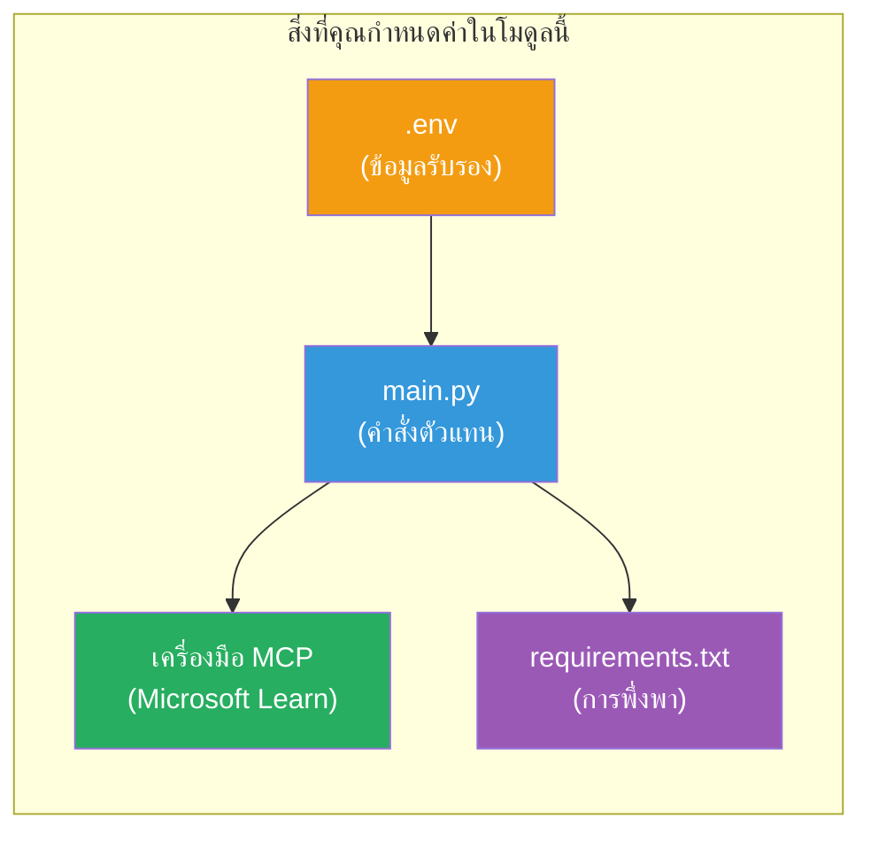

# Module 3 - กำหนดค่า Agents, เครื่องมือ MCP & สภาพแวดล้อม

ในโมดูลนี้ คุณจะปรับแต่งโปรเจกต์หลายเอเย่นต์ที่สร้างขึ้นโดยใช้โครงร่าง คุณจะเขียนคำสั่งสำหรับเอเย่นต์ทั้งสี่ ตั้งค่าเครื่องมือ MCP สำหรับ Microsoft Learn กำหนดค่าตัวแปรสภาพแวดล้อม และติดตั้ง dependencies


> **อ้างอิง:** โค้ดทำงานสมบูรณ์อยู่ที่ [`PersonalCareerCopilot/main.py`](../../../../../workshop/lab02-multi-agent/PersonalCareerCopilot/main.py) ให้ใช้เป็นอ้างอิงขณะสร้างของคุณเอง

---

## ขั้นตอนที่ 1: กำหนดค่าตัวแปรสภาพแวดล้อม

1. เปิดไฟล์ **`.env`** ที่โฟลเดอร์รูทของโปรเจกต์คุณ
2. กรอกรายละเอียดโปรเจกต์ Foundry ของคุณ:

   ```env
   PROJECT_ENDPOINT=https://<your-account>.services.ai.azure.com/api/projects/<your-project>
   MODEL_DEPLOYMENT_NAME=gpt-4.1-mini
   ```

3. บันทึกไฟล์

### ที่หาได้ของค่าต่างๆ เหล่านี้

| ค่า | วิธีค้นหา |
|-------|---------------|
| **Project endpoint** | แถบด้านข้างของ Microsoft Foundry → คลิกโปรเจกต์ของคุณ → URL endpoint ในหน้ารายละเอียด |
| **Model deployment name** | แถบด้านข้างของ Foundry → ขยายโปรเจกต์ → **Models + endpoints** → ชื่อถัดจากโมเดลที่ deploy แล้ว |

> **ความปลอดภัย:** อย่าคอมมิตไฟล์ `.env` เข้าระบบ version control ให้เพิ่มไว้ใน `.gitignore` หากยังไม่มี

### การแมปตัวแปรสภาพแวดล้อม

`main.py` ของ multi-agent อ่านชื่อ env var ทั้งแบบมาตรฐานและแบบเฉพาะ workshop:

```python
PROJECT_ENDPOINT = os.getenv("AZURE_AI_PROJECT_ENDPOINT") or os.getenv("PROJECT_ENDPOINT")
MODEL_DEPLOYMENT_NAME = os.getenv(
    "AZURE_AI_MODEL_DEPLOYMENT_NAME",
    os.getenv("MODEL_DEPLOYMENT_NAME", "gpt-4.1-mini"),
)
MICROSOFT_LEARN_MCP_ENDPOINT = os.getenv(
    "MICROSOFT_LEARN_MCP_ENDPOINT", "https://learn.microsoft.com/api/mcp"
)
```

endpoint MCP มีค่าดีฟอลต์ที่เหมาะสม — คุณไม่จำเป็นต้องตั้งใน `.env` เว้นแต่ต้องการเปลี่ยนค่า

---

## ขั้นตอนที่ 2: เขียนคำสั่งสำหรับเอเย่นต์

นี่คือขั้นตอนที่สำคัญที่สุด เอเย่นต์แต่ละตัวต้องการคำสั่งที่รอบคอบ กำหนดบทบาท รูปแบบผลลัพธ์ และกติกา เปิด `main.py` แล้วสร้าง (หรือแก้ไข) ตัวแปรคำสั่ง

### 2.1 Resume Parser Agent

```python
RESUME_PARSER_INSTRUCTIONS = """\
You are the Resume Parser.
Extract resume text into a compact, structured profile for downstream matching.

Output exactly these sections:
1) Candidate Profile
2) Technical Skills (grouped categories)
3) Soft Skills
4) Certifications & Awards
5) Domain Experience
6) Notable Achievements

Rules:
- Use only explicit or strongly implied evidence.
- Do not invent skills, titles, or experience.
- Keep concise bullets; no long paragraphs.
- If input is not a resume, return a short warning and request resume text.
"""
```

**ทำไมต้องมีส่วนเหล่านี้?** MatchingAgent ต้องข้อมูลที่มีโครงสร้างเพื่อใช้ในการให้คะแนน ส่วนที่สอดคล้องกันช่วยให้การส่งงานระหว่างเอเย่นต์เป็นไปได้อย่างน่าเชื่อถือ

### 2.2 Job Description Agent

```python
JOB_DESCRIPTION_INSTRUCTIONS = """\
You are the Job Description Analyst.
Extract a structured requirement profile from a JD.

Output exactly these sections:
1) Role Overview
2) Required Skills
3) Preferred Skills
4) Experience Required
5) Certifications Required
6) Education
7) Domain / Industry
8) Key Responsibilities

Rules:
- Keep required vs preferred clearly separated.
- Only use what the JD states; do not invent hidden requirements.
- Flag vague requirements briefly.
- If input is not a JD, return a short warning and request JD text.
"""
```

**ทำไมต้องแยกระหว่าง required กับ preferred?** MatchingAgent ใช้น้ำหนักคะแนนแตกต่างกัน (Required Skills = 40 คะแนน, Preferred Skills = 10 คะแนน)

### 2.3 Matching Agent

```python
MATCHING_AGENT_INSTRUCTIONS = """\
You are the Matching Agent.
Compare parsed resume output vs JD output and produce an evidence-based fit report.

Scoring (100 total):
- Required Skills 40
- Experience 25
- Certifications 15
- Preferred Skills 10
- Domain Alignment 10

Output exactly these sections:
1) Fit Score (with breakdown math)
2) Matched Skills
3) Missing Skills
4) Partially Matched
5) Experience Alignment
6) Certification Gaps
7) Overall Assessment

Rules:
- Be objective and evidence-only.
- Keep partial vs missing separate.
- Keep Missing Skills precise; it feeds roadmap planning.
"""
```

**ทำไมต้องมีการให้คะแนนชัดเจน?** การให้คะแนนที่ทำซ้ำได้ทำให้เปรียบเทียบผลลัพธ์และแก้ไขบั๊กได้ง่าย เกณฑ์ 100 คะแนนเข้าใจง่ายสำหรับผู้ใช้ตอนท้าย

### 2.4 Gap Analyzer Agent

```python
GAP_ANALYZER_INSTRUCTIONS = """\
You are the Gap Analyzer and Roadmap Planner.
Create a practical upskilling plan from the matching report.

Microsoft Learn MCP usage (required):
- For EVERY High and Medium priority gap, call tool `search_microsoft_learn_for_plan`.
- Use returned Learn links in Suggested Resources.
- Prefer Microsoft Learn for free resources.

CRITICAL: You MUST produce a SEPARATE detailed gap card for EVERY skill listed in
the Missing Skills and Certification Gaps sections of the matching report. Do NOT
skip or combine gaps. Do NOT summarize multiple gaps into one card.

Output format:
1) Personalized Learning Roadmap for [Role Title]
2) One DETAILED card per gap (produce ALL cards, not just the first):
   - Skill
   - Priority (High/Medium/Low)
   - Current Level
   - Target Level
   - Suggested Resources (include Learn URL from tool results)
   - Estimated Time
   - Quick Win Project
3) Recommended Learning Order (numbered list)
4) Timeline Summary (week-by-week)
5) Motivational Note

Rules:
- Produce every gap card before writing the summary sections.
- Keep it specific, realistic, and actionable.
- Tailor to candidate's existing stack.
- If fit >= 80, focus on polish/interview readiness.
- If fit < 40, be honest and provide a staged path.
"""
```

**ทำไมต้องเน้นคำว่า "CRITICAL"?** ถ้าไม่มีคำสั่งชัดเจนให้สร้างบัตรช่องว่างทั้งหมด โมเดลจะสร้างเพียง 1-2 ใบและสรุปที่เหลือ บล็อก "CRITICAL" ป้องกันการตัดทอนนี้

---

## ขั้นตอนที่ 3: กำหนดเครื่องมือ MCP

GapAnalyzer ใช้เครื่องมือที่เรียก [Microsoft Learn MCP server](https://learn.microsoft.com/azure/foundry/agents/how-to/tools/model-context-protocol) เพิ่มโค้ดนี้ใน `main.py`:

```python
import json
from agent_framework import tool
from mcp.client.session import ClientSession
from mcp.client.streamable_http import streamable_http_client

@tool
async def search_microsoft_learn_for_plan(
    skill: str, role: str = "", max_results: int = 5
) -> str:
    """Search Microsoft Learn MCP and return curated official links for roadmap planning."""
    query = " ".join(part for part in [skill, role, "learning path module"] if part).strip()
    query = query or "job skills learning path"

    try:
        async with streamable_http_client(MICROSOFT_LEARN_MCP_ENDPOINT) as (
            read_stream, write_stream, _,
        ):
            async with ClientSession(read_stream, write_stream) as session:
                await session.initialize()
                result = await session.call_tool(
                    "microsoft_docs_search", {"query": query}
                )

        if not result.content:
            return (
                "No results returned from Microsoft Learn MCP. "
                "Fallback: https://learn.microsoft.com/training/support/catalog-api"
            )

        payload_text = getattr(result.content[0], "text", "")
        data = json.loads(payload_text) if payload_text else {}
        items = data.get("results", [])[:max(1, min(max_results, 10))]

        if not items:
            return f"No direct Microsoft Learn results found for '{skill}'."

        lines = [f"Microsoft Learn resources for '{skill}':"]
        for i, item in enumerate(items, start=1):
            title = item.get("title") or item.get("url") or "Microsoft Learn Resource"
            url = item.get("url") or item.get("link") or ""
            lines.append(f"{i}. {title} - {url}".rstrip(" -"))
        return "\n".join(lines)
    except Exception as ex:
        return (
            f"Microsoft Learn MCP lookup unavailable. Reason: {ex}. "
            "Fallbacks: https://learn.microsoft.com/api/mcp"
        )
```

### วิธีการทำงานของเครื่องมือ

| ขั้นตอน | เกิดอะไรขึ้น |
|------|-------------|
| 1 | GapAnalyzer ตัดสินใจว่าต้องการทรัพยากรสำหรับทักษะ (เช่น "Kubernetes") |
| 2 | Framework เรียก `search_microsoft_learn_for_plan(skill="Kubernetes")` |
| 3 | ฟังก์ชันเปิดการเชื่อมต่อ [Streamable HTTP](https://learn.microsoft.com/agent-framework/agents/tools/hosted-mcp-tools) ไปยัง `https://learn.microsoft.com/api/mcp` |
| 4 | เรียกใช้งาน `microsoft_docs_search` บน [MCP server](https://learn.microsoft.com/azure/foundry/agents/how-to/tools/model-context-protocol) |
| 5 | MCP server คืนค่าผลการค้นหา (ชื่อเรื่อง + URL) |
| 6 | ฟังก์ชันจัดรูปแบบผลลัพธ์เป็นรายการเลขลำดับ |
| 7 | GapAnalyzer นำ URL เหล่านี้รวมเข้ากับบัตรช่องว่าง |

### Dependencies ของ MCP

ไลบรารี MCP client ถูกติดตั้งผ่านการพึ่งพาของ [`agent-framework-core`](https://learn.microsoft.com/agent-framework/overview/) ไม่ต้องเพิ่มใน `requirements.txt` แยกต่างหาก หากเกิดข้อผิดพลาดในการ import โปรดยืนยัน:

```powershell
pip list | Select-String "mcp"
```

คาดหวัง: ติดตั้งแพ็กเกจ `mcp` (เวอร์ชัน 1.x หรือใหม่กว่า)

---

## ขั้นตอนที่ 4: เชื่อมต่อเอเย่นต์และ workflow

### 4.1 สร้างเอเย่นต์ด้วย context managers

```python
from contextlib import asynccontextmanager

@asynccontextmanager
async def create_agents():
    async with (
        get_credential() as credential,
        AzureAIAgentClient(
            project_endpoint=PROJECT_ENDPOINT,
            model_deployment_name=MODEL_DEPLOYMENT_NAME,
            credential=credential,
        ).as_agent(
            name="ResumeParser",
            instructions=RESUME_PARSER_INSTRUCTIONS,
        ) as resume_parser,
        AzureAIAgentClient(
            project_endpoint=PROJECT_ENDPOINT,
            model_deployment_name=MODEL_DEPLOYMENT_NAME,
            credential=credential,
        ).as_agent(
            name="JobDescriptionAgent",
            instructions=JOB_DESCRIPTION_INSTRUCTIONS,
        ) as jd_agent,
        AzureAIAgentClient(
            project_endpoint=PROJECT_ENDPOINT,
            model_deployment_name=MODEL_DEPLOYMENT_NAME,
            credential=credential,
        ).as_agent(
            name="MatchingAgent",
            instructions=MATCHING_AGENT_INSTRUCTIONS,
        ) as matching_agent,
        AzureAIAgentClient(
            project_endpoint=PROJECT_ENDPOINT,
            model_deployment_name=MODEL_DEPLOYMENT_NAME,
            credential=credential,
        ).as_agent(
            name="GapAnalyzer",
            instructions=GAP_ANALYZER_INSTRUCTIONS,
            tools=[search_microsoft_learn_for_plan],
        ) as gap_analyzer,
    ):
        yield resume_parser, jd_agent, matching_agent, gap_analyzer
```

**ประเด็นสำคัญ:**
- เอเย่นต์แต่ละตัวมีอินสแตนซ์ `AzureAIAgentClient` ของตัวเอง
- มีเพียง GapAnalyzer ที่ได้รับ `tools=[search_microsoft_learn_for_plan]`
- `get_credential()` คืนค่า [`ManagedIdentityCredential`](https://learn.microsoft.com/python/api/overview/azure/identity-readme#managed-identity-support) ใน Azure และ [`DefaultAzureCredential`](https://learn.microsoft.com/azure/developer/python/sdk/authentication/credential-chains#defaultazurecredential-overview) ในเครื่องท้องถิ่น

### 4.2 สร้างกราฟของ workflow

```python
def create_workflow(resume_parser, jd_agent, matching_agent, gap_analyzer):
    workflow = (
        WorkflowBuilder(
            name="ResumeJobFitEvaluator",
            start_executor=resume_parser,
            output_executors=[gap_analyzer],
        )
        .add_edge(resume_parser, jd_agent)
        .add_edge(resume_parser, matching_agent)
        .add_edge(jd_agent, matching_agent)
        .add_edge(matching_agent, gap_analyzer)
        .build()
    )
    return workflow.as_agent()
```

> ดู [Workflows as Agents](https://learn.microsoft.com/agent-framework/workflows/as-agents) เพื่อทำความเข้าใจรูปแบบ `.as_agent()`

### 4.3 เริ่มเซิร์ฟเวอร์

```python
async def main() -> None:
    validate_configuration()
    async with create_agents() as (resume_parser, jd_agent, matching_agent, gap_analyzer):
        agent = create_workflow(resume_parser, jd_agent, matching_agent, gap_analyzer)
        from azure.ai.agentserver.agentframework import from_agent_framework
        await from_agent_framework(agent).run_async()

if __name__ == "__main__":
    asyncio.run(main())
```

---

## ขั้นตอนที่ 5: สร้างและเปิดใช้งานสภาพแวดล้อมเสมือน

### 5.1 สร้างสภาพแวดล้อม

```powershell
cd workshop\lab02-multi-agent\PersonalCareerCopilot
python -m venv .venv
```

### 5.2 เปิดใช้งาน

**PowerShell (Windows):**
```powershell
.\.venv\Scripts\Activate.ps1
```

**macOS/Linux:**
```bash
source .venv/bin/activate
```

### 5.3 ติดตั้ง dependencies

```powershell
pip install -r requirements.txt
```

> **หมายเหตุ:** บรรทัด `agent-dev-cli --pre` ใน `requirements.txt` จะติดตั้งเวอร์ชันพรีวิวล่าสุด ซึ่งจำเป็นเพื่อความเข้ากันได้กับ `agent-framework-core==1.0.0rc3`

### 5.4 ตรวจสอบการติดตั้ง

```powershell
pip list | Select-String "agent-framework|agentserver|agent-dev"
```

ผลลัพธ์ที่คาดหวัง:
```
agent-dev-cli                  0.0.1b260316
agent-framework-azure-ai       1.0.0rc3
agent-framework-core            1.0.0rc3
azure-ai-agentserver-agentframework 1.0.0b16
azure-ai-agentserver-core      1.0.0b16
```

> **ถ้า `agent-dev-cli` แสดงเวอร์ชันเก่า** (เช่น `0.0.1b260119`) Agent Inspector จะล้มเหลวด้วยข้อผิดพลาด 403/404 อัปเกรดโดยใช้: `pip install agent-dev-cli --pre --upgrade`

---

## ขั้นตอนที่ 6: ตรวจสอบการพิสูจน์ตัวตน

รันการตรวจสอบ auth แบบเดียวกับใน Lab 01:

```powershell
az account show --query "{name:name, id:id}" --output table
```

ถ้าล้มเหลว ให้รัน [`az login`](https://learn.microsoft.com/cli/azure/authenticate-azure-cli-interactively)

ในการทำงานแบบหลายเอเย่นต์ เอเย่นต์ทั้งสี่ใช้ข้อมูลประจำตัวเดียวกัน หาก auth สำเร็จสำหรับหนึ่งตัว ก็จะสำเร็จสำหรับทั้งหมด

---

### จุดตรวจสอบ

- [ ] `.env` มีค่า `PROJECT_ENDPOINT` และ `MODEL_DEPLOYMENT_NAME` ที่ถูกต้อง
- [ ] ตัวแปรคำสั่งสำหรับเอเย่นต์ทั้ง 4 (ResumeParser, JD Agent, MatchingAgent, GapAnalyzer) ถูกกำหนดใน `main.py`
- [ ] เครื่องมือ MCP `search_microsoft_learn_for_plan` ถูกกำหนดและลงทะเบียนกับ GapAnalyzer
- [ ] `create_agents()` สร้างเอเย่นต์ 4 ตัว โดยแต่ละตัวมีอินสแตนซ์ `AzureAIAgentClient` ของตัวเอง
- [ ] `create_workflow()` สร้างกราฟโดยใช้ `WorkflowBuilder` อย่างถูกต้อง
- [ ] สภาพแวดล้อมเสมือนถูกสร้างและเปิดใช้งาน (เห็น `(.venv)` บน prompt)
- [ ] `pip install -r requirements.txt` สำเร็จไม่มีข้อผิดพลาด
- [ ] `pip list` แสดงแพ็กเกจทั้งหมดที่คาดหวังในเวอร์ชันที่ถูกต้อง (rc3 / b16)
- [ ] `az account show` คืนค่าสมัครสมาชิกของคุณ

---

**ก่อนหน้า:** [02 - Scaffold Multi-Agent Project](02-scaffold-multi-agent.md) · **ถัดไป:** [04 - Orchestration Patterns →](04-orchestration-patterns.md)

---

<!-- CO-OP TRANSLATOR DISCLAIMER START -->
**ข้อจำกัดความรับผิดชอบ**:  
เอกสารฉบับนี้ได้รับการแปลโดยใช้บริการแปลภาษา AI [Co-op Translator](https://github.com/Azure/co-op-translator) แม้เราจะพยายามให้มีความถูกต้อง แต่โปรดทราบว่าการแปลอัตโนมัติอาจมีข้อผิดพลาดหรือความไม่ถูกต้อง เอกสารต้นฉบับในภาษาต้นทางควรถูกพิจารณาว่าเป็นแหล่งข้อมูลที่เชื่อถือได้ สำหรับข้อมูลที่สำคัญ ขอแนะนำให้ใช้บริการแปลโดยมนุษย์ผู้เชี่ยวชาญ เราจะไม่รับผิดชอบต่อความเข้าใจผิดหรือการตีความผิดที่เกิดขึ้นจากการใช้การแปลนี้
<!-- CO-OP TRANSLATOR DISCLAIMER END -->