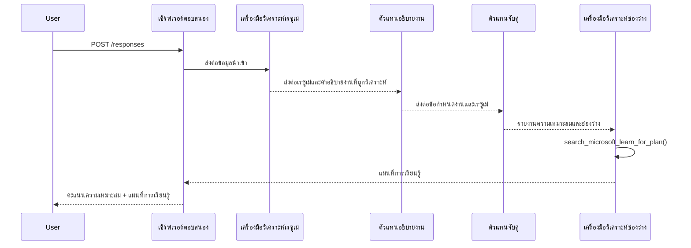

# โมดูล 3 - กำหนดค่าคำสั่ง, สภาพแวดล้อม & ติดตั้ง Dependencies

⏱️ ~15 นาที

ในโมดูลนี้ คุณจะแปลงโครงร่างต้นแบบเป็น **เวิร์กโฟลว์มัลติเอเย่นต์ของคุณเอง** - โดยการตั้งค่าตัวแปรสภาพแวดล้อม, เขียนคำสั่งสำหรับเอเย่นต์, เพิ่มเครื่องมือ MCP, เชื่อมต่อกราฟเวิร์กโฟลว์ และติดตั้ง dependencies

> **เอกสารอ้างอิง:** โค้ดทำงานครบถ้วนอยู่ใน [`PersonalCareerCopilot/main.py`](../../../../../workshop/lab02-multi-agent/PersonalCareerCopilot/main.py) ใช้เป็นเอกสารอ้างอิงขณะสร้างกราฟเวิร์กโฟลว์และบล็อกคำสั่งของคุณเอง

---

## เอเย่นต์ทั้งสี่ทำงานร่วมกันอย่างไร


```mermaid
sequenceDiagram
    participant User
    participant Server as เซิร์ฟเวอร์ตอบสนอง
    participant RP as เครื่องมือวิเคราะห์เรซูเม่
    participant JD as ตัวแทนอธิบายงาน
    participant MA as ตัวแทนจับคู่
    participant GA as เครื่องมือวิเคราะห์ช่องว่าง

    User->>Server: POST /responses
    Server->>RP: ส่งต่อข้อมูลนำเข้า
    RP-->>JD: ส่งต่อเรซูเม่และคำอธิบายงานที่ถูกวิเคราะห์
    JD-->>MA: ส่งต่อข้อกำหนดงานและเรซูเม่
    MA-->>GA: รายงานความเหมาะสมและช่องว่าง
    GA->>GA: search_microsoft_learn_for_plan()
    GA-->>Server: แผนที่การเรียนรู้
    Server-->>User: คะแนนความเหมาะสม + แผนที่การเรียนรู้
```

---

## ขั้นตอนที่ 1: กำหนดค่าตัวแปรสภาพแวดล้อม

1. เปิดไฟล์ **`.env`** ในโฟลเดอร์ root ของโปรเจกต์คุณ (สร้างโดยตัวช่วยสร้าง scaffold)
2. แทนที่ตัวแทนที่ว่างด้วยค่าจริงของคุณจาก Lab 01

<details open>
<summary><strong>🅰️ เส้นทาง A - บริการสมัครใช้งาน Foundry</strong></summary>

```env
FOUNDRY_PROJECT_ENDPOINT=https://<your-account>.services.ai.azure.com/api/projects/<your-project>
AZURE_AI_MODEL_DEPLOYMENT_NAME=gpt-4.1-mini
```

> **หาค่าที่ไหน:** ดูที่ [Lab 01, โมดูล 1](../../lab01-single-agent/docs/01-setup.md#deploy-a-model--assign-rbac)

</details>

<details open>
<summary><strong>🅱️ เส้นทาง B - Foundry Local</strong></summary>

```env
FOUNDRY_PROJECT_ENDPOINT=http://localhost:5273/v1
AZURE_AI_MODEL_DEPLOYMENT_NAME=phi-4-mini
```

> การประเมินผลทั้งหมดเกิดขึ้นบนเครื่องของคุณเอง - ไม่มีข้อมูลใดออกจากอุปกรณ์ของคุณ รัน `foundry model list` เพื่อยืนยันชื่อโมเดลที่แน่นอน คำขอออกเพียงอย่างเดียวคือการเรียกเครื่องมือ MCP ไปที่ `https://learn.microsoft.com/api/mcp`

> **หาค่าที่ไหน:** ดูที่ [Lab 01, โมดูล 1 - เส้นทาง local](../../lab01-single-agent/docs/01-setup.md#step-2-set-up-based-on-your-access)

</details>

> **ความปลอดภัย:** ห้ามส่งไฟล์ `.env` เข้าระบบควบคุมเวอร์ชัน ควรถูกใส่ใน `.gitignore` แล้ว

---

## ขั้นตอนที่ 2: เขียนคำสั่งเอเย่นต์

คำสั่งกำหนดบทบาทของแต่ละเอเย่นต์ รูปแบบผลลัพธ์ และกฎต่างๆ เปิด `main.py` และกำหนด (หรือแทนที่) ค่าคงที่คำสั่งทั้งสี่ - ข้อความครบถ้วนอยู่ใน [`PersonalCareerCopilot/main.py`](../../../../../workshop/lab02-multi-agent/PersonalCareerCopilot/main.py)

### 2.1 `RESUME_PARSER_INSTRUCTIONS`
วิเคราะห์เรซูเม่เป็นโปรไฟล์ผู้สมัครแบบมีโครงสร้าง **และ** คัดลอกคำอธิบายงานตามต้นฉบับลงใน `[JOB DESCRIPTION PASS-THROUGH]` ทั้งสองส่วนที่ติดป้ายชื่อซึ่งปรากฏในผลลัพธ์

> **ทำไมต้องผ่านคำอธิบายงาน?** ด้วย `context_mode="last_agent"` ResumeParser คือเอเย่นต์ **เพียงคนเดียว** ที่เห็นข้อความต้นฉบับของผู้ใช้ ถ้าไม่คัดลอกส่วนคำอธิบายงานไปข้างหน้า เอเย่นต์ถัดไปจะไม่เห็นเลย

### 2.2 `JOB_DESCRIPTION_INSTRUCTIONS`
อ่าน `[PARSED RESUME]` และ `[JOB DESCRIPTION PASS-THROUGH]` จากผลลัพธ์ของ ResumeParser ออก `[JD REQUIREMENTS]` (ข้อกำหนดในรูปแบบโครงสร้าง) และ `[PARSED RESUME PASS-THROUGH]` (สำเนาเรซูเม่ตามต้นฉบับสำหรับ MatchingAgent)

### 2.3 `MATCHING_AGENT_INSTRUCTIONS`
อ่าน `[JD REQUIREMENTS]` และ `[PARSED RESUME PASS-THROUGH]` สร้างรายงานคะแนนความเหมาะสม (0–100) พร้อมคำอธิบายคณิตศาสตร์, ทักษะที่ผ่านการจับคู่, ทักษะที่ขาด และการจับคู่ประสบการณ์

### 2.4 `GAP_ANALYZER_INSTRUCTIONS`
อ่านรายงานความเหมาะสม สำหรับทักษะที่ขาด **ทุกชิ้น** เรียก `search_microsoft_learn_for_plan` เพื่อดึงทรัพยากร Microsoft Learn ออกมา สร้างการ์ดช่องว่างละเอียดยิบต่อทักษะ พร้อมแผนการเรียนรายสัปดาห์

---

## ขั้นตอนที่ 3: เพิ่มเครื่องมือ MCP

GapAnalyzer เรียกใช้ [เซิร์ฟเวอร์ Microsoft Learn MCP](https://learn.microsoft.com/azure/foundry/agents/how-to/tools/model-context-protocol) เพื่อดึงทรัพยากรการเรียนรู้จริงสำหรับช่องว่างทักษะแต่ละช่อง ฟังก์ชันเต็ม `search_microsoft_learn_for_plan` อยู่ใน [`PersonalCareerCopilot/main.py`](../../../../../workshop/lab02-multi-agent/PersonalCareerCopilot/main.py)

ลงทะเบียนเครื่องมือนี้บน GapAnalyzer เมื่อสร้างเอเย่นต์:

```python
gap_analyzer = Agent(
    client=client,
    instructions=GAP_ANALYZER_INSTRUCTIONS,
    name="GapAnalyzer",
    tools=[search_microsoft_learn_for_plan],
)
```

> ดู [`PersonalCareerCopilot/main.py`](../../../../../workshop/lab02-multi-agent/PersonalCareerCopilot/main.py) สำหรับกราฟ `WorkflowBuilder` ที่ครบถ้วนพร้อม `FoundryChatClient`, `AgentExecutor` และคำสั่งเรียก `add_edge()` ทั้งหมด

---

## ขั้นตอนที่ 4: สร้าง virtual environment & ติดตั้ง dependencies

> ⚠️ **อย่าข้ามขั้นตอนนี้** หากไม่ติดตั้ง dependencies การดีบั๊กด้วย F5 จะล้มเหลว

### 4.1 สร้าง virtual environment

```powershell
python -m venv .venv
```

### 4.2 เปิดใช้งานมัน

| ระบบปฏิบัติการ | คำสั่ง |
|----|---------|
| **Windows (PowerShell)** | `.\.venv\Scripts\Activate.ps1` |
| **Windows (CMD)** | `.venv\Scripts\activate.bat` |
| **macOS / Linux** | `source .venv/bin/activate` |

คุณควรเห็น `(.venv)` ในพรอมต์เทอร์มินัลของคุณ

### 4.3 ติดตั้ง dependencies

```powershell
pip install -r requirements.txt
```

### 4.4 ตรวจสอบ

```powershell
pip list | Select-String "agent-framework|mcp|debugpy"
```

คาดหวังให้เห็น: `agent-framework-foundry`, `agent-framework-foundry-hosting`, `mcp` และ `debugpy` ปรากฏในรายการ

---

## ขั้นตอนที่ 5: ตรวจสอบการยืนยันตัวตน

<details open>
<summary><strong>🅰️ เส้นทาง A - ข้อมูลรับรอง Azure</strong></summary>

```powershell
az account show --query "{name:name, id:id}" --output table
```

หากล้มเหลว ให้รัน [`az login`](https://learn.microsoft.com/cli/azure/authenticate-azure-cli-interactively)

เอเย่นต์ทั้งสี่ใช้ `FoundryChatClient` ตัวเดียว และใช้ `DefaultAzureCredential` ตัวเดียว หากการยืนยันตัวตนทำงานกับตัวหนึ่ง มันจะทำงานกับทุกตัว

</details>

<details open>
<summary><strong>🅱️ เส้นทาง B - Foundry Local</strong></summary>

ไม่ต้องยืนยันตัวตนสำหรับการทดสอบบนเครื่อง local

</details>

---

### ✅ จุดตรวจสอบ

> อย่า **ดำเนินการต่อ** ไปยังโมดูล 04 จนกว่า: **(1)** จะเห็น `(.venv)` ในพรอมต์ของคุณ และ **(2)** รัน `pip install -r requirements.txt` เสร็จสมบูรณ์สำเร็จ

- [ ] `.env` มีค่าจุดเชื่อมต่อ และชื่อการใช้งานโมเดลถูกต้อง (ไม่ใช่ตัวแทน)
- [ ] นิยามค่าคงที่คำสั่งเอเย่นต์ 4 ตัวใน `main.py` (ResumeParser, JD Agent, MatchingAgent, GapAnalyzer)
- [ ] เครื่องมือ MCP `search_microsoft_learn_for_plan` ถูกกำหนดและลงทะเบียนบน GapAnalyzer
- [ ] สร้างออบเจ็กต์ `FoundryChatClient` + 4 `Agent` + 4 `AgentExecutor` ใน `main()`
- [ ] `WorkflowBuilder` สร้างกราฟตามลำดับที่ถูกต้องพร้อมคำสั่ง `add_edge()` ครบ 3 ครั้ง
- [ ] สร้างและเปิดใช้งาน virtual environment แล้ว (`(.venv)` เห็นในพรอมต์)
- [ ] รัน `pip install -r requirements.txt` เสร็จโดยไม่มีข้อผิดพลาด
- [ ] **เส้นทาง A:** รัน `az account show` ผ่าน หรือ ไอคอนบัญชีใน VS Code แสดงว่าลงชื่อเข้าใช้บัญชีแล้ว

---

**ก่อนหน้า:** [02 - Scaffold Multi-Agent Project](02-scaffold-multi-agent.md) · **ถัดไป:** [04 - Orchestration Patterns →](04-orchestration-patterns.md)

---

<!-- CO-OP TRANSLATOR DISCLAIMER START -->
**ปฏิเสธความรับผิดชอบ**:
เอกสารนี้ได้รับการแปลโดยใช้บริการแปลภาษา AI [Co-op Translator](https://github.com/Azure/co-op-translator) ขณะที่เราพยายามให้ความถูกต้อง โปรดทราบว่าการแปลโดยอัตโนมัติอาจมีข้อผิดพลาดหรือความไม่ถูกต้อง เอกสารต้นฉบับในภาษาต้นทางควรถูกพิจารณาเป็นแหล่งข้อมูลที่เชื่อถือได้ สำหรับข้อมูลที่สำคัญ แนะนำให้ใช้การแปลโดยมนุษย์มืออาชีพ เราไม่รับผิดชอบต่อความเข้าใจผิดหรือการตีความที่ผิดพลาดที่เกิดขึ้นจากการใช้การแปลนี้
<!-- CO-OP TRANSLATOR DISCLAIMER END -->