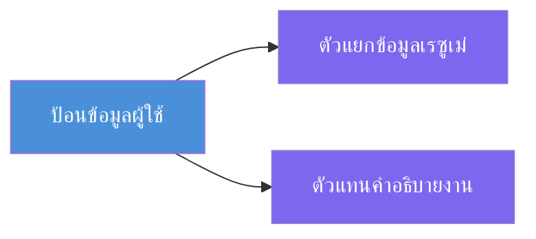
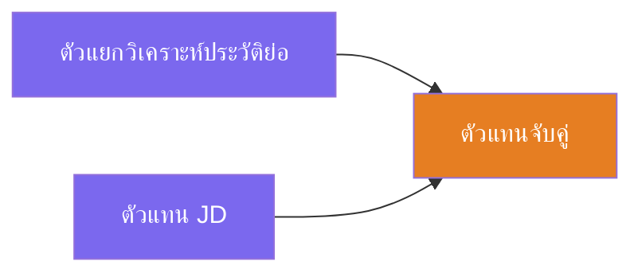
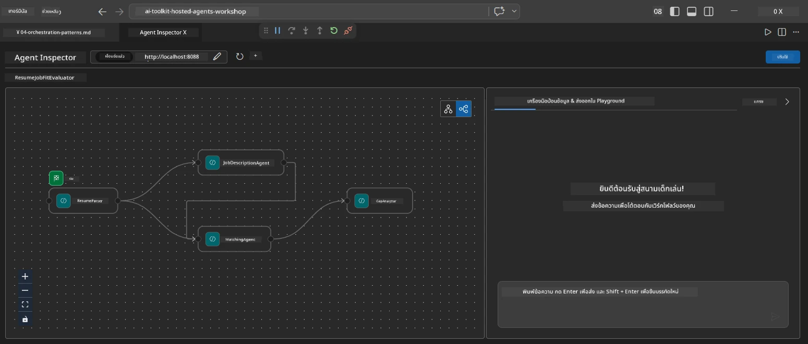
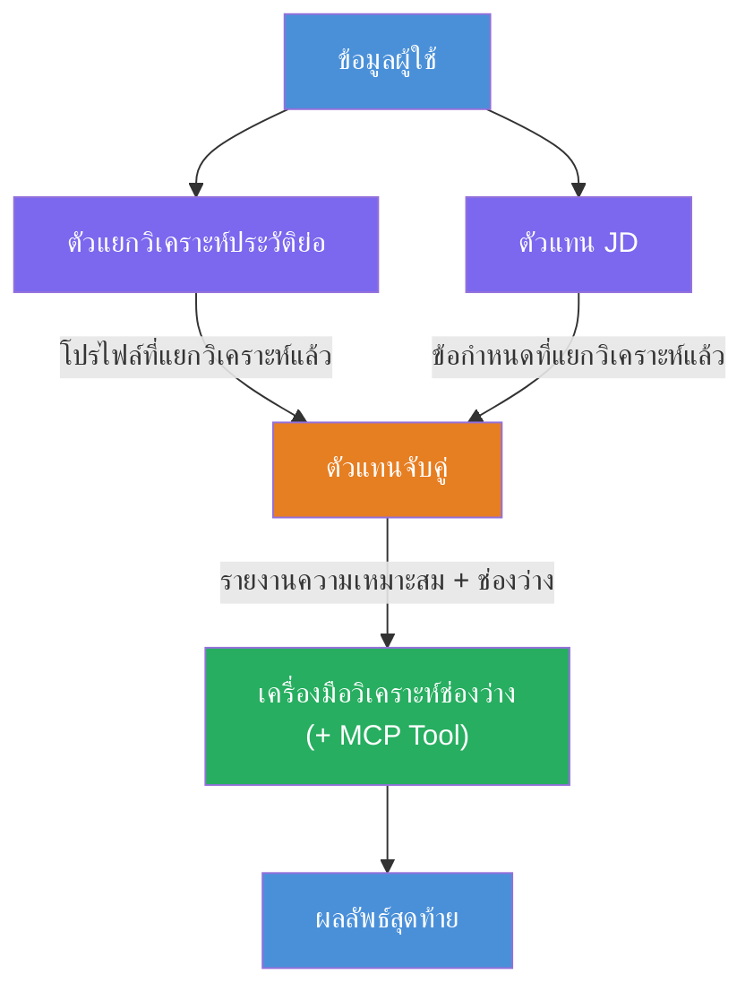
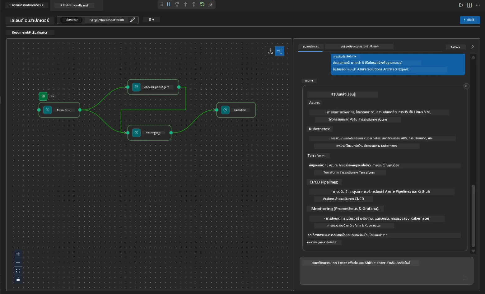

# Module 4 - รูปแบบการประสานงาน

ในโมดูลนี้ คุณจะได้สำรวจรูปแบบการประสานงานที่ใช้ใน Resume Job Fit Evaluator และเรียนรู้วิธีการอ่าน แก้ไข และขยายกราฟของเวิร์กโฟลว์ การเข้าใจรูปแบบเหล่านี้เป็นสิ่งสำคัญสำหรับการดีบักปัญหาการไหลของข้อมูลและการสร้าง [เวิร์กโฟลว์หลายเอเจนต์](https://learn.microsoft.com/agent-framework/workflows/) ของคุณเอง

---

## รูปแบบที่ 1: Fan-out (แยกแบบขนาน)

รูปแบบแรกในเวิร์กโฟลว์คือ **fan-out** - อินพุตเดียวจะถูกส่งไปยังเอเจนต์หลายตัวพร้อมกัน


ในโค้ด เหตุการณ์นี้เกิดขึ้นเพราะ `resume_parser` เป็น `start_executor` - ซึ่งจะได้รับข้อความจากผู้ใช้ก่อน จากนั้นเพราะทั้ง `jd_agent` และ `matching_agent` มีเส้นขอบจาก `resume_parser` เฟรมเวิร์กจึงส่งผลลัพธ์ของ `resume_parser` ไปยังทั้งสองเอเจนต์:

```python
.add_edge(resume_parser, jd_agent)         # ผลลัพธ์ ResumeParser → ตัวแทน JD
.add_edge(resume_parser, matching_agent)   # ผลลัพธ์ ResumeParser → ตัวแทนจับคู่
```

**ทำไมถึงทำงานได้:** ResumeParser และ JD Agent ประมวลผลข้อมูลแง่มุมต่างๆ ของอินพุตเดียวกัน การรันทั้งสองแบบขนานช่วยลดเวลาหน่วงโดยรวมเมื่อเทียบกับการรันทีละตัว

### เมื่อใดควรใช้ fan-out

| กรณีการใช้งาน | ตัวอย่าง |
|----------|---------|
| งานย่อยที่ไม่ขึ้นต่อกัน | การแยกวิเคราะห์เรซูเม่เทียบกับการแยกวิเคราะห์ JD |
| ความซ้ำซ้อน / การโหวต | สองเอเจนต์วิเคราะห์ข้อมูลเดียวกัน ตัวที่สามเลือกคำตอบที่ดีที่สุด |
| ผลลัพธ์หลายรูปแบบ | เอเจนต์หนึ่งสร้างข้อความ อีกเอเจนต์หนึ่งสร้าง JSON ที่มีโครงสร้าง |

---

## รูปแบบที่ 2: Fan-in (การรวบรวม)

รูปแบบที่สองคือ **fan-in** - ผลลัพธ์จากหลายเอเจนต์ถูกรวบรวมและส่งไปยังเอเจนต์เดียวในทิศทางถัดไป


ในโค้ด:

```python
.add_edge(resume_parser, matching_agent)   # ผลลัพธ์ ResumeParser → MatchingAgent
.add_edge(jd_agent, matching_agent)        # ผลลัพธ์ JD Agent → MatchingAgent
```

**พฤติกรรมสำคัญ:** เมื่อเอเจนต์มี **สองเส้นขอบหรือมากกว่าเข้ามา** เฟรมเวิร์กจะรอให้เอเจนต์ต้นทางทั้งหมดทำงานเสร็จก่อนจึงจะรันเอเจนต์ในทิศทางถัดไป MatchingAgent จะไม่เริ่มจนกว่า ResumeParser และ JD Agent จะเสร็จสิ้นทั้งคู่

### สิ่งที่ MatchingAgent ได้รับ

เฟรมเวิร์กรวมผลลัพธ์จากเอเจนต์ต้นทางทั้งหมด MatchingAgent ได้รับอินพุตในรูปแบบ:

```
[ResumeParser output]
---
Candidate Profile:
  Name: Jane Doe
  Technical Skills: Python, Azure, Kubernetes, ...
  ...

[JobDescriptionAgent output]
---
Role Overview: Senior Cloud Engineer
Required Skills: Python, Azure, Terraform, ...
...
```

> **หมายเหตุ:** รูปแบบการรวมข้อมูลที่แน่นอนขึ้นอยู่กับเวอร์ชันของเฟรมเวิร์ก คำแนะนำของเอเจนต์ควรเขียนเพื่อรองรับทั้งข้อมูลต้นทางที่มีโครงสร้างและไม่มีโครงสร้าง



---

## รูปแบบที่ 3: โซ่ลำดับ

รูปแบบที่สามคือ **โซ่ลำดับ** - ผลลัพธ์ของเอเจนต์หนึ่งจะถูกป้อนโดยตรงไปยังเอเจนต์ถัดไป


ในโค้ด:

```python
.add_edge(matching_agent, gap_analyzer)    # เอาต์พุตของ MatchingAgent → GapAnalyzer
```

นี่คือรูปแบบที่ง่ายที่สุด GapAnalyzer จะได้รับคะแนนความเหมาะสมจาก MatchingAgent รวมถึงทักษะที่ตรงกัน/หายไป และช่องว่าง จากนั้นจะเรียกใช้ [เครื่องมือ MCP](https://learn.microsoft.com/azure/foundry/agents/how-to/tools/model-context-protocol) สำหรับแต่ละช่องว่างเพื่อดึงแหล่งข้อมูล Microsoft Learn

---

## กราฟทั้งหมด

การรวมทั้งสามรูปแบบสร้างเวิร์กโฟลว์เต็มรูปแบบ:


### ไทม์ไลน์การทำงาน

```mermaid
gantt
    title กรอบเวลาการทำงานของเอเจนต์
    dateFormat X
    axisFormat %s

    section ทำงานพร้อมกัน
    Resume Parser       :rp, 0, 3
    JD Agent            :jd, 0, 2

    section ทำงานเป็นลำดับ
    Matching Agent      :ma, 3, 5
    Gap Analyzer        :ga, 5, 9
```


> เวลารวมบนผนังโดยประมาณคือ `max(ResumeParser, JD Agent) + MatchingAgent + GapAnalyzer` GapAnalyzer มักจะช้าที่สุดเพราะมันเรียกใช้เครื่องมือ MCP หลายครั้ง (หนึ่งครั้งต่อช่องว่าง)

---

## การอ่านโค้ด WorkflowBuilder

นี่คือฟังก์ชัน `create_workflow()` ฉบับสมบูรณ์จาก `main.py` พร้อมคำอธิบาย:

```python
def create_workflow(resume_parser, jd_agent, matching_agent, gap_analyzer):
    workflow = (
        WorkflowBuilder(
            name="ResumeJobFitEvaluator",

            # ตัวแทนคนแรกที่ได้รับข้อมูลจากผู้ใช้
            start_executor=resume_parser,

            # ตัวแทนที่ผลลัพธ์ของพวกเขากลายเป็นคำตอบสุดท้าย
            output_executors=[gap_analyzer],
        )
        # การกระจาย: ผลลัพธ์ของ ResumeParser ส่งไปยังทั้ง JD Agent และ MatchingAgent
        .add_edge(resume_parser, jd_agent)
        .add_edge(resume_parser, matching_agent)

        # การรวบรวม: MatchingAgent รอทั้ง ResumeParser และ JD Agent
        .add_edge(jd_agent, matching_agent)

        # แบบลำดับ: ผลลัพธ์ของ MatchingAgent ส่งไปยัง GapAnalyzer
        .add_edge(matching_agent, gap_analyzer)

        .build()
    )
    return workflow.as_agent()
```

### ตารางสรุปเส้นขอบ

| # | เส้นขอบ | รูปแบบ | ผลกระทบ |
|---|------|---------|--------|
| 1 | `resume_parser → jd_agent` | Fan-out | JD Agent จะได้รับผลลัพธ์ของ ResumeParser (บวกกับอินพุตดั้งเดิมของผู้ใช้) |
| 2 | `resume_parser → matching_agent` | Fan-out | MatchingAgent จะได้รับผลลัพธ์ของ ResumeParser |
| 3 | `jd_agent → matching_agent` | Fan-in | MatchingAgent ยังได้รับผลลัพธ์ของ JD Agent (รอทั้งคู่) |
| 4 | `matching_agent → gap_analyzer` | ลำดับ | GapAnalyzer ได้รับรายงานความเหมาะสม + รายการช่องว่าง |

---

## การแก้ไขกราฟ

### การเพิ่มเอเจนต์ใหม่

เพื่อเพิ่มเอเจนต์ตัวที่ห้า (เช่น **InterviewPrepAgent** ที่สร้างคำถามสัมภาษณ์ตามการวิเคราะห์ช่องว่าง):

```python
# 1. กำหนดคำสั่ง
INTERVIEW_PREP_INSTRUCTIONS = """\
You are the Interview Prep Agent.
Given a gap analysis and fit report, generate 10 targeted interview questions
the candidate should prepare for.
"""

# 2. สร้างเอเจนต์ (ภายในบล็อก async with)
AzureAIAgentClient(
    project_endpoint=PROJECT_ENDPOINT,
    model_deployment_name=MODEL_DEPLOYMENT_NAME,
    credential=credential,
).as_agent(
    name="InterviewPrepAgent",
    instructions=INTERVIEW_PREP_INSTRUCTIONS,
) as interview_prep,

# 3. เพิ่มขอบในฟังก์ชัน create_workflow()
.add_edge(matching_agent, interview_prep)   # รับรายงานการฟิต
.add_edge(gap_analyzer, interview_prep)     # นอกจากนี้ยังรับบัตรช่องว่าง

# 4. อัปเดต output_executors
output_executors=[interview_prep],  # ตอนนี้เป็นเอเจนต์สุดท้ายแล้ว
```

### การเปลี่ยนลำดับการทำงาน

เพื่อให้ JD Agent ทำงาน **หลัง** ResumeParser (แบบลำดับแทนแบบขนาน):

```python
# ลบ: .add_edge(resume_parser, jd_agent)  ← มีอยู่แล้ว, ให้เก็บไว้
# ลบการทำงานแบบขนานที่เป็นนัยโดยไม่ให้ jd_agent รับข้อมูลผู้ใช้โดยตรง
# start_executor ส่งไปที่ resume_parser ก่อน และ jd_agent จะได้รับ
# ผลลัพธ์ของ resume_parser ผ่าน edge ซึ่งทำให้เป็นลำดับการทำงานต่อเนื่องกัน
```

> **สำคัญ:** `start_executor` เป็นเอเจนต์เดียวที่ได้รับอินพุตดิบจากผู้ใช้ เอเจนต์อื่นจะได้รับผลลัพธ์จากเส้นขอบต้นทางของตน หากคุณต้องการให้อินพุตดิบจากผู้ใช้ส่งถึงเอเจนต์ใด เอเจนต์นั้นต้องมีเส้นขอบจาก `start_executor`

---

## ข้อผิดพลาดทั่วไปของกราฟ

| ข้อผิดพลาด | อาการ | วิธีแก้ไข |
|---------|---------|-----|
| ไม่มีเส้นขอบไปยัง `output_executors` | เอเจนต์ทำงานแต่ผลลัพธ์ว่าง | ตรวจสอบให้แน่ใจว่ามีเส้นทางจาก `start_executor` ไปยังเอเจนต์ทุกตัวใน `output_executors` |
| การพึ่งพาหมุนเวียน | วนลูปไม่มีที่สิ้นสุดหรือหมดเวลา | ตรวจสอบว่าไม่มีเอเจนต์ใดป้อนข้อมูลกลับไปยังเอเจนต์ต้นทาง |
| เอเจนต์ใน `output_executors` ไม่มีเส้นขอบเข้ามา | ผลลัพธ์ว่าง | เพิ่ม `add_edge(source, that_agent)` อย่างน้อยหนึ่งเส้น |
| หลาย `output_executors` ไม่มี fan-in | ผลลัพธ์มีแค่คำตอบของเอเจนต์เดียว | ใช้เอเจนต์ผลลัพธ์ตัวเดียวที่รวบรวม หรือยอมรับผลลัพธ์หลายตัว |
| ไม่มี `start_executor` | เกิด `ValueError` ขณะสร้าง | ระบุ `start_executor` ใน `WorkflowBuilder()` เสมอ |

---

## การดีบักกราฟ

### การใช้ Agent Inspector

1. เริ่มเอเจนต์ในเครื่อง (กด F5 หรือใช้เทอร์มินัล - ดู [Module 5](05-test-locally.md))
2. เปิด Agent Inspector (`Ctrl+Shift+P` → **Foundry Toolkit: Open Agent Inspector**)
3. ส่งข้อความทดสอบ
4. ในแผงตอบกลับของ Inspector ให้ดูที่ **ผลลัพธ์แบบสตรีม** - จะแสดงส่วนที่แต่ละเอเจนต์มีส่วนร่วมตามลำดับ



### การใช้ logging

เพิ่ม logging ใน `main.py` เพื่อตรวจสอบการไหลของข้อมูล:

```python
import logging
logger = logging.getLogger("resume-job-fit")

# ใน create_workflow(), หลังจากสร้างแล้ว:
logger.info("Workflow graph built with edges: RP→JD, RP→MA, JD→MA, MA→GA")
```

บันทึกของเซิร์ฟเวอร์แสดงลำดับการทำงานของเอเจนต์และการเรียกเครื่องมือ MCP:

```
INFO:resume-job-fit:Starting Resume -> Job Fit Evaluator HTTP server...
INFO:resume-job-fit:Server running on http://localhost:8088
INFO:agent_framework:Executing agent: ResumeParser
INFO:agent_framework:Executing agent: JobDescriptionAgent
INFO:agent_framework:Waiting for upstream agents: ResumeParser, JobDescriptionAgent
INFO:agent_framework:Executing agent: MatchingAgent
INFO:agent_framework:Executing agent: GapAnalyzer
INFO:agent_framework:Tool call: search_microsoft_learn_for_plan(skill="Kubernetes")
POST https://learn.microsoft.com/api/mcp → 200
INFO:agent_framework:Tool call: search_microsoft_learn_for_plan(skill="Terraform")
POST https://learn.microsoft.com/api/mcp → 200
```

---

### จุดตรวจสอบ

- [ ] คุณสามารถระบุรูปแบบการประสานสามแบบในเวิร์กโฟลว์ได้: fan-out, fan-in, และโซ่ลำดับ
- [ ] คุณเข้าใจว่าเอเจนต์ที่มีเส้นขอบเข้ามาหลายเส้นจะรอให้เอเจนต์ต้นทางทั้งหมดทำงานเสร็จ
- [ ] คุณสามารถอ่านโค้ด `WorkflowBuilder` และเชื่อมโยงแต่ละการเรียก `add_edge()` กับกราฟภาพได้
- [ ] คุณเข้าใจไทม์ไลน์การทำงาน: เอเจนต์แบบขนานทำงานก่อน จากนั้นรวบรวม แล้วจึงทำแบบลำดับ
- [ ] คุณรู้วิธีเพิ่มเอเจนต์ใหม่ในกราฟ (กำหนดคำแนะนำ สร้างเอเจนต์ เพิ่มเส้นขอบ อัปเดตผลลัพธ์)
- [ ] คุณสามารถระบุข้อผิดพลาดทั่วไปของกราฟและอาการต่างๆ ได้

---

**ก่อนหน้า:** [03 - การตั้งค่าเอเจนต์และสภาพแวดล้อม](03-configure-agents.md) · **ถัดไป:** [05 - ทดสอบในเครื่อง →](05-test-locally.md)

---

<!-- CO-OP TRANSLATOR DISCLAIMER START -->
**ข้อจำกัดความรับผิดชอบ**:  
เอกสารฉบับนี้ได้รับการแปลโดยใช้บริการแปลภาษาอัตโนมัติ [Co-op Translator](https://github.com/Azure/co-op-translator) แม้ว่าเราจะพยายามอย่างดีที่สุดเพื่อความถูกต้อง แต่โปรดทราบว่าการแปลอัตโนมัติอาจมีข้อผิดพลาดหรือความไม่ถูกต้อง เอกสารต้นฉบับในภาษาต้นทางถือเป็นแหล่งข้อมูลที่เชื่อถือได้ หากเป็นข้อมูลที่สำคัญ ขอแนะนำให้ใช้การแปลโดยนักแปลมืออาชีพ เราจะไม่รับผิดชอบต่อความเข้าใจผิดหรือการตีความที่ผิดพลาดใดๆ ที่เกิดจากการใช้การแปลนี้
<!-- CO-OP TRANSLATOR DISCLAIMER END -->