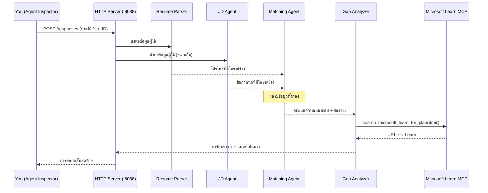
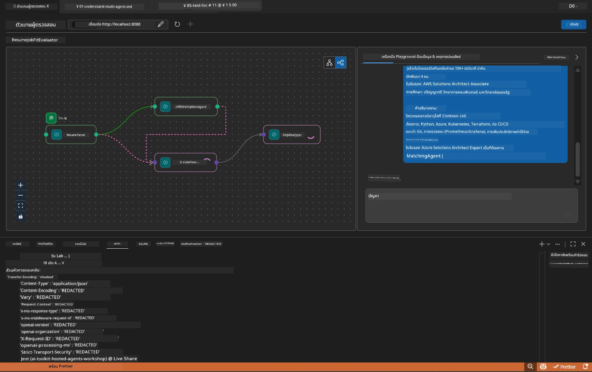

# Module 5 - ทดสอบแบบ Local (Multi-Agent)

ในโมดูลนี้ คุณจะรัน workflow แบบ multi-agent ในเครื่องของคุณ ทดสอบกับ Agent Inspector และตรวจสอบว่าเอเจนต์ทั้งหมดสี่ตัวและเครื่องมือ MCP ทำงานถูกต้องก่อนที่จะ deploy ไปยัง Foundry

### สิ่งที่จะเกิดขึ้นในระหว่างการทดสอบแบบ local


---

## ขั้นตอนที่ 1: เริ่มต้น agent server

### ตัวเลือก A: ใช้ task ของ VS Code (แนะนำ)

1. กด `Ctrl+Shift+P` → พิมพ์ **Tasks: Run Task** → เลือก **Run Lab02 HTTP Server**
2. Task จะเริ่มเซิร์ฟเวอร์พร้อม debugpy แนบที่พอร์ต `5679` และ agent ที่พอร์ต `8088`
3. รอผลลัพธ์แสดง:

```
INFO:resume-job-fit:Starting Resume -> Job Fit Evaluator HTTP server...
INFO:resume-job-fit:Server running on http://localhost:8088
```

### ตัวเลือก B: ใช้เทอร์มินัลด้วยตนเอง

```powershell
cd workshop\lab02-multi-agent\PersonalCareerCopilot
```

เปิดใช้งาน virtual environment:

**PowerShell (Windows):**
```powershell
.\.venv\Scripts\Activate.ps1
```

**macOS/Linux:**
```bash
source .venv/bin/activate
```

เริ่มเซิร์ฟเวอร์:

```powershell
python -m debugpy --listen 127.0.0.1:5679 -m agentdev run main.py --verbose --port 8088
```

### ตัวเลือก C: ใช้ F5 (โหมดดีบัก)

1. กด `F5` หรือไปที่ **Run and Debug** (`Ctrl+Shift+D`)
2. เลือกคอนฟิกสำหรับ launch ชื่อ **Lab02 - Multi-Agent** จากเมนูดรอปดาวน์
3. เซิร์ฟเวอร์จะเริ่มทำงานพร้อมสนับสนุน breakpoint แบบเต็มรูปแบบ

> **คำแนะนำ:** โหมดดีบักช่วยให้คุณตั้ง breakpoint ภายในฟังก์ชัน `search_microsoft_learn_for_plan()` เพื่อดูการตอบสนองของ MCP หรือตั้ง breakpoint ในสตริงคำสั่งของ agent เพื่อตรวจสอบสิ่งที่แต่ละ agent รับเข้ามา

---

## ขั้นตอนที่ 2: เปิด Agent Inspector

1. กด `Ctrl+Shift+P` → พิมพ์ **Foundry Toolkit: Open Agent Inspector**
2. Agent Inspector จะเปิดในแท็บเบราว์เซอร์ที่ `http://localhost:5679`
3. คุณควรเห็นอินเทอร์เฟซของ agent พร้อมรับข้อความ

> **หาก Agent Inspector ไม่เปิด:** ตรวจสอบให้แน่ใจว่าเซิร์ฟเวอร์เริ่มทำงานสมบูรณ์ (คุณเห็น log “Server running”) หากพอร์ต 5679 ถูกใช้งานอยู่ ให้ดูที่ [Module 8 - Troubleshooting](08-troubleshooting.md)

---

## ขั้นตอนที่ 3: รันการทดสอบเบื้องต้น

รันการทดสอบสามรายการนี้ตามลำดับ แต่ละอันจะทดสอบส่วนของ workflow มากขึ้นทีละขั้น

### ทดสอบที่ 1: เรซูเม่พื้นฐาน + คำอธิบายงาน

วางข้อความต่อไปนี้ลงใน Agent Inspector:

```
Resume:
Jane Doe
Senior Software Engineer with 5 years of experience in Python, Django, and AWS.
Built microservices handling 10K+ requests/second. Led a team of 4 developers.
Certifications: AWS Solutions Architect Associate.
Education: B.S. Computer Science, State University.

Job Description:
Senior Cloud Engineer at Contoso Ltd.
Required: Python, Azure, Kubernetes, Terraform, CI/CD pipelines.
Preferred: Go, monitoring (Prometheus/Grafana), cost optimization.
Experience: 5+ years in cloud infrastructure.
Certifications: Azure Solutions Architect Expert preferred.
```

**โครงสร้างผลลัพธ์ที่คาดหวัง:**

การตอบสนองควรประกอบด้วยเอาต์พุตจาก agent ทั้งสี่ตัวตามลำดับ:

1. **ผลลัพธ์ Resume Parser** - โปรไฟล์ผู้สมัครที่จัดโครงสร้างพร้อมทักษะแบ่งตามประเภท
2. **ผลลัพธ์ JD Agent** - ความต้องการที่จัดโครงสร้าง แยกระหว่างทักษะที่จำเป็นกับที่ต้องการ
3. **ผลลัพธ์ Matching Agent** - คะแนนความเหมาะสม (0-100) พร้อมรายละเอียด แสดงทักษะที่จับคู่, ขาด, ช่องว่าง
4. **ผลลัพธ์ Gap Analyzer** - การ์ดช่องว่างแต่ละรายการสำหรับทักษะที่ขาด พร้อม URL ของ Microsoft Learn



### สิ่งที่ควรตรวจสอบในทดสอบที่ 1

| ตรวจสอบ | คาดหวัง | ผ่าน? |
|-------|----------|-------|
| การตอบสนองมีคะแนนความเหมาะสม | ตัวเลขระหว่าง 0-100 พร้อมรายละเอียด | |
| ทักษะที่จับคู่ถูกระบุไว้ | Python, CI/CD (บางส่วน), ฯลฯ | |
| ทักษะที่ขาดถูกระบุไว้ | Azure, Kubernetes, Terraform, ฯลฯ | |
| มีการ์ดช่องว่างสำหรับแต่ละทักษะที่ขาด | การ์ดหนึ่งใบต่อทักษะ | |
| มี URL ของ Microsoft Learn | ลิงก์จริง `learn.microsoft.com` | |
| ไม่มีข้อความแสดงข้อผิดพลาดในคำตอบ | ผลลัพธ์ที่เป็นโครงสร้างสะอาด | |

### ทดสอบที่ 2: ยืนยันการทำงานของเครื่องมือ MCP

ขณะรันทดสอบที่ 1 ตรวจสอบ **เทอร์มินัลเซิร์ฟเวอร์** สำหรับ log การใช้งาน MCP:

```
GET https://learn.microsoft.com/api/mcp → 405 (Method Not Allowed)
POST https://learn.microsoft.com/api/mcp → 200
DELETE https://learn.microsoft.com/api/mcp → 405 (Method Not Allowed)
```

| รายการ log | ความหมาย | คาดหวัง? |
|-----------|---------|-----------|
| `GET ... → 405` | MCP client ทดสอบด้วย GET ระหว่างเริ่มต้น | ใช่ - เป็นปกติ |
| `POST ... → 200` | เรียกใช้งานเครื่องมือจริงไปยังเซิร์ฟเวอร์ MCP ของ Microsoft Learn | ใช่ - นี่คือการเรียกจริง |
| `DELETE ... → 405` | MCP client ทดสอบด้วย DELETE ระหว่างการทำความสะอาด | ใช่ - เป็นปกติ |
| `POST ... → 4xx/5xx` | การเรียกใช้เครื่องมือล้มเหลว | ไม่ใช่ - ดู [Troubleshooting](08-troubleshooting.md) |

> **จุดสำคัญ:** บรรทัด `GET 405` และ `DELETE 405` เป็นพฤติกรรมที่คาดหวัง ให้กังวลเฉพาะถ้าการเรียก `POST` มีสถานะที่ไม่ใช่ 200

### ทดสอบที่ 3: กรณีขอบ - ผู้สมัครที่มีความเหมาะสมสูง

วางเรซูเม่ที่ใกล้เคียงกับ JD มากเพื่อตรวจสอบว่า Gap Analyzer จัดการกับกรณีผู้สมัครที่ความเหมาะสมสูงได้อย่างไร:

```
Resume:
Alex Chen
Senior Cloud Engineer with 7 years of experience.
Skills: Python, Azure (AKS, Functions, DevOps), Kubernetes, Terraform, CI/CD (GitHub Actions, Azure Pipelines), Go, Prometheus, Grafana, cost optimization.
Certifications: Azure Solutions Architect Expert, Azure DevOps Engineer Expert.
Led infrastructure migration to Azure for 3 enterprise clients.
Education: M.S. Computer Science, Tech University.

Job Description:
Senior Cloud Engineer at Contoso Ltd.
Required: Python, Azure, Kubernetes, Terraform, CI/CD pipelines.
Preferred: Go, monitoring (Prometheus/Grafana), cost optimization.
Experience: 5+ years in cloud infrastructure.
Certifications: Azure Solutions Architect Expert preferred.
```

**พฤติกรรมที่คาดหวัง:**
- คะแนนความเหมาะสมควรเป็น **80+** (ทักษะส่วนใหญ่ตรงกัน)
- การ์ดช่องว่างควรเน้นที่การเตรียมความพร้อมสำหรับการสัมภาษณ์หรือการเพิ่มพูนมากกว่าการเรียนรู้พื้นฐาน
- คำสั่ง GapAnalyzer กล่าวว่า: "ถ้าคะแนน fit >= 80 เน้นที่การเพิ่มพูน/เตรียมพร้อมสำหรับการสัมภาษณ์"

---

## ขั้นตอนที่ 4: ตรวจสอบความสมบูรณ์ของผลลัพธ์

หลังจากรันการทดสอบ ให้ตรวจสอบผลลัพธ์ว่าตรงตามเกณฑ์เหล่านี้:

### รายการตรวจสอบโครงสร้างผลลัพธ์

| ส่วน | Agent | มีอยู่? |
|---------|-------|----------|
| โปรไฟล์ผู้สมัคร | Resume Parser | |
| ทักษะทางเทคนิค (แยกกลุ่ม) | Resume Parser | |
| ภาพรวมบทบาทงาน | JD Agent | |
| ทักษะที่จำเป็น vs. ที่ต้องการ | JD Agent | |
| คะแนนความเหมาะสมพร้อมการแบ่งแยก | Matching Agent | |
| ทักษะที่จับคู่ / ขาด / บางส่วน | Matching Agent | |
| การ์ดช่องว่างสำหรับทักษะที่ขาด | Gap Analyzer | |
| URL ของ Microsoft Learn ในการ์ดช่องว่าง | Gap Analyzer (MCP) | |
| ลำดับการเรียนรู้ (เลขลำดับ) | Gap Analyzer | |
| สรุปไทม์ไลน์ | Gap Analyzer | |

### ปัญหาทั่วไปในขั้นตอนนี้

| ปัญหา | สาเหตุ | แก้ไข |
|-------|-------|-----|
| การ์ดช่องว่างแค่ใบเดียว (ส่วนที่เหลือถูกตัด) | คำสั่งใน GapAnalyzer ขาดบรรทัด CRITICAL สำคัญ | เพิ่มย่อหน้า `CRITICAL:` ใน `GAP_ANALYZER_INSTRUCTIONS` - ดู [Module 3](03-configure-agents.md) |
| ไม่มี URL ของ Microsoft Learn | MCP endpoint ไม่สามารถเข้าถึงได้ | ตรวจสอบการเชื่อมต่ออินเทอร์เน็ต ตรวจสอบค่า `MICROSOFT_LEARN_MCP_ENDPOINT` ใน `.env` ต้องเป็น `https://learn.microsoft.com/api/mcp` |
| คำตอบว่างเปล่า | ตั้งค่า `PROJECT_ENDPOINT` หรือ `MODEL_DEPLOYMENT_NAME` ไม่ถูกต้อง | ตรวจสอบค่าภายในไฟล์ `.env` รัน `echo $env:PROJECT_ENDPOINT` ในเทอร์มินัล |
| คะแนนความเหมาะสมเป็น 0 หรือขาดหาย | MatchingAgent ไม่ได้รับข้อมูลจาก upstream | ตรวจสอบว่ามี `add_edge(resume_parser, matching_agent)` และ `add_edge(jd_agent, matching_agent)` ใน `create_workflow()` |
| Agent เริ่มต้นแต่ปิดตัวทันที | ข้อผิดพลาดการนำเข้า หรือ ขึ้นอยู่กับไลบรารีที่หายไป | รัน `pip install -r requirements.txt` อีกครั้ง ตรวจสอบเทอร์มินัลสำหรับ stack trace |
| ข้อผิดพลาด `validate_configuration` | ตัวแปรสภาพแวดล้อมขาด | สร้างไฟล์ `.env` พร้อมค่า `PROJECT_ENDPOINT=<your-endpoint>` และ `MODEL_DEPLOYMENT_NAME=<your-model>` |

---

## ขั้นตอนที่ 5: ทดสอบด้วยข้อมูลของคุณเอง (ไม่บังคับ)

ลองวางเรซูเม่ของคุณเองและคำอธิบายงานจริง เพื่อช่วยตรวจสอบว่า:

- Agents รองรับรูปแบบเรซูเม่ที่แตกต่างกัน (chronological, functional, hybrid)
- JD Agent รองรับสไตล์การเขียนคำอธิบายงานที่แตกต่างกัน (หัวข้อย่อย, ย่อหน้า, โครงสร้าง)
- เครื่องมือ MCP คืนทรัพยากรที่เกี่ยวข้องกับทักษะจริง
- การ์ดช่องว่างถูกปรับให้เหมาะสมกับประวัติของคุณ

> **หมายเหตุด้านความเป็นส่วนตัว:** เมื่อตรวจสอบในเครื่อง ข้อมูลของคุณจะเก็บไว้ในเครื่องของคุณเองและส่งเพียงไปยัง Azure OpenAI deployment ของคุณเท่านั้น จะไม่มีการบันทึกหรือเก็บข้อมูลโดยโครงสร้างพื้นฐานของเวิร์คช็อป ใช้ชื่อสมมติหากต้องการ (เช่น "Jane Doe" แทนชื่อจริง)

---

### จุดตรวจสอบ

- [ ] เซิร์ฟเวอร์เริ่มต้นสำเร็จที่พอร์ต `8088` (log แสดง "Server running")
- [ ] Agent Inspector เปิดและเชื่อมต่อกับ agent เรียบร้อย
- [ ] ทดสอบที่ 1: คำตอบครบถ้วนพร้อมคะแนนความเหมาะสม ทักษะที่จับคู่/ขาด การ์ดช่องว่าง และ URL ของ Microsoft Learn
- [ ] ทดสอบที่ 2: Log MCP แสดง `POST ... → 200` (เรียกเครื่องมือสำเร็จ)
- [ ] ทดสอบที่ 3: ผู้สมัครที่เหมาะสมสูงได้คะแนน 80+ พร้อมคำแนะนำที่เน้นการปรับแต่ง
- [ ] การ์ดช่องว่างครบถ้วน (หนึ่งใบต่อทักษะที่ขาด ไม่มีการตัดทอน)
- [ ] ไม่มีข้อผิดพลาดหรือ stack trace ในเทอร์มินัลเซิร์ฟเวอร์

---

**ก่อนหน้า:** [04 - Orchestration Patterns](04-orchestration-patterns.md) · **ถัดไป:** [06 - Deploy to Foundry →](06-deploy-to-foundry.md)

---

<!-- CO-OP TRANSLATOR DISCLAIMER START -->
**ข้อจำกัดความรับผิดชอบ**:  
เอกสารนี้ได้รับการแปลโดยใช้บริการแปลภาษาอัตโนมัติ [Co-op Translator](https://github.com/Azure/co-op-translator) แม้เราจะพยายามให้มีความถูกต้อง แต่โปรดทราบว่าการแปลโดยอัตโนมัติอาจมีข้อผิดพลาดหรือข้อมูลที่ไม่ถูกต้อง เอกสารต้นฉบับในภาษาต้นทางควรถูกพิจารณาเป็นแหล่งข้อมูลที่เชื่อถือได้ สำหรับข้อมูลที่สำคัญ ขอแนะนำให้ใช้การแปลโดยมืออาชีพเพื่อความถูกต้อง เราจะไม่รับผิดชอบต่อความเข้าใจผิดหรือการตีความผิดพลาดที่เกิดจากการใช้การแปลนี้
<!-- CO-OP TRANSLATOR DISCLAIMER END -->