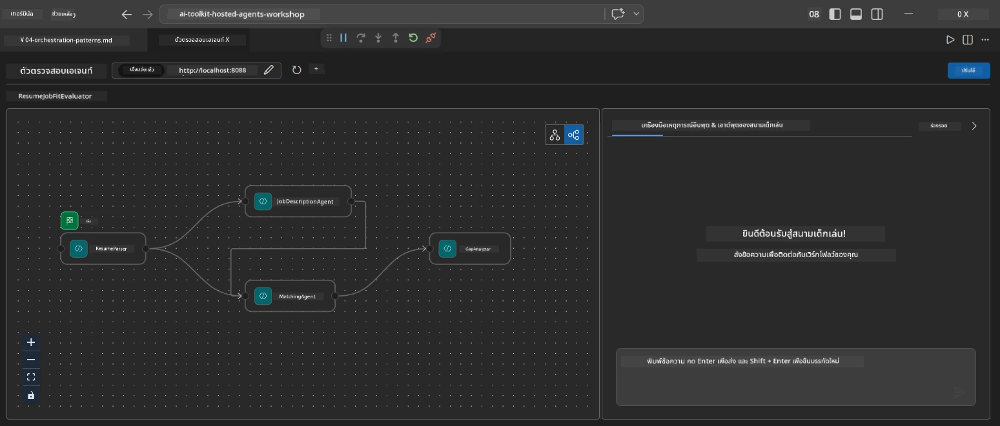
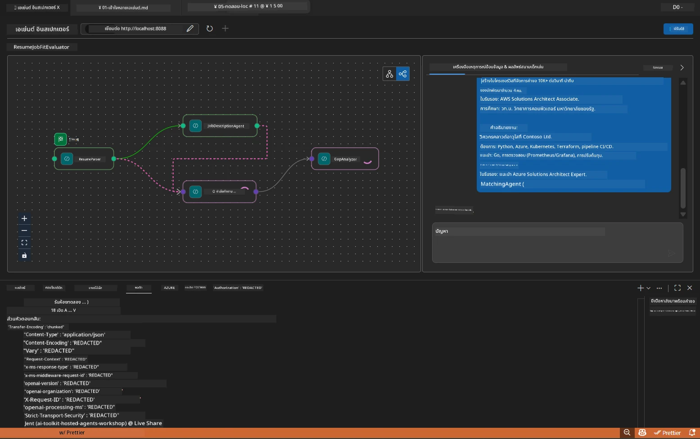
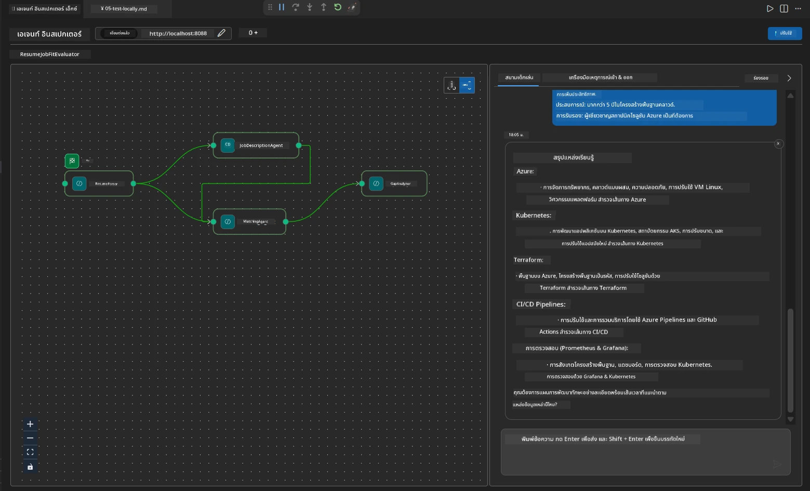

# โมดูล 5 - ทดสอบแบบโลคัล

⏱️ ~15 นาที

ในโมดูลนี้ คุณจะรันเวิร์กโฟลว์แบบหลายเอเย่นต์ในเครื่องของคุณ ทดสอบด้วย Agent Inspector และตรวจสอบให้แน่ใจว่าเอเย่นต์ทั้งสี่และเครื่องมือ MCP ทำงานถูกต้องก่อนที่จะนำไปใช้งานจริง

---

## ขั้นตอนที่ 1: เริ่มเซิร์ฟเวอร์เอเย่นต์

### ตัวเลือก A: ใช้งานผ่าน VS Code task (แนะนำ)

1. เปิดโฟลเดอร์ `workshop/lab02-multi-agent/PersonalCareerCopilot/` ใน VS Code
2. กด `Ctrl+Shift+P` → พิมพ์ **Tasks: Run Task** → เลือก **Run Agent HTTP Server**
3. งานจะเริ่มเซิร์ฟเวอร์พร้อม debugpy แนบที่พอร์ต `5679` และเอเย่นต์ที่พอร์ต `8088`
4. รอผลลัพธ์แสดงว่า:

```
INFO:resume-job-fit:Starting Resume -> Job Fit Evaluator HTTP server...
INFO:resume-job-fit:Server running on http://localhost:8088
```

### ตัวเลือก B: ใช้งานผ่าน F5 (โหมดดีบัก)

1. กด `F5` → เลือก **Debug Local Agent HTTP Server**
2. เซิร์ฟเวอร์จะเริ่มต้นพร้อมรองรับเบรกพอยต์เต็มรูปแบบ - เหมาะสำหรับการตรวจสอบการตอบสนองของ MCP หรือผลลัพธ์ของเอเย่นต์

---

## ขั้นตอนที่ 2: เปิด Agent Inspector

1. กด `Ctrl+Shift+P` → พิมพ์ **Foundry Toolkit: Open Agent Inspector**
2. Agent Inspector จะเปิดเป็นแผงใน VS Code เชื่อมต่อกับ `http://localhost:8088`
3. คุณจะเห็นอินเทอร์เฟซของเอเย่นต์พร้อมรับข้อความ



> **ถ้า Agent Inspector ไม่เปิด:** ตรวจสอบว่าเซิร์ฟเวอร์เริ่มทำงานเต็มที่แล้ว (ดูบันทึก "Server running") หากพอร์ต 5679 ถูกใช้งาน ดูที่ [โมดูล 8 - การแก้ไขปัญหา](08-troubleshooting.md)

---

## ขั้นตอนที่ 2b: (ไม่บังคับ) เปิด Workflow Visualizer

Foundry Toolkit มี **Workflow Visualizer** แบบเรียลไทม์ที่แสดงการทำงานของเอเย่นต์ในรูปแบบกราฟ ซึ่งเป็นประโยชน์อย่างยิ่งสำหรับการดีบักแบบหลายเอเย่นต์

1. กด `Ctrl+Shift+P` → พิมพ์ **Foundry Toolkit: Open Visualizer for Hosted Agents**
2. แท็บใหม่ใน VS Code จะเปิดขึ้นแสดงกราฟการทำงานแบบสด
3. เมื่อคุณส่งข้อความใน Agent Inspector ตัว visualizer จะอัปเดตโดยอัตโนมัติ - โหนดสีเขียวแสดงเอเย่นต์ที่ทำงานเสร็จแล้ว และขอบที่เคลื่อนไหวแสดงการไหลของข้อมูลระหว่างกัน

> **ปัญหาการชนกันของพอร์ต:** หากพอร์ตของ visualizer ถูกใช้งานอยู่แล้ว ให้เปลี่ยนพอร์ตได้ในการตั้งค่า VS Code → **Extensions** → **Microsoft Foundry Configuration** → **Hosted Agents: Visualizer Port**

---

## ขั้นตอนที่ 3: รันการทดสอบเบื้องต้น

รันการทดสอบสามแบบนี้ตามลำดับ แต่ละแบบทดสอบเวิร์กโฟลว์ในระดับที่มากขึ้น

### การทดสอบ 1: ประวัติย่อ + คำบรรยายงานพื้นฐาน

วางเนื้อหาดังต่อไปนี้ลงใน Agent Inspector:

```
Resume:
Jane Doe
Senior Software Engineer with 5 years of experience in Python, Django, and AWS.
Built microservices handling 10K+ requests/second. Led a team of 4 developers.
Certifications: AWS Solutions Architect Associate.
Education: B.S. Computer Science, State University.

Job Description:
Senior Cloud Engineer at Contoso Ltd.
Required: Python, Azure, Kubernetes, Terraform, CI/CD pipelines.
Preferred: Go, monitoring (Prometheus/Grafana), cost optimization.
Experience: 5+ years in cloud infrastructure.
Certifications: Azure Solutions Architect Expert preferred.
```

**โครงสร้างผลลัพธ์ที่คาดหวัง:**

การตอบสนองควรรวมผลลัพธ์จากเอเย่นต์ทั้งสี่เรียงตามลำดับ:

1. **ผลลัพธ์จาก Resume Parser** - สองส่วนที่ติดป้ายชื่อ: `[PARSED RESUME]` (โปรไฟล์ผู้สมัครพร้อมทักษะที่จัดกลุ่ม) และ `[JOB DESCRIPTION PASS-THROUGH]` (ข้อความ JD ตรงที่ป้อนให้ JD Agent)
2. **ผลลัพธ์จาก JD Agent** - ข้อกำหนดที่มีโครงสร้างแยกความต้องการทักษะที่จำเป็นและทักษะที่ต้องการ
3. **ผลลัพธ์จาก Matching Agent** - คะแนนความเหมาะสม (0-100) พร้อมรายละเอียด, ทักษะที่ตรงกัน, ทักษะที่ขาด, ช่องว่าง
4. **ผลลัพธ์จาก Gap Analyzer** - การ์ดช่องว่างแต่ละใบสำหรับทักษะที่ขาดแต่ละอย่าง พร้อมลิงก์ Microsoft Learn





### สิ่งที่ต้องตรวจสอบในการทดสอบ 1

| ตรวจสอบ | คาดหวัง | ผ่าน? |
|-------|----------|-------|
| การตอบสนองมีคะแนนความเหมาะสม | ตัวเลขระหว่าง 0-100 พร้อมรายละเอียด | |
| ทักษะที่ตรงกันถูกระบุ | Python, CI/CD (บางส่วน), ฯลฯ | |
| ทักษะที่ขาดถูกระบุ | Azure, Kubernetes, Terraform, ฯลฯ | |
| มีการ์ดช่องว่างสำหรับแต่ละทักษะที่ขาด | การ์ดหนึ่งใบต่อทักษะ | |
| มี URL ของ Microsoft Learn | ลิงก์จริง `learn.microsoft.com` | |
| ไม่มีข้อความแสดงข้อผิดพลาดในผลลัพธ์ | ผลลัพธ์ที่มีโครงสร้างชัดเจน | |

### การทดสอบ 2: กรณีขอบเขต - ผู้สมัครที่เหมาะสมสูง

วางประวัติย่อที่ตรงกับ JD อย่างใกล้ชิดเพื่อยืนยันว่า GapAnalyzer จัดการสถานการณ์ที่เหมาะสมสูงได้:

```
Resume:
Alex Chen
Senior Cloud Engineer with 7 years of experience.
Skills: Python, Azure (AKS, Functions, DevOps), Kubernetes, Terraform, CI/CD (GitHub Actions, Azure Pipelines), Go, Prometheus, Grafana, cost optimization.
Certifications: Azure Solutions Architect Expert, Azure DevOps Engineer Expert.
Led infrastructure migration to Azure for 3 enterprise clients.
Education: M.S. Computer Science, Tech University.

Job Description:
Senior Cloud Engineer at Contoso Ltd.
Required: Python, Azure, Kubernetes, Terraform, CI/CD pipelines.
Preferred: Go, monitoring (Prometheus/Grafana), cost optimization.
Experience: 5+ years in cloud infrastructure.
Certifications: Azure Solutions Architect Expert preferred.
```

**พฤติกรรมที่คาดหวัง:**
- คะแนนความเหมาะสมควรเป็น **80+** (ส่วนใหญ่ทักษะตรงกัน)
- การ์ดช่องว่างควรมุ่งเน้นการขัดเกลาหรือเตรียมตัวสัมภาษณ์แทนการเรียนรู้พื้นฐาน
- คำสั่งใน GapAnalyzer กล่าวว่า: "ถ้าคะแนน >= 80 ให้มุ่งเน้นการขัดเกลาหรือเตรียมตัวสัมภาษณ์"

---

## ขั้นตอนที่ 4: ทดสอบด้วยข้อมูลของคุณเอง (ไม่บังคับ)

ลองวางประวัติย่อของคุณเองและคำบรรยายงานจริง ซึ่งช่วยยืนยันว่า:

- เอเย่นต์รองรับรูปแบบประวัติย่อต่างๆ (ลำดับเวลา, ทำงาน, ผสมผสาน)
- JD Agent รองรับรูปแบบคำบรรยายงานต่างๆ (หัวข้อย่อย, ย่อหน้า, มีโครงสร้าง)
- เครื่องมือ MCP ส่งคืนทรัพยากรที่เกี่ยวข้องกับทักษะจริง
- การ์ดช่องว่างปรับให้เหมาะสมกับประวัติส่วนตัวของคุณ

> **ความเป็นส่วนตัว - เส้นทาง A (Foundry cloud):** ข้อความประวัติย่อและ JD จะถูกส่งไปยัง Azure OpenAI ของคุณเพื่อวิเคราะห์ โดยจะไม่ถูกบันทึกหรือเก็บไว้โดยโครงสร้างเวิร์กช็อป ใช้ชื่อสมมุติ (เช่น "Jane Doe") ถ้าคุณต้องการ
>
> **ความเป็นส่วนตัว - เส้นทาง B (Foundry Local):** การวิเคราะห์ทั้งสี่เอเย่นต์ทำงานทั้งหมดบนอุปกรณ์ของคุณ ข้อความประวัติย่อและคำบรรยายงานของคุณ **จะไม่ส่งออกจากเครื่องเลย** การเรียกขอเพียงครั้งเดียวคือตัว MCP ที่ดึงข้อมูลจาก `https://learn.microsoft.com/api/mcp`; คิวรีนั้นมีเพียงชื่อทักษะเท่านั้น ไม่ใช่ข้อมูลส่วนตัวของคุณ

---

### จุดตรวจสอบ

- [ ] เซิร์ฟเวอร์เริ่มต้นได้สำเร็จบนพอร์ต `8088` (บันทึกแสดง "Server running")
- [ ] Agent Inspector เปิดและเชื่อมต่อกับเอเย่นต์
- [ ] การทดสอบ 1: การตอบสนองครบถ้วนมีคะแนนความเหมาะสม, ทักษะตรง/ขาด, การ์ดช่องว่าง และ URL Microsoft Learn
- [ ] การทดสอบ 2: ผู้สมัครเหมาะสมสูงได้คะแนน 80+ พร้อมคำแนะนำเน้นขัดเกลาผลงาน
- [ ] ทุกการ์ดช่องว่างมีครบ (หนึ่งใบต่อทักษะขาด, ไม่มีการตัดข้อความ)
- [ ] ไม่มีข้อผิดพลาดหรือสแต็กเทรซในเทอร์มินัลเซิร์ฟเวอร์

---

**ก่อนหน้า:** [04 - รูปแบบการประสานงาน](04-orchestration-patterns.md) · **ถัดไป:** [06 - นำไปใช้บน Foundry →](06-deploy-to-foundry.md)

---

<!-- CO-OP TRANSLATOR DISCLAIMER START -->
**ปฏิเสธความรับผิดชอบ**:
เอกสารนี้ได้รับการแปลโดยใช้บริการแปลภาษา AI [Co-op Translator](https://github.com/Azure/co-op-translator) ขณะที่เราพยายามให้ความถูกต้อง โปรดทราบว่าการแปลโดยอัตโนมัติอาจมีข้อผิดพลาดหรือความไม่ถูกต้อง เอกสารต้นฉบับในภาษาต้นทางควรถูกพิจารณาเป็นแหล่งข้อมูลที่เชื่อถือได้ สำหรับข้อมูลที่สำคัญ แนะนำให้ใช้การแปลโดยมนุษย์มืออาชีพ เราไม่รับผิดชอบต่อความเข้าใจผิดหรือการตีความที่ผิดพลาดที่เกิดขึ้นจากการใช้การแปลนี้
<!-- CO-OP TRANSLATOR DISCLAIMER END -->