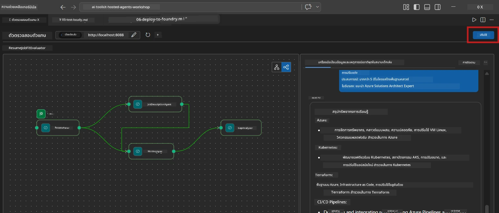
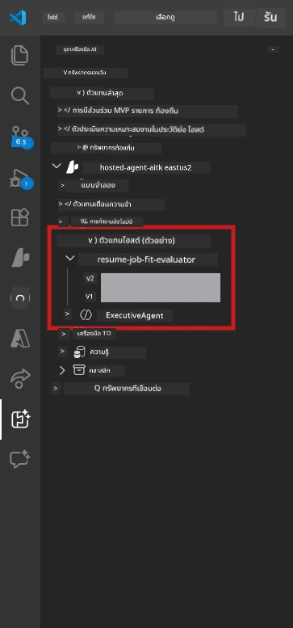

# Module 6 - การปรับใช้ไปยัง Foundry Agent Service

ในโมดูลนี้ คุณจะปรับใช้เวิร์กโฟลว์มัลติเอเจนต์ที่ทดสอบในเครื่องกับ [Microsoft Foundry](https://learn.microsoft.com/azure/foundry/agents/concepts/hosted-agents) ในฐานะ **Hosted Agent** กระบวนการปรับใช้จะสร้างอิมเมจคอนเทนเนอร์ Docker, ดันลงใน [Azure Container Registry (ACR)](https://learn.microsoft.com/azure/container-registry/container-registry-intro) และสร้างเวอร์ชันเอเจนต์ที่โฮสต์ใน [Foundry Agent Service](https://learn.microsoft.com/azure/foundry/agents/how-to/publish-agent)

> **ความแตกต่างสำคัญจาก Lab 01:** กระบวนการปรับใช้เหมือนกัน Foundry มองเวิร์กโฟลว์มัลติเอเจนต์ของคุณเป็นเอเจนต์โฮสต์เดียว – ความซับซ้อนอยู่ภายในคอนเทนเนอร์ แต่จุดปรับใช้เป็นจุดสิ้นสุด `/responses` เดียวกัน

---

## การตรวจสอบความพร้อมเบื้องต้น

ก่อนปรับใช้ ให้ตรวจสอบรายการด้านล่างนี้ทุกข้อ:

1. **เอเจนต์ผ่านการทดสอบสโมกในเครื่อง:**
   - คุณทำครบทั้ง 3 การทดสอบใน [Module 5](05-test-locally.md) และเวิร์กโฟลว์แสดงผลลัพธ์ครบถ้วนพร้อมการ์ดช่องว่างและ URL ของ Microsoft Learn

2. **คุณมีบทบาท [Azure AI User](https://learn.microsoft.com/azure/foundry/concepts/rbac-foundry):**
   - กำหนดไว้ใน [Lab 01, Module 2](../../lab01-single-agent/docs/02-create-foundry-project.md) ตรวจสอบได้ที่:
   - [Azure Portal](https://portal.azure.com) → ทรัพยากรโปรเจกต์ Foundry ของคุณ → **Access control (IAM)** → **Role assignments** → ยืนยันว่ามี **[Azure AI User](https://aka.ms/foundry-ext-project-role)** สำหรับบัญชีของคุณ

3. **คุณลงชื่อเข้าใช้งาน Azure ใน VS Code แล้ว:**
   - ตรวจสอบไอคอนบัญชีที่มุมล่างซ้ายของ VS Code บัญชีของคุณควรปรากฏ

4. **`agent.yaml` มีค่าถูกต้อง:**
   - เปิด `PersonalCareerCopilot/agent.yaml` และตรวจสอบ:
     ```yaml
     environment_variables:
       - name: PROJECT_ENDPOINT
         value: ${PROJECT_ENDPOINT}
       - name: MODEL_DEPLOYMENT_NAME
         value: ${MODEL_DEPLOYMENT_NAME}
     ```
   - ค่าต้องตรงกับ env vars ที่ `main.py` อ่าน

5. **`requirements.txt` มีเวอร์ชันถูกต้อง:**
   ```
   agent-framework-azure-ai==1.0.0rc3
   agent-framework-core==1.0.0rc3
   azure-ai-agentserver-agentframework==1.0.0b16
   azure-ai-agentserver-core==1.0.0b16
   debugpy
   agent-dev-cli --pre
   ```

---

## ขั้นตอนที่ 1: เริ่มการปรับใช้

### ตัวเลือก A: ปรับใช้จาก Agent Inspector (แนะนำ)

ถ้าเอเจนต์กำลังรันผ่าน F5 พร้อมกับ Agent Inspector เปิด:

1. ดูที่ **มุมบนขวา** ของแผง Agent Inspector
2. คลิกปุ่ม **Deploy** (ไอคอนเมฆพร้อมลูกศรขึ้น ↑)
3. ตัวช่วยปรับใช้จะเปิดขึ้น



### ตัวเลือก B: ปรับใช้จาก Command Palette

1. กด `Ctrl+Shift+P` เพื่อเปิด **Command Palette**
2. พิมพ์: **Microsoft Foundry: Deploy Hosted Agent** แล้วเลือก
3. ตัวช่วยปรับใช้จะเปิดขึ้น

---

## ขั้นตอนที่ 2: กำหนดค่าการปรับใช้

### 2.1 เลือกโปรเจกต์เป้าหมาย

1. เมนูแบบเลื่อนลงจะแสดงโปรเจกต์ Foundry ของคุณ
2. เลือกโปรเจกต์ที่คุณใช้ตลอดเวิร์กช็อป (เช่น `workshop-agents`)

### 2.2 เลือกไฟล์เอเจนต์คอนเทนเนอร์

1. คุณจะถูกขอให้เลือกจุดเริ่มต้นของเอเจนต์
2. ไปที่ `workshop/lab02-multi-agent/PersonalCareerCopilot/` และเลือก **`main.py`**

### 2.3 กำหนดค่าทรัพยากร

| การตั้งค่า | ค่าแนะนำ | หมายเหตุ |
|---------|------------------|-------|
| **CPU** | `0.25` | ค่าเริ่มต้น เวิร์กโฟลว์มัลติเอเจนต์ไม่ต้องการ CPU มากเพราะการเรียกโมเดลเป็น I/O-bound |
| **Memory** | `0.5Gi` | ค่าเริ่มต้น เพิ่มเป็น `1Gi` หากเพิ่มเครื่องมือประมวลผลข้อมูลขนาดใหญ่ |

---

## ขั้นตอนที่ 3: ยืนยันและปรับใช้

1. ตัวช่วยแสดงสรุปการปรับใช้
2. ตรวจสอบและคลิก **Confirm and Deploy**
3. ดูความคืบหน้าใน VS Code

### เกิดอะไรขึ้นในระหว่างการปรับใช้

ดูที่แผง **Output** ของ VS Code (เลือกเมนูแบบเลื่อนลง “Microsoft Foundry”):


1. **การ build Docker** – สร้างคอนเทนเนอร์จาก `Dockerfile` ของคุณ:
   ```
   Step 1/6 : FROM python:3.14-slim
   Step 2/6 : WORKDIR /app
   ...
   Successfully built abc123def456
   ```

2. **การ push Docker** – ดันอิมเมจไปยัง ACR (ใช้เวลา 1-3 นาทีในครั้งแรกที่ปรับใช้)

3. **การลงทะเบียนเอเจนต์** – Foundry สร้างโฮสต์เอเจนต์โดยใช้เมตาดาต้าใน `agent.yaml` ชื่อเอเจนต์คือ `resume-job-fit-evaluator`

4. **เริ่มคอนเทนเนอร์** – คอนเทนเนอร์จะเริ่มในโครงสร้างพื้นฐานที่จัดการโดย Foundry พร้อมตัวตนที่ระบบจัดการให้

> **การปรับใช้ครั้งแรกจะช้ากว่า** (Docker ดันเลเยอร์ทั้งหมด) การปรับใช้ครั้งถัดไปจะใช้เลเยอร์ที่แคชไว้และเร็วกว่ามาก

### หมายเหตุเฉพาะสำหรับมัลติเอเจนต์

- **เอเจนต์ทั้งสี่อยู่ในคอนเทนเนอร์เดียวกัน** Foundry มองว่ามันเป็นเอเจนต์โฮสต์เดียว กราฟ WorkflowBuilder จะรันภายในคอนเทนเนอร์
- **การเรียก MCP จะออกอินเทอร์เน็ต** คอนเทนเนอร์ต้องสามารถเข้าถึง `https://learn.microsoft.com/api/mcp` Foundry มีการจัดการโครงสร้างพื้นฐานเพื่อให้เข้าถึงได้โดยอัตโนมัติ
- **[Managed Identity](https://learn.microsoft.com/python/api/overview/azure/identity-readme#managed-identity-support)** ในสภาพแวดล้อมโฮสต์ ฟังก์ชัน `get_credential()` ใน `main.py` จะคืนค่า `ManagedIdentityCredential()` (เนื่องจากมีการตั้งค่า `MSI_ENDPOINT`) ซึ่งเป็นการทำงานอัตโนมัติ

---

## ขั้นตอนที่ 4: ตรวจสอบสถานะการปรับใช้

1. เปิดแถบด้านข้าง **Microsoft Foundry** (คลิกไอคอน Foundry ใน Activity Bar)
2. ขยาย **Hosted Agents (Preview)** ภายใต้โปรเจกต์ของคุณ
3. หา **resume-job-fit-evaluator** (หรือชื่อเอเจนต์ของคุณ)
4. คลิกชื่อเอเจนต์ → ขยายเวอร์ชัน (เช่น `v1`)
5. คลิกเวอร์ชัน → ดู **Container Details** → **Status**:



| สถานะ | ความหมาย |
|--------|---------|
| **Started** / **Running** | คอนเทนเนอร์กำลังทำงาน, เอเจนต์พร้อมใช้งาน |
| **Pending** | คอนเทนเนอร์กำลังเริ่มต้น (รอ 30-60 วินาที) |
| **Failed** | คอนเทนเนอร์เริ่มต้นไม่สำเร็จ (ตรวจสอบบันทึก - ดูด้านล่าง) |

> **การเริ่มต้นมัลติเอเจนต์จะใช้เวลานานกว่าการเอเจนต์เดียว** เพราะคอนเทนเนอร์สร้างเอเจนต์ 4 อินสแตนซ์ในตอนเริ่มต้น “Pending” นานสูงสุด 2 นาทีเป็นเรื่องปกติ

---

## ข้อผิดพลาดทั่วไปในการปรับใช้และวิธีแก้ไข

### ข้อผิดพลาด 1: Permission denied - `agents/write`

```
Error: lacks the required data action 
Microsoft.CognitiveServices/accounts/AIServices/agents/write
```

**วิธีแก้:** กำหนดบทบาท **[Azure AI User](https://learn.microsoft.com/azure/foundry/concepts/rbac-foundry)** ในระดับ **โปรเจกต์** ดูรายละเอียดขั้นตอนใน [Module 8 - Troubleshooting](08-troubleshooting.md)

### ข้อผิดพลาด 2: Docker ไม่รัน

```
Error: Docker build failed / Cannot connect to Docker daemon
```

**วิธีแก้:**
1. เริ่ม Docker Desktop
2. รอจนขึ้นข้อความ "Docker Desktop is running"
3. ตรวจสอบ: `docker info`
4. **Windows:** ตรวจสอบว่าเปิดใช้งาน WSL 2 backend ในการตั้งค่า Docker Desktop
5. ลองใหม่อีกครั้ง

### ข้อผิดพลาด 3: pip install ไม่สำเร็จในระหว่าง build Docker

```
Error: Could not find a version that satisfies the requirement agent-dev-cli
```

**วิธีแก้:** ธง `--pre` ใน `requirements.txt` ถูกจัดการต่างกันใน Docker ให้แน่ใจว่า `requirements.txt` มี:
```
agent-dev-cli --pre
```

ถ้ายังล้มเหลว ให้สร้าง `pip.conf` หรือส่ง `--pre` ผ่านอาร์กิวเมนต์ build ดูรายละเอียดใน [Module 8](08-troubleshooting.md)

### ข้อผิดพลาด 4: เครื่องมือ MCP ล้มเหลวในเอเจนต์โฮสต์

ถ้า Gap Analyzer หยุดสร้าง URL ของ Microsoft Learn หลังจากการปรับใช้:

**สาเหตุ:** นโยบายเครือข่ายอาจบล็อก HTTPS ขาออกจากคอนเทนเนอร์

**วิธีแก้:**
1. โดยปกติไม่ใช่ปัญหาใน Foundry ด้วยค่ากำหนดเริ่มต้น
2. หากเกิดขึ้น ให้ตรวจสอบว่าเครือข่ายเสมือน (virtual network) ของโปรเจกต์ Foundry มี NSG บล็อก HTTPS ขาออกหรือไม่
3. เครื่องมือ MCP มี URL fallback ในตัว ดังนั้นเอเจนต์จะยังผลิตผลลัพธ์ (แต่ไม่มี URL สด)

---

### จุดตรวจสอบ

- [ ] คำสั่งปรับใช้สำเร็จโดยไม่มีข้อผิดพลาดใน VS Code
- [ ] เอเจนต์ปรากฏใน **Hosted Agents (Preview)** ในแถบ Foundry
- [ ] ชื่อเอเจนต์เป็น `resume-job-fit-evaluator` (หรือชื่อที่เลือก)
- [ ] สถานะคอนเทนเนอร์แสดง **Started** หรือ **Running**
- [ ] (ถ้ามีข้อผิดพลาด) ระบุข้อผิดพลาด, แก้ไข และปรับใช้ใหม่สำเร็จ

---

**ก่อนหน้า:** [05 - Test Locally](05-test-locally.md) · **ถัดไป:** [07 - Verify in Playground →](07-verify-in-playground.md)

---

<!-- CO-OP TRANSLATOR DISCLAIMER START -->
**ข้อจำกัดความรับผิดชอบ**:  
เอกสารนี้ได้รับการแปลโดยใช้บริการแปลภาษาอัตโนมัติ [Co-op Translator](https://github.com/Azure/co-op-translator) แม้เราจะพยายามให้มีความถูกต้องสูงสุด โปรดทราบว่าการแปลโดยระบบอัตโนมัติอาจมีข้อผิดพลาดหรือความคลาดเคลื่อนได้ เอกสารต้นฉบับในภาษาต้นทางถือเป็นแหล่งข้อมูลที่ถูกต้องและเชื่อถือได้ สำหรับข้อมูลที่สำคัญ ควรใช้การแปลโดยมนุษย์มืออาชีพ เราจะไม่รับผิดชอบต่อความเข้าใจผิดหรือการตีความที่ผิดพลาดที่เกิดขึ้นจากการใช้การแปลนี้
<!-- CO-OP TRANSLATOR DISCLAIMER END -->