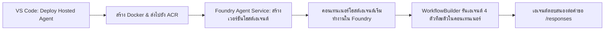
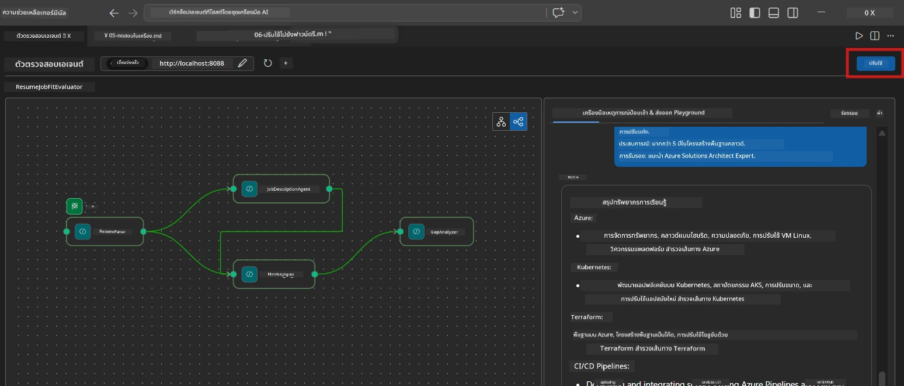
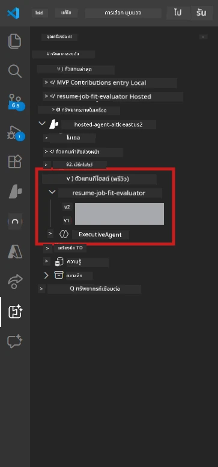

# โมดูล 6 - ติดตั้งไปยังบริการ Foundry Agent

⏱️ ~10 นาที

ในโมดูลนี้ คุณจะติดตั้งเวิร์กโฟลว์หลายเอเจนต์ที่ทดสอบในเครื่องไปยัง [Microsoft Foundry](https://learn.microsoft.com/azure/foundry/agents/concepts/hosted-agents) ในฐานะ **Hosted Agent** กระบวนการติดตั้งจะสร้างอิมเมจ Docker container ดันไปยัง [Azure Container Registry (ACR)](https://learn.microsoft.com/azure/container-registry/container-registry-intro) และสร้างเวอร์ชันโฮสต์เอเจนต์ใน [Foundry Agent Service](https://learn.microsoft.com/azure/foundry/agents/how-to/publish-agent)

> **ความแตกต่างที่สำคัญจาก Lab 01:** กระบวนการติดตั้งเหมือนกัน Foundry มองเวิร์กโฟลว์หลายเอเจนต์ของคุณเป็นโฮสต์เอเจนต์เดียว — ความซับซ้อนอยู่ภายในคอนเทนเนอร์ แต่หน้าพื้นที่ติดตั้งเหมือนกับ endpoint `/responses` เดียวกัน

### กระบวนการติดตั้ง


```mermaid
flowchart LR
    A[VS Code: Deploy Hosted Agent] --> B[สร้าง Docker & ส่งไปยัง ACR]
    B --> C[Foundry Agent Service: สร้างเวอร์ชันโฮสต์เอเจนต์]
    C --> D[คอนเทนเนอร์โฮสต์เอเจนต์เริ่มทำงานใน Foundry]
    D --> E[WorkflowBuilder รันเอเจนต์ 4 ตัวทีละตัวในคอนเทนเนอร์]
    E --> F[เอเจนต์ตอบสนองต่อคำขอ /responses]
```

---

## ตรวจสอบข้อกำหนดเบื้องต้น

ก่อนการติดตั้ง ให้ตรวจสอบแต่ละรายการด้านล่าง:

1. **เอเจนต์ผ่านการทดสอบแบบ smoke tests ในเครื่อง:**
   - คุณได้ทำการทดสอบครบทั้ง 3 ใน [โมดูล 5](05-test-locally.md) และเวิร์กโฟลว์ให้ผลลัพธ์สมบูรณ์พร้อมบัตรช่องว่างและ URL Microsoft Learn

2. **คุณมีบทบาท [Foundry User](https://learn.microsoft.com/azure/foundry/concepts/rbac-foundry)** (สำหรับการติดตั้ง คุณต้องมีอย่างน้อย **Foundry Project Manager** ในระดับโปรเจกต์):

   > **หมายเหตุ:** บทบาท Foundry RBAC เพิ่งเปลี่ยนชื่อ — **Foundry User**, **Foundry Owner**, และ **Foundry Project Manager** เดิมชื่อ Azure AI User, Azure AI Owner, และ Azure AI Project Manager ตามลำดับ รหัสและสิทธิ์บทบาทไม่เปลี่ยนแปลง

   - ตรวจสอบใน [Azure Portal](https://portal.azure.com) → ทรัพยากร **โปรเจกต์** Foundry ของคุณ → **Access control (IAM)** → **Role assignments** → ยืนยันว่ามี **Foundry User** (หรือสูงกว่า) อยู่ในบัญชีของคุณ

3. **คุณเซ็นชื่อเข้าใช้ Azure ใน VS Code:**
   - ตรวจสอบไอคอนบัญชีที่มุมล่างซ้ายของ VS Code ชื่อบัญชีของคุณควรปรากฏ

4. **`agent.yaml` มีค่าถูกต้อง:**
   - เปิด `PersonalCareerCopilot/agent.yaml` และตรวจสอบ:
     ```yaml
     environment_variables:
       - name: AZURE_AI_MODEL_DEPLOYMENT_NAME
         value: ${AZURE_AI_MODEL_DEPLOYMENT_NAME}
     ```
   - `FOUNDRY_PROJECT_ENDPOINT` **จะไม่** ปรากฏในนี้ — Foundry จะใส่ค่าในระหว่างรันไทม์ มีเพียง `AZURE_AI_MODEL_DEPLOYMENT_NAME` ที่ต้องประกาศเท่านั้น

5. **`requirements.txt` มีเวอร์ชันที่ถูกต้อง:**
   ```
   agent-framework-foundry
   agent-framework-foundry-hosting
   mcp<2,>=1.24.0
   debugpy
   ```

---

## ขั้นตอนที่ 1: เริ่มการติดตั้ง

### ตัวเลือก A: ติดตั้งจาก Agent Inspector (แนะนำ)

หากเอเจนต์กำลังทำงานผ่าน F5 พร้อมเปิด Agent Inspector:

1. ดูที่ **มุมบนขวา** ของแผง Agent Inspector
2. คลิกปุ่ม **Deploy** (ไอคอนเมฆพร้อมลูกศรขึ้น ↑)
3. ตัวช่วยติดตั้งจะเปิดขึ้น



### ตัวเลือก B: ติดตั้งจาก Command Palette

1. กด `Ctrl+Shift+P` เพื่อเปิด **Command Palette**
2. พิมพ์: **Foundry Toolkit: Deploy Hosted Agent** และเลือก
3. ตัวช่วยติดตั้งจะเปิดขึ้น

---

## ขั้นตอนที่ 2: กำหนดค่าการติดตั้ง

### 2.1 เลือกโปรเจกต์เป้าหมาย

1. เมนูดรอปดาวน์จะแสดงโปรเจกต์ Foundry ของคุณ
2. เลือกโปรเจกต์ที่คุณใช้ตลอดระหว่างเวิร์กช็อป (เช่น `workshop-agents`)

### 2.2 เลือกไฟล์เอเจนต์คอนเทนเนอร์

1. คุณจะถูกขอให้เลือกจุดเข้าเอเจนต์
2. ไปที่ `workshop/lab02-multi-agent/PersonalCareerCopilot/` และเลือก **`main.py`**

### 2.3 กำหนดค่าทรัพยากร

| การตั้งค่า | ค่าที่แนะนำ | หมายเหตุ |
|---------|------------------|-------|
| **วิธีติดตั้ง** | **Container** (แนะนำ) หรือ **Code** | Container สร้างอิมเมจ Docker; Code อัปโหลดซอร์สเป็น ZIP (สถานะตัวอย่าง) |
| **Container Registry** | **ACR เริ่มต้น** | Foundry สร้างและจัดการให้คุณ |
| **CPU** | `0.25` | ค่าดีฟอลต์ เวิร์กโฟลว์หลายเอเจนต์ไม่ต้องการ CPU มากกว่าเพราะการเรียกโมเดลเป็น I/O-bound |
| **หน่วยความจำ** | `0.5Gi` | ค่าดีฟอลต์ เพิ่มเป็น `1Gi` หากเพิ่มเครื่องมือประมวลผลข้อมูลขนาดใหญ่ |

---

## ขั้นตอนที่ 3: ยืนยันและติดตั้ง

1. ตัวช่วยจะแสดงสรุปการติดตั้ง
2. ตรวจสอบและคลิก **Confirm and Deploy**
3. ดูความคืบหน้าใน VS Code

### สิ่งที่จะเกิดขึ้นระหว่างติดตั้ง

ดูแผง **Output** ใน VS Code (เลือกเมนู "Microsoft Foundry"):

1. **Docker build** - สร้างคอนเทนเนอร์จาก `Dockerfile` ของคุณ
   ```
   Step 1/6 : FROM python:3.12-slim
   Step 2/6 : WORKDIR /app
   ...
   Successfully built abc123def456
   ```

2. **Docker push** - ดันอิมเมจไปยัง ACR (1-3 นาทีในการติดตั้งครั้งแรก)

3. **การลงทะเบียนเอเจนต์** - Foundry สร้างโฮสต์เอเจนต์โดยใช้ metadata จาก `agent.yaml` ชื่อเอเจนต์คือ `resume-job-fit-evaluator`

4. **เริ่มคอนเทนเนอร์** - คอนเทนเนอร์เริ่มในโครงสร้างพื้นฐานที่จัดการโดย Foundry พร้อมกับตัวระบุตัวตนที่ระบบจัดการให้

> **การติดตั้งครั้งแรกช้ากว่า** (Docker ดันทุกเลเยอร์) การติดตั้งครั้งถัดไปรวมเลเยอร์ที่แคชไว้และเร็วกว่ามาก

### หมายเหตุเฉพาะหลายเอเจนต์

- **เอเจนต์ทั้งสี่อยู่ในคอนเทนเนอร์เดียวกัน** Foundry มองว่าเป็นเอเจนต์โฮสต์เดียว กราฟ WorkflowBuilder รันภายใน
- **การเรียก MCP ติดต่อออกอินเทอร์เน็ต** คอนเทนเนอร์ต้องเข้าถึง `https://learn.microsoft.com/api/mcp` Foundry จัดให้โดยค่าเริ่มต้น
- **[Managed Identity](https://learn.microsoft.com/azure/foundry/agents/concepts/agent-identity).** Foundry สร้างตัวระบุตัวตน Entra เฉพาะสำหรับแต่ละโฮสต์เอเจนต์โดยอัตโนมัติเมื่อเวลาติดตั้ง ในสภาพแวดล้อมโฮสต์ `DefaultAzureCredential` จะอ้างถึงตัวระบุตัวตนเอเจนต์นี้โดยอัตโนมัติ — ไม่ต้องตั้งค่าตัวระบุตัวตนด้วยตนเอง

---

## ขั้นตอนที่ 4: ตรวจสอบสถานะการติดตั้ง

1. เปิดแถบด้านข้าง **Microsoft Foundry** (คลิกไอคอน Foundry ใน Activity Bar)
2. ขยาย **Hosted Agents (Preview)** ภายใต้โปรเจกต์ของคุณ
3. ค้นหา **resume-job-fit-evaluator** (หรือชื่อเอเจนต์ของคุณ)
4. คลิกชื่อเอเจนต์ → ขยายเวอร์ชันต่างๆ (เช่น `v1`)
5. คลิกที่เวอร์ชัน → ตรวจสอบ **Container Details** → **Status**:



| สถานะ | ความหมาย |
|--------|---------|
| **active** | เอเจนต์กำลังทำงานและพร้อมรับคำขอ |
| **creating** | คอนเทนเนอร์กำลังเริ่มต้น (รอ 30–60 วินาที) |
| **failed** | คอนเทนเนอร์เริ่มไม่สำเร็จ (ตรวจเช็คล็อก—ดูด้านล่าง) |

> **หมายเหตุ:** แถบด้านข้าง VS Code อาจแสดงป้าย "Running" หรือ "Started" ขณะที่สถานะ API ใช้ `active`/`creating` สถานะแสดงทั้งสองหมายถึงสถานะเดียวกัน

> **การเริ่มต้นหลายเอเจนต์ใช้เวลานานกว่า** เอเจนต์เดียวเพราะคอนเทนเนอร์สร้างอินสแตนซ์เอเจนต์ 4 ตัวตอนเริ่มต้น `creating` นานถึง 2 นาทีถือว่าเป็นปกติ

---

## ข้อผิดพลาดและวิธีแก้ไขทั่วไปเมื่อติดตั้ง

### ข้อผิดพลาด 1: ไม่ได้รับอนุญาต - `agents/write`

```
Error: lacks the required data action 
Microsoft.CognitiveServices/accounts/AIServices/agents/write
```

**แก้ไข:** กำหนดบทบาท **[Foundry User](https://learn.microsoft.com/azure/foundry/concepts/rbac-foundry)** (เดิม **Azure AI User**) ในระดับ **โปรเจกต์** ดู [โมดูล 8 - แก้ปัญหา](08-troubleshooting.md) สำหรับขั้นตอนทีละขั้นตอน

### ข้อผิดพลาด 2: Docker ไม่ทำงาน

```
Error: Docker build failed / Cannot connect to Docker daemon
```

**แก้ไข:**
1. เริ่ม Docker Desktop
2. รอจนแสดงว่า "Docker Desktop is running"
3. ตรวจสอบ: `docker info`
4. **Windows:** ตรวจสอบว่าเปิดใช้ backend WSL 2 ในการตั้งค่า Docker Desktop
5. ลองใหม่

### ข้อผิดพลาด 3: pip install ล้มเหลวระหว่างการสร้าง Docker

```
Error: Could not find a version that satisfies the requirement agent-framework-foundry
```

**แก้ไข:** ตรวจสอบว่า `requirements.txt` ตรงกับที่แนะนำ:
```
agent-framework-foundry
agent-framework-foundry-hosting
mcp<2,>=1.24.0
debugpy
```

ถ้าการสร้างยังล้มเหลว อาจเป็นเพราะเครือข่าย Docker บล็อก PyPI ตรวจสอบ `docker info` สำหรับการตั้งค่า proxy

### ข้อผิดพลาด 4: เครื่องมือ MCP ล้มเหลวในโฮสต์เอเจนต์

ถ้า Gap Analyzer หยุดสร้าง URL Microsoft Learn หลังติดตั้ง:

**สาเหตุหลัก:** นโยบายเครือข่ายอาจบล็อก HTTPS outbound จากคอนเทนเนอร์

**แก้ไข:**
1. ปกติจะไม่เป็นปัญหากับการตั้งค่า Foundry เริ่มต้น
2. หากเกิดขึ้น ให้ตรวจสอบว่าเครือข่ายเสมือนในโปรเจกต์ Foundry มี NSG บล็อก HTTPS outbound หรือไม่
3. เครื่องมือ MCP มี fallback URL ในตัว ดังนั้นเอเจนต์ยังสามารถผลิตผลลัพธ์ได้ (แต่ไม่มี URL สด)

---

### จุดตรวจสอบ

- [ ] คำสั่งติดตั้งเสร็จสมบูรณ์โดยไม่มีข้อผิดพลาดใน VS Code
- [ ] เอเจนต์ปรากฏภายใต้ **Hosted Agents (Preview)** ในแถบด้านข้าง Foundry
- [ ] ชื่อเอเจนต์คือ `resume-job-fit-evaluator` (หรือชื่อที่เลือก)
- [ ] สถานะคอนเทนเนอร์แสดง **Started** หรือ **Running**
- [ ] (ถ้ามีข้อผิดพลาด) คุณระบุข้อผิดพลาด ใช้วิธีแก้ไข และติดตั้งใหม่สำเร็จ

---

**ก่อนหน้า:** [05 - ทดสอบในเครื่อง](05-test-locally.md) · **ถัดไป:** [07 - ตรวจสอบใน Playground →](07-verify-in-playground.md)

---

<!-- CO-OP TRANSLATOR DISCLAIMER START -->
**ปฏิเสธความรับผิดชอบ**:
เอกสารนี้ได้รับการแปลโดยใช้บริการแปลภาษา AI [Co-op Translator](https://github.com/Azure/co-op-translator) ขณะที่เราพยายามให้ความถูกต้อง โปรดทราบว่าการแปลโดยอัตโนมัติอาจมีข้อผิดพลาดหรือความไม่ถูกต้อง เอกสารต้นฉบับในภาษาต้นทางควรถูกพิจารณาเป็นแหล่งข้อมูลที่เชื่อถือได้ สำหรับข้อมูลที่สำคัญ แนะนำให้ใช้การแปลโดยมนุษย์มืออาชีพ เราไม่รับผิดชอบต่อความเข้าใจผิดหรือการตีความที่ผิดพลาดที่เกิดขึ้นจากการใช้การแปลนี้
<!-- CO-OP TRANSLATOR DISCLAIMER END -->