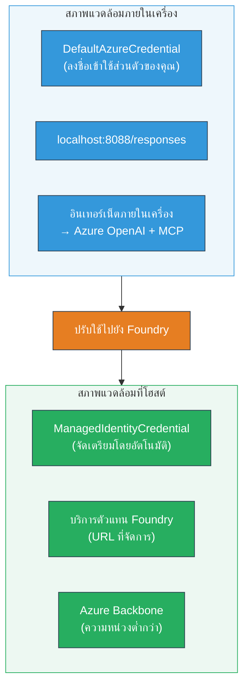

# Module 7 - ตรวจสอบใน Playground

ในโมดูลนี้ คุณจะทดสอบเวิร์กโฟลว์หลายตัวแทนที่คุณปรับใช้ในทั้ง **VS Code** และ **[Foundry Portal](https://ai.azure.com)** เพื่อยืนยันว่าตัวแทนทำงานเหมือนกับตอนทดสอบในเครื่อง

---

## ทำไมต้องตรวจสอบหลังจากปรับใช้?

เวิร์กโฟลว์หลายตัวแทนของคุณทำงานได้สมบูรณ์แบบในเครื่อง ทําไมต้องทดสอบอีกครั้ง? เพราะสภาพแวดล้อมที่โฮสต์แตกต่างกันหลายประการ:


| ความแตกต่าง | ในเครื่อง | โฮสต์ |
|-----------|-------|--------|
| **Identity** | [`DefaultAzureCredential`](https://learn.microsoft.com/azure/developer/python/sdk/authentication/credential-chains#defaultazurecredential-overview) (การลงชื่อเข้าใช้ส่วนตัวของคุณ) | [`ManagedIdentityCredential`](https://learn.microsoft.com/python/api/overview/azure/identity-readme#managed-identity-support) (จัดเตรียมโดยอัตโนมัติ) |
| **Endpoint** | `http://localhost:8088/responses` | [Foundry Agent Service](https://learn.microsoft.com/azure/foundry/agents/concepts/hosted-agents) endpoint (URL ที่จัดการ) |
| **Network** | เครื่องในเครื่อง → Azure OpenAI + MCP outbound | โครงข่ายหลัก Azure (หน่วงเวลาต่ำกว่า ระหว่างบริการ) |
| **MCP connectivity** | อินเทอร์เน็ตในเครื่อง → `learn.microsoft.com/api/mcp` | คอนเทนเนอร์ outbound → `learn.microsoft.com/api/mcp` |

ถ้ามีการตั้งค่าตัวแปรสภาพแวดล้อมผิดพลาด, สิทธิ์ RBAC แตกต่าง, หรือการเชื่อมต่อ MCP outbound ถูกบล็อก จะตรวจจับได้ที่นี่

---

## ตัวเลือก A: ทดสอบใน VS Code Playground (แนะนำให้ทำเป็นอย่างแรก)

[Foundry extension](https://marketplace.visualstudio.com/items?itemName=TeamsDevApp.vscode-ai-foundry) มี Playground ในตัวที่ให้คุณสนทนากับตัวแทนที่คุณปรับใช้ได้โดยไม่ต้องออกจาก VS Code

### ขั้นตอนที่ 1: ไปยังตัวแทนที่โฮสต์ของคุณ

1. คลิกที่ไอคอน **Microsoft Foundry** ใน **Activity Bar** ของ VS Code (แถบด้านซ้าย) เพื่อเปิดแผง Foundry
2. ขยายโปรเจกต์ที่เชื่อมต่อของคุณ (เช่น `workshop-agents`)
3. ขยาย **Hosted Agents (Preview)**
4. คุณจะเห็นชื่อตัวแทนของคุณ (เช่น `resume-job-fit-evaluator`)

### ขั้นตอนที่ 2: เลือกเวอร์ชัน

1. คลิกที่ชื่อตัวแทนเพื่อขยายดูเวอร์ชัน
2. คลิกที่เวอร์ชันที่คุณปรับใช้ (เช่น `v1`)
3. แผงรายละเอียดจะเปิดขึ้นแสดง Container Details
4. ตรวจสอบสถานะว่าเป็น **Started** หรือ **Running**

### ขั้นตอนที่ 3: เปิด Playground

1. ในแผงรายละเอียด คลิกปุ่ม **Playground** (หรือคลิกขวาที่เวอร์ชัน → **Open in Playground**)
2. อินเทอร์เฟซแชทจะเปิดในแท็บ VS Code

### ขั้นตอนที่ 4: รันการทดสอบ smoke tests ของคุณ

ใช้ 3 การทดสอบเดียวกับใน [Module 5](05-test-locally.md) พิมพ์ข้อความแต่ละข้อความในช่องป้อนข้อมูลของ Playground และกด **ส่ง** (หรือ **Enter**)

#### การทดสอบ 1 - เรซูเม่เต็ม + JD (กระบวนการปกติ)

วางข้อความเรซูเม่เต็ม + JD จาก Module 5, การทดสอบ 1 (Jane Doe + Senior Cloud Engineer ที่ Contoso Ltd)

**คาดหวัง:**
- คะแนนความเหมาะสมพร้อมการคำนวณแยกรายละเอียด (มาตราส่วน 100 คะแนน)
- ส่วนทักษะที่ตรงกัน
- ส่วนทักษะที่ขาดหาย
- **บัตรช่องว่างหนึ่งใบต่อทักษะที่ขาดหาย** พร้อม URL ของ Microsoft Learn
- ตารางการเรียนรู้พร้อมไทม์ไลน์

#### การทดสอบ 2 - การทดสอบสั้นอย่างรวดเร็ว (ข้อมูลน้อยสุด)

```
RESUME: 3 years Python developer, knows Django and PostgreSQL, no cloud experience.

JOB: Cloud DevOps Engineer requiring AWS, Kubernetes, Terraform, CI/CD. 5 years needed.
```

**คาดหวัง:**
- คะแนนความเหมาะสมต่ำกว่า (< 40)
- การประเมินอย่างซื่อสัตย์พร้อมเส้นทางการเรียนรู้เป็นขั้นตอน
- บัตรช่องว่างหลายใบ (AWS, Kubernetes, Terraform, CI/CD, ช่องว่างประสบการณ์)

#### การทดสอบ 3 - ผู้สมัครที่เหมาะสมสูง

```
RESUME:
10 years Azure Cloud Architect. AZ-305 certified. Expert in AKS, Terraform, Azure DevOps, 
Azure Functions, Helm, Prometheus, Grafana, Python, Go. Led platform team of 8.

JOB:
Senior Cloud Engineer. Required: AKS, Terraform, Azure DevOps, Python. Preferred: Helm, Go.
5+ years experience. AZ-305 preferred.
```

**คาดหวัง:**
- คะแนนความเหมาะสมสูง (≥ 80)
- เน้นการเตรียมตัวสัมภาษณ์และการขัดเกลา
- มีบัตรช่องว่างเพียงเล็กน้อยหรือไม่มีเลย
- ไทม์ไลน์สั้นที่เน้นการเตรียมตัว

### ขั้นตอนที่ 5: เปรียบเทียบกับผลลัพธ์ในเครื่อง

เปิดบันทึกหรือแท็บเบราว์เซอร์จาก Module 5 ที่คุณบันทึกคำตอบในเครื่อง สำหรับแต่ละการทดสอบ:

- คำตอบมี **โครงสร้างเดียวกัน** หรือไม่ (คะแนนความเหมาะสม, บัตรช่องว่าง, ตารางเส้นทาง)?
- ใช้ **หลักการคำนวณคะแนนเดียวกัน** หรือไม่ (การแยกคะแนน 100 คะแนน)?
- ยังมี **URL Microsoft Learn** ในบัตรช่องว่างหรือเปล่า?
- มี **บัตรช่องว่างหนึ่งใบต่อทักษะที่ขาดหาย** (ไม่ได้ตัดทอน)?

> **ความแตกต่างเล็กน้อยในสำนวนถือว่าเป็นเรื่องปกติ** - โมเดลมีความไม่แน่นอน เน้นที่โครงสร้าง ความสอดคล้องของการให้คะแนน และการใช้เครื่องมือ MCP

---

## ตัวเลือก B: ทดสอบใน Foundry Portal

[Foundry Portal](https://ai.azure.com) มี playground แบบเว็บที่เหมาะสำหรับแชร์กับทีมงานหรือผู้มีส่วนได้ส่วนเสีย

### ขั้นตอนที่ 1: เปิด Foundry Portal

1. เปิดเบราว์เซอร์และไปที่ [https://ai.azure.com](https://ai.azure.com)
2. ลงชื่อเข้าใช้ด้วยบัญชี Azure เดียวกันที่คุณใช้ในเวิร์กช็อปนี้

### ขั้นตอนที่ 2: ไปยังโปรเจกต์ของคุณ

1. บนหน้าแรก ดูที่ **Recent projects** ในแถบด้านซ้าย
2. คลิกชื่อโปรเจกต์ของคุณ (เช่น `workshop-agents`)
3. ถ้าไม่เห็น ให้คลิก **All projects** แล้วค้นหา

### ขั้นตอนที่ 3: หาเอเจนต์ที่ปรับใช้ของคุณ

1. ในเมนูด้านซ้ายของโปรเจกต์ คลิก **Build** → **Agents** (หรือดูส่วน **Agents**)
2. คุณจะเห็นรายการเอเจนต์ หาเอเจนต์ที่คุณปรับใช้ (เช่น `resume-job-fit-evaluator`)
3. คลิกชื่อเอเจนต์เพื่อเปิดหน้ารายละเอียด

### ขั้นตอนที่ 4: เปิด Playground

1. บนหน้ารายละเอียดเอเจนต์ ดูที่แถบทูลบาร์ด้านบน
2. คลิก **Open in playground** (หรือ **Try in playground**)
3. อินเทอร์เฟซแชทจะเปิดขึ้น

### ขั้นตอนที่ 5: รันการทดสอบ smoke tests เดียวกัน

ทำซ้ำทดสอบ 3 การทดสอบเดียวจากส่วน VS Code Playground ด้านบน เปรียบเทียบคำตอบกับผลลัพธ์ทั้งในเครื่อง (Module 5) และ VS Code Playground (ตัวเลือก A ข้างต้น)

---

## การตรวจสอบเฉพาะ multi-agent

นอกเหนือจากความถูกต้องพื้นฐาน ให้ตรวจสอบพฤติกรรมเฉพาะ multi-agent เหล่านี้:

### การเรียกใช้เครื่องมือ MCP

| ตรวจสอบ | วิธีตรวจสอบ | เงื่อนไขผ่าน |
|-------|---------------|----------------|
| เรียก MCP สำเร็จ | บัตรช่องว่างมี URL `learn.microsoft.com` | URL จริง ไม่ใช่ข้อความสำรอง |
| เรียก MCP หลายครั้ง | ทุกช่องว่างที่มีความสำคัญสูง/กลางมีทรัพยากร | ไม่ใช่แค่บัตรช่องว่างใบแรก |
| สำรอง MCP ทำงาน | ถ้าไม่พบ URL ให้ตรวจสอบข้อความสำรอง | ตัวแทนยังสร้างบัตรช่องว่างได้ (ไม่ว่าจะมี URL หรือไม่) |

### การประสานงานตัวแทน

| ตรวจสอบ | วิธีตรวจสอบ | เงื่อนไขผ่าน |
|-------|---------------|----------------|
| ตัวแทน 4 ตัวทำงานครบ | ผลลัพธ์มีทั้งคะแนนความเหมาะสมและบัตรช่องว่าง | คะแนนมาจาก MatchingAgent, บัตรมาจาก GapAnalyzer |
| การกระจายแบบขนาน | เวลาแสดงผลสมเหตุสมผล (< 2 นาที) | ถ้านานกว่า 3 นาที อาจไม่ใช่การทำงานแบบขนาน |
| ความสมบูรณ์ของการไหลข้อมูล | บัตรช่องว่างอ้างอิงทักษะจากรายงาน matching | ไม่มีทักษะลวงที่ไม่มีใน JD |

---

## หลักเกณฑ์การประเมิน

ใช้เกณฑ์นี้ประเมินพฤติกรรมที่โฮสต์ของเวิร์กโฟลว์ multi-agent ของคุณ:

| # | หลักเกณฑ์ | เงื่อนไขผ่าน | ผ่าน? |
|---|----------|---------------|-------|
| 1 | **ความถูกต้องในการทำงาน** | ตัวแทนตอบเรซูเม่ + JD ด้วยคะแนนความเหมาะสมและการวิเคราะห์ช่องว่าง | |
| 2 | **ความสอดคล้องคะแนน** | คะแนนใช้มาตราส่วน 100 คะแนนพร้อมการคำนวณแยก | |
| 3 | **ความครบถ้วนของบัตรช่องว่าง** | บัตรหนึ่งใบต่อทักษะที่หายไป (ไม่ตัดทอนหรือรวม) | |
| 4 | **การรวมเครื่องมือ MCP** | บัตรช่องว่างมี URL ของ Microsoft Learn ที่ใช้งานได้จริง | |
| 5 | **ความสอดคล้องของโครงสร้าง** | โครงสร้างผลลัพธ์ตรงกับการรันทั้งในเครื่องและโฮสต์ | |
| 6 | **เวลาตอบกลับ** | ตัวแทนโฮสต์ตอบภายใน 2 นาทีสำหรับการประเมินเต็มรูปแบบ | |
| 7 | **ไม่มีข้อผิดพลาด** | ไม่มีข้อผิดพลาด HTTP 500, หมดเวลา หรือคำตอบว่าง | |

> "ผ่าน" หมายถึงเกณฑ์ทั้ง 7 ผ่านสำหรับการทดสอบ smoke tests ครบทั้ง 3 รายการใน playground อย่างน้อยหนึ่งแห่ง (VS Code หรือ Portal)

---

## การแก้ไขปัญหา playground

| อาการ | สาเหตุที่เป็นไปได้ | วิธีแก้ไข |
|---------|-------------|-----|
| Playground โหลดไม่ขึ้น | สถานะคอนเทนเนอร์ไม่ใช่ "Started" | กลับไปที่ [Module 6](06-deploy-to-foundry.md) ตรวจสอบสถานะการปรับใช้ รอถ้าเป็น "Pending" |
| ตัวแทนส่งคำตอบว่าง | ชื่อโมเดลในการปรับใช้ไม่ตรงกัน | ตรวจสอบ `agent.yaml` → `environment_variables` → `MODEL_DEPLOYMENT_NAME` ให้ตรงกับโมเดลที่ปรับใช้ |
| ตัวแทนส่งข้อความแสดงข้อผิดพลาด | สิทธิ์ [RBAC](https://learn.microsoft.com/azure/foundry/concepts/rbac-foundry) ขาด | กำหนดบทบาท **[Azure AI User](https://aka.ms/foundry-ext-project-role)** ในระดับโปรเจกต์ |
| ไม่มี URL Microsoft Learn ในบัตรช่องว่าง | MCP ถูกบล็อก outbound หรือเซิร์ฟเวอร์ MCP ไม่พร้อมใช้งาน | ตรวจสอบว่าคอนเทนเนอร์เข้าถึง `learn.microsoft.com` ได้ ดู [Module 8](08-troubleshooting.md) |
| มีบัตรช่องว่างแค่ใบเดียว (ตัดทอน) | คำสั่ง GapAnalyzer ขาดบล็อก "CRITICAL" | ทบทวน [Module 3, Step 2.4](03-configure-agents.md) |
| คะแนนความเหมาะสมต่างจากเครื่องมาก | โมเดลหรือคำสั่งที่ปรับใช้ต่างกัน | เปรียบเทียบตัวแปรสภาพแวดล้อมใน `agent.yaml` กับ `.env` ในเครื่อง ปรับใช้ใหม่ถ้าจำเป็น |
| "Agent not found" ใน Portal | การปรับใช้ยังดำเนินการไม่เสร็จหรือผิดพลาด | รอ 2 นาที รีเฟรชหน้าจอ ถ้ายังไม่พบ ให้ปรับใช้ใหม่จาก [Module 6](06-deploy-to-foundry.md) |

---

### จุดตรวจสอบ

- [ ] ทดสอบตัวแทนใน VS Code Playground - ผ่านทั้ง 3 smoke tests
- [ ] ทดสอบตัวแทนใน [Foundry Portal](https://ai.azure.com) Playground - ผ่านทั้ง 3 smoke tests
- [ ] คำตอบมีโครงสร้างสอดคล้องกับการทดสอบในเครื่อง (คะแนนความเหมาะสม, บัตรช่องว่าง, ตารางเส้นทาง)
- [ ] มี URL Microsoft Learn ในบัตรช่องว่าง (เครื่องมือ MCP ทำงานในสภาพแวดล้อมโฮสต์)
- [ ] บัตรช่องว่างหนึ่งใบต่อทักษะที่หายไป (ไม่ตัดทอน)
- [ ] ไม่มีข้อผิดพลาดหรือการหมดเวลาในระหว่างทดสอบ
- [ ] ทำแบบประเมินครบถ้วน (เกณฑ์ทั้ง 7 ผ่าน)

---

**ก่อนหน้า:** [06 - Deploy to Foundry](06-deploy-to-foundry.md) · **ถัดไป:** [08 - Troubleshooting →](08-troubleshooting.md)

---

<!-- CO-OP TRANSLATOR DISCLAIMER START -->
**ข้อจำกัดความรับผิดชอบ**:  
เอกสารฉบับนี้ได้รับการแปลโดยใช้บริการแปลภาษาด้วย AI [Co-op Translator](https://github.com/Azure/co-op-translator) ถึงแม้เราจะพยายามให้มีความถูกต้องมากที่สุด แต่โปรดทราบว่าการแปลอัตโนมัติอาจมีข้อผิดพลาดหรือความไม่แม่นยำ เอกสารต้นฉบับในภาษาต้นทางควรถือเป็นแหล่งข้อมูลที่เชื่อถือได้ สำหรับข้อมูลที่สำคัญ ควรใช้บริการแปลโดยมนุษย์ผู้เชี่ยวชาญ เราไม่รับผิดชอบต่อความเข้าใจผิดหรือตีความผิดใด ๆ ที่เกิดจากการใช้การแปลนี้
<!-- CO-OP TRANSLATOR DISCLAIMER END -->