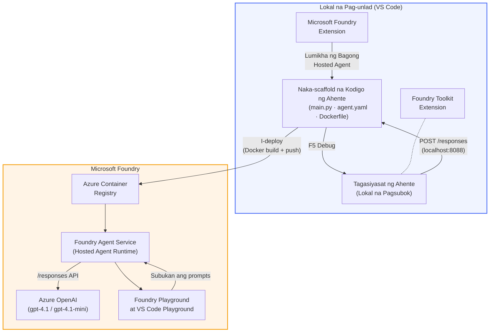

# Foundry Toolkit + Foundry Hosted Agents Workshop

[](https://www.python.org/)
[](https://github.com/microsoft/agents)
[](https://learn.microsoft.com/azure/ai-foundry/agents/concepts/hosted-agents/)
[](https://ai.azure.com/)
[](https://learn.microsoft.com/azure/ai-services/openai/)
[](https://learn.microsoft.com/cli/azure/install-azure-cli)
[](https://learn.microsoft.com/azure/developer/azure-developer-cli/install-azd)
[](https://www.docker.com/)
[](https://marketplace.visualstudio.com/items?itemName=ms-windows-ai-studio.windows-ai-studio)
[](LICENSE)

Bumuo, subukin, at i-deploy ang mga AI agent sa **Microsoft Foundry Agent Service** bilang **Hosted Agents** - nang buo mula sa VS Code gamit ang **Microsoft Foundry extension** at **Foundry Toolkit**.

> **Ang Hosted Agents ay kasalukuyang nasa preview.** Limitado ang mga suportadong rehiyon - tingnan ang [region availability](https://learn.microsoft.com/azure/foundry/agents/concepts/hosted-agents#region-availability).

> Ang folder na `agent/` sa bawat lab ay **awtomatikong naisaayos** ng Foundry extension - pagkatapos ay mo na itong i-customize, subukan nang lokal, at i-deploy.

<!-- CO-OP TRANSLATOR LANGUAGES TABLE START -->
[Arabic](../ar/README.md) | [Bengali](../bn/README.md) | [Bulgarian](../bg/README.md) | [Burmese (Myanmar)](../my/README.md) | [Chinese (Simplified)](../zh-CN/README.md) | [Chinese (Traditional, Hong Kong)](../zh-HK/README.md) | [Chinese (Traditional, Macau)](../zh-MO/README.md) | [Chinese (Traditional, Taiwan)](../zh-TW/README.md) | [Croatian](../hr/README.md) | [Czech](../cs/README.md) | [Danish](../da/README.md) | [Dutch](../nl/README.md) | [Estonian](../et/README.md) | [Finnish](../fi/README.md) | [French](../fr/README.md) | [German](../de/README.md) | [Greek](../el/README.md) | [Hebrew](../he/README.md) | [Hindi](../hi/README.md) | [Hungarian](../hu/README.md) | [Indonesian](../id/README.md) | [Italian](../it/README.md) | [Japanese](../ja/README.md) | [Kannada](../kn/README.md) | [Khmer](../km/README.md) | [Korean](../ko/README.md) | [Lithuanian](../lt/README.md) | [Malay](../ms/README.md) | [Malayalam](../ml/README.md) | [Marathi](../mr/README.md) | [Nepali](../ne/README.md) | [Nigerian Pidgin](../pcm/README.md) | [Norwegian](../no/README.md) | [Persian (Farsi)](../fa/README.md) | [Polish](../pl/README.md) | [Portuguese (Brazil)](../pt-BR/README.md) | [Portuguese (Portugal)](../pt-PT/README.md) | [Punjabi (Gurmukhi)](../pa/README.md) | [Romanian](../ro/README.md) | [Russian](../ru/README.md) | [Serbian (Cyrillic)](../sr/README.md) | [Slovak](../sk/README.md) | [Slovenian](../sl/README.md) | [Spanish](../es/README.md) | [Swahili](../sw/README.md) | [Swedish](../sv/README.md) | [Tagalog (Filipino)](./README.md) | [Tamil](../ta/README.md) | [Telugu](../te/README.md) | [Thai](../th/README.md) | [Turkish](../tr/README.md) | [Ukrainian](../uk/README.md) | [Urdu](../ur/README.md) | [Vietnamese](../vi/README.md)

> **Mas gusto mo bang mag-clone nang lokal?**
>
> Kasama sa repositoriyong ito ang higit sa 50 wika na salin na malaki ang nadaragdag sa laki ng pag-download. Para mag-clone nang walang mga salin, gumamit ng sparse checkout:
>
> **Bash / macOS / Linux:**
> ```bash
> git clone --filter=blob:none --sparse https://github.com/microsoft-foundry/Foundry_Toolkit_for_VSCode_Lab.git
> cd Foundry_Toolkit_for_VSCode_Lab
> git sparse-checkout set --no-cone '/*' '!translations' '!translated_images'
> ```
>
> **CMD (Windows):**
> ```cmd
> git clone --filter=blob:none --sparse https://github.com/microsoft-foundry/Foundry_Toolkit_for_VSCode_Lab.git
> cd Foundry_Toolkit_for_VSCode_Lab
> git sparse-checkout set --no-cone "/*" "!translations" "!translated_images"
> ```
>
> Ito ay nagbibigay sa iyo ng lahat ng kailangan upang matapos ang kurso nang mas mabilis ang pag-download.
<!-- CO-OP TRANSLATOR LANGUAGES TABLE END -->

---

## Arkitektura


**Daloy:** Inaayos ng Foundry extension ang agent → ini-customize mo ang code at mga instruksyon → sinusubukan nang lokal gamit ang Agent Inspector → dine-deploy sa Foundry (Docker image ay pinupush sa ACR) → sinisigurong gumagana sa Playground.

---

## Ano ang iyong bubuuin

| Lab | Paglalarawan | Status |
|-----|--------------|--------|
| **Lab 01 - Isang Agent** | Bumuo ng **"Explain Like I'm an Executive" Agent**, subukan nang lokal, at i-deploy sa Foundry | ✅ Available |
| **Lab 02 - Multi-Agent Workflow** | Bumuo ng **"Resume → Job Fit Evaluator"** - 4 na agent ang nagcollaborate para iskor ang resume fit at gumawa ng learning roadmap | ✅ Available |

---

## Kilalanin ang Executive Agent

Sa workshop na ito gagawa ka ng **"Explain Like I'm an Executive" Agent** - isang AI agent na nagpapaliwanag ng malalalim na teknikal na salita sa mga malinaw at handang iharap sa boardroom na buod. Kasi sa totoo lang, walang gustong marinig sa C-suite ay tungkol sa "thread pool exhaustion na sanhi ng synchronous calls na ipinakilala sa v3.2."

Ginawa ko ang agent na ito pagkatapos ng ilang pangyayari na kung saan ang aking perpektong ginawa na post-mortem ay sinagot ng: *"So... ba'y bumagsak ba ang website o hindi?"*

### Paano ito gumagana

Binibigyan mo ito ng teknikal na update. Bibigyan ka nito ng executive summary - tatlong bullet points, walang jargon, walang stack trace, walang nakakabahalang ideya. Naka-focus lang sa **ano ang nangyari**, **epekto sa negosyo**, at **susunod na hakbang**.

### Tingnan ito na gumagana

**Sinasabi mo:**
> "Tumaas ang API latency dahil sa thread pool exhaustion na sanhi ng synchronous calls na ipinakilala sa v3.2."

**Sumagot ang agent:**

> **Executive Summary:**
> - **Ano ang nangyari:** Matapos ang pinakabagong release, bumagal ang sistema.
> - **Epekto sa negosyo:** Nagkaroon ng pagkaantala ang ilang users habang ginagamit ang serbisyo.
> - **Susunod na hakbang:** Inalis na ang pagbabago at naghahanda ng pag-aayos bago muling i-deploy.

### Bakit itong agent?

Isa itong napakasimpleng, nag-iisang layunin na agent - perpekto para matutunan nang buo ang hosted agent workflow nang hindi nalulunod sa komplikadong tool chains. At sa totoo lang? Ang bawat engineering team ay maaaring makinabang dito.

---

## Estruktura ng workshop

```
📂 Foundry_Toolkit_for_VSCode_Lab/
├── 📄 README.md                      ← You are here
├── 📂 ExecutiveAgent/                ← Standalone hosted agent project
│   ├── agent.yaml
│   ├── Dockerfile
│   ├── main.py
│   └── requirements.txt
└── 📂 workshop/
    ├── 📂 lab01-single-agent/        ← Full lab: docs + agent code
    │   ├── README.md                 ← Hands-on lab instructions
    │   ├── 📂 docs/                  ← Step-by-step tutorial modules
    │   │   ├── 00-prerequisites.md
    │   │   ├── 01-install-foundry-toolkit.md
    │   │   ├── 02-create-foundry-project.md
    │   │   ├── 03-create-hosted-agent.md
    │   │   ├── 04-configure-and-code.md
    │   │   ├── 05-test-locally.md
    │   │   ├── 06-deploy-to-foundry.md
    │   │   ├── 07-verify-in-playground.md
    │   │   └── 08-troubleshooting.md
    │   └── 📂 agent/                 ← Reference solution (auto-scaffolded by Foundry extension)
    │       ├── agent.yaml
    │       ├── Dockerfile
    │       ├── main.py
    │       └── requirements.txt
    └── 📂 lab02-multi-agent/         ← Resume → Job Fit Evaluator
        ├── README.md                 ← Hands-on lab instructions (end-to-end)
        ├── 📂 docs/                  ← Step-by-step tutorial modules
        │   ├── 00-prerequisites.md
        │   ├── 01-understand-multi-agent.md
        │   ├── 02-scaffold-multi-agent.md
        │   ├── 03-configure-agents.md
        │   ├── 04-orchestration-patterns.md
        │   ├── 05-test-locally.md
        │   ├── 06-deploy-to-foundry.md
        │   ├── 07-verify-in-playground.md
        │   └── 08-troubleshooting.md
        └── 📂 PersonalCareerCopilot/ ← Reference solution (multi-agent workflow)
            ├── agent.yaml
            ├── Dockerfile
            ├── main.py
            └── requirements.txt
```

> **Tandaan:** Ang folder na `agent/` sa bawat lab ay ang nilikha ng **Microsoft Foundry extension** kapag pinatakbo mo ang `Microsoft Foundry: Create a New Hosted Agent` mula sa Command Palette. Ang mga file ay iniaangkop gamit ang mga instruksyon, tool, at configuration ng iyong agent. Tinatahak ka ng Lab 01 kung paano ito gawin mula sa simula.

---

## Pagsisimula

### 1. I-clone ang repository

```bash
git clone https://github.com/microsoft-foundry/Foundry_Toolkit_for_VSCode_Lab.git
cd Foundry_Toolkit_for_VSCode_Lab
```

### 2. Mag-set up ng Python virtual environment

```bash
python -m venv venv
```

I-activate ito:

- **Windows (PowerShell):**
  ```powershell
  .\venv\Scripts\Activate.ps1
  ```
- **macOS / Linux:**
  ```bash
  source venv/bin/activate
  ```

### 3. Mag-install ng mga dependencies

```bash
pip install -r workshop/lab01-single-agent/agent/requirements.txt
```

### 4. I-configure ang mga environment variables

Kopyahin ang halimbawa ng `.env` na file mula sa loob ng agent folder at punan ng mga halaga mo:

```bash
cp workshop/lab01-single-agent/agent/.env.example workshop/lab01-single-agent/agent/.env
```

I-edit ang `workshop/lab01-single-agent/agent/.env`:

```env
AZURE_AI_PROJECT_ENDPOINT=https://<your-account>.services.ai.azure.com/api/projects/<your-project>
MODEL_DEPLOYMENT_NAME=<your-model-deployment-name>
```

### 5. Sundan ang mga workshop labs

Bawat lab ay hiwalay na may sariling mga modules. Magsimula sa **Lab 01** upang matutunan ang mga batayan, pagkatapos ay pumunta sa **Lab 02** para sa multi-agent workflows.

#### Lab 01 - Isang Agent ([kompletong instruksyon](workshop/lab01-single-agent/README.md))

| # | Module | Link |
|---|--------|------|
| 1 | Basahin ang mga kinakailangan | [00-prerequisites.md](workshop/lab01-single-agent/docs/00-prerequisites.md) |
| 2 | I-install ang Foundry Toolkit at Foundry extension | [01-install-foundry-toolkit.md](workshop/lab01-single-agent/docs/01-install-foundry-toolkit.md) |
| 3 | Gumawa ng Foundry project | [02-create-foundry-project.md](workshop/lab01-single-agent/docs/02-create-foundry-project.md) |
| 4 | Gumawa ng hosted agent | [03-create-hosted-agent.md](workshop/lab01-single-agent/docs/03-create-hosted-agent.md) |
| 5 | I-configure ang instruksyon at kapaligiran | [04-configure-and-code.md](workshop/lab01-single-agent/docs/04-configure-and-code.md) |
| 6 | Subukan nang lokal | [05-test-locally.md](workshop/lab01-single-agent/docs/05-test-locally.md) |
| 7 | I-deploy sa Foundry | [06-deploy-to-foundry.md](workshop/lab01-single-agent/docs/06-deploy-to-foundry.md) |
| 8 | Suriin sa playground | [07-verify-in-playground.md](workshop/lab01-single-agent/docs/07-verify-in-playground.md) |
| 9 | Troubleshooting | [08-troubleshooting.md](workshop/lab01-single-agent/docs/08-troubleshooting.md) |

#### Lab 02 - Multi-Agent Workflow ([kompletong instruksyon](workshop/lab02-multi-agent/README.md))

| # | Module | Link |
|---|--------|------|
| 1 | Mga kinakailangan (Lab 02) | [00-prerequisites.md](workshop/lab02-multi-agent/docs/00-prerequisites.md) |
| 2 | Unawain ang multi-agent architecture | [01-understand-multi-agent.md](workshop/lab02-multi-agent/docs/01-understand-multi-agent.md) |
| 3 | I-scaffold ang multi-agent project | [02-scaffold-multi-agent.md](workshop/lab02-multi-agent/docs/02-scaffold-multi-agent.md) |
| 4 | I-configure ang mga agent at kapaligiran | [03-configure-agents.md](workshop/lab02-multi-agent/docs/03-configure-agents.md) |
| 5 | Mga pattern ng orchestration | [04-orchestration-patterns.md](workshop/lab02-multi-agent/docs/04-orchestration-patterns.md) |
| 6 | Subukan nang lokal (multi-agent) | [05-test-locally.md](workshop/lab02-multi-agent/docs/05-test-locally.md) |
| 7 | I-deploy sa Foundry | [06-deploy-to-foundry.md](workshop/lab02-multi-agent/docs/06-deploy-to-foundry.md) |
| 8 | Suriin sa playground | [07-verify-in-playground.md](workshop/lab02-multi-agent/docs/07-verify-in-playground.md) |
| 9 | Pag-aayos ng problema (multi-agent) | [08-troubleshooting.md](workshop/lab02-multi-agent/docs/08-troubleshooting.md) |

---

## Tagapangalaga

<table>
<tr>
    <td align="center"><a href="https://github.com/ShivamGoyal03">
        <br />
        <sub><b>Shivam Goyal</b></sub>
    </a><br />
    </td>
</tr>
</table>

---

## Mga kinakailangang permiso (mabilisang sanggunian)

| Senaryo | Kinakailangang mga papel |
|----------|-------------------------|
| Lumikha ng bagong proyekto sa Foundry | **Azure AI Owner** sa Foundry resource |
| Mag-deploy sa umiiral na proyekto (bagong mga resources) | **Azure AI Owner** + **Contributor** sa subscription |
| Mag-deploy sa ganap na naka-configure na proyekto | **Reader** sa account + **Azure AI User** sa proyekto |

> **Mahalaga:** Ang mga papel na Azure `Owner` at `Contributor` ay naglalaman lamang ng mga permiso sa *pamamahala*, hindi mga permiso sa *pagpapaunlad* (mga aksyon sa data). Kailangan mo ng **Azure AI User** o **Azure AI Owner** para bumuo at mag-deploy ng mga ahente.

---

## Mga Sanggunian

- [Quickstart: I-deploy ang iyong unang hosted agent (VS Code)](https://learn.microsoft.com/azure/foundry/agents/quickstarts/quickstart-hosted-agent)
- [Ano ang mga hosted agents?](https://learn.microsoft.com/azure/foundry/agents/concepts/hosted-agents)
- [Lumikha ng mga workflow ng hosted agent sa VS Code](https://learn.microsoft.com/azure/foundry/agents/how-to/vs-code-agents-workflow-pro-code)
- [Mag-deploy ng hosted agent](https://learn.microsoft.com/azure/foundry/agents/how-to/deploy-hosted-agent)
- [RBAC para sa Microsoft Foundry](https://learn.microsoft.com/azure/foundry/concepts/rbac-foundry)
- [Halimbawa ng Architecture Review Agent](https://github.com/Azure-Samples/agent-architecture-review-sample) - Totoong hosted agent na may MCP tools, Excalidraw diagrams, at dobleng deployment

---


## Lisensya

[MIT](../../LICENSE)

---

<!-- CO-OP TRANSLATOR DISCLAIMER START -->
**Paunawa**:  
Ang dokumentong ito ay isinalin gamit ang serbisyong AI na pagsasalin na [Co-op Translator](https://github.com/Azure/co-op-translator). Bagamat nagsusumikap kami para sa katumpakan, pakitandaan na ang mga awtomatikong pagsasalin ay maaaring maglaman ng mga pagkakamali o di-tiyak na impormasyon. Ang orihinal na dokumento sa kanyang katutubong wika ang dapat ituring na opisyal na sanggunian. Para sa mahahalagang impormasyon, inirerekomenda ang propesyonal na pagsasalin ng tao. Hindi kami mananagot sa anumang hindi pagkakaunawaan o maling interpretasyon na nagmumula sa paggamit ng pagsasaling ito.
<!-- CO-OP TRANSLATOR DISCLAIMER END -->