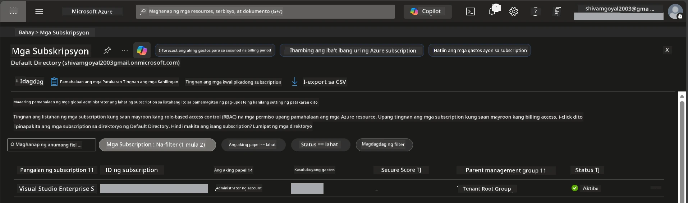

# Module 0 - Mga Kinakailangan

Bago simulan ang workshop, tiyaking handa na ang mga sumusunod na tools, access, at environment. Sundin ang bawat hakbang sa ibaba - huwag mag-skip.

---

## 1. Azure account at subscription

### 1.1 Gumawa o i-verify ang iyong Azure subscription

1. Buksan ang browser at pumunta sa [https://azure.microsoft.com/free/](https://azure.microsoft.com/free/).
2. Kung wala kang Azure account, i-click ang **Start free** at sundin ang proseso ng pag-sign-up. Kakailanganin mo ng Microsoft account (o gumawa ng isa) at credit card para sa pagkakakilanlan.
3. Kung mayroon ka nang account, mag-sign in sa [https://portal.azure.com](https://portal.azure.com).
4. Sa Portal, i-click ang **Subscriptions** blade sa kaliwang navigation (o hanapin ang "Subscriptions" sa itaas na search bar).
5. Siguraduhing may makita kang kahit isang **Active** subscription. Tandaan ang **Subscription ID** - kakailanganin mo ito mamaya.



### 1.2 Unawain ang kinakailangang RBAC roles

Ang [Hosted Agent](https://learn.microsoft.com/azure/foundry/agents/concepts/hosted-agents) deployment ay nangangailangan ng **data action** na permiso na hindi kasama sa karaniwang Azure `Owner` at `Contributor` roles. Kakailanganin mo ang isa sa mga [kombinasyon ng role](https://learn.microsoft.com/azure/foundry/concepts/rbac-foundry#built-in-roles) na ito:

| Senaryo | Kinakailangang roles | Saan ito ia-assign |
|----------|---------------------|--------------------|
| Gumawa ng bagong Foundry project | **Azure AI Owner** sa Foundry resource | Foundry resource sa Azure Portal |
| Mag-deploy sa umiiral na proyekto (bagong mga resources) | **Azure AI Owner** + **Contributor** sa subscription | Subscription + Foundry resource |
| Mag-deploy sa ganap nang naka-configure na proyekto | **Reader** sa account + **Azure AI User** sa proyekto | Account + Project sa Azure Portal |

> **Pangunahing punto:** Ang mga Azure `Owner` at `Contributor` roles ay sakop lamang ang *management* permissions (ARM operations). Kailangan mo ang [**Azure AI User**](https://learn.microsoft.com/azure/foundry/concepts/rbac-foundry#built-in-roles) (o mas mataas) para sa *data actions* tulad ng `agents/write` na kinakailangan upang gumawa at mag-deploy ng mga ahente. Ia-assign mo ang mga role na ito sa [Module 2](02-create-foundry-project.md).

---

## 2. I-install ang mga lokal na tools

I-install ang bawat tool sa ibaba. Pagkatapos mag-install, i-verify na gumagana ito gamit ang check command.

### 2.1 Visual Studio Code

1. Pumunta sa [https://code.visualstudio.com/](https://code.visualstudio.com/).
2. I-download ang installer para sa iyong OS (Windows/macOS/Linux).
3. Patakbuhin ang installer gamit ang default na settings.
4. Buksan ang VS Code upang kumpirmahin na nagbukas ito.

### 2.2 Python 3.10+

1. Pumunta sa [https://www.python.org/downloads/](https://www.python.org/downloads/).
2. I-download ang Python 3.10 o mas bago (inirerekomenda ang 3.12+).
3. **Windows:** Sa panahon ng pag-install, i-check ang **"Add Python to PATH"** sa unang screen.
4. Buksan ang terminal at i-verify:

   ```powershell
   python --version
   ```

   Inaasahang output: `Python 3.10.x` o mas mataas.

### 2.3 Azure CLI

1. Pumunta sa [https://learn.microsoft.com/cli/azure/install-azure-cli](https://learn.microsoft.com/cli/azure/install-azure-cli).
2. Sundin ang mga tagubilin para sa pag-install para sa iyong OS.
3. I-verify:

   ```powershell
   az --version
   ```

   Inaasahan: `azure-cli 2.80.0` o mas mataas.

4. Mag-sign in:

   ```powershell
   az login
   ```

### 2.4 Azure Developer CLI (azd)

1. Pumunta sa [https://learn.microsoft.com/azure/developer/azure-developer-cli/install-azd](https://learn.microsoft.com/azure/developer/azure-developer-cli/install-azd).
2. Sundin ang mga tagubilin para sa pag-install para sa iyong OS. Sa Windows:

   ```powershell
   winget install microsoft.azd
   ```

3. I-verify:

   ```powershell
   azd version
   ```

   Inaasahan: `azd version 1.x.x` o mas mataas.

4. Mag-sign in:

   ```powershell
   azd auth login
   ```

### 2.5 Docker Desktop (opsyonal)

Kinakailangan lang ang Docker kung nais mong buuin at subukan ang container image nang lokal bago mag-deploy. Pinangangasiwaan ng Foundry extension ang container builds nang awtomatiko sa oras ng deployment.

1. Pumunta sa [https://docs.docker.com/get-docker/](https://docs.docker.com/get-docker/).
2. I-download at i-install ang Docker Desktop para sa iyong OS.
3. **Windows:** Siguraduhing naka-select ang WSL 2 backend sa pag-install.
4. Simulan ang Docker Desktop at maghintay hanggang lumitaw ang icon sa system tray na may nakasulat na **"Docker Desktop is running"**.
5. Buksan ang terminal at i-verify:

   ```powershell
   docker info
   ```

   Dapat nitong ipakita ang Docker system info nang walang error. Kung makita mo ang `Cannot connect to the Docker daemon`, maghintay ng ilang segundo hanggang tuluyang magsimula ang Docker.

---

## 3. I-install ang mga VS Code extension

Kailangan mo ng tatlong extension. I-install ang mga ito **bago** magsimula ang workshop.

### 3.1 Microsoft Foundry para sa VS Code

1. Buksan ang VS Code.
2. Pindutin ang `Ctrl+Shift+X` upang buksan ang Extensions panel.
3. Sa search box, i-type ang **"Microsoft Foundry"**.
4. Hanapin ang **Microsoft Foundry for Visual Studio Code** (publisher: Microsoft, ID: `TeamsDevApp.vscode-ai-foundry`).
5. I-click ang **Install**.
6. Pagkatapos ng pag-install, makikita mo ang icon ng **Microsoft Foundry** sa Activity Bar (kaliwang sidebar).

### 3.2 Foundry Toolkit

1. Sa Extensions panel (`Ctrl+Shift+X`), hanapin ang **"Foundry Toolkit"**.
2. Hanapin ang **Foundry Toolkit** (publisher: Microsoft, ID: `ms-windows-ai-studio.windows-ai-studio`).
3. I-click ang **Install**.
4. Dapat lumitaw ang icon ng **Foundry Toolkit** sa Activity Bar.

### 3.3 Python

1. Sa Extensions panel, hanapin ang **"Python"**.
2. Hanapin ang **Python** (publisher: Microsoft, ID: `ms-python.python`).
3. I-click ang **Install**.

---

## 4. Mag-sign in sa Azure mula sa VS Code

Ang [Microsoft Agent Framework](https://learn.microsoft.com/agent-framework/overview/) ay gumagamit ng [`DefaultAzureCredential`](https://learn.microsoft.com/azure/developer/python/sdk/authentication/credential-chains#defaultazurecredential-overview) para sa authentication. Kailangan mong naka-sign in sa Azure sa VS Code.

### 4.1 Mag-sign in sa pamamagitan ng VS Code

1. Tignan ang ibabang kaliwang bahagi ng VS Code at i-click ang icon na **Accounts** (silweta ng tao).
2. I-click ang **Sign in to use Microsoft Foundry** (o **Sign in with Azure**).
3. Magbubukas ang browser window - mag-sign in gamit ang Azure account na may access sa iyong subscription.
4. Bumalik sa VS Code. Dapat mong makita ang pangalan ng iyong account sa ibabang kaliwa.

### 4.2 (Opsyonal) Mag-sign in gamit ang Azure CLI

Kung na-install mo ang Azure CLI at gusto mo ng authentication gamit ang CLI:

```powershell
az login
```

Magbubukas ito ng browser para sa sign-in. Pagkatapos mag-sign in, itakda ang tamang subscription:

```powershell
az account set --subscription "<your-subscription-id>"
```

I-verify:

```powershell
az account show --query "{name:name, id:id, state:state}" --output table
```

Dapat makita mo ang pangalan ng subscription, ID, at estado = `Enabled`.

### 4.3 (Alternatibo) Service principal auth

Para sa CI/CD o shared environments, itakda ang mga environment variables na ito:

```powershell
$env:AZURE_TENANT_ID = "<your-tenant-id>"
$env:AZURE_CLIENT_ID = "<your-client-id>"
$env:AZURE_CLIENT_SECRET = "<your-client-secret>"
```

---

## 5. Mga limitasyon ng preview

Bago magpatuloy, alamin ang mga kasalukuyang limitasyon:

- Ang [**Hosted Agents**](https://learn.microsoft.com/azure/foundry/agents/concepts/hosted-agents) ay kasalukuyang nasa **public preview** - hindi pa inirerekomenda para sa production workloads.
- **Limitado ang mga suportadong rehiyon** - tingnan ang [region availability](https://learn.microsoft.com/azure/foundry/agents/concepts/hosted-agents#region-availability) bago gumawa ng resources. Kung pipili ka ng rehiyong hindi suportado, mag-fail ang deployment.
- Ang `azure-ai-agentserver-agentframework` package ay pre-release (`1.0.0b16`) - maaaring magbago ang mga API.
- Mga limitasyon sa scale: sumusuporta lamang ang hosted agents sa 0-5 replicas (kasama ang scale-to-zero).

---

## 6. Preflight checklist

Suriin ang bawat item sa ibaba. Kung may hakbang na pumalya, bumalik at ayusin ito bago magpatuloy.

- [ ] Nababuksan ang VS Code nang walang error
- [ ] May Python 3.10+ sa iyong PATH (`python --version` ay nagpapakita ng `3.10.x` o mas mataas)
- [ ] Nakainstall ang Azure CLI (`az --version` ay nagpapakita ng `2.80.0` o mas mataas)
- [ ] Nakainstall ang Azure Developer CLI (`azd version` ay nagpapakita ng impormasyon ng bersyon)
- [ ] Nakainstall ang Microsoft Foundry extension (makikita ang icon sa Activity Bar)
- [ ] Nakainstall ang Foundry Toolkit extension (makikita ang icon sa Activity Bar)
- [ ] Nakainstall ang Python extension
- [ ] Nakalogin ka sa Azure sa VS Code (tingnan ang Accounts icon, ibabang kaliwa)
- [ ] Nagpapakita ng iyong subscription ang `az account show`
- [ ] (Opsyonal) Naka-run ang Docker Desktop (`docker info` ay nagpapakita ng system info nang walang error)

### Checkpoint

Buksan ang Activity Bar ng VS Code at tiyaking makikita mo ang **Foundry Toolkit** at **Microsoft Foundry** na mga sidebar view. I-click ang bawat isa upang kumpirmahin na naglo-load nang walang error.

---

**Susunod:** [01 - Install Foundry Toolkit & Foundry Extension →](01-install-foundry-toolkit.md)

---

<!-- CO-OP TRANSLATOR DISCLAIMER START -->
**Pahayag ng Pagsasantabi**:  
Ang dokumentong ito ay isinalin gamit ang AI translation service na [Co-op Translator](https://github.com/Azure/co-op-translator). Bagamat nagsusumikap kami para sa katumpakan, pakatandaan na ang mga awtomatikong pagsasalin ay maaaring maglaman ng mga pagkakamali o kamalian. Ang orihinal na dokumento sa orihinal nitong wika ang dapat ituring bilang opisyal na sanggunian. Para sa mahahalagang impormasyon, inirerekomenda ang propesyonal na pagsasaling-tao. Hindi kami mananagot sa anumang hindi pagkakaunawaan o maling interpretasyon na nagmula sa paggamit ng pagsasaling ito.
<!-- CO-OP TRANSLATOR DISCLAIMER END -->