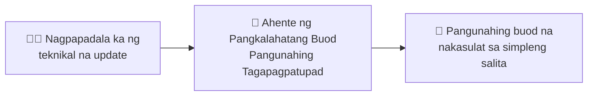

# Module 0 - Panimula

⏱️ ~10 min

> [!WARNING]
> **Paunang-tanaw at Mga Limitasyon:** Ang [Hosted Agents](https://learn.microsoft.com/azure/foundry/agents/concepts/hosted-agents) ay kasalukuyang nasa **public preview** - hindi inirerekomenda para sa mga production na gawain. Maging maingat sa mga sumusunod:
> - **Limitado ang mga suportadong rehiyon** - tingnan ang [region availability](https://learn.microsoft.com/azure/foundry/agents/concepts/hosted-agents#region-availability) bago gumawa ng mga resources. Kung pumili ka ng rehiyong hindi suportado, mabibigo ang deployment.
> - Ang `azure-ai-agentserver-agentframework` package ay pre-release - maaaring magbago ang APIs sa pagitan ng mga bersyon.
> - Mga limitasyon sa scale: ang hosted agents ay sumusuporta ng 0–5 replicas (kasama na ang scale-to-zero).
> - Ang ilang mga tampok na ipinakita sa workshop na ito ay maaaring magbago habang ang serbisyo ay papalapit sa GA.

## Ano ang iyong bubuuin

Sa workshop na ito, gagawa ka ng isang **"Explain Like I'm an Executive"** agent - isang hosted AI agent na tumatanggap ng mga komplikadong teknikal na update at nire-rewrite ang mga ito bilang mga plain-English executive summaries.

```mermaid
flowchart LR
    A["🧑‍💻 Nagpapadala ka ng\nteknikal na update"] --> B["🤖 Ahente ng Pangkalahatang Buod\nPangunahing Tagapagpatupad"]
    B --> C["📝 Pangunahing buod na\nnakasulat sa simpleng salita"]
```

**Ginagamit ng agent ang:**
- **Microsoft Agent Framework** - para sa lohika at istruktura ng agent
- **Foundry Toolkit para sa VS Code** - para mag-scaffold, mag-test locally, at mag-deploy
- **Isang AI model** (hal., `gpt-4.1-mini/gpt-5-mini`) - para bumuo ng mga summary

Sa katapusan ng lab na ito, magkakaroon ka ng gumaganang agent na maaari mong subukan locally gamit ang Agent Inspector, at opsyonal na i-deploy sa cloud.

---

## Ano ang mga hosted agents?

Ang **hosted agent** ay isang AI agent na tumatakbo bilang isang managed service sa Microsoft Foundry. Sa halip na ikaw ang mag-manage ng iyong sariling infrastructure, ipapack mo ang iyong agent code sa isang container at ang Foundry ang bahala sa scaling, hosting, at pag-expose nito sa pamamagitan ng isang standard HTTP endpoint.

| Konsepto | Kahulugan |
|---------|--------------|
| **Agent** | Ang iyong Python code na tumatanggap ng user message, tumatawag sa AI model, at nagbabalik ng nakaayos na tugon |
| **Hosted** | Pinapatakbo ng Foundry ang iyong container para sa iyo - walang VMs, walang Kubernetes, walang infrastructure na kailangang i-manage |
| **Responses protocol** | Isang standard HTTP API (`POST /responses`) na maaaring tawagan ng anumang client upang makipag-ugnayan sa iyong agent |
| **Agent Inspector** | Isang local testing UI (naka-integrate sa Foundry Toolkit) na nagpapahintulot sa iyo na makipag-chat sa iyong agent bago mag-deploy |

Sa workshop na ito, magsisimula ka mula zero hanggang makabuo ng isang fully hosted agent - o maaari kang huminto sa pagsusuri locally kung gusto mo.

---

## Piliin ang iyong landas

> ⚠️ **Pumili ng isang landas bago magpatuloy.** Ang iyong pagpili ang magtatakda kung anong mga tools ang i-install at kung anong mga module ang uunahin. Maaari kang lumipat mula Path B → Path A kung magkakaroon ka ng subscription.

<strong>🅰️ Path A - Azure cloud (kailangan ng Azure subscription)</strong>

| | Mga Detalye |
|---|---|
| **Sino ang para dito?** | May aktibong Azure subscription ka at maaaring gumawa ng Foundry resources |
| **Model** | Azure OpenAI via Foundry (hal., `gpt-4.1-mini/gpt-5-mini`) |
| **Mga muajng sasaklawin** | Lahat ng modules (00–07) |
| **Mag-deploy sa cloud?** | ✅ Oo - full end-to-end deployment |

<strong>🅱️ Path B - Local / free-tier (hindi kailangan ng Azure subscription)</strong>

| | Mga Detalye |
|---|---|
| **Sino ang para dito?** | MVPs, estudyante, o sinumang walang access sa Azure |
| **Model** | **Foundry Local** (libre, tumatakbo sa iyong makina) |
| **Mga module na sasaklawin** | Mga module 00–04 (huwag isama ang deploy at cloud verify) |
| **Mag-deploy sa cloud?** | ❌ Hindi - local testing lamang gamit ang Agent Inspector |

---

## Lahat ng landas: Mga kinakailangang tools

I-install ang bawat tool sa ibaba. Pagkatapos i-install, i-verify kung gumagana ito sa pamamagitan ng pagpapatakbo ng check command.

| # | Tool | Bersyon | Instalasyon | Pag-verify (Inaasahang Output) |
|---|------|---------|---------|---------------------------|
| 1 | **Visual Studio Code** | Pinakabago | [code.visualstudio.com](https://code.visualstudio.com/) | Nagbubukas nang walang error |
| 2 | **Python** | 3.12 o mas mataas| [python.org/downloads](https://www.python.org/downloads/) | `python --version` $\rightarrow$ `Python 3.12.x` |
| 3 | **Foundry Toolkit para sa VS Code** | Pinakabago | Extension ID: `ms-windows-ai-studio.windows-ai-studio` | Foundry icon sa Activity Bar |
| 4 | **Python extension para sa VS Code** | Pinakabago | Extension ID: `ms-python.python` | Na-install sa Extensions panel |

> [!TIP]
> **Mga Pro-tip para sa instalasyon:**
> - **Python PATH (Windows):** Laging i-check ang **"Add Python to PATH"** sa unang screen ng Python installer. Kung wala ito, hindi makikilala ang `python` sa iyong terminal.
> - **Maraming bersyon ng Python:** Kung meron kang parehong Python 3.10 at 3.12 na naka-install, gamitin ang `python3.12 -m venv .venv` upang masigurado na ang tamang bersyon ang gagamitin para sa iyong virtual environment.
> - **Docker WSL 2 (Windows):** Sa pag-install ng Docker Desktop, siguraduhing nakapili ang **WSL 2 backend**. Ang Docker na may Hyper-V ay mas mabagal at maaaring magdulot ng problema sa Foundry container builds.
> - **Hindi nagsisimula ang Docker?** Maghintay ng 30–60 segundo pagkatapos buksan ang Docker Desktop. Patakbuhin ang `docker info` - kung lumabas ang "Cannot connect to the Docker daemon," nag-i-initialize pa ang Docker.
> - **Hindi naglo-load ang VS Code extensions?** Pagkatapos i-install ang mga extensions, i-reload ang window: `Ctrl+Shift+P` → `Developer: Reload Window`.

> **Para sa mga Windows users:** I-check ang **"Add Python to PATH"** sa panahon ng instalasyon ng Python.

**Susunod:** [01 - Setup →](01-setup.md)

---

<!-- CO-OP TRANSLATOR DISCLAIMER START -->
**Pagtatanggi**:
Ang dokumentong ito ay isinalin gamit ang serbisyo ng AI translation na [Co-op Translator](https://github.com/Azure/co-op-translator). Bagama't nagsusumikap kami para sa katumpakan, pakatandaan na ang awtomatikong pagsasalin ay maaaring maglaman ng mga pagkakamali o hindi pagkakatugma. Ang orihinal na dokumento sa orihinal nitong wika ang dapat ituring na pangunahing sanggunian. Para sa mahahalagang impormasyon, inirerekomenda ang propesyonal na pagsasalin ng tao. Hindi kami mananagot sa anumang maling pagkakaintindi o maling interpretasyon na nagmula sa paggamit ng pagsasaling ito.
<!-- CO-OP TRANSLATOR DISCLAIMER END -->