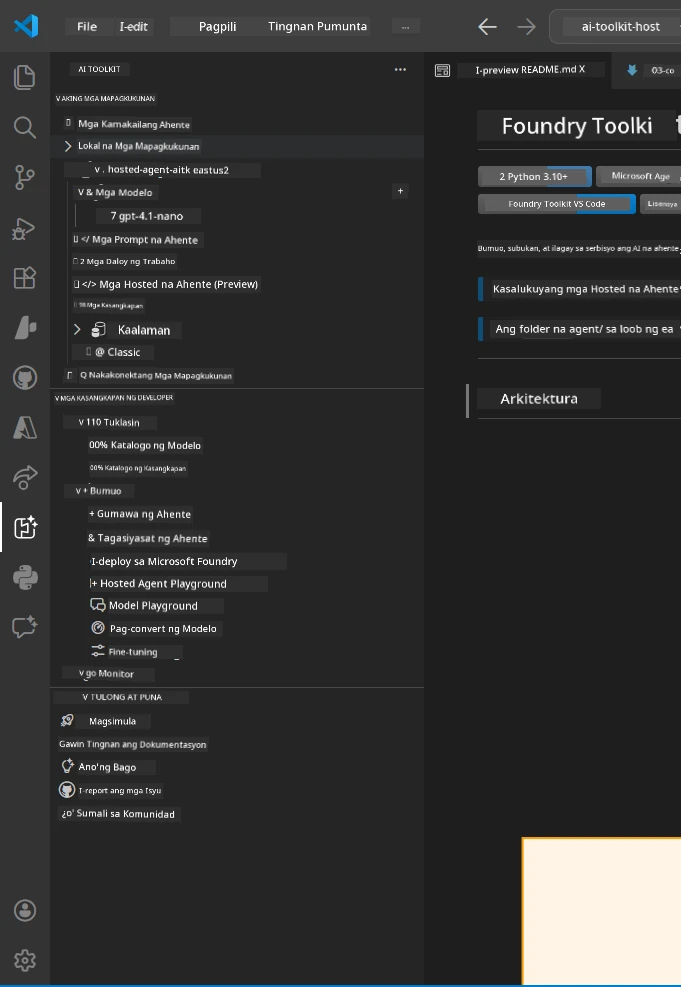
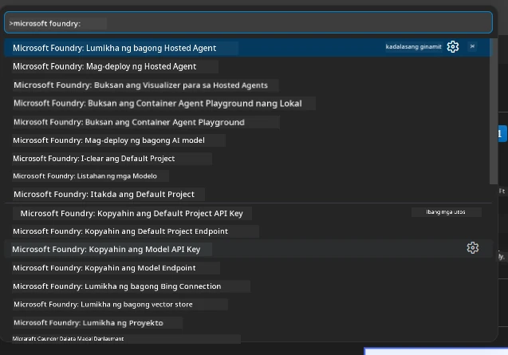

# Module 1 - I-install ang Foundry Toolkit & Foundry Extension

Pinaglalakaran ka ng module na ito sa pag-install at pag-verify ng dalawang pangunahing VS Code extension para sa workshop na ito. Kung na-install mo na ang mga ito noong [Module 0](00-prerequisites.md), gamitin ang module na ito upang i-verify na gumagana ang mga ito nang tama.

---

## Hakbang 1: I-install ang Microsoft Foundry Extension

Ang **Microsoft Foundry for VS Code** extension ang iyong pangunahing kagamitan para sa paggawa ng mga Foundry project, pag-deploy ng mga modelo, pag-scaffold ng mga hosted agent, at pag-deploy nang direkta mula sa VS Code.

1. Buksan ang VS Code.
2. Pindutin ang `Ctrl+Shift+X` upang buksan ang **Extensions** panel.
3. Sa search box sa itaas, i-type: **Microsoft Foundry**
4. Hanapin ang resulta na may pamagat na **Microsoft Foundry for Visual Studio Code**.
   - Publisher: **Microsoft**
   - Extension ID: `TeamsDevApp.vscode-ai-foundry`
5. I-click ang **Install** button.
6. Maghintay hanggang matapos ang pag-install (makikita mo ang maliit na progress indicator).
7. Pagkatapos ng pag-install, tingnan ang **Activity Bar** (ang patayong icon bar sa kaliwang bahagi ng VS Code). Dapat makita mo ang bagong **Microsoft Foundry** icon (mukhang diyamante/AI icon).
8. I-click ang **Microsoft Foundry** icon upang buksan ang sidebar view nito. Dapat may mga seksyon ito para sa:
   - **Resources** (o Projects)
   - **Agents**
   - **Models**

> **Kung hindi lumitaw ang icon:** Subukang i-reload ang VS Code (`Ctrl+Shift+P` → `Developer: Reload Window`).

---

## Hakbang 2: I-install ang Foundry Toolkit Extension

Ang **Foundry Toolkit** extension ay nagbibigay ng [**Agent Inspector**](https://learn.microsoft.com/azure/foundry/agents/how-to/vs-code-agents-workflow-pro-code) - isang visual na interface para sa local na pagsubok at pag-debug ng mga agent - plus mga playground, pamamahala ng modelo, at mga tool sa pagsusuri.

1. Sa Extensions panel (`Ctrl+Shift+X`), linisin ang search box at i-type: **Foundry Toolkit**
2. Hanapin ang **Foundry Toolkit** sa resulta.
   - Publisher: **Microsoft**
   - Extension ID: `ms-windows-ai-studio.windows-ai-studio`
3. I-click ang **Install**.
4. Pagkatapos ng pag-install, lalabas ang **Foundry Toolkit** icon sa Activity Bar (mukhang robot/sparkle icon).
5. I-click ang **Foundry Toolkit** icon upang buksan ang sidebar view nito. Makikita mo ang Foundry Toolkit welcome screen na may mga opsyon para sa:
   - **Models**
   - **Playground**
   - **Agents**

---

## Hakbang 3: I-verify na gumagana ang parehong extension

### 3.1 I-verify ang Microsoft Foundry Extension

1. I-click ang **Microsoft Foundry** icon sa Activity Bar.
2. Kung naka-sign in ka sa Azure (mula sa Module 0), dapat makita mo ang iyong mga proyekto sa ilalim ng **Resources**.
3. Kung hinihiling na mag-sign in, i-click ang **Sign in** at sundan ang authentication flow.
4. Kumpirmahin na makikita mo ang sidebar nang walang errors.

### 3.2 I-verify ang Foundry Toolkit Extension

1. I-click ang **Foundry Toolkit** icon sa Activity Bar.
2. Kumpirmahin na nag-load ang welcome view o pangunahing panel nang walang errors.
3. Hindi mo pa kailangang i-configure ang anumang bagay — gagamitin natin ang Agent Inspector sa [Module 5](05-test-locally.md).

### 3.3 I-verify gamit ang Command Palette

1. Pindutin ang `Ctrl+Shift+P` upang buksan ang Command Palette.
2. I-type ang **"Microsoft Foundry"** - dapat makita mo ang mga command tulad ng:
   - `Microsoft Foundry: Create a New Hosted Agent`
   - `Microsoft Foundry: Deploy Hosted Agent`
   - `Microsoft Foundry: Open Model Catalog`
3. Pindutin ang `Escape` upang isara ang Command Palette.
4. Buksan muli ang Command Palette at i-type ang **"Foundry Toolkit"** - dapat makita mo ang mga command tulad ng:
   - `Foundry Toolkit: Open Agent Inspector`

> Kung hindi mo makita ang mga command na ito, maaaring hindi tama ang pagkaka-install ng mga extension. Subukang i-uninstall at i-install muli ang mga ito.

---

## Ano ang ginagawa ng mga extension na ito sa workshop na ito

| Extension | Ano ang ginagawa nito | Kailan mo ito gagamitin |
|-----------|-----------------------|-------------------------|
| **Microsoft Foundry for VS Code** | Gumawa ng mga Foundry project, mag-deploy ng mga modelo, **mag-scaffold ng [hosted agents](https://learn.microsoft.com/azure/foundry/agents/concepts/hosted-agents)** (auto-generate ng `agent.yaml`, `main.py`, `Dockerfile`, `requirements.txt`), mag-deploy sa [Foundry Agent Service](https://learn.microsoft.com/azure/foundry/agents/overview) | Modules 2, 3, 6, 7 |
| **Foundry Toolkit** | Agent Inspector para sa lokal na pagsubok/pag-debug, playground UI, pamamahala ng modelo | Modules 5, 7 |

> **Ang Foundry extension ang pinaka-mahalagang tool sa workshop na ito.** Pinangangasiwaan nito ang end-to-end na lifecycle: scaffold → configure → deploy → verify. Pinapalakas ito ng Foundry Toolkit sa pamamagitan ng pagbibigay ng visual na Agent Inspector para sa lokal na pagsubok.

---

### Checkpoint

- [ ] Nakikita ang Microsoft Foundry icon sa Activity Bar
- [ ] Pag-click dito ay bumubukas ang sidebar nang walang errors
- [ ] Nakikita ang Foundry Toolkit icon sa Activity Bar
- [ ] Pag-click dito ay bumubukas ang sidebar nang walang errors
- [ ] `Ctrl+Shift+P` → pagt-type ng "Microsoft Foundry" ay nagpapakita ng mga available na command
- [ ] `Ctrl+Shift+P` → pagt-type ng "Foundry Toolkit" ay nagpapakita ng mga available na command

---

**Nakaraan:** [00 - Prerequisites](00-prerequisites.md) · **Susunod:** [02 - Create Foundry Project →](02-create-foundry-project.md)

---

<!-- CO-OP TRANSLATOR DISCLAIMER START -->
**Pagtatanggal-sala**:  
Ang dokumentong ito ay isinalin gamit ang AI na serbisyo sa pagsasalin na [Co-op Translator](https://github.com/Azure/co-op-translator). Bagaman pagsisikapan naming maging tumpak, mangyaring tandaan na ang mga awtomatikong pagsasalin ay maaaring maglaman ng mga pagkakamali o katiwalian. Ang orihinal na dokumento sa orihinal nitong wika ang dapat ituring na pinagkakatiwalaang sanggunian. Para sa mahalagang impormasyon, inirerekomenda ang propesyonal na pagsasalin ng tao. Hindi kami mananagot sa anumang mga hindi pagkakaunawaan o maling interpretasyon na nagmumula sa paggamit ng pagsasaling ito.
<!-- CO-OP TRANSLATOR DISCLAIMER END -->