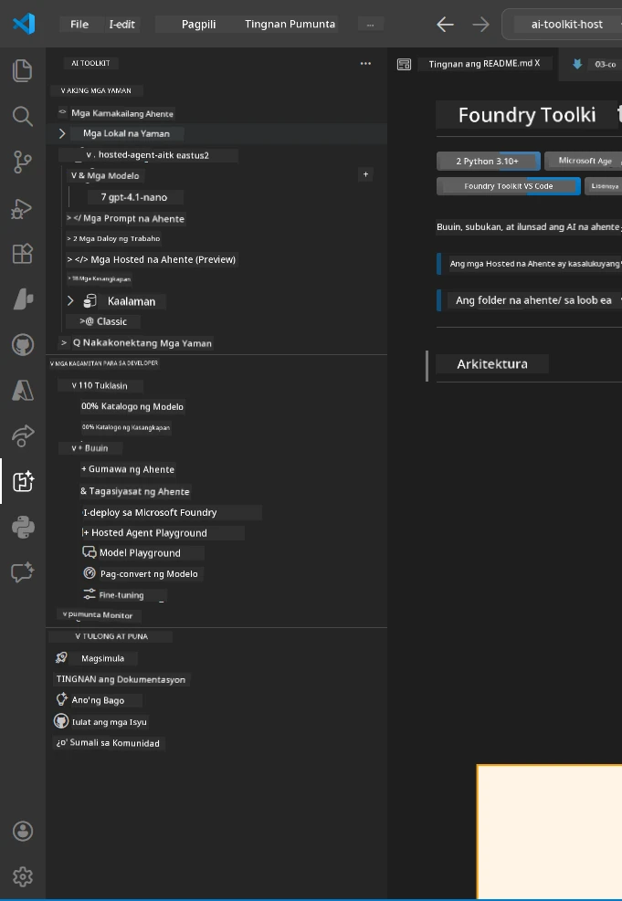
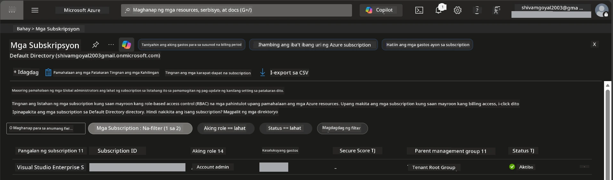
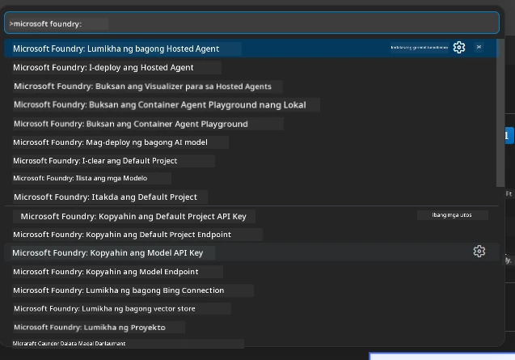
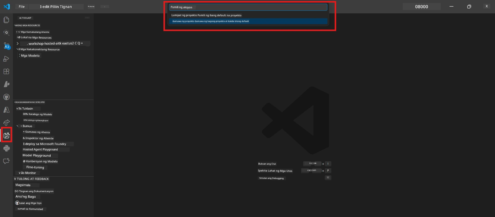
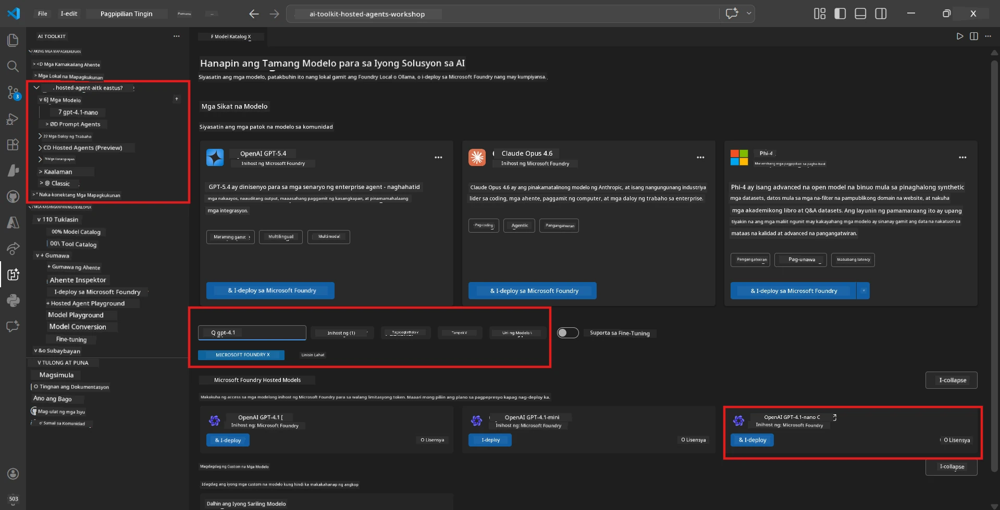
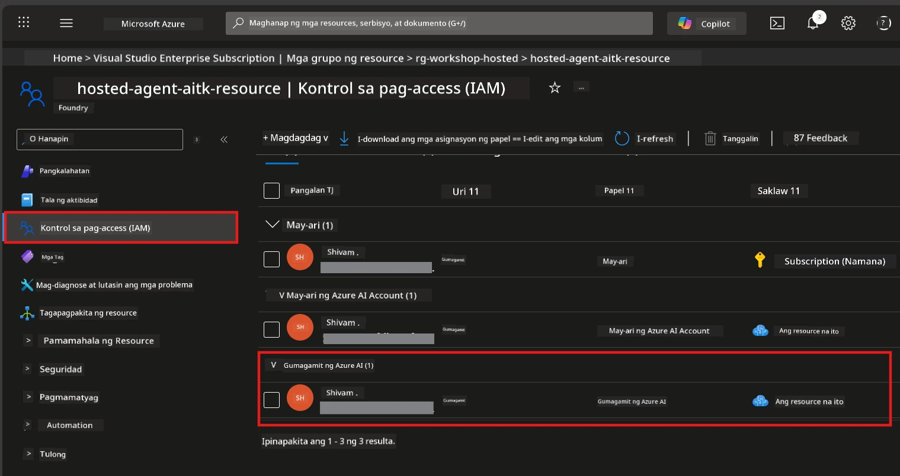

# Setup: Extension, Project & Model

⏱️ ~15 min

Sa modyulong ito, i-install at i-verify mo ang Foundry Toolkit extension, gumawa (o kumonekta sa) isang Foundry project, at i-deploy ang modelong gagamitin ng iyong agent.

## Hakbang 1: I-install ang Foundry Toolkit

**Foundry Toolkit para sa VS Code** ang pangunahing extension para sa workshop na ito. Nagbibigay ito ng paggawa ng proyekto, deployment ng modelo, scaffolding ng agent, lokal na pagsubok (Agent Inspector), at cloud deployment — lahat mula sa VS Code.

1. Buksan ang VS Code pagkatapos pindutin ang `Ctrl+Shift+X` para buksan ang **Extensions** panel.
2. Hanapin ang **Foundry Toolkit**.
3. I-install ang **Foundry Toolkit para sa VS Code** (Publisher: Microsoft, ID: `ms-windows-ai-studio.windows-ai-studio`).
4. Pagkatapos ng pag-install, lilitaw ang icon ng **Foundry Toolkit** sa Activity Bar (kaliwang sidebar).

> *Tandaan: Maaaring ipakita ng Activity Bar ang "AI TOOLKIT" sa mga lumang bersyon ng extension. Pareho lamang ang functionality.*



## Hakbang 2: I-setup base sa iyong access

> **Pumili ng iyong landas:** Palawakin ang seksyon sa ibaba na tumutugma sa iyong setup. Kailangan mo lamang tapusin ang **isang** landas.

<details>
<summary><strong>🅰️ Landas A - Azure cloud (kailangan ng Azure subscription)</strong></summary>

### Azure CLI

1. I-install mula sa [learn.microsoft.com/cli/azure/install-azure-cli](https://learn.microsoft.com/cli/azure/install-azure-cli).
2. I-verify: `az --version` (dapat 2.80.0+).
3. Mag-sign in: `az login`

### Mga Opsyon sa Authentication

Ginagamit ng [Microsoft Agent Framework](https://learn.microsoft.com/agent-framework/overview/) ang [`DefaultAzureCredential`](https://learn.microsoft.com/azure/developer/python/sdk/authentication/credential-chains#defaultazurecredential-overview) na sumusubok ng maraming paraan ng authentication sa isang pagkakasunud-sunod. Pumili ng naaangkop sa iyong kapaligiran:

#### Opsyon 1: VS Code Accounts (inirerekomenda para sa mga workshop)
1. I-click ang icon na **Accounts** (larawan ng tao) sa ibabang kaliwang bahagi ng VS Code.
2. Piliin ang **Sign in to use Microsoft Foundry** (o **Sign in with Azure**).
3. Magbubukas ang browser - mag-sign in gamit ang Azure account na may access sa iyong subscription.
4. Bumalik sa VS Code. Makikita mo ang pangalan ng iyong account sa ibabang kaliwa.

#### Opsyon 2: Azure CLI
```bash
az login
az account set --subscription "<your-subscription-id>"
```

#### Opsyon 3: Service Principal (Enterprise/CI)
Para sa mga protektadong kapaligiran o CI/CD pipelines, itakda ang mga environment variables na ito sa iyong `.env` file:
```env
AZURE_TENANT_ID=<your-tenant-id>
AZURE_CLIENT_ID=<your-client-id>
AZURE_CLIENT_SECRET=<your-client-secret>
```

> **Paano gumagana ang `DefaultAzureCredential`:** Sinusubukan nito muna ang environment variables, pagkatapos ay managed identity, pagkatapos ay VS Code sign-in, tapos Azure CLI — at ginagamit ang unang matagumpay. Tingnan ang [credential chain docs](https://learn.microsoft.com/azure/developer/python/sdk/authentication/credential-chains#defaultazurecredential-overview).

### Azure Developer CLI (azd)

1. I-install: `winget install microsoft.azd` (Windows) o tingnan ang [install docs](https://learn.microsoft.com/azure/developer/azure-developer-cli/install-azd).
2. I-verify: `azd version`
3. Mag-sign in: `azd auth login`

### Docker Desktop (opsyonal)

Kailangan lamang ang Docker kung gusto mong gumawa ng mga container nang lokal. Ang Foundry extension ang awtomatikong humahandle ng mga build sa panahon ng deployment.

1. I-install mula sa [docs.docker.com/get-docker](https://docs.docker.com/get-docker/).
2. I-verify: `docker info`

### Azure subscription at RBAC

1. Mag-sign in sa [portal.azure.com](https://portal.azure.com).
2. Pumunta sa **Subscriptions** at tiyakin na mayroong hindi bababa sa isa na **Active**.
3. Tandaan ang iyong **Subscription ID** — kailangan mo ito sa Module 01.



#### Talahanayan ng RBAC Scenario

Ang pag-deploy ng [Hosted Agent](https://learn.microsoft.com/azure/foundry/agents/concepts/hosted-agents) ay nangangailangan ng **mga permiso sa data action** na hindi kasama sa mga standard Azure `Owner` at `Contributor` na role. Gamitin ang talahanayan sa ibaba upang malaman kung aling mga role ang kailangan mo:

| Scenario | Mga kinakailangang role | Kung saan ito i-aassign |
|----------|------------------------|------------------------|
| Gumawa ng bagong Foundry project | **Azure AI Owner** sa Foundry resource | Foundry resource sa Azure Portal |
| Mag-deploy sa umiiral na proyekto (mga bagong resources) | **Azure AI Owner** + **Contributor** sa subscription | Subscription + Foundry resource |
| Mag-deploy sa ganap na naka-configure na proyekto | **Reader** sa account + **Azure AI User** sa proyekto | Account + Project sa Azure Portal |
| Para sa lokal na pagsubok lang (walang deployment) | **Azure AI User** sa proyekto | Project sa Azure Portal |

> **Pangunahing punto:** Ang Azure `Owner` at `Contributor` roles ay para lamang sa *management* na mga permiso (ARM operations). Kailangan mo ang [**Azure AI User**](https://learn.microsoft.com/azure/foundry/concepts/rbac-foundry#built-in-roles) (o mas mataas) para sa *data actions* tulad ng `agents/write` na kailangan para gumawa at mag-deploy ng mga agent.

## Kumonekta o gumawa ng Foundry project



1. Pindutin ang `Ctrl+Shift+P` → i-type ang **Foundry Toolkit: Create Project** → piliin ito.
2. Piliin ang iyong **Azure subscription** mula sa dropdown.
3. Piliin o gumawa ng isang **resource group** (hal., `rg-hosted-agents-workshop`).
4. Piliin ang isang **region** na sumusuporta sa hosted agents: `East US`, `West US 2`, o `Sweden Central`. Tingnan ang [region availability](https://learn.microsoft.com/azure/foundry/agents/concepts/hosted-agents#region-availability).
5. Ipasok ang pangalan ng proyekto (hal., `workshop-agents`).
6. Maghintay ng 2–5 minuto para sa provisioning. May lalabas na progress notification sa VS Code.
7. Kapag tapos na, makikita ang iyong proyekto sa **Foundry Toolkit** sidebar sa ilalim ng **MY RESOURCES**.



## Mag-deploy ng modelo at mag-assign ng RBAC

Kailangan ng iyong hosted agent ng AI model para gumawa ng mga tugon.

#### Matrix ng Pagpili ng Modelo
Depende sa iyong pangangailangan, maaari kang pumili mula sa iba't ibang model tiers:

| Modelo | Pinakamainam para sa | Gastos | Mga Tala |
|-------|----------|-------|----------|
| `gpt-4.1` | Mataas na kalidad, masalimuot na mga sagot | Mas mataas | Pinakamagandang resulta, inirerekomenda para sa panghuling pagsusuri |
| `gpt-4.1-mini/gpt-5-mini` | Mabilis na iterasyon, mas mababang gastos | Mas mababa | Maganda para sa pagbuo ng workshop at mabilisang pagsusuri |
| `gpt-4.1-nano` | Magaang na gawain | Pinakamababa | Pinakamurang opsyon, ngunit mas simple ang mga sagot |

1. Pindutin ang `Ctrl+Shift+P` → **Foundry Toolkit: Open Model Catalog** (o i-click ang **Model Catalog** sa sidebar sa ilalim ng DEVELOPER TOOLS → Discover).
2. Hanapin ang **gpt-4.1** sa katalogo.
3. Hanapin ang **OpenAI GPT-4.1-mini** (o `gpt-5-mini` para sa mas magandang kalidad) at i-click ang **Deploy**.



4. Sa deployment configuration:
   - **Pangalan ng deployment:** Iwanang default o maglagay ng custom na pangalan. **Tandaan ang pangalang ito.**
   - **Target:** Piliin ang **Deploy to Foundry Toolkit** → piliin ang iyong proyekto.
5. I-click ang **Deploy** at maghintay ng 1–3 minuto.

> **Rekomendasyon:** Gamitin ang `gpt-4.1-mini/gpt-5-mini` para sa workshop — mabilis, abot-kaya, at nagbibigay ng magagandang resulta.

### Tandaan ang iyong mga halaga

Pagkatapos ng deployment, tandaan ang dalawang halagang ito (kailangan mo ito sa Module 03):

| Halaga | Kung saan ito mahahanap |
|-------|-----------------------|
| **Endpoint ng proyekto** | I-click ang iyong proyekto sa sidebar → magpapakita ang detalye ng URL (hal., `https://<account>.services.ai.azure.com/api/projects/<project>`) |
| **Pangalan ng deployment ng modelo** | Palawakin ang proyekto → **Models** → ang pangalan katabi ng na-deploy mong modelo (hal., `gpt-4.1-mini/gpt-5-mini`) |

### Mag-assign ng RBAC role

> ⚠️ **Ito ang pinaka-karaniwang nalalaktawang hakbang.** Kung wala ang tamang role, mabibigo ang deployment sa Module 05.

#### Anong role ang kailangan ko?
Depende sa iyong senaryo, kailangan mo ang sumusunod na kumbinasyon ng mga role:

| Scenario | Kinakailangang mga role | Kung saan ito i-aassign |
|----------|------------------------|------------------------|
| Gumawa ng bagong Foundry project | **Azure AI Owner** sa Foundry resource | Foundry resource sa Azure Portal |
| Mag-deploy sa umiiral na proyekto (mga bagong resources) | **Azure AI Owner** + **Contributor** sa subscription | Subscription + Foundry resource |
| Mag-deploy sa ganap na naka-configure na proyekto | **Reader** sa account + **Azure AI User** sa proyekto | Account + Project sa Azure Portal |

**Pangunahing punto:** Ang mga role na Azure `Owner` at `Contributor` ay para lamang sa *management* na permiso. Kailangan mo ang **Azure AI User** (o mas mataas) para sa *data actions* tulad ng `agents/write` na kailangan para gumawa at mag-deploy ng mga agent.

1. Buksan ang [portal.azure.com](https://portal.azure.com).
2. Hanapin ang iyong **Foundry project** pangalan → i-click ang resulta na uri ay **"Foundry Toolkit project"** (HINDI ang parent account).
3. I-click ang **Access control (IAM)** sa kaliwang navigation.
4. I-click ang **+ Add** → **Add role assignment**.
5. **Role tab:** Hanapin ang **Azure AI User**, piliin ito, i-click ang **Next**.
6. **Members tab:** Piliin ang **User, group, or service principal** → i-click ang **+ Select members** → hanapin at piliin ang sarili mo → i-click ang **Select**.
7. I-click ang **Review + assign** → muli ang **Review + assign**.
8. **Maghintay ng 1–2 minuto** para sa propagation.

> **Bakit ang role na ito?** Ang Azure `Owner`/`Contributor` ay nagbibigay lamang ng management permissions. Ang role na **Azure AI User** ang nagbibigay ng data action na `agents/write` na kailangan para gumawa at mag-deploy ng mga agent. Tingnan ang [Foundry RBAC docs](https://learn.microsoft.com/azure/foundry/concepts/rbac-foundry#built-in-roles).



</details>

<details>
<summary><strong>🅱️ Landas B - Lokal / free-tier (hindi kailangan ng Azure subscription)</strong></summary>

### Foundry Local

Pinapahintulutan ng Foundry Local kang patakbuhin ang mga AI modelo sa iyong sariling makina — hindi kailangan ng cloud account. Maaari mong ma-access ang Foundry Local models gamit ang Foundry Toolkit sa pamamagitan ng model catalog tulad ng sumusunod:

1. Pumunta sa Foundry Toolkit extension.
2. Sa navigation ng Foundry Toolkit pumunta sa **Developer Tools** > at piliin ang **Model Catalog**
3. Sa bagong window, piliin ang **local** mula sa navigation bar.
4. Mag-scroll pababa sa **Phi 4 Mini,** at i-click ang **add button** lalabas ang pop up na nagsasaad na dina-download ang modelo.
5. Kapag na-download na ang modelo, maaari kang magpatuloy sa susunod na hakbang.

</details>

### ✅ Checkpoint


- [ ] `Ctrl+Shift+P` → nagpapakita ng available na mga command ang "Foundry Toolkit"
- [ ] Nai-install ang Foundry Toolkit extension at walang error sa pag-load ng sidebar
- [ ] Bumubukas at tumatakbo nang maayos ang VS Code
- [ ] Ipinapakita ng `python --version` ang 3.10+
- [ ] Nakikita ang Foundry Toolkit icon sa VS Code Activity Bar
- [ ] **Landas A:** Nagtagumpay ang `az login`, aktibo ang subscription
- [ ] **Landas B:** Tumakbo ang Foundry Local (`foundry local status`)
- [ ] **Landas A:** Nakikita ang Foundry project sa sidebar, naka-deploy ang modelo, naka-assign ang Azure AI User role
- [ ] **Landas B:** Tumakbo ang Foundry Local na may modelo
- [ ] Natandaan mo ang iyong **endpoint** at **pangalan ng deployment ng modelo**


**Nakaraan:** [00 - Prerequisites](00-prerequisites.md) · **Susunod:** [02 - Create Hosted Agent →](02-create-hosted-agent.md)

---

<!-- CO-OP TRANSLATOR DISCLAIMER START -->
**Pagtatanggi**:
Ang dokumentong ito ay isinalin gamit ang serbisyo ng AI translation na [Co-op Translator](https://github.com/Azure/co-op-translator). Bagama't nagsusumikap kami para sa katumpakan, pakatandaan na ang awtomatikong pagsasalin ay maaaring maglaman ng mga pagkakamali o hindi pagkakatugma. Ang orihinal na dokumento sa orihinal nitong wika ang dapat ituring na pangunahing sanggunian. Para sa mahahalagang impormasyon, inirerekomenda ang propesyonal na pagsasalin ng tao. Hindi kami mananagot sa anumang maling pagkakaintindi o maling interpretasyon na nagmula sa paggamit ng pagsasaling ito.
<!-- CO-OP TRANSLATOR DISCLAIMER END -->