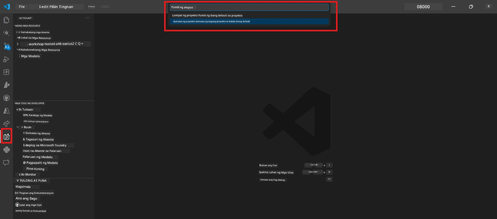
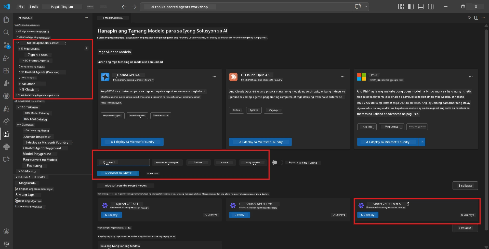
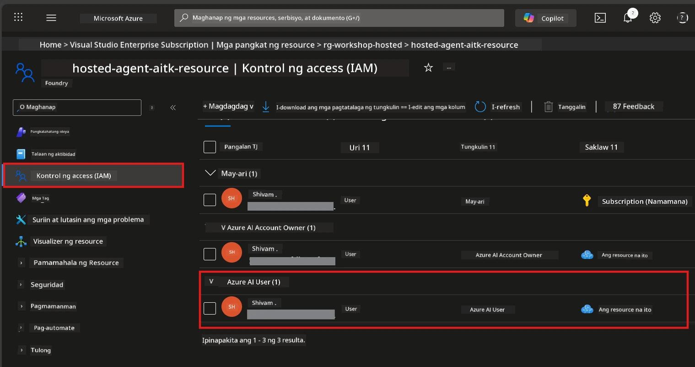

# Module 2 - Lumikha ng Foundry Project at I-deploy ang Model

Sa module na ito, gagawa ka (o pipili) ng Microsoft Foundry project at ide-deploy ang isang model na gagamitin ng iyong ahente. Bawat hakbang ay nakasulat nang malinaw - sundin ang mga ito nang sunod-sunod.

> Kung mayroon ka nang Foundry project na may naka-deploy na model, laktawan ito papuntang [Module 3](03-create-hosted-agent.md).

---

## Hakbang 1: Lumikha ng Foundry project mula sa VS Code

Gagamitin mo ang Microsoft Foundry extension para gumawa ng project nang hindi umaalis sa VS Code.

1. Pindutin ang `Ctrl+Shift+P` para buksan ang **Command Palette**.
2. I-type: **Microsoft Foundry: Create Project** at piliin ito.
3. Lalabas ang dropdown - piliin ang iyong **Azure subscription** mula sa listahan.
4. Hihingin kang pumili o gumawa ng isang **resource group**:
   - Para gumawa ng bago: i-type ang pangalan (hal. `rg-hosted-agents-workshop`) at pindutin ang Enter.
   - Para gumamit ng existing: piliin ito mula sa dropdown.
5. Pumili ng **region**. **Mahalaga:** Pumili ng region na sumusuporta sa hosted agents. Tingnan ang [region availability](https://learn.microsoft.com/azure/foundry/agents/concepts/hosted-agents#region-availability) - mga karaniwang pagpipilian ang `East US`, `West US 2`, o `Sweden Central`.
6. I-type ang isang **pangalan** para sa Foundry project (hal. `workshop-agents`).
7. Pindutin ang Enter at maghintay hanggang matapos ang provisioning.

> **Ang provisioning ay tumatagal ng 2-5 minuto.** Makikita mo ang progress notification sa kanang ibaba ng VS Code. Huwag isara ang VS Code habang nagpoprovision.

8. Kapag tapos na, ipapakita sa **Microsoft Foundry** sidebar ang bagong project sa ilalim ng **Resources**.
9. I-click ang pangalan ng project para i-expand at tiyakin na may mga seksyon tulad ng **Models + endpoints** at **Agents**.



### Alternatibo: Gumawa sa pamamagitan ng Foundry Portal

Kung mas gusto mong gamitin ang browser:

1. Buksan ang [https://ai.azure.com](https://ai.azure.com) at mag-sign in.
2. I-click ang **Create project** sa home page.
3. I-fill out ang project name, piliin ang subscription, resource group, at region.
4. I-click ang **Create** at maghintay sa provisioning.
5. Matapos malikha, bumalik sa VS Code - dapat lumabas ang project sa Foundry sidebar pagkatapos i-refresh (i-click ang refresh icon).

---

## Hakbang 2: I-deploy ang model

Ang iyong [hosted agent](https://learn.microsoft.com/azure/foundry/agents/concepts/hosted-agents) ay nangangailangan ng Azure OpenAI model para gumawa ng mga tugon. Magde-deploy ka ng isa ngayon ([deploy a model](https://learn.microsoft.com/azure/ai-foundry/openai/how-to/create-resource#deploy-a-model)).

1. Pindutin ang `Ctrl+Shift+P` para buksan ang **Command Palette**.
2. I-type: **Microsoft Foundry: Open [Model Catalog](https://learn.microsoft.com/azure/ai-foundry/openai/concepts/models)** at piliin ito.
3. Magbubukas ang Model Catalog view sa VS Code. Mag-browse o gamitin ang search bar para hanapin ang **gpt-4.1**.
4. I-click ang model card na **gpt-4.1** (o `gpt-4.1-mini` kung mas gusto mo ng mas murang opsyon).
5. I-click ang **Deploy**.


6. Sa deployment configuration:
   - **Deployment name**: Iwanang default (hal. `gpt-4.1`) o maglagay ng custom na pangalan. **Tandaan ang pangalan na ito** - kakailanganin mo ito sa Module 4.
   - **Target**: Piliin ang **Deploy to Microsoft Foundry** at pumili ng proyekto na kakagawa mo lang.
7. I-click ang **Deploy** at hintayin matapos ang deployment (1-3 minuto).

### Pagpili ng model

| Model | Pinakamahusay para sa | Gastos | Tala |
|-------|----------------------|--------|------|
| `gpt-4.1` | Mataas na kalidad, masalimuot na mga sagot | Mas mataas | Pinakamahusay na resulta, inirerekomenda para sa huling pagsusuri |
| `gpt-4.1-mini` | Mabilisang pag-ulit, mas mababang gastos | Mas mababa | Maganda para sa pagbuo at mabilisang pagsusubok sa workshop |
| `gpt-4.1-nano` | Magaan na mga gawain | Pinakamababa | Pinakamurang opsyon, ngunit mas simple ang mga sagot |

> **Rekomendasyon para sa workshop na ito:** Gamitin ang `gpt-4.1-mini` para sa pag-develop at testing. Mabilis, mura, at nagbibigay ng magagandang resulta para sa mga pagsasanay.

### Beripikahin ang deployment ng model

1. Sa **Microsoft Foundry** sidebar, i-expand ang iyong proyekto.
2. Tingnan sa ilalim ng **Models + endpoints** (o katulad na seksyon).
3. Dapat makita mo ang iyong na-deploy na modelo (hal. `gpt-4.1-mini`) na may status na **Succeeded** o **Active**.
4. I-click ang deployment ng model para makita ang mga detalye nito.
5. **Itala** ang dalawang halaga na ito - kakailanganin mo ito sa Module 4:

   | Setting | Saan ito mahahanap | Halimbawa ng halaga |
   |---------|--------------------|---------------------|
   | **Project endpoint** | I-click ang pangalan ng proyekto sa Foundry sidebar. Ang endpoint URL ay nakikita sa details view. | `https://<account>.services.ai.azure.com/api/projects/<project>` |
   | **Model deployment name** | Pangalan na nakalagay sa tabi ng deployed na model. | `gpt-4.1-mini` |

---

## Hakbang 3: Mag-assign ng kinakailangang RBAC roles

Ito ang **pinakadalang na nalalampasang hakbang**. Kung wala ang tamang mga role, mabibigo ang deployment sa Module 6 dahil sa error sa permiso.

### 3.1 Mag-assign ng Azure AI User role sa iyong sarili

1. Buksan ang browser at pumunta sa [https://portal.azure.com](https://portal.azure.com).
2. Sa top search bar, i-type ang pangalan ng iyong **Foundry project** at i-click ito sa resulta.
   - **Mahalaga:** Pumunta sa **project** resource (uri: "Microsoft Foundry project"), hindi sa parent account/hub resource.
3. Sa kaliwang navigation ng proyekto, i-click ang **Access control (IAM)**.
4. I-click ang **+ Add** na button sa taas → piliin ang **Add role assignment**.
5. Sa tab na **Role**, hanapin ang [**Azure AI User**](https://learn.microsoft.com/azure/foundry/concepts/rbac-foundry#built-in-roles) at piliin ito. I-click ang **Next**.
6. Sa tab na **Members**:
   - Piliin ang **User, group, or service principal**.
   - I-click ang **+ Select members**.
   - Hanapin ang iyong pangalan o email, piliin ang sarili mo, at i-click ang **Select**.
7. I-click ang **Review + assign** → pagkatapos ay muli **Review + assign** para kumpirmahin.



### 3.2 (Opsyonal) Mag-assign ng Azure AI Developer role

Kung kailangan mong gumawa ng mga dagdag na resources sa loob ng proyekto o mag-manage ng deployments programmatically:

1. Ulitin ang mga hakbang sa itaas, ngunit sa hakbang 5, piliin ang **Azure AI Developer**.
2. I-assign ito sa **Foundry resource (account)** level, hindi lang sa project level.

### 3.3 Beripikahin ang mga role assignments mo

1. Sa proyekto sa pahina ng **Access control (IAM)**, i-click ang tab na **Role assignments**.
2. Hanapin ang iyong pangalan.
3. Dapat makita mo ang **Azure AI User** na nakalista para sa saklaw ng proyekto.

> **Bakit mahalaga ito:** Ang [`Azure AI User`](https://learn.microsoft.com/azure/foundry/concepts/rbac-foundry#built-in-roles) na role ay nagbibigay ng `Microsoft.CognitiveServices/accounts/AIServices/agents/write` data action. Kung wala ito, makikita mo ang error na ito sa deployment:
>
> ```
> Error: lacks the required data action 
> Microsoft.CognitiveServices/accounts/AIServices/agents/write 
> to perform POST /api/projects/{projectName}/assistants operation.
> ```
>
> Tingnan ang [Module 8 - Troubleshooting](08-troubleshooting.md) para sa dagdag na detalye.

---

### Checkpoint

- [ ] May umiiral na Foundry project at nakikita ito sa Microsoft Foundry sidebar sa VS Code
- [ ] May kahit isang modelo na na-deploy (hal. `gpt-4.1-mini`) na may status na **Succeeded**
- [ ] Naitala mo ang **project endpoint** URL at **model deployment name**
- [ ] Mayroon kang **Azure AI User** role na na-assign sa **project** level (beripikahin sa Azure Portal → IAM → Role assignments)
- [ ] Ang proyekto ay nasa isang [sinusuportahang rehiyon](https://learn.microsoft.com/azure/foundry/agents/concepts/hosted-agents#region-availability) para sa hosted agents

---

**Nakaraan:** [01 - Install Foundry Toolkit](01-install-foundry-toolkit.md) · **Susunod:** [03 - Create a Hosted Agent →](03-create-hosted-agent.md)

---

<!-- CO-OP TRANSLATOR DISCLAIMER START -->
**Pagtatangi**:  
Ang dokumentong ito ay isinalin gamit ang AI translation service na [Co-op Translator](https://github.com/Azure/co-op-translator). Bagamat aming pinagsisikapang maging tumpak, pakatandaan na ang mga awtomatikong salin ay maaaring maglaman ng mga pagkakamali o di-tumpak na impormasyon. Ang orihinal na dokumento sa orihinal nitong wika ang dapat ituring na pangunahing sanggunian. Para sa mahahalagang impormasyon, inirerekomenda ang propesyonal na pagsasaling-tao. Hindi kami mananagot sa anumang hindi pagkakaunawaan o maling interpretasyon na maaaring magmula sa paggamit ng pagsalin na ito.
<!-- CO-OP TRANSLATOR DISCLAIMER END -->