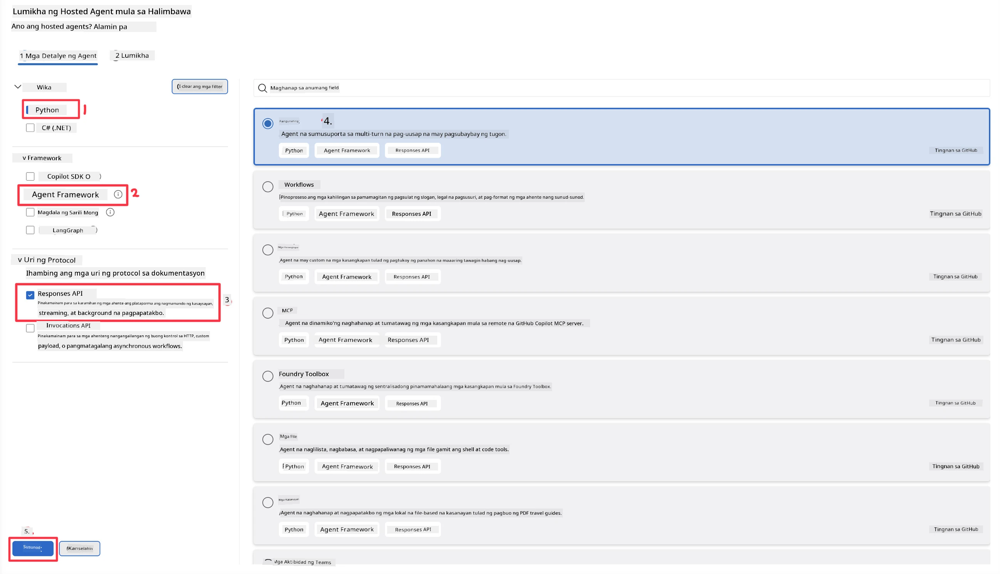
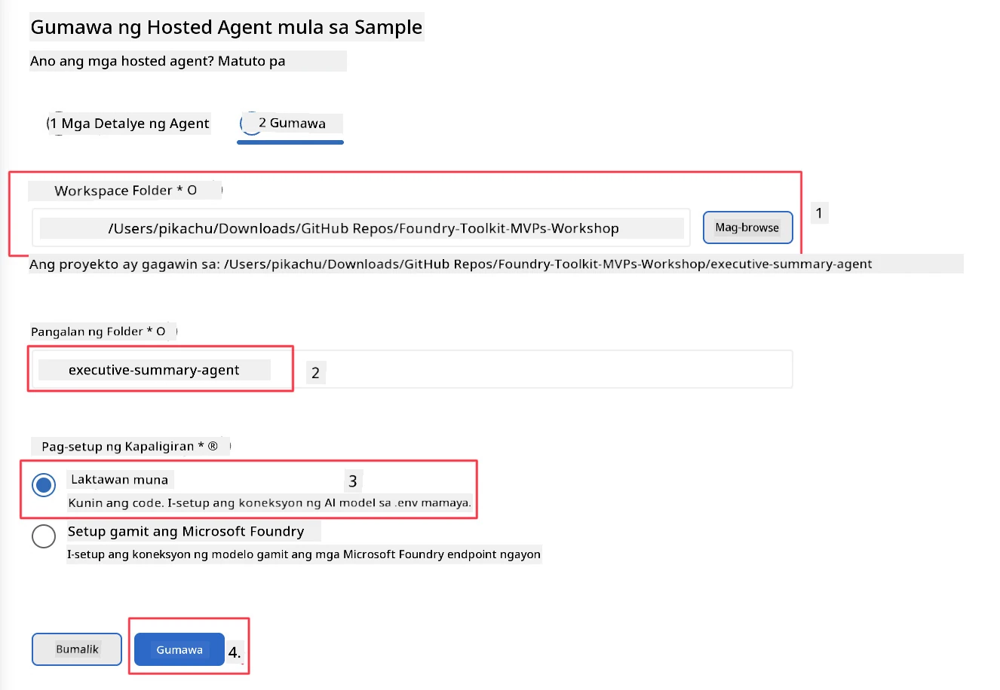

# Module 2 - Gumawa ng Bagong Hosted Agent

⏱️ ~5 min

Sa module na ito, gagamitin mo ang Foundry Toolkit para **mag-scaffold ng hosted agent project**. Ang scaffold ay bumubuo ng buong istruktura ng proyekto - `agent.yaml`, `main.py`, `Dockerfile`, `requirements.txt`, at VS Code debug configuration - para makapokus ka sa pag-customize ng pag-uugali ng agent.

> **Pangunahing konsepto:** Ang `agent/` na folder sa lab na ito ay halimbawa ng kung ano ang ginagawa ng Foundry Toolkit. Hindi mo kailangang isulat ang mga file na ito mula sa simula.

### Daloy ng Scaffold wizard

```mermaid
flowchart LR
    A["Command Palette:
    Create new Hosted Agent"] --> B["Language:
    Python"]
    B --> C["API type:
    Response API"]
    C --> D["Template:
    Basic - Agent Framework"]
    D --> E["Pumili ng modelo"]
    E --> F["Workspace folder
    & agent name"]
    F --> G["Nabuo na proyekto"]

    style A fill:#4A90D9,color:#fff
    style B fill:#7B68EE,color:#fff
    style C fill:#7B68EE,color:#fff
    style D fill:#7B68EE,color:#fff
    style E fill:#7B68EE,color:#fff
    style F fill:#7B68EE,color:#fff
    style G fill:#27AE60,color:#fff
```



---

## Hakbang 1: Buksan ang Create Hosted Agent wizard

1. Pindutin ang `Ctrl+Shift+P` para buksan ang **Command Palette**.
2. I-type: **Foundry Toolkit: Create new Hosted Agent** at piliin ito.

> **Alternatibo: Gumawa gamit ang Foundry Portal**
> Kung mas gusto mo ang browser, maaari mong likhain ang iyong proyekto sa [https://ai.azure.com](https://ai.azure.com). Kapag na-provision na ang proyekto, bumalik sa VS Code at gamitin ang **Foundry Toolkit** sidebar para kumonekta dito.

> **Alternatibo:** I-click ang **+** icon sa tabi ng **Hosted Agents (Preview)** sa Foundry Toolkit sidebar.

## Hakbang 2: Piliin ang mga setting



1. Sa kaliwang bahagi ng navigation/options, piliin ang mga sumusunod:

| Menu | Piliin | Tala |
|--------|-----------|-------|
| **Language** | Python | Sinusuportahan din ang C# |
| **Framework** | Agent Framework | Simpleng panimulang punto gamit ang Agent Framework SDK |
| **API type** | Response API | `POST /responses` - para sa conversational, na may platform-managed na history |
| **Template** | Basic | Simpleng panimulang punto gamit ang Agent Framework SDK |

2. Kapag napili na, i-click ang **Next**



3. Sa susunod na window, piliin ang mga sumusunod:

| Menu | Piliin | Tala |
|--------|-----------|-------|
| **Workspace folder** | Pumili ng target na folder | hal., `/workspace/Foundry_Toolkit_for_VSCode_Lab/` o subfolder sa repo na ito |
| **Agent name** | Maglagay ng pangalan | hal., `executive-summary-agent` |
| **Environment Setup** | huwag muna gawin setup |  |

I-click ang **create** para likhain ang ating agent. Isang bagong folder ang mabubuo gamit ang pangalan ng hosted agent.

## Hakbang 3: Siyasatin ang nabuo na proyekto

Pagkatapos makumpleto ang scaffolding, tiyakin na makita mo ang mga file na ito sa Explorer (`Ctrl+Shift+E`):

```
📂 my-agent/
├── .env                ← Environment variables (placeholders)
├── .vscode/
│   ├── launch.json     ← Debug config (F5 → run + Agent Inspector)
│   └── tasks.json      ← VS Code task definitions
├── agent.yaml          ← Agent definition (kind: hosted)
├── Dockerfile          ← Container config for deployment
├── main.py             ← Agent entry point (your main code)
└── requirements.txt    ← Python dependencies
```

### Paliwanag sa mga pangunahing file

| File | Layunin |
|------|---------|
| `agent.yaml` | Ipinapahayag ang agent bilang `kind: hosted`, nagmamapa ng mga environment variable, nagdedeklara ng `/responses` protocol |
| `main.py` | Gumagawa ng `FoundryChatClient` → inilalagay ito sa isang `Agent` gamit ang mga instruksyon → nagsisilbi gamit ang `ResponsesHostServer` sa port 8088 |
| `Dockerfile` | Gumagamit ng `python:3.12-slim`, nag-iinstall ng dependencies, nagbubukas ng port 8088, pinapatakbo ang `main.py` |
| `requirements.txt` | `agent-framework-foundry`, `agent-framework-foundry-hosting`, `mcp`, `debugpy` |

> **Mahalaga:** Buksan ang scaffolded agent folder nang direkta sa VS Code (ang `agent/` folder mismo) upang gumana nang maayos ang `.vscode/launch.json` at `tasks.json` para sa F5 debugging.

---

### ✅ Checkpoint

- [ ] Nabuong scaffolded na proyekto na may lahat ng inaasahang mga file
- [ ] Ipinapakita ng `agent.yaml` ang `kind: hosted` at `protocol: responses`
- [ ] Nag-iimport ang `main.py` ng `Agent`, `FoundryChatClient`, `ResponsesHostServer`
- [ ] Nakabukas ang agent folder sa VS Code bilang workspace root

---

**Nakaraan:** [01 - Setup](01-setup.md) · **Susunod:** [03 - Configure & Code →](03-configure-and-code.md)

---

<!-- CO-OP TRANSLATOR DISCLAIMER START -->
**Pagtatanggi**:
Ang dokumentong ito ay isinalin gamit ang serbisyo ng AI translation na [Co-op Translator](https://github.com/Azure/co-op-translator). Bagama't nagsusumikap kami para sa katumpakan, pakatandaan na ang awtomatikong pagsasalin ay maaaring maglaman ng mga pagkakamali o hindi pagkakatugma. Ang orihinal na dokumento sa orihinal nitong wika ang dapat ituring na pangunahing sanggunian. Para sa mahahalagang impormasyon, inirerekomenda ang propesyonal na pagsasalin ng tao. Hindi kami mananagot sa anumang maling pagkakaintindi o maling interpretasyon na nagmula sa paggamit ng pagsasaling ito.
<!-- CO-OP TRANSLATOR DISCLAIMER END -->