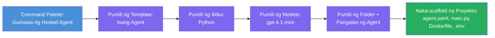

# Module 3 - Lumikha ng Bagong Hosted Agent (Auto-Scaffolded ng Foundry Extension)

Sa module na ito, gagamitin mo ang Microsoft Foundry extension upang **i-scaffold ang bagong [hosted agent](https://learn.microsoft.com/azure/foundry/agents/concepts/hosted-agents) na proyekto**. Ang extension ang gagawa ng buong istraktura ng proyekto para sa iyo - kasama ang `agent.yaml`, `main.py`, `Dockerfile`, `requirements.txt`, isang `.env` na file, at isang VS Code debug configuration. Pagkatapos ng scaffolding, ie-customize mo ang mga file na ito gamit ang mga tagubilin, kagamitan, at configuration ng iyong agent.

> **Pangunahing konsepto:** Ang `agent/` na folder sa lab na ito ay isang halimbawa ng kung ano ang nilikha ng Foundry extension kapag pinatakbo mo ang scaffold command. Hindi mo kailangang isulat ang mga file na ito mula sa simula - ang extension ang gagawa ng mga ito, at pagkatapos ay i-momodify mo ang mga ito.

### Daloy ng Scaffold wizard


---

## Hakbang 1: Buksan ang Create Hosted Agent wizard

1. Pindutin ang `Ctrl+Shift+P` upang buksan ang **Command Palette**.
2. I-type: **Microsoft Foundry: Create a New Hosted Agent** at piliin ito.
3. Bubukas ang hosted agent creation wizard.

> **Alternatibong ruta:** Maaari mo ring maabot ang wizard na ito mula sa sidebar ng Microsoft Foundry → i-click ang **+** icon sa tabi ng **Agents** o mag-right-click at piliin ang **Create New Hosted Agent**.

---

## Hakbang 2: Piliin ang iyong template

Hihingin ng wizard na pumili ka ng template. Makakakita ka ng mga opsyon tulad ng:

| Template | Deskripsyon | Kailan gagamitin |
|----------|-------------|------------------|
| **Single Agent** | Isang agent na may sariling modelo, mga tagubilin, at opsyonal na kagamitan | Ang workshop na ito (Lab 01) |
| **Multi-Agent Workflow** | Maraming agent na nagtutulungan nang sunud-sunod | Lab 02 |

1. Piliin ang **Single Agent**.
2. I-click ang **Next** (o awtomatikong magpapatuloy ang pagpili).

---

## Hakbang 3: Piliin ang programming language

1. Piliin ang **Python** (inirerekomenda para sa workshop na ito).
2. I-click ang **Next**.

> **Sinusuportahan din ang C#** kung gusto mo ng .NET. Halos pareho ang scaffold na istraktura (gumagamit ng `Program.cs` sa halip na `main.py`).

---

## Hakbang 4: Piliin ang iyong modelo

1. Ipapakita ng wizard ang mga modelong naka-deploy sa iyong Foundry project (mula sa Module 2).
2. Piliin ang modelong na-deploy mo - halimbawa, **gpt-4.1-mini**.
3. I-click ang **Next**.

> Kung wala kang nakikitang mga modelo, bumalik sa [Module 2](02-create-foundry-project.md) at mag-deploy muna.

---

## Hakbang 5: Piliin ang lokasyon ng folder at pangalan ng agent

1. Bubukas ang file dialog - pumili ng **target folder** kung saan malilikha ang proyekto. Para sa workshop na ito:
   - Kung nagsisimula nang bago: pumili ng anumang folder (hal., `C:\Projects\my-agent`)
   - Kung nagtatrabaho sa loob ng workshop repo: gumawa ng bagong subfolder sa ilalim ng `workshop/lab01-single-agent/agent/`
2. Ilagay ang **pangalan** ng hosted agent (hal., `executive-summary-agent` o `my-first-agent`).
3. I-click ang **Create** (o pindutin ang Enter).

---

## Hakbang 6: Maghintay hanggang matapos ang scaffolding

1. Magbubukas ang VS Code ng **bagong window** na may scaffolded na proyekto.
2. Maghintay ng ilang segundo para sa buong pag-load ng proyekto.
3. Makikita mo ang mga sumusunod na file sa Explorer panel (`Ctrl+Shift+E`):

```
📂 my-first-agent/
├── .env                ← Environment variables (auto-generated with placeholders)
├── .vscode/
│   └── launch.json     ← Debug configuration (F5 to run + Agent Inspector)
├── agent.yaml          ← Agent definition (kind: hosted)
├── Dockerfile          ← Container configuration for deployment
├── main.py             ← Agent entry point (your main code file)
└── requirements.txt    ← Python dependencies
```

> **Ito ay parehong istraktura ng `agent/` na folder** sa lab na ito. Awtomatikong nililikha ng Foundry extension ang mga file na ito - hindi mo kailangang gumawa manually.

> **Tala sa Workshop:** Sa repository ng workshop na ito, ang `.vscode/` na folder ay nasa **workspace root** (hindi sa loob ng bawat proyekto). Naglalaman ito ng shared na `launch.json` at `tasks.json` na may dalawang debug configuration - **"Lab01 - Single Agent"** at **"Lab02 - Multi-Agent"** - na tumutukoy sa tamang `cwd` ng lab. Kapag pinindot mo ang F5, piliin ang configuration na tumutugma sa lab na iyong ginagawa mula sa dropdown.

---

## Hakbang 7: Unawain ang bawat nilikhang file

Maglaan ng sandali upang suriin ang bawat file na ginawa ng wizard. Mahalaga itong maintindihan para sa Module 4 (customization).

### 7.1 `agent.yaml` - Kahulugan ng Agent

Buksan ang `agent.yaml`. Ganito ang itsura nito:

```yaml
# yaml-language-server: $schema=https://raw.githubusercontent.com/microsoft/AgentSchema/refs/heads/main/schemas/v1.0/ContainerAgent.yaml

kind: hosted
name: my-first-agent
description: >
  A hosted agent deployed to Microsoft Foundry Agent Service.
metadata:
  authors:
    - Microsoft
  tags:
    - Azure AI AgentServer
    - Microsoft Agent Framework
    - Hosted Agent
protocols:
  - protocol: responses
    version: v1
environment_variables:
  - name: AZURE_AI_PROJECT_ENDPOINT
    value: ${PROJECT_ENDPOINT}
  - name: AZURE_AI_MODEL_DEPLOYMENT_NAME
    value: ${MODEL_DEPLOYMENT_NAME}
dockerfile_path: Dockerfile
resources:
  cpu: '0.25'
  memory: 0.5Gi
```

**Pangunahing mga field:**

| Field | Layunin |
|-------|---------|
| `kind: hosted` | Nagdeklara na ito ay isang hosted agent (container-based, nade-deploy sa [Foundry Agent Service](https://learn.microsoft.com/azure/foundry/agents/overview)) |
| `protocols: responses v1` | Ipinapakita ng agent ang OpenAI-compatible na `/responses` HTTP endpoint |
| `environment_variables` | Nagmamapa ng mga halaga mula sa `.env` papunta sa container env vars sa oras ng deployment |
| `dockerfile_path` | Tumutukoy sa Dockerfile na ginagamit sa pagbuo ng container image |
| `resources` | CPU at memory allocation para sa container (0.25 CPU, 0.5Gi memory) |

### 7.2 `main.py` - Entry point ng Agent

Buksan ang `main.py`. Ito ang pangunahing Python file kung saan nakatira ang logic ng iyong agent. Kasama sa scaffold:

```python
from agent_framework.azure import AzureAIAgentClient
from azure.ai.agentserver.agentframework import from_agent_framework
from azure.identity.aio import DefaultAzureCredential
```

**Pangunahing import:**

| Import | Layunin |
|--------|---------|
| `AzureAIAgentClient` | Kumokonekta sa iyong Foundry project at lumilikha ng mga agent gamit ang `.as_agent()` |
| [`DefaultAzureCredential`](https://learn.microsoft.com/azure/developer/python/sdk/authentication/credential-chains#defaultazurecredential-overview) | Namamahala sa authentication (Azure CLI, VS Code sign-in, managed identity, o service principal) |
| `from_agent_framework` | Nag-i-wrap ng agent bilang HTTP server na nagpapakita ng `/responses` endpoint |

Ang pangunahing daloy ay:
1. Gumawa ng credential → gumawa ng client → tawagin ang `.as_agent()` para makakuha ng agent (async context manager) → i-wrap bilang server → patakbuhin

### 7.3 `Dockerfile` - Container image

```dockerfile
FROM python:3.14-slim

WORKDIR /app

COPY ./ .

RUN pip install --upgrade pip && \
    if [ -f requirements.txt ]; then \
        pip install -r requirements.txt; \
    else \
        echo "No requirements.txt found" >&2; exit 1; \
    fi

EXPOSE 8088

CMD ["python", "main.py"]
```

**Mga pangunahing detalye:**
- Gumagamit ng `python:3.14-slim` bilang base image.
- Kinokopya lahat ng mga file ng proyekto sa `/app`.
- Ina-upgrade ang `pip`, ini-install ang mga dependencies mula sa `requirements.txt`, at agad na mag-fail kung wala ang file.
- **Nag-eexpose ng port 8088** - ito ang kinakailangang port para sa hosted agents. Huwag itong baguhin.
- Sinisimulan ang agent gamit ang `python main.py`.

### 7.4 `requirements.txt` - Mga dependency

```
agent-framework-azure-ai==1.0.0rc3
agent-framework-core==1.0.0rc3
azure-ai-agentserver-agentframework==1.0.0b16
azure-ai-agentserver-core==1.0.0b16
debugpy
agent-dev-cli
```

| Package | Layunin |
|---------|---------|
| `agent-framework-azure-ai` | Azure AI integration para sa Microsoft Agent Framework |
| `agent-framework-core` | Core runtime para sa paggawa ng mga agent (kasama ang `python-dotenv`) |
| `azure-ai-agentserver-agentframework` | Hosted agent server runtime para sa Foundry Agent Service |
| `azure-ai-agentserver-core` | Core agent server abstractions |
| `debugpy` | Suporta para sa Python debugging (nagpapahintulot ng F5 debugging sa VS Code) |
| `agent-dev-cli` | Lokal na development CLI para sa pagsubok ng mga agent (ginagamit ng debug/run configuration) |

---

## Pag-unawa sa agent protocol

Nakikipagkomunikasyon ang hosted agents gamit ang **OpenAI Responses API** protocol. Kapag tumatakbo (lokal o cloud), nagpapakita ang agent ng isang HTTP endpoint:

```
POST http://localhost:8088/responses
Content-Type: application/json

{
  "input": "Your prompt here",
  "stream": false
}
```

Tinutawag ng Foundry Agent Service ang endpoint na ito upang magpadala ng mga prompt ng user at makatanggap ng mga sagot mula sa agent. Ito ang parehong protocol na ginagamit ng OpenAI API, kaya compatible ang iyong agent sa anumang client na gumagamit ng OpenAI Responses format.

---

### Checkpoint

- [ ] Matagumpay na natapos ang scaffold wizard at isang **bagong VS Code window** ang nabuksan
- [ ] Nakikita mo ang lahat ng 5 files: `agent.yaml`, `main.py`, `Dockerfile`, `requirements.txt`, `.env`
- [ ] Ang `.vscode/launch.json` file ay naroon (nagpapagana ng F5 debugging - sa workshop na ito nasa workspace root ito na may mga lab-specific config)
- [ ] Nabasa mo na ang bawat file at nauunawaan ang layunin nito
- [ ] Naiintindihan mo na kinakailangan ang port `8088` at ang `/responses` endpoint ang protocol

---

**Nakasunod:** [02 - Create Foundry Project](02-create-foundry-project.md) · **Sumunod:** [04 - Configure & Code →](04-configure-and-code.md)

---

<!-- CO-OP TRANSLATOR DISCLAIMER START -->
**Pagsasabi ng Limitasyon**:
Ang dokumentong ito ay isinalin gamit ang AI translation service na [Co-op Translator](https://github.com/Azure/co-op-translator). Bagaman sinisikap naming maging tumpak, pakatandaan na ang mga awtomatikong pagsasalin ay maaaring magkaroon ng mga pagkakamali o di-tiyak na impormasyon. Ang orihinal na dokumento sa sariling wika nito ang dapat ituring na opisyal na pinagkukunan. Para sa mahahalagang impormasyon, inirerekomenda ang propesyonal na pagsasalin ng tao. Hindi kami mananagot sa anumang hindi pagkakaintindihan o maling interpretasyon na nagmumula sa paggamit ng pagsasaling ito.
<!-- CO-OP TRANSLATOR DISCLAIMER END -->