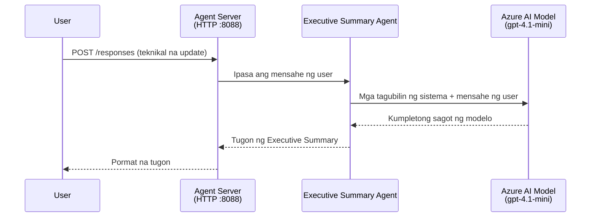
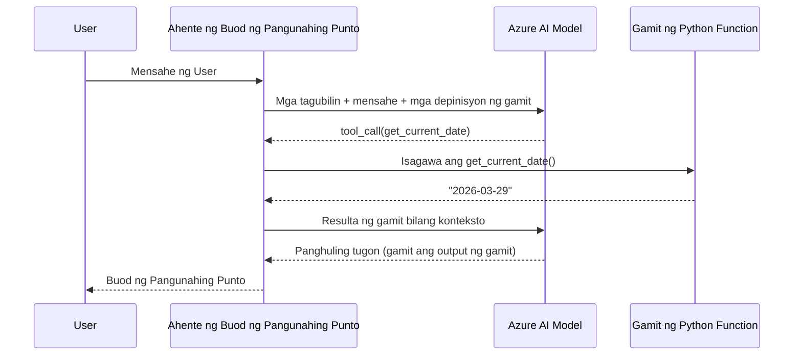

# Module 4 - I-configure ang Mga Instruksyon, Kapaligiran at I-install ang Mga Dependency

Sa module na ito, inaangkop mo ang mga auto-scaffolded na file ng agent mula sa Module 3. Dito mo binabago ang generic scaffold para maging **iyong** agent - sa pamamagitan ng pagsulat ng mga instruksyon, pagtatakda ng mga environment variable, opsyonal na pagdagdag ng mga tool, at pag-install ng mga dependency.

> **Paalaala:** Ang extension na Foundry ang awtomatikong gumawa ng mga file ng iyong proyekto. Ngayon ay babaguhin mo ang mga ito. Tingnan ang folder na [`agent/`](../../../../../workshop/lab01-single-agent/agent) para sa isang kompletong gumaganang halimbawa ng naangkop na agent.

---

## Paano nagsasama-sama ang mga bahagi

### Siklo ng kahilingan (isang agent lamang)


> **Kasama ang mga tool:** Kung ang agent ay may mga nakarehistrong tool, maaaring magbalik ang model ng tool-call imbes na direktang resulta. Pinapatakbo ng framework ang tool nang lokal, ibinabalik ang resulta sa model, at saka bumubuo ang model ng huling sagot.


---

## Hakbang 1: I-configure ang mga environment variable

Gumawa ang scaffold ng `.env` file na may mga placeholder na halaga. Kailangan mong punan ito ng totoong mga halaga mula sa Module 2.

1. Sa iyong scaffolded na proyekto, buksan ang **`.env`** file (nasa root ng proyekto ito).
2. Palitan ang mga placeholder ng mga totoong detalye ng iyong Foundry project:

   ```env
   PROJECT_ENDPOINT=https://<your-account>.services.ai.azure.com/api/projects/<your-project>
   MODEL_DEPLOYMENT_NAME=gpt-4.1-mini
   ```

3. I-save ang file.

### Saan mahahanap ang mga halagang ito

| Halaga | Paano ito hanapin |
|--------|-------------------|
| **Project endpoint** | Buksan ang **Microsoft Foundry** sidebar sa VS Code → i-click ang iyong proyekto → makikita ang endpoint URL sa detalye. Mukha itong `https://<account-name>.services.ai.azure.com/api/projects/<project-name>` |
| **Model deployment name** | Sa Foundry sidebar, i-expand ang iyong proyekto → tingnan sa ilalim ng **Models + endpoints** → nakalista ang pangalan malapit sa naka-deploy na modelo (halimbawa, `gpt-4.1-mini`) |

> **Seguridad:** Huwag kailanman i-commit ang `.env` file sa version control. Kasama na ito sa `.gitignore` bilang default. Kung hindi, idagdag ito:
> ```
> .env
> ```

### Paano dumadaloy ang mga environment variable

Ang mapping chain ay: `.env` → `main.py` (binabasa gamit ang `os.getenv`) → `agent.yaml` (inakma sa mga container env var sa oras ng deployment).

Sa `main.py`, binabasa ng scaffold ang mga halagang ito tulad nito:

```python
PROJECT_ENDPOINT = os.getenv("AZURE_AI_PROJECT_ENDPOINT") or os.getenv("PROJECT_ENDPOINT")
MODEL_DEPLOYMENT_NAME = os.getenv("AZURE_AI_MODEL_DEPLOYMENT_NAME", os.getenv("MODEL_DEPLOYMENT_NAME", "gpt-4.1-mini"))
```

Tinanggap ang parehong `AZURE_AI_PROJECT_ENDPOINT` at `PROJECT_ENDPOINT` (ginagamit ng `agent.yaml` ang prefix na `AZURE_AI_*`).

---

## Hakbang 2: Sumulat ng mga instruksyon para sa agent

Ito ang pinakamahalagang hakbang ng pag-customize. Ang mga instruksyon ang tumutukoy sa personalidad, pag-uugali, format ng output, at mga safety constraint ng iyong agent.

1. Buksan ang `main.py` sa iyong proyekto.
2. Hanapin ang string ng instruksyon (may default/generic ang scaffold).
3. Palitan ito ng mga detalyado at nakaayos na instruksyon.

### Ano ang mga dapat isama sa mabuting instruksyon

| Bahagi | Layunin | Halimbawa |
|--------|---------|-----------|
| **Role** | Ano ang agent at ano ang ginagawa nito | "Ikaw ay isang executive summary agent" |
| **Audience** | Para kanino ang mga sagot | "Mga senior leader na may limitadong teknikal na kaalaman" |
| **Input definition** | Anong uri ng mga prompt ang tinatanggap | "Mga technical incident report, operational update" |
| **Output format** | Eksaktong istraktura ng mga sagot | "Executive Summary: - Ano ang nangyari: ... - Epekto sa negosyo: ... - Susunod na hakbang: ..." |
| **Rules** | Mga limitasyon at kundisyon ng pagtanggi | "Huwag magdagdag ng impormasyon lampas sa ibinigay" |
| **Safety** | Para maiwasan ang maling paggamit at hallucination | "Kung hindi malinaw ang input, humingi ng paglilinaw" |
| **Examples** | Mga halimbawa ng input/output para itulak ang pag-uugali | Maglakip ng 2-3 mga halimbawa na may iba't ibang inputs |

### Halimbawa: Instruksyon para sa Executive Summary Agent

Narito ang mga instruksyon na ginamit sa workshop na [`agent/main.py`](../../../../../workshop/lab01-single-agent/agent/main.py):

```python
AGENT_INSTRUCTIONS = """You are an "Explain Like I'm an Executive" agent.

Purpose:
Your job is to translate complex technical or operational information into
clear, concise, and outcome-focused summaries that can be easily understood
by non-technical executives.

Audience:
Senior leaders with limited technical background who care about impact,
risk, and what happens next.

What you must do:
- Rephrase the input so it is understandable to a non-technical audience
- Prioritize clarity, brevity, and outcomes over technical accuracy
- Remove technical jargon, logs, metrics, stack traces, and deep root-cause details
- Translate technical causes into simple cause-and-effect statements
- Explicitly call out business impact
- Always include a clear next step or action
- Maintain a neutral, factual, and calm executive tone
- Do NOT add new facts or speculate beyond the input

Standard Output Structure (always use this wording):

Executive Summary:
- What happened: <plain-language description>
- Business impact: <clear, non-technical impact>
- Next step: <clear action or mitigation>

Rules:
- Keep responses under 100 words
- Do NOT add facts beyond the input
- If input is unclear, ask for clarification
"""
```

4. Palitan ang kasalukuyang string ng instruksyon sa `main.py` ng iyong sariling instruksyon.
5. I-save ang file.

---

## Hakbang 3: (Opsyonal) Magdagdag ng mga custom tool

Maaaring patakbuhin ng hosted agents ang **mga lokal na Python function** bilang [tools](https://learn.microsoft.com/azure/foundry/agents/concepts/tool-catalog). Isa itong mahalagang bentahe ng code-based hosted agents kumpara sa prompt-only agents - maaaring patakbuhin ng iyong agent ang kahit anong server-side na lohika.

### 3.1 Magdefine ng tool function

Magdagdag ng function para sa tool sa `main.py`:

```python
from agent_framework import tool

@tool
def get_current_date() -> str:
    """Returns the current date in YYYY-MM-DD format."""
    from datetime import date
    return str(date.today())
```

Pinapagana ng decorator na `@tool` ang parehong standard Python function bilang agent tool. Ang docstring ang nagsisilbing paglalarawan ng tool na nakikita ng model.

### 3.2 Irehistro ang tool sa agent

Kapag gumagawa ng agent gamit ang `.as_agent()` context manager, ipasa ang tool sa `tools` parameter:

```python
async with AzureAIAgentClient(
    project_endpoint=PROJECT_ENDPOINT,
    model_deployment_name=MODEL_DEPLOYMENT_NAME,
    credential=credential,
).as_agent(
    name="my-agent",
    instructions=AGENT_INSTRUCTIONS,
    tools=[get_current_date],
) as agent:
    server = from_agent_framework(agent)
    await server.run_async()
```

### 3.3 Paano gumagana ang tool calls

1. Magpadala ng prompt ang user.
2. Pinipili ng model kung kailangan ng tool (batay sa prompt, instruksyon, at mga paglalarawan ng tool).
3. Kung kailangan ang tool, tinatawag ng framework ang iyong Python function nang lokal (sa loob ng container).
4. Ibinabalik ng tool ang resulta sa model bilang konteksto.
5. Bumubuo ang model ng huling sagot.

> **Ang mga tool ay pinatatakbo sa server-side** - tumatakbo ang mga ito sa loob ng iyong container, hindi sa browser ng user o model. Ibig sabihin, maaari kang mag-access ng mga database, API, file system, o kahit anong Python library.

---

## Hakbang 4: Gumawa at i-activate ang virtual environment

Bago mag-install ng mga dependency, gumawa ng hiwalay na Python environment.

### 4.1 Gumawa ng virtual environment

Buksan ang terminal sa VS Code (`` Ctrl+` ``) at patakbuhin:

```powershell
python -m venv .venv
```

Lumilikha ito ng folder na `.venv` sa direktoryo ng iyong proyekto.

### 4.2 I-activate ang virtual environment

**PowerShell (Windows):**

```powershell
.\.venv\Scripts\Activate.ps1
```

**Command Prompt (Windows):**

```cmd
.venv\Scripts\activate.bat
```

**macOS/Linux (Bash):**

```bash
source .venv/bin/activate
```

Makikita mo ang `(.venv)` na lumilitaw sa simula ng iyong terminal prompt na nagsasabing aktibo ang virtual environment.

### 4.3 I-install ang mga dependency

Habang aktibo ang virtual environment, i-install ang mga kinakailangang package:

```powershell
pip install -r requirements.txt
```

Ito ang ini-install:

| Package | Layunin |
|---------|---------|
| `agent-framework-azure-ai==1.0.0rc3` | Azure AI integration para sa [Microsoft Agent Framework](https://learn.microsoft.com/agent-framework/overview/) |
| `agent-framework-core==1.0.0rc3` | Core runtime para sa paggawa ng mga agent (kasama ang `python-dotenv`) |
| `azure-ai-agentserver-agentframework==1.0.0b16` | Hosted agent server runtime para sa [Foundry Agent Service](https://learn.microsoft.com/azure/foundry/agents/overview) |
| `azure-ai-agentserver-core==1.0.0b16` | Core agent server abstractions |
| `debugpy` | Python debugging (pinapagana ang F5 debugging sa VS Code) |
| `agent-dev-cli` | Lokal na development CLI para sa pagsubok ng mga agent |

### 4.4 Tiyakin ang pag-install

```powershell
pip list | Select-String "agent-framework|agentserver"
```

Inaasahang output:
```
agent-framework-azure-ai   1.0.0rc3
agent-framework-core       1.0.0rc3
azure-ai-agentserver-agentframework 1.0.0b16
azure-ai-agentserver-core  1.0.0b16
```

---

## Hakbang 5: Tiyakin ang authentication

Gumagamit ang agent ng [`DefaultAzureCredential`](https://learn.microsoft.com/azure/developer/python/sdk/authentication/credential-chains#defaultazurecredential-overview) na sumusubok ng iba't ibang pamamaraan ng authentication sa ganitong pagkakasunod-sunod:

1. **Environment variables** - `AZURE_CLIENT_ID`, `AZURE_TENANT_ID`, `AZURE_CLIENT_SECRET` (service principal)
2. **Azure CLI** - kinukuha ang iyong `az login` session
3. **VS Code** - ginagamit ang account na naka-sign in sa VS Code
4. **Managed Identity** - ginagamit kapag tumatakbo sa Azure (sa panahon ng deployment)

### 5.1 Tiyakin para sa lokal na development

Dapat gumana ang kahit isa sa mga ito:

**Opsyon A: Azure CLI (inirerekomenda)**

```powershell
az account show --query "{name:name, id:id}" --output table
```

Inaasahan: Ipinapakita ang pangalan at ID ng iyong subscription.

**Opsyon B: VS Code sign-in**

1. Tingnan ang ibaba-kaliwa ng VS Code para sa icon na **Accounts**.
2. Kung nakikita mo ang pangalan ng account mo, authenticated ka na.
3. Kung hindi, i-click ang icon → **Sign in to use Microsoft Foundry**.

**Opsyon C: Service principal (para sa CI/CD)**

```powershell
$env:AZURE_TENANT_ID = "<your-tenant-id>"
$env:AZURE_CLIENT_ID = "<your-client-id>"
$env:AZURE_CLIENT_SECRET = "<your-client-secret>"
```

### 5.2 Karaniwang isyu sa auth

Kung naka-sign in ka sa maraming Azure account, siguraduhing tama ang napiling subscription:

```powershell
az account set --subscription "<your-subscription-id>"
```

---

### Checkpoint

- [ ] May valid na `PROJECT_ENDPOINT` at `MODEL_DEPLOYMENT_NAME` (hindi placeholder) ang `.env` file
- [ ] Na-customize ang mga instruksyon ng agent sa `main.py` - tinutukoy nito ang role, audience, output format, rules, at safety constraints
- [ ] (Opsyonal) May defined at nairehistrong custom tools
- [ ] Nalikha at na-activate ang virtual environment (`(.venv)` ay nakikita sa terminal prompt)
- [ ] Natapos ang `pip install -r requirements.txt` nang walang error
- [ ] Ipinapakita ng `pip list | Select-String "azure-ai-agentserver"` na naka-install ang package
- [ ] Valid ang authentication - nagbalik ng subscription ang `az account show` O naka-sign in ka sa VS Code

---

**Nakaraan:** [03 - Gumawa ng Hosted Agent](03-create-hosted-agent.md) · **Susunod:** [05 - Subukan nang Lokal →](05-test-locally.md)

---

<!-- CO-OP TRANSLATOR DISCLAIMER START -->
**Paunawa**:  
Ang dokumentong ito ay isinalin gamit ang AI translation service na [Co-op Translator](https://github.com/Azure/co-op-translator). Bagamat aming pinagsisikapang maging tumpak, pakatandaan na ang awtomatikong pagsasalin ay maaaring maglaman ng mga pagkakamali o di-katumpakan. Ang orihinal na dokumento sa kanyang likas na wika ang dapat ituring na pangunahing sanggunian. Para sa mahahalagang impormasyon, inirerekomenda ang propesyonal na pagsasaling-tao. Hindi kami mananagot sa anumang hindi pagkakaintindihan o maling interpretasyon na nagmumula sa paggamit ng pagsasaling ito.
<!-- CO-OP TRANSLATOR DISCLAIMER END -->