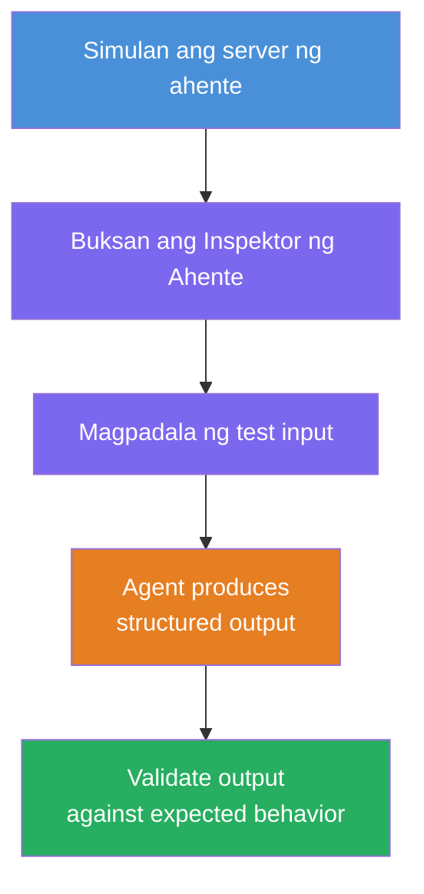
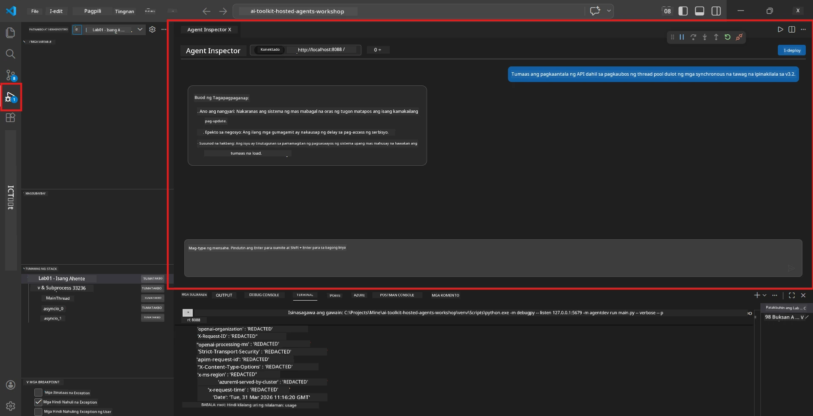
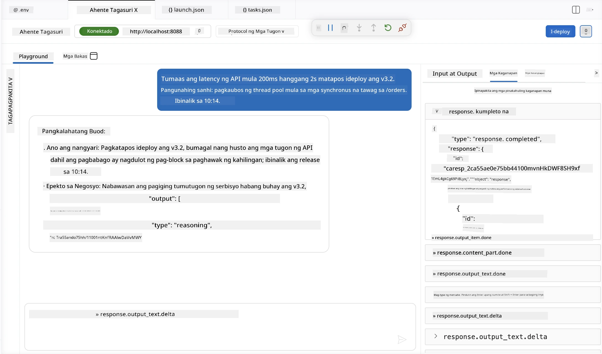

# Module 4 - Subukan Nang Lokal

⏱️ ~10 min

Sa module na ito, patatakbuhin mo ang iyong ahente nang lokal at susuriin kung ito ay gumagana ng tama gamit ang **happy-path functional tests**. Gagamitin mo ang Agent Inspector (visual UI) o direktang mga tawag sa HTTP upang kumpirmahin na ang ahente ay gumagawa ng istrakturadong, tumpak na mga tugon.

### Daloy ng lokal na pagsubok



---

## Opsyon 1: Pindutin ang F5 - I-debug gamit ang Agent Inspector (inirerekomenda)

### Simulan ang debugger

1. Buksan ang **executive-summary-agent/** folder direkta sa VS Code (`File → Open Folder`).
2. Buksan ang panel na **Run and Debug** (`Ctrl+Shift+D`).
3. Piliin ang **Debug Local Agent Server** mula sa dropdown.
4. Pindutin ang **F5** (o i-click ang ▶ Start Debugging).

> ⚠️ **Mahalaga: Piliin ang iyong Python Interpreter**
> Kung makakatanggap ka ng "ModuleNotFoundError" o hindi magsimula ang debugger, kailangang sabihin sa VS Code na gamitin ang iyong virtual environment:
  > 1. Pindutin ang `Ctrl+Shift+P` $\rightarrow$ i-type ang **Python: Select Interpreter**.
  > 2. Piliin ang interpreter na nasa `.venv` folder ng iyong proyekto (hal., `.\.venv\Scripts\python.exe` sa Windows).
  > 3. I-restart ang sesyon ng debug.
> Kung patuloy ang mga error, i-update nang manu-mano ang iyong `tasks.json` file sa mga sumusunod:
  > 1. Puntahan ang `.vscode/tasks.json` file
  > 2. Hanapin ang utos na may label na: `Run Agent/Workflow HTTP Server`
  > 3. I-update ang halaga ng command ng ganito: `"value": "${workspaceFolder}/.venv/bin/python",`

### Ano ang nangyayari

1. Nagsisimula ang HTTP server sa `http://localhost:8088/responses`.
2. Awtomatikong bumubukas ang panel ng **Agent Inspector** - isang visual chat interface para sa pagsubok.
3. Naka-enable ang mga breakpoint sa `main.py`.

Bantayan ang Terminal para sa:
```
Starting executive summary hosted agent
Executive agent server running on http://localhost:8088
```

> **Kung hindi bumukas ang Agent Inspector:** Pindutin ang `Ctrl+Shift+P` → **Foundry Toolkit: Open Agent Inspector**.



> *Maaaring ang screenshot ay nagpapakita ng lumang 'AI TOOLKIT' branding mula sa naunang bersyon ng extension.*

---

## Opsyon 2: Subukan sa Terminal (alternatibo)

Simulan ang ahente sa isang terminal, magpadala ng mga kahilingan mula sa isa pa:

```bash
# Terminal 1: Simulan ang ahente
cd executive-summary-agent/
source .venv/bin/activate
python main.py
```

```bash
# Terminal 2: Magpadala ng pagsubok (curl)
curl -sS -X POST http://localhost:8088/responses \
  -H "Content-Type: application/json" \
  -d '{"input": "The API latency increased due to thread pool exhaustion caused by sync calls in v3.2.", "stream": false}'
```

---

## Mga pagsubok sa senaryo: Pagsusuri sa happy-path functional

Patakbuhin ang **lahat ng tatlong** senaryo sa ibaba. Sinasuri nito na ang iyong ahente ay gumagawa ng tama, istrakturadong output para sa makatotohanang input.



### Senaryo 1: IT Incident - Pagsabog ng latency ng API

**Input:**
```
The API latency increased from 200ms to 2s after deploying v3.2.
Root cause: thread pool starvation from synchronous calls in /orders.
Rolled back at 10:14.
```

**Inaasahang kilos:**
- ✅ Sinusunod ang istruktura ng "Executive Summary" (Ano ang nangyari / Epekto sa negosyo / Susunod na hakbang)
- ✅ Walang teknikal na jargon (walang "thread pool", walang "/orders", walang "v3.2")
- ✅ Maliwanag na sinasabi ang epekto sa negosyo (hal., nagkaroon ng pagkaantala ang mga gumagamit)
- ✅ May kasamang susunod na hakbang (hal., patch na naipadala, naka-set up ang monitoring)

---

### Senaryo 2: Data Pipeline - ETL failure

**Input:**
```
The nightly ETL job failed because the upstream schema changed. APAC dashboards show missing data.
```

**Inaasahang kilos:**
- ✅ Buod ng kabiguan sa pag-refresh ng data sa payak na salita
- ✅ Binanggit ang epekto sa APAC dashboard
- ✅ Kasama ang susunod na hakbang para sa remedyo
- ✅ HINDI binanggit ang "ETL", "schema", o ibang teknikal na termino

---

### Senaryo 3: Seguridad - Bukas na kredensyal

**Input:**
```
Static analysis flagged a hardcoded secret in the repository.
The secret may have been exposed in commit history.
```

**Inaasahang kilos:**
- ✅ Inilalarawan ang isyu sa kredensyal/sekuridad sa paraang madaling maintindihan ng isang ehekutibo
- ✅ Tinatawag ang posibleng panganib (hindi awtorisadong pag-access)
- ✅ Sinasabi ang aksyon para sa remedyo (pag-ikot ng kredensyal, audit)
- ✅ HINDI kasama ang mga terminong gaya ng "static analysis", "commit history", o "hardcoded"

---

## Mga pamantayan sa pagsusuri

Para sa bawat senaryo, suriin:

| # | Pamantayan | Pasa kapag |
|---|----------|---------------|
| 1 | **Istruktura** | Tugon ay gumagamit ng format na "Executive Summary" na may tatlong bullets |
| 2 | **Payak na wika** | Walang teknikal na jargon na hindi mauunawaan ng ehekutibo |
| 3 | **Katumpakan** | Buod ay tumutugma sa input - walang imbentong detalye |
| 4 | **Kalakihan** | Tugon ay hindi lalampas sa 100 salita |
| 5 | **Susunod na hakbang** | Maliwanag ang tinukoy na aksyon o mitigasyon |

---

## Mga tip sa pag-debug

| Isyu | Ayusin |
|-------|-----|
| Hindi nagsisimula ang ahente | Suriin ang mga halaga sa `.env`, tiyakin na naka-activate ang venv, patakbuhin ang `pip install -r requirements.txt` |
| Walang laman o pangkalahatang tugon | Balikan ang mga tagubilin sa `main.py` - siguraduhing nakasaad ang format ng output |
| Tugon ay may jargon | Palakasin ang mga panuntunan sa "alisin ang teknikal na termino" sa mga tagubilin |
| Hindi bumubukas ang Agent Inspector | `Ctrl+Shift+P` → **Foundry Toolkit: Open Agent Inspector** |
| Mga error sa modelo sa Terminal | Tiyakin na ang `AZURE_AI_MODEL_DEPLOYMENT_NAME` ay eksaktong tumutugma (case-sensitive) |

---

### ✅ Checkpoint

- [ ] Nagsisimula ang ahente nang lokal nang walang error
- [ ] Bumubukas ang Agent Inspector at nagpapakita ng chat interface (kung ginamit ang F5)
- [ ] **Senaryo 1** (IT incident) - istrakturadong Executive Summary, walang jargon
- [ ] **Senaryo 2** (data pipeline) - kaugnay na buod na may epekto sa negosyo
- [ ] **Senaryo 3** (alerto sa seguridad) - angkop na komunikasyon ng panganib
- [ ] Lahat ng tugon ay sumusunod sa itinakdang istruktura ng output

> **I-save ang iyong mga tugon** (kopyahin o kunan ng screenshot) - ihahambing mo ito sa mga resulta sa cloud sa Module 06.

---

**Nauna:** [03 - Configure & Code](03-configure-and-code.md) · **Susunod:** [05 - Deploy to Foundry →](05-deploy-to-foundry.md)

---

<!-- CO-OP TRANSLATOR DISCLAIMER START -->
**Pagtatanggi**:
Ang dokumentong ito ay isinalin gamit ang serbisyo ng AI translation na [Co-op Translator](https://github.com/Azure/co-op-translator). Bagama't nagsusumikap kami para sa katumpakan, pakatandaan na ang awtomatikong pagsasalin ay maaaring maglaman ng mga pagkakamali o hindi pagkakatugma. Ang orihinal na dokumento sa orihinal nitong wika ang dapat ituring na pangunahing sanggunian. Para sa mahahalagang impormasyon, inirerekomenda ang propesyonal na pagsasalin ng tao. Hindi kami mananagot sa anumang maling pagkakaintindi o maling interpretasyon na nagmula sa paggamit ng pagsasaling ito.
<!-- CO-OP TRANSLATOR DISCLAIMER END -->