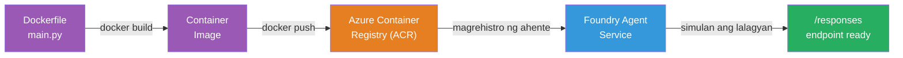
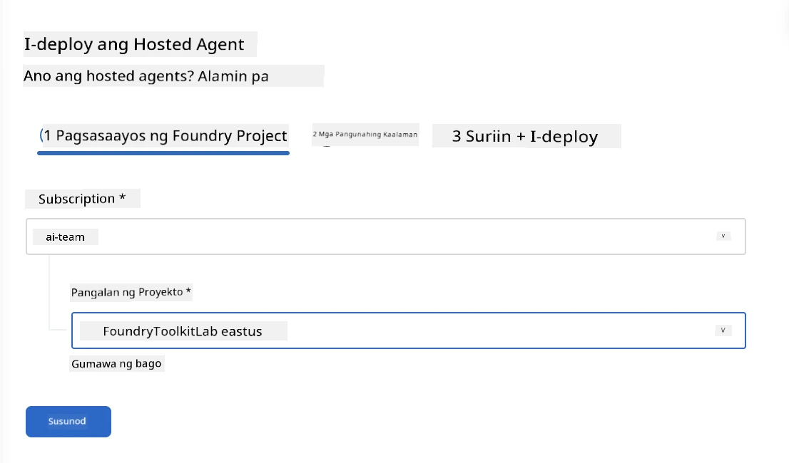
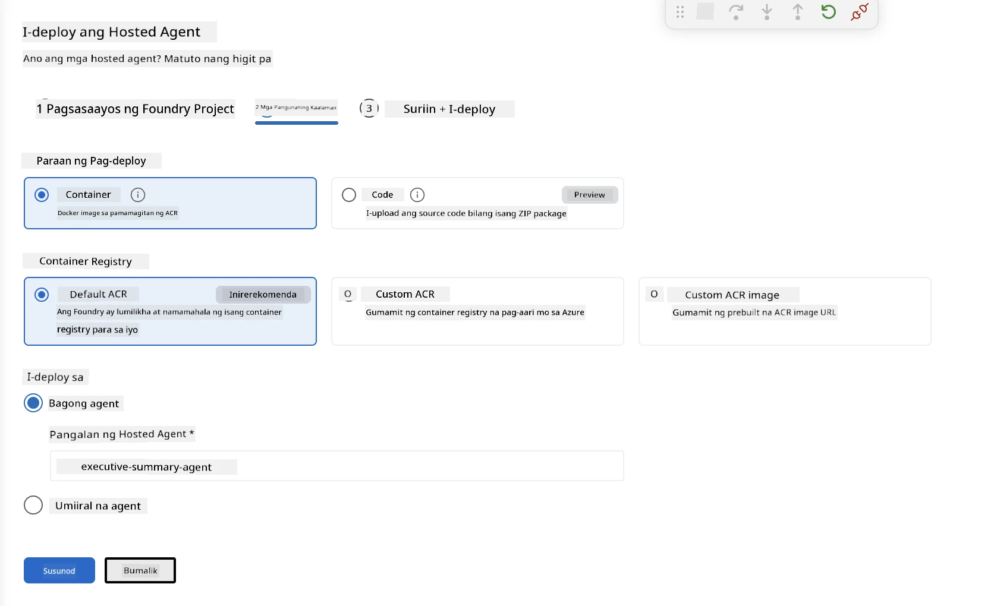
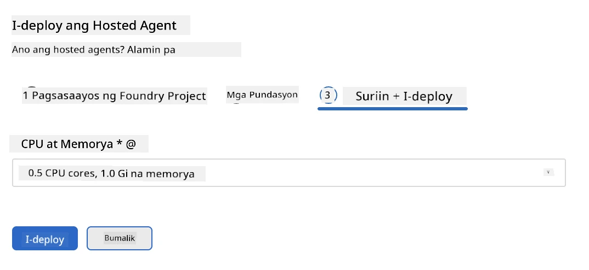
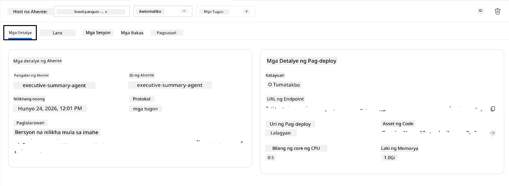

# Module 5 - I-deploy sa Foundry Agent Service

⏱️ ~10 minuto

> ⚠️ **Mga gumagamit ng Path B:** Nangangailangan ang module na ito ng subscription sa Foundry. Kung gumagamit ka ng Foundry Local, laktawan ang seksyon patungo sa [Module 07 - Buod](07-summary.md). Matagumpay mong natapos ang local development workflow!

Sa module na ito, ide-deploy mo ang iyong locally-tested na agent sa Microsoft Foundry bilang isang **Hosted Agent**. Ang deployment ay bumubuo ng container image, itinutulak ito sa Azure Container Registry, at sinisimulan ang agent sa managed infrastructure ng Foundry.

### Deployment pipeline

---

## Pagsusuri ng mga kinakailangan

Bago mag-deploy, tiyakin ang mga sumusunod:

- [ ] Nakapasa ang Agent sa lahat ng 3 lokal na senaryo mula sa [Module 04](04-test-locally.md)
- [ ] Mayroon kang **Azure AI User** na papel sa antas ng proyekto ([Module 01, Itakda ang RBAC](01-setup.md#deploy-a-model--assign-rbac))
- [ ] Nakal login ka sa Azure sa VS Code (Makikita ang iyong pangalan sa icon ng Accounts)

---

## Hakbang 1: Simulan ang deployment

### Opsyon A: Mag-deploy mula sa Agent Inspector (inirerekomenda)

Kung bukas ang Agent Inspector (mula sa testing):
1. I-click ang **Deploy** na button sa kanang itaas na sulok (icon ng ulap ↑).

### Opsyon B: Mag-deploy mula sa Command Palette

1. Pindutin ang `Ctrl+Shift+P` → **Foundry Toolkit: Deploy Hosted Agent**.

---

## Hakbang 2: I-configure ang deployment

Tatanungin ka ng wizard tungkol sa:

| Prompt | Pinili |
|--------|-----------|
| **Subscription** | Iyong Azure Subscription |
| **Target project** | Ang iyong Foundry project (hal. `workshop-agents`) |

I-click ang **next** para i-configure ang iyong agent.

| Prompt | Pinili |
|--------|-----------|
| **Deployment Method** | Container |
| **Container registry** | **Default ACR** (Nililikha at pinamamahalaan ito ng Microsoft Foundry para sa iyo) |
| **Deploy to** | Bagong Agent (pangalan, `executive-summary-agent`) |

I-click ang **next** upang suriin at ideploy ang iyong agent.

| Prompt | Pinili |
|--------|-----------|
| **CPU at memory** | **0.25 CPU cores, 0.5 Gi memory** (sapat para sa workshop) |

---

## Hakbang 3: I-deploy at subaybayan

1. I-click ang **Deploy**.
2. Bantayan ang **Output** panel (piliin ang **Microsoft Foundry** mula sa dropdown).
3. Dadaan ang deployment sa mga sumusunod na yugto:
   - **Docker build** - bumubuo ng container mula sa iyong Dockerfile
   - **Docker push** - itinutulak ang image sa ACR (1–3 minuto sa unang deployment)
   - **Agent registration** - nililikha ang hosted agent sa Foundry
   - **Container start** - sinisimulan gamit ang system-managed identity

4. Kapag tapos na, lalabas ang isang notification:
   > **matagumpay na na-deploy ang my-agent.** `View logs` `Run agent`

5. I-click ang **Run agent** upang buksan ang Agent Playground.

### Mga kahulugan ng status ng deployment

| Status | Kahulugan |
|--------|---------|
| **Running** | Handa na ang container, tumutugon ang agent |
| **Pending** | Nagsisimula ang container - maghintay ng 30–60 segundo |
| **Failed** | Suriin ang mga log (tingnan ang troubleshooting sa ibaba) |

---

## Mga karaniwang error sa deployment

| Error | Pinagmulan | Ayusin |
|-------|-----------|-----|
| `agents/write` permission denied | Wala ang **Azure AI User** na papel sa antas ng proyekto | [Module 01, Itakda ang RBAC](01-setup.md#deploy-a-model--assign-rbac) |
| Hindi tumatakbo ang Docker | Hindi nasimulan ang Docker Desktop | Simulan ang Docker Desktop → tiyakin ang `docker info` |
| ACR authorization | Hindi makakuha ang managed identity ng image | Tingnan ang [Module 08 - Troubleshooting](08-troubleshooting.md) |

---

### ✅ Checkpoint

- [ ] Natapos ang deployment nang walang error
- [ ] Lumilitaw ang Agent sa ilalim ng **Hosted Agents (Preview)** sa Foundry sidebar
- [ ] Ipinapakita ang status ng container na **Running**
- [ ] Nabuksan ang tab ng Agent Playground na nagpapakita ng detalye ng agent at endpoint URL

---

**Nauna:** [04 - Test Locally](04-test-locally.md) · **Susunod:** [06 - Verify in Playground →](06-verify-in-playground.md)

---

<!-- CO-OP TRANSLATOR DISCLAIMER START -->
**Pagtatanggi**:
Ang dokumentong ito ay isinalin gamit ang serbisyo ng AI translation na [Co-op Translator](https://github.com/Azure/co-op-translator). Bagama't nagsusumikap kami para sa katumpakan, pakatandaan na ang awtomatikong pagsasalin ay maaaring maglaman ng mga pagkakamali o hindi pagkakatugma. Ang orihinal na dokumento sa orihinal nitong wika ang dapat ituring na pangunahing sanggunian. Para sa mahahalagang impormasyon, inirerekomenda ang propesyonal na pagsasalin ng tao. Hindi kami mananagot sa anumang maling pagkakaintindi o maling interpretasyon na nagmula sa paggamit ng pagsasaling ito.
<!-- CO-OP TRANSLATOR DISCLAIMER END -->