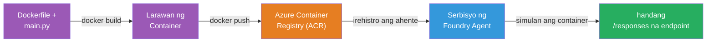
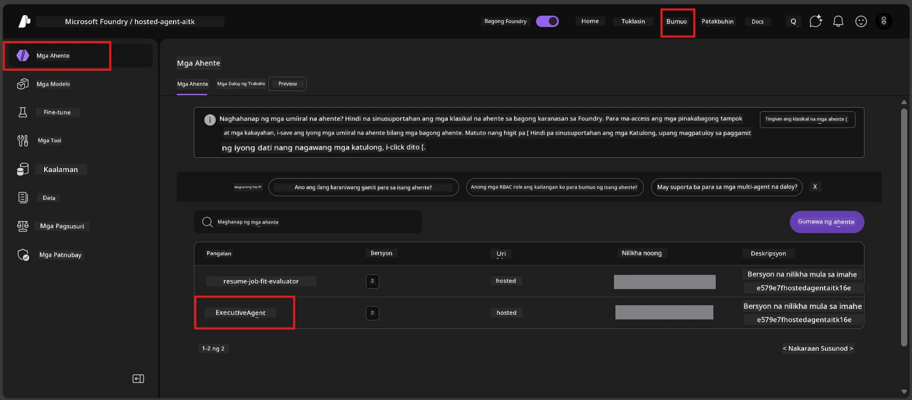

# Module 6 - I-deploy sa Foundry Agent Service

Sa modyul na ito, ide-deploy mo ang locally-tested mong agent sa Microsoft Foundry bilang isang [**Hosted Agent**](https://learn.microsoft.com/azure/foundry/agents/concepts/hosted-agents). Ang proseso ng deployment ay bumubuo ng isang Docker container image mula sa iyong proyekto, itinutulak ito sa [Azure Container Registry (ACR)](https://learn.microsoft.com/azure/container-registry/container-registry-intro), at lumilikha ng isang hosted agent version sa [Foundry Agent Service](https://learn.microsoft.com/azure/foundry/agents/overview).

### Deployment pipeline


---

## Pagsusuri ng mga kinakailangan

Bago mag-deploy, tiyakin ang lahat ng item sa ibaba. Ang pag-skip sa mga ito ang pinaka-karaniwang dahilan ng pagkabigo sa deployment.

1. **Pumasa ang agent sa lokal na smoke tests:**
   - Natapos mo ang lahat ng 4 na tests sa [Module 5](05-test-locally.md) at tama ang naging tugon ng agent.

2. **Mayroon kang [Azure AI User](https://learn.microsoft.com/azure/foundry/concepts/rbac-foundry#built-in-roles) role:**
   - Naibigay ito sa [Module 2, Hakbang 3](02-create-foundry-project.md). Kung hindi ka sigurado, i-verify ngayon:
   - Azure Portal → iyong Foundry **project** resource → **Access control (IAM)** → tab na **Role assignments** → hanapin ang iyong pangalan → kumpirmahin na nakalista ang **Azure AI User**.

3. **Nakalog-in ka sa Azure sa VS Code:**
   - Tingnan ang Accounts icon sa kaliwang ibaba ng VS Code. Dapat nakikita ang pangalan ng iyong account.

4. **(Opsyonal) Naka-run ang Docker Desktop:**
   - Kailangan lang ang Docker kung hihilingin ng Foundry extension ng local build. Sa karamihan ng kaso, awtomatikong hinahandle ng extension ang mga container build habang nagdedeploy.
   - Kung naka-install ang Docker, i-verify kung ito ay tumatakbo: `docker info`

---

## Hakbang 1: Simulan ang deployment

May dalawang paraan para mag-deploy - pareho ang magiging resulta.

### Opsyon A: I-deploy mula sa Agent Inspector (inirerekomenda)

Kung pinapatakbo mo ang agent gamit ang debugger (F5) at bukas ang Agent Inspector:

1. Tingnan ang **kanang itaas na sulok** ng Agent Inspector panel.
2. I-click ang **Deploy** button (cloud icon na may pataas na arrow ↑).
3. Magbubukas ang deployment wizard.

### Opsyon B: I-deploy mula sa Command Palette

1. Pindutin ang `Ctrl+Shift+P` para buksan ang **Command Palette**.
2. I-type: **Microsoft Foundry: Deploy Hosted Agent** at piliin ito.
3. Magbubukas ang deployment wizard.

---

## Hakbang 2: I-configure ang deployment

Gababalikan ka ng deployment wizard sa configuration. Sagutin ang bawat prompt:

### 2.1 Piliin ang target na proyekto

1. May dropdown na nagpapakita ng iyong Foundry projects.
2. Piliin ang proyektong nilikha mo sa Module 2 (hal., `workshop-agents`).

### 2.2 Piliin ang container agent file

1. Hihingin kang pumili ng entry point ng agent.
2. Piliin ang **`main.py`** (Python) - ito ang file na ginagamit ng wizard para kilalanin ang iyong agent project.

### 2.3 I-configure ang mga resources

| Setting | Inirerekomendang halaga | Tala |
|---------|--------------------------|-------|
| **CPU** | `0.25` | Default, sapat para sa workshop. Dagdagan para sa production workloads |
| **Memory** | `0.5Gi` | Default, sapat para sa workshop |

Tugma ito sa mga halaga sa `agent.yaml`. Maaari mong tanggapin ang mga default.

---

## Hakbang 3: Kumpirmahin at i-deploy

1. Ipinapakita ng wizard ang deployment summary kasama ang:
   - Pangalan ng target project
   - Pangalan ng agent (mula sa `agent.yaml`)
   - Container file at mga resources
2. Suriin ang summary at i-click ang **Confirm and Deploy** (o **Deploy**).
3. Bantayan ang progreso sa VS Code.

### Ano ang nangyayari habang nagdedeploy (hakbang-hakbang)

Ang deployment ay isang multi-step na proseso. Bantayang mabuti ang VS Code **Output** panel (pumili ng "Microsoft Foundry" mula sa dropdown):

1. **Docker build** - Binubuo ng VS Code ang Docker container image mula sa iyong `Dockerfile`. Makikita mo ang mga mensahe ng Docker layer:
   ```
   Step 1/6 : FROM python:<version>-slim
   Step 2/6 : WORKDIR /app
   ...
   Successfully built abc123def456
   ```

2. **Docker push** - Itinutulak ang image sa **Azure Container Registry (ACR)** na konektado sa iyong Foundry project. Maaaring tumagal ito ng 1-3 minuto sa unang deployment (ang base image ay >100MB).

3. **Agent registration** - Lumilikha ang Foundry Agent Service ng bagong hosted agent (o bagong version kung mayroon nang agent). Ginagamit ang metadata ng agent mula sa `agent.yaml`.

4. **Container start** - Nagsisimula ang container sa managed infrastructure ng Foundry. Nagbibigay ang platform ng [system-managed identity](https://learn.microsoft.com/azure/foundry/agents/concepts/agent-identity) at inilalantad ang `/responses` endpoint.

> **Mas mabagal ang unang deployment** (kailangang itulak ng Docker ang lahat ng layers). Mas mabilis ang mga sumunod na deployment dahil nag-cache ang Docker ng walang nabagong layers.

---

## Hakbang 4: Kumpirmahin ang status ng deployment

Pagkatapos makumpleto ang deployment command:

1. Buksan ang **Microsoft Foundry** sidebar sa pamamagitan ng pag-click sa Foundry icon sa Activity Bar.
2. Palawakin ang seksyong **Hosted Agents (Preview)** sa ilalim ng iyong proyekto.
3. Dapat makita mo ang pangalan ng iyong agent (hal., `ExecutiveAgent` o ang pangalan mula sa `agent.yaml`).
4. **I-click ang pangalan ng agent** upang palawakin ito.
5. Makikita mo ang isa o higit pang mga **version** (hal., `v1`).
6. I-click ang version para makita ang **Container Details**.
7. Suriin ang field na **Status**:

   | Status | Kahulugan |
   |--------|-----------|
   | **Started** o **Running** | Nakatakbo ang container at handa na ang agent |
   | **Pending** | Nagsisimula pa ang container (hintayin ng 30-60 segundo) |
   | **Failed** | Nabigo ang container na magsimula (tingnan ang logs - tingnan ang troubleshooting sa ibaba) |



> **Kung "Pending" ng higit sa 2 minuto:** Maaaring nagda-download pa ang container ng base image. Maghintay ng kaunti pa. Kung nananatiling pending, suriin ang container logs.

---

## Mga karaniwang error sa deployment at solusyon

### Error 1: Permission denied - `agents/write`

```
Error: lacks the required data action 
Microsoft.CognitiveServices/accounts/AIServices/agents/write 
to perform POST /api/projects/{projectName}/assistants operation.
```

**Pangunahing sanhi:** Wala kang `Azure AI User` role sa **level ng project**.

**Hakbang-hakbang na solusyon:**

1. Buksan ang [https://portal.azure.com](https://portal.azure.com).
2. Sa search bar, i-type ang pangalan ng iyong Foundry **project** at i-click ito.
   - **Mahalaga:** Siguraduhing pumunta ka sa **project** resource (uri: "Microsoft Foundry project"), HINDI sa parent account/hub resource.
3. Sa kaliwang navigation, i-click ang **Access control (IAM)**.
4. I-click ang **+ Add** → **Add role assignment**.
5. Sa tab na **Role**, hanapin ang [**Azure AI User**](https://learn.microsoft.com/azure/foundry/concepts/rbac-foundry#built-in-roles) at piliin ito. I-click ang **Next**.
6. Sa tab na **Members**, piliin ang **User, group, or service principal**.
7. I-click ang **+ Select members**, hanapin ang iyong pangalan/email, piliin ang iyong sarili, i-click ang **Select**.
8. I-click ang **Review + assign** → muli **Review + assign**.
9. Maghintay ng 1-2 minuto para mapasa ang role assignment.
10. **Ulitin ang deployment** mula sa Hakbang 1.

> Dapat ang role ay nasa **project** scope, hindi lang sa account scope. Ito ang #1 pinaka-karaniwang sanhi ng pagkabigo sa deployment.

### Error 2: Docker hindi tumatakbo

```
Error: Docker build failed / Cannot connect to Docker daemon
```

**Solusyon:**
1. Simulan ang Docker Desktop (hanapin ito sa Start menu o system tray).
2. Maghintay hanggang lumabas ang "Docker Desktop is running" (30-60 segundo).
3. I-verify: `docker info` sa terminal.
4. **Para sa Windows:** Siguraduhing naka-enable ang WSL 2 backend sa Docker Desktop settings → **General** → **Use the WSL 2 based engine**.
5. Subukang muli ang deployment.

### Error 3: ACR authorization - `AcrPullUnauthorized`

```
Error: AcrPullUnauthorized
```

**Pangunahing sanhi:** Walang pull access sa container registry ang managed identity ng Foundry project.

**Solusyon:**
1. Sa Azure Portal, pumunta sa iyong **[Container Registry](https://learn.microsoft.com/azure/container-registry/container-registry-intro)** (nasa parehong resource group bilang Foundry project).
2. Pumunta sa **Access control (IAM)** → **Add** → **Add role assignment**.
3. Piliin ang role na **[AcrPull](https://learn.microsoft.com/azure/container-registry/container-registry-roles)**.
4. Sa ilalim ng Members, piliin ang **Managed identity** → hanapin ang managed identity ng Foundry project.
5. **Review + assign**.

> Kadalsang naisasagawa ito nang awtomatiko ng Foundry extension. Kung lumabas ang error na ito, maaaring nabigo ang awtomatikong setup.

### Error 4: Container platform mismatch (Apple Silicon)

Kung nagde-deploy mula sa Apple Silicon Mac (M1/M2/M3), dapat itayo ang container para sa `linux/amd64`:

```bash
docker build --platform linux/amd64 -t myagent:v1 .
```

> Awtomatikong hinahandle ito ng Foundry extension para sa karamihan ng mga user.

---

### Checkpoint

- [ ] Natapos ang deployment command nang walang error sa VS Code
- [ ] Lumabas ang agent sa ilalim ng **Hosted Agents (Preview)** sa Foundry sidebar
- [ ] Na-click mo ang agent → pinili ang version → nakita ang **Container Details**
- [ ] Ang status ng container ay nagpapakita ng **Started** o **Running**
- [ ] (Kung may errors) Natukoy mo ang error, naayos, at matagumpay na na-deploy ulit

---

**Nakaraan:** [05 - Test Locally](05-test-locally.md) · **Susunod:** [07 - Verify in Playground →](07-verify-in-playground.md)

---

<!-- CO-OP TRANSLATOR DISCLAIMER START -->
**Pagtatangi**:  
Ang dokumentong ito ay isinalin gamit ang serbisyong AI translation na [Co-op Translator](https://github.com/Azure/co-op-translator). Bagaman nagsusumikap kaming maging tumpak, pakatandaan na ang mga awtomatikong pagsasalin ay maaaring maglaman ng mga pagkakamali o di-katumpakan. Ang orihinal na dokumento sa orihinal nitong wika ang dapat ituring na pangunahing sanggunian. Para sa mga mahahalagang impormasyon, inirerekomenda ang propesyonal na pagsasaling tao. Hindi kami mananagot sa anumang hindi pagkakaunawaan o maling interpretasyon na magmumula sa paggamit ng pagsasaling ito.
<!-- CO-OP TRANSLATOR DISCLAIMER END -->