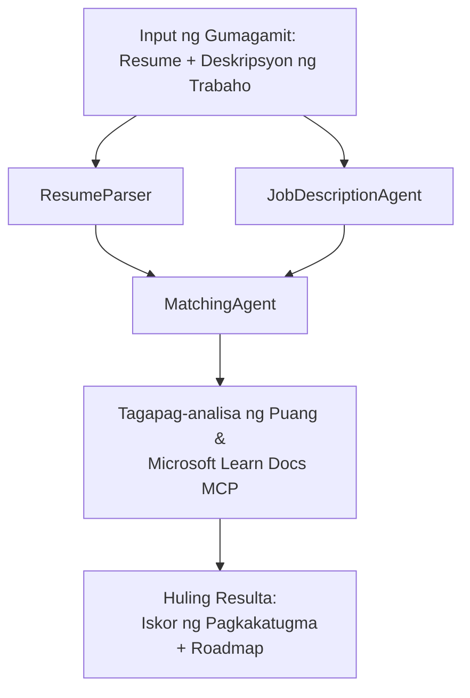

# PersonalCareerCopilot - Resume → Tagapagsuri ng Pagkakatugma sa Trabaho

Isang multi-agent na workflow na sumusuri kung gaano kahusay ang pagkakatugma ng isang resume sa isang deskripsyon ng trabaho, tapos ay gumagawa ng isang personalisadong roadmap sa pag-aaral para punan ang mga kakulangan.

---

## Mga Ahente

| Ahente | Papel | Mga Kagamitan |
|-------|------|-------|
| **ResumeParser** | Kumukuha ng nakaayos na kasanayan, karanasan, sertipikasyon mula sa teksto ng resume | - |
| **JobDescriptionAgent** | Kumukuha ng kinakailangan/preperensiyal na kasanayan, karanasan, sertipikasyon mula sa isang JD | - |
| **MatchingAgent** | Inihahambing ang profile laban sa mga kinakailangan → puntos ng pagkakatugma (0-100) + mga tumugma/hindi tumugmang kasanayan | - |
| **GapAnalyzer** | Gumagawa ng personalisadong roadmap sa pag-aaral gamit ang mga resource mula sa Microsoft Learn | `search_microsoft_learn_for_plan` (MCP) |

## Workflow


---

## Mabilisang pagsisimula

### 1. I-set up ang kapaligiran

```powershell
cd workshop\lab02-multi-agent\PersonalCareerCopilot
python -m venv .venv
.\.venv\Scripts\Activate.ps1          # Windows PowerShell
# source .venv/bin/activate            # macOS / Linux
pip install -r requirements.txt
```

### 2. I-configure ang mga kredensyal

Kopyahin ang halimbawa ng env file at punan ang mga detalye ng iyong Foundry project:

```powershell
cp .env.example .env
```

I-edit ang `.env`:

```env
PROJECT_ENDPOINT=https://<your-account>.services.ai.azure.com/api/projects/<your-project>
MODEL_DEPLOYMENT_NAME=gpt-4.1-mini
```

| Halaga | Saan ito mahahanap |
|-------|-----------------|
| `PROJECT_ENDPOINT` | Microsoft Foundry sidebar sa VS Code → i-right click ang iyong proyekto → **Copy Project Endpoint** |
| `MODEL_DEPLOYMENT_NAME` | Foundry sidebar → palawakin ang proyekto → **Models + endpoints** → pangalan ng deployment |

### 3. Patakbuhin nang lokal

```powershell
python -m debugpy --listen 127.0.0.1:5679 -m agentdev run main.py --verbose --port 8088
```

O gamitin ang VS Code task: `Ctrl+Shift+P` → **Tasks: Run Task** → **Run Lab02 HTTP Server**.

### 4. Subukan gamit ang Agent Inspector

Buksan ang Agent Inspector: `Ctrl+Shift+P` → **Foundry Toolkit: Open Agent Inspector**.

Idikit ang test prompt na ito:

```
Resume:
Jane Doe
Senior Software Engineer with 5 years of experience in Python, Django, and AWS.
Built microservices handling 10K+ requests/second. Led a team of 4 developers.
Certifications: AWS Solutions Architect Associate.
Education: B.S. Computer Science, State University.

Job Description:
Senior Cloud Engineer at Contoso Ltd.
Required: Python, Azure, Kubernetes, Terraform, CI/CD pipelines.
Preferred: Go, monitoring (Prometheus/Grafana), cost optimization.
Experience: 5+ years in cloud infrastructure.
Certifications: Azure Solutions Architect Expert preferred.
```

**Inaasahan:** Isang puntos ng pagkakatugma (0-100), mga tumugma/hindi tumugmang kasanayan, at isang personalisadong roadmap sa pag-aaral gamit ang mga URL ng Microsoft Learn.

### 5. I-deploy sa Foundry

`Ctrl+Shift+P` → **Microsoft Foundry: Deploy Hosted Agent** → piliin ang iyong proyekto → kumpirmahin.

---

## Istruktura ng proyekto

```
PersonalCareerCopilot/
├── .env.example        ← Template for environment variables
├── .env                ← Your credentials (git-ignored)
├── agent.yaml          ← Hosted agent definition (name, resources, env vars)
├── Dockerfile          ← Container image for Foundry deployment
├── main.py             ← 4-agent workflow (instructions, MCP tool, WorkflowBuilder)
└── requirements.txt    ← Python dependencies
```

## Mga Pangunahing file

### `agent.yaml`

Nagpapakahulugan ng hosted na ahente para sa Foundry Agent Service:
- `kind: hosted` - tumatakbo bilang isang managed container
- `protocols: [responses v1]` - nagpapakita ng `/responses` HTTP endpoint
- `environment_variables` - `PROJECT_ENDPOINT` at `MODEL_DEPLOYMENT_NAME` ay ini-inject sa oras ng deployment

### `main.py`

Nagtataglay ng:
- **Mga tagubilin para sa ahente** - apat na `*_INSTRUCTIONS` constant, isa para sa bawat ahente
- **MCP na kagamitan** - `search_microsoft_learn_for_plan()` tumatawag sa `https://learn.microsoft.com/api/mcp` gamit ang Streamable HTTP
- **Paglikha ng ahente** - `create_agents()` context manager gamit ang `AzureAIAgentClient.as_agent()`
- **Workflow graph** - `create_workflow()` gumagamit ng `WorkflowBuilder` para i-wire ang mga ahente na may fan-out/fan-in/sequential na pattern
- **Pagsisimula ng server** - `from_agent_framework(agent).run_async()` sa port 8088

### `requirements.txt`

| Package | Bersyon | Layunin |
|---------|---------|---------|
| `agent-framework-azure-ai` | `1.0.0rc3` | Integrasyon ng Azure AI para sa Microsoft Agent Framework |
| `agent-framework-core` | `1.0.0rc3` | Core runtime (kasama ang WorkflowBuilder) |
| `azure-ai-agentserver-agentframework` | `1.0.0b16` | Hosted agent server runtime |
| `azure-ai-agentserver-core` | `1.0.0b16` | Core agent server abstractions |
| `debugpy` | pinakabago | Python debugging (F5 sa VS Code) |
| `agent-dev-cli` | `--pre` | Lokal na dev CLI + backend ng Agent Inspector |

---

## Paglutas ng Problema

| Isyu | Ayusin |
|-------|-----|
| `RuntimeError: Missing required environment variable(s)` | Gumawa ng `.env` na may `PROJECT_ENDPOINT` at `MODEL_DEPLOYMENT_NAME` |
| `ModuleNotFoundError: No module named 'agent_framework'` | I-activate ang venv at patakbuhin ang `pip install -r requirements.txt` |
| Walang Microsoft Learn URLs sa output | Suriin ang koneksyon sa internet sa `https://learn.microsoft.com/api/mcp` |
| Isa lang ang gap card (naputol) | Siguraduhing kasama sa `GAP_ANALYZER_INSTRUCTIONS` ang `CRITICAL:` na block |
| Port 8088 ay ginagamit na | Patayin ang ibang server: `netstat -ano \| findstr :8088` |

Para sa mas detalyadong paglutas ng problema, tingnan ang [Module 8 - Troubleshooting](../docs/08-troubleshooting.md).

---

**Kompletong walkthrough:** [Lab 02 Docs](../docs/README.md) · **Bumalik sa:** [Lab 02 README](../README.md) · [Workshop Home](../../../README.md)

---

<!-- CO-OP TRANSLATOR DISCLAIMER START -->
**Paunawa**:  
Ang dokumentong ito ay isinalin gamit ang serbisyong AI na pagsasalin na [Co-op Translator](https://github.com/Azure/co-op-translator). Bagamat aming nilalayon ang katumpakan, pakatandaan na ang mga awtomatikong pagsasalin ay maaaring maglaman ng mga error o kamalian. Ang orihinal na dokumento sa kanyang sariling wika ang dapat ituring na pangunahing pinagkukunan. Para sa mahahalagang impormasyon, inirerekomenda ang propesyonal na pagsasaling pang-tao. Hindi kami mananagot sa anumang hindi pagkakaintindihan o maling interpretasyon na maaaring magmula sa paggamit ng pagsasaling ito.
<!-- CO-OP TRANSLATOR DISCLAIMER END -->