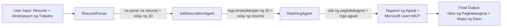

# PersonalCareerCopilot - Pagsusuri ng Resume → Pagtutugma sa Trabaho

Isang app na multi-agent na nakatuon sa workflow na sumusuri kung gaano kahusay tugma ang isang resume sa deskripsyon ng trabaho, pagkatapos ay bumubuo ng isang personal na plano sa pag-aaral upang punan ang mga kakulangan.

---

## Mga Ahente

| Ahente | Papel | Mga Kasangkapan |
|-------|------|-------|
| **ResumeParser** | Kumukuha ng istrukturadong mga kasanayan, karanasan, sertipikasyon mula sa teksto ng resume | - |
| **JobDescriptionAgent** | Kumukuha ng kinakailangan/ginustong mga kasanayan, karanasan, sertipikasyon mula sa JD | - |
| **MatchingAgent** | Inihahambing ang profile vs mga kinakailangan → iskor ng pagtutugma (0-100) + mga kasanayang tugma/hindi pa mayroon | - |
| **GapAnalyzer** | Gumagawa ng personal na roadmap ng pag-aaral gamit ang mga resource ng Microsoft Learn | `search_microsoft_learn_for_plan` (MCP) |

## Daloy ng Trabaho


```mermaid
flowchart LR
    UserInput["User Input: Resume + Deskripsyon ng Trabaho"] --> ResumeParser
    ResumeParser -- "na-parse na resume + relay ng JD" --> JobDescriptionAgent
    JobDescriptionAgent -- "mga kinakailangan ng JD + relay ng resume" --> MatchingAgent
    MatchingAgent -- "ulat ng pagkakatugma + mga agwat" --> GapAnalyzerMCP["Tagasuri ng Agwat +\nMicrosoft Learn MCP"]
    GapAnalyzerMCP --> FinalOutput["Final Output:\nIskor ng Pagkakatugma + Mapa ng Daan"]
```

---

## Mabilisang simula

### 1. Ihanda ang kapaligiran

Ang folder na ito ay ang reference na implementasyon para sa workflow-based Lab 02 scaffold. Ang `main.py` nito ay gumagamit ng umiiral na mga prompt block kasama ang `WorkflowBuilder` upang pagdugtungin ang apat na ahente.

```powershell
cd workshop\lab02-multi-agent\PersonalCareerCopilot
python -m venv .venv
.\.venv\Scripts\Activate.ps1          # Windows PowerShell
# source .venv/bin/activate            # macOS / Linux
pip install -r requirements.txt
```

### 2. Isaayos ang mga kredensyal

Gumawa ng `.env` file sa folder na ito:

```powershell
copy .env .env.bak 2>$null; echo $null > .env
```

I-edit ang `.env`:

```env
FOUNDRY_PROJECT_ENDPOINT=https://<your-account>.services.ai.azure.com/api/projects/<your-project>
AZURE_AI_MODEL_DEPLOYMENT_NAME=gpt-4.1-mini
```

| Halaga | Saan Makikita |
|-------|------------------|
| `FOUNDRY_PROJECT_ENDPOINT` | Sidebar ng Foundry Toolkit → i-right click ang iyong proyekto → **Kopyahin ang Project Endpoint** |
| `AZURE_AI_MODEL_DEPLOYMENT_NAME` | Sidebar ng Foundry → palawakin ang proyekto → **Mga Modelo + mga endpoint** → pangalan ng deployment |

### 3. Patakbuhin nang lokal

```powershell
python -m debugpy --listen 127.0.0.1:5679 main.py --port 8088
```

O gamitin ang VS Code task: `Ctrl+Shift+P` → **Tasks: Run Task** → **Patakbuhin ang Agent HTTP Server**.

Para sa F5 debugging, gamitin ang **Debug Local Agent HTTP Server**.

### 4. Subukan gamit ang Agent Inspector

Buksan ang Agent Inspector: `Ctrl+Shift+P` → **Foundry Toolkit: Buksan ang Agent Inspector**.

Idikit ang test prompt na ito:

```
Resume:
Jane Doe
Senior Software Engineer with 5 years of experience in Python, Django, and AWS.
Built microservices handling 10K+ requests/second. Led a team of 4 developers.
Certifications: AWS Solutions Architect Associate.
Education: B.S. Computer Science, State University.

Job Description:
Senior Cloud Engineer at Contoso Ltd.
Required: Python, Azure, Kubernetes, Terraform, CI/CD pipelines.
Preferred: Go, monitoring (Prometheus/Grafana), cost optimization.
Experience: 5+ years in cloud infrastructure.
Certifications: Azure Solutions Architect Expert preferred.
```

**Inaasahan:** Isang iskor ng pagtutugma (0-100), mga kasanayang tugma/hindi pa mayroon, at isang personal na roadmap sa pag-aaral kasama ang mga URL ng Microsoft Learn.

### 5. I-deploy sa Foundry

`Ctrl+Shift+P` → **Foundry Toolkit: I-deploy ang Hosted Agent** → piliin ang iyong proyekto → kumpirmahin.

---

## Estruktura ng proyekto

```
PersonalCareerCopilot/
├── .env                ← Your credentials (git-ignored)
├── agent.yaml          ← Hosted agent definition (name, resources, env vars)
├── Dockerfile          ← Container image for Foundry deployment
├── main.py             ← 4-agent workflow (instructions, MCP tool, WorkflowBuilder)
└── requirements.txt    ← Python dependencies
```

## Pangunahing mga file

### `agent.yaml`

Nagpapakahulugan ng hosted agent para sa Foundry Agent Service:
- `kind: hosted` - tumatakbo bilang isang pinamamahalaang container
- `protocols` - `responses` protocol na may `version: 1.0.0`, na naglalantad ng `/responses` HTTP endpoint
- `environment_variables` - idineklara dito ang `AZURE_AI_MODEL_DEPLOYMENT_NAME`; awtomatiko namang ini-inject ang `FOUNDRY_PROJECT_ENDPOINT` sa oras ng pag-deploy

### `main.py`

Naglalaman ng:
- **Mga tagubilin para sa Ahente** - apat na `*_INSTRUCTIONS` constants, isa para sa bawat ahente
- **MCP tool** - `search_microsoft_learn_for_plan()` tumatawag sa `https://learn.microsoft.com/api/mcp` gamit ang Streamable HTTP
- **Paglikha ng Ahente** - apat na `Agent()` + `AgentExecutor()` instances na gumagamit ng isang `FoundryChatClient`
- **Workflow graph** - `WorkflowBuilder` na pinagdugtong-dugtong ang mga ahente bilang isang sunod-sunod na pipeline: ResumeParser → JD Agent → MatchingAgent → GapAnalyzer
- **Pagsisimula ng server** - `ResponsesHostServer` ay tumatakbo sa port 8088

### `requirements.txt`

| Package | Layunin |
|---------|----------|
| `agent-framework-foundry` | Core runtime: `Agent`, `AgentExecutor`, `WorkflowBuilder`, `@tool`, `FoundryChatClient` |
| `agent-framework-foundry-hosting` | `ResponsesHostServer` + integrasyon sa Foundry hosting |
| `mcp<2,>=1.24.0` | MCP client para sa GapAnalyzer (`streamable_http_client`) |
| `debugpy` | Python debugging (F5 sa VS Code) |

---

## Pag-aayos ng mga problema

| Isyu | Ayusin |
|-------|-----|
| `KeyError: 'FOUNDRY_PROJECT_ENDPOINT'` o `KeyError: 'AZURE_AI_MODEL_DEPLOYMENT_NAME'` | Gumawa ng `.env` na may parehong `FOUNDRY_PROJECT_ENDPOINT` at `AZURE_AI_MODEL_DEPLOYMENT_NAME` na naka-set |
| `ModuleNotFoundError: No module named 'agent_framework'` | I-activate ang venv at patakbuhin ang `pip install -r requirements.txt` |
| Walang Microsoft Learn URLs sa output | Suriin ang koneksyon sa internet papuntang `https://learn.microsoft.com/api/mcp` |
| Isa lamang ang gap card (putol) | Tiyaking kasama sa `GAP_ANALYZER_INSTRUCTIONS` ang `CRITICAL:` block |
| Ang Port 8088 ay ginagamit na | Itigil ang ibang server: `netstat -ano \| findstr :8088` |

Para sa mas detalyadong paglutas ng problema, tingnan ang [Module 8 - Troubleshooting](../docs/08-troubleshooting.md).

---

**Kompletong walkthrough:** [Lab 02 Docs](../docs/README.md) · **Bumalik sa:** [Lab 02 README](../README.md) · [Tahanan ng Workshop](../../../README.md)

---

<!-- CO-OP TRANSLATOR DISCLAIMER START -->
**Pagtatanggi**:
Ang dokumentong ito ay isinalin gamit ang serbisyo ng AI translation na [Co-op Translator](https://github.com/Azure/co-op-translator). Bagama't nagsusumikap kami para sa katumpakan, pakatandaan na ang awtomatikong pagsasalin ay maaaring maglaman ng mga pagkakamali o hindi pagkakatugma. Ang orihinal na dokumento sa orihinal nitong wika ang dapat ituring na pangunahing sanggunian. Para sa mahahalagang impormasyon, inirerekomenda ang propesyonal na pagsasalin ng tao. Hindi kami mananagot sa anumang maling pagkakaintindi o maling interpretasyon na nagmula sa paggamit ng pagsasaling ito.
<!-- CO-OP TRANSLATOR DISCLAIMER END -->