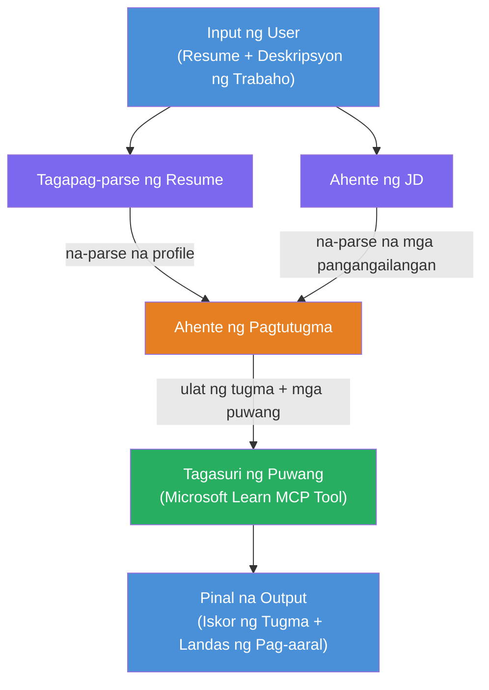

# Lab 02 - Multi-Agent Workflow: Resume → Job Fit Evaluator

---

## Ano ang iyong bubuuin

Isang **Resume → Job Fit Evaluator** - isang multi-agent workflow kung saan apat na espesyalistang ahente ang nagtutulungan upang suriin kung gaano kahusay tumutugma ang resume ng kandidato sa isang paglalarawan ng trabaho, at pagkatapos ay lumikha ng isang personalisadong learning roadmap para punan ang mga kakulangan.

### Ang mga ahente

| Ahente | Papel |
|--------|-------|
| **Resume Parser** | Kumuha ng istrukturadong kasanayan, karanasan, at sertipikasyon mula sa teksto ng resume |
| **Job Description Agent** | Kumuha ng kinakailangang/preperadong kasanayan, karanasan, at sertipikasyon mula sa isang JD |
| **Matching Agent** | Ihambing ang profile vs mga kinakailangan → fit score (0-100) + mga tumutugma/hindi nararapat na kasanayan |
| **Gap Analyzer** | Gumawa ng personalisadong learning roadmap na may mga resources, timeline, at mabilisang proyekto |

### Daloy ng Demo

Mag-upload ng **resume + paglalarawan ng trabaho** → makakuha ng **fit score + mga kulang na kasanayan** → tumanggap ng **personalized learning roadmap**.

### Arkitektura ng Workflow

> Purple = mga ahenteng gumagana nang sabay-sabay | Orange = punto ng pagsasama-sama | Green = panghuling ahente na may mga kasangkapan. Tingnan ang [Module 1 - Understand the Architecture](docs/01-understand-multi-agent.md) at [Module 4 - Orchestration Patterns](docs/04-orchestration-patterns.md) para sa detalyadong mga diagram at daloy ng datos.

### Mga paksang tinalakay

- Paggawa ng multi-agent workflow gamit ang **WorkflowBuilder**
- Pagpapakahulugan ng mga papel ng ahente at daloy ng orchestration (sabayan + sunod-sunod)
- Mga pattern ng komunikasyon sa pagitan ng mga ahente
- Lokal na pagsubok gamit ang Agent Inspector
- Pag-deploy ng multi-agent workflows sa Foundry Agent Service

---

## Mga Kinakailangan

Tapusin muna ang Lab 01:

- [Lab 01 - Single Agent](../lab01-single-agent/README.md)

---

## Pagsisimula

Tingnan ang buong mga tagubilin sa setup, walkthrough ng code, at mga test command sa:

- [Lab 2 Docs - Prerequisites](docs/00-prerequisites.md)
- [Lab 2 Docs - Full Learning Path](docs/README.md)
- [PersonalCareerCopilot run guide](PersonalCareerCopilot/README.md)

## Mga pattern ng orchestration (mga ahenteng alternatibo)

Kasama sa Lab 2 ang default na **parallel → aggregator → planner** na daloy, at inilalarawan din sa mga docs ang mga alternatibong pattern upang ipakita ang mas matibay na pag-uugali ng ahente:

- **Fan-out/Fan-in na may weighted consensus**
- **Reviewer/critic na pasada bago ang panghuling roadmap**
- **Conditional router** (pagpili ng landas base sa fit score at mga kulang na kasanayan)

Tingnan ang [docs/04-orchestration-patterns.md](docs/04-orchestration-patterns.md).

---

**Nakaraan:** [Lab 01 - Single Agent](../lab01-single-agent/README.md) · **Bumalik sa:** [Workshop Home](../../README.md)

---

<!-- CO-OP TRANSLATOR DISCLAIMER START -->
**Pagtatanggol**:  
Ang dokumentong ito ay isinalin gamit ang AI translation service na [Co-op Translator](https://github.com/Azure/co-op-translator). Bagamat nagsusumikap kami para sa katumpakan, pakatandaan na ang mga awtomatikong pagsasalin ay maaaring maglaman ng mga pagkakamali o kamalian. Ang orihinal na dokumento sa kanyang katutubong wika ang dapat ituring na opisyal na sanggunian. Para sa mga kritikal na impormasyon, inirerekomenda ang propesyonal na pagsasaling-tao. Hindi kami mananagot sa anumang hindi pagkakaunawaan o maling interpretasyon na nagmumula sa paggamit ng salin na ito.
<!-- CO-OP TRANSLATOR DISCLAIMER END -->