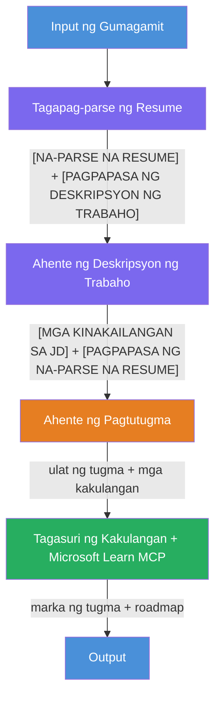

# Lab 02 - Multi-Agent Workflow: Resume → Job Fit Evaluator

## Pangkalahatang-ideya

Sa hands-on na lab na ito, gagawa ka ng isang **workflow-first multi-agent app** gamit ang Foundry Toolkit sa VS Code at i-deploy ito sa Microsoft Foundry Agent Service.

**Ang iyong gagawin:** isang Resume → Job Fit Evaluator na sumusuri sa resume at job description, nagbibigay ng score sa pagkakatugma, at gumagawa ng isang personalized na learning roadmap gamit ang mga Microsoft Learn resources.

---

## Arkitektura

```mermaid
flowchart TD
    A["Input ng Gumagamit"] --> B["Tagapag-parse ng Resume"]
    B -->|"[NA-PARSE NA RESUME] + [PAGPAPASA NG DESKRIPSYON NG TRABAHO]"| C["Ahente ng Deskripsyon ng Trabaho"]
    C -->|"[MGA KINAKAILANGAN SA JD] + [PAGPAPASA NG NA-PARSE NA RESUME]"| D["Ahente ng Pagtutugma"]
    D -->|ulat ng tugma + mga kakulangan| E["Tagasuri ng Kakulangan + Microsoft Learn MCP"]
    E -->|marka ng tugma + roadmap| F["Output"]

    style A fill:#4A90D9,color:#fff
    style B fill:#7B68EE,color:#fff
    style C fill:#7B68EE,color:#fff
    style D fill:#E67E22,color:#fff
    style E fill:#27AE60,color:#fff
    style F fill:#4A90D9,color:#fff
```

**Paano ito gumagana:**
1. Nag-paste ang user ng isang resume at job description.
2. Ang **ResumeParser** ay sumusuri sa resume at kinokopya ang JD nang eksakto sa isang `[JOB DESCRIPTION PASS-THROUGH]` na seksyon.
3. Kinukuha ng **JD Agent** ang mga nakaayos na pangangailangan mula sa pass-through, pagkatapos ay ipinapasa ang `[PARSED RESUME]` bilang `[PARSED RESUME PASS-THROUGH]`.
4. Inihahambing ng **MatchingAgent** ang `[PARSED RESUME PASS-THROUGH]` laban sa `[JD REQUIREMENTS]` at nagbibigay ng fit score.
5. Ginagawa ng **GapAnalyzer** ang mga puwang sa isang praktikal na roadmap at kumukuha ng tunay na mga link ng Microsoft Learn sa pamamagitan ng MCP.

---

## Mga Kinakailangan

Tapusin muna ang Lab 01:

- [Lab 01 - Single Agent](../lab01-single-agent/README.md)

---

## Bahagi 1: Basahin ang mga module sa tamang pagkakasunod-sunod

Tingnan ang buong learning path sa:

- [Lab 2 Docs - Mga Kinakailangan](docs/00-prerequisites.md)
- [Lab 2 Docs - Buong Learning Path](docs/README.md)
- [PersonalCareerCopilot run guide](PersonalCareerCopilot/README.md)

---

## Bahagi 2: Gawin at subukan ang workflow

1. Gamitin ang Foundry Toolkit wizard upang simulan ang workflow-based na proyekto.
2. Kopyahin ang prompt blocks at workflow graph mula sa `PersonalCareerCopilot/main.py` papunta sa iyong workspace.
3. Patakbuhin ito nang lokal gamit ang Agent Inspector at siguruhing gumagana ang apat na agents kasama ang MCP tool.
4. I-deploy ang hosted agent sa Foundry kapag pumasa ang lokal na pagsusuri.

---

## Mga pattern ng orkestrasyon

Kasama sa Lab 02 ang default na **fan-out → fan-in → sequential** na daloy, at tinatalakay din ng docs ang mga alternatibong pattern ng orkestrasyon para sa eksperimentasyon.

- **Fan-out/Fan-in na may weighted consensus**
- **Reviewer/critic pass bago ang pinal na roadmap**
- **Conditional router** base sa fit score at mga nawawalang kakayahan

Tingnan ang [docs/04-orchestration-patterns.md](docs/04-orchestration-patterns.md).

---

**Nakaraan:** [Lab 01 - Single Agent](../lab01-single-agent/README.md) · **Bumalik sa:** [Workshop Home](../../README.md)

---

<!-- CO-OP TRANSLATOR DISCLAIMER START -->
**Pagtatanggi**:
Ang dokumentong ito ay isinalin gamit ang serbisyo ng AI translation na [Co-op Translator](https://github.com/Azure/co-op-translator). Bagama't nagsusumikap kami para sa katumpakan, pakatandaan na ang awtomatikong pagsasalin ay maaaring maglaman ng mga pagkakamali o hindi pagkakatugma. Ang orihinal na dokumento sa orihinal nitong wika ang dapat ituring na pangunahing sanggunian. Para sa mahahalagang impormasyon, inirerekomenda ang propesyonal na pagsasalin ng tao. Hindi kami mananagot sa anumang maling pagkakaintindi o maling interpretasyon na nagmula sa paggamit ng pagsasaling ito.
<!-- CO-OP TRANSLATOR DISCLAIMER END -->