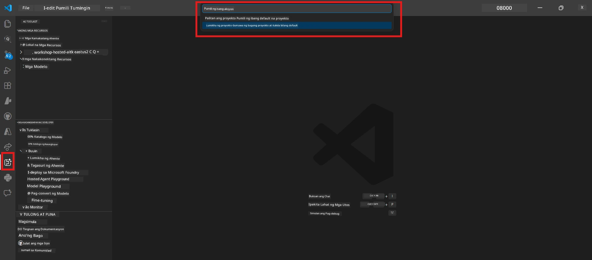

# Module 0 - Mga Kinakailangan

Bago simulan ang Lab 02, tiyakin na natapos mo na ang mga sumusunod. Direktang nakabase ang lab na ito sa Lab 01 - huwag itong laktawan.

---

## 1. Tapusin ang Lab 01

Ina-assume ng Lab 02 na natapos mo na ang:

- [x] Natapos lahat ng 8 modules ng [Lab 01 - Single Agent](../../lab01-single-agent/README.md)
- [x] Matagumpay na na-deploy ang isang agent sa Foundry Agent Service
- [x] Napatunayan na gumagana ang agent sa lokal na Agent Inspector at Foundry Playground

Kung hindi mo pa natatapos ang Lab 01, bumalik at tapusin ito ngayon: [Lab 01 Docs](../../lab01-single-agent/docs/00-prerequisites.md)

---

## 2. Siguraduhin ang kasalukuyang setup

Dapat pa ring naka-install at gumagana lahat ng tools mula sa Lab 01. Patakbuhin ang mabilis na mga tseke na ito:

### 2.1 Azure CLI

```powershell
az account show --query "{name:name, id:id}" --output table
```

Inaasahan: Ipinapakita ang pangalan at ID ng iyong subscription. Kung hindi ito gumana, patakbuhin ang [`az login`](https://learn.microsoft.com/cli/azure/authenticate-azure-cli-interactively).

### 2.2 Mga extension ng VS Code

1. Pindutin ang `Ctrl+Shift+P` → i-type ang **"Microsoft Foundry"** → tiyaking makikita mo ang mga command (hal., `Microsoft Foundry: Create a New Hosted Agent`).
2. Pindutin ang `Ctrl+Shift+P` → i-type ang **"Foundry Toolkit"** → tiyaking makikita mo ang mga command (hal., `Foundry Toolkit: Open Agent Inspector`).

### 2.3 Foundry project at modelo

1. I-click ang icon na **Microsoft Foundry** sa VS Code Activity Bar.
2. Tiyaking nakalista ang iyong proyekto (hal., `workshop-agents`).
3. I-expand ang proyekto → siguraduhing may deployed na modelo (hal., `gpt-4.1-mini`) na may status na **Succeeded**.

> **Kung nag-expire ang deployment ng iyong modelo:** Ang ilang libreng tier na deployment ay awtomatikong nag-e-expire. I-deploy muli mula sa [Model Catalog](https://learn.microsoft.com/azure/foundry/foundry-models/concepts/models-sold-directly-by-azure) (`Ctrl+Shift+P` → **Microsoft Foundry: Open Model Catalog**).



### 2.4 Mga RBAC role

Tiyaking mayroon kang **Azure AI User** sa iyong Foundry project:

1. [Azure Portal](https://portal.azure.com) → iyong Foundry **project** resource → **Access control (IAM)** → tab na **[Role assignments](https://learn.microsoft.com/azure/foundry/concepts/rbac-foundry)**.
2. Hanapin ang iyong pangalan → tiyaking nakalista ang **[Azure AI User](https://aka.ms/foundry-ext-project-role)**.

---

## 3. Unawain ang mga konsepto ng multi-agent (bago sa Lab 02)

Nagpapakilala ang Lab 02 ng mga konsepto na hindi natalakay sa Lab 01. Basahin ito bago magpatuloy:

### 3.1 Ano ang multi-agent workflow?

Sa halip na isang agent lamang ang humawak sa lahat, ang **multi-agent workflow** ay naghahati ng trabaho sa maraming espesyalisadong agent. Ang bawat agent ay may:

- Sariling **mga tagubilin** (system prompt)
- Sariling **gawain** (ang tungkulin nito)
- Opsyonal na **mga tool** (mga function na maaaring tawagin)

Nag-uusap ang mga agent sa pamamagitan ng isang **orchestration graph** na naglalarawan kung paano umaagos ang data sa pagitan nila.

### 3.2 WorkflowBuilder

Ang [`WorkflowBuilder`](https://learn.microsoft.com/agent-framework/workflows/agents-in-workflows) class mula sa `agent_framework` ay ang SDK component na nag-uugnay sa mga agent:

```python
from agent_framework import WorkflowBuilder

workflow = (
    WorkflowBuilder(
        name="MyWorkflow",
        start_executor=agent_a,
        output_executors=[agent_d],
    )
    .add_edge(agent_a, agent_b)
    .add_edge(agent_a, agent_c)
    .add_edge(agent_b, agent_d)
    .add_edge(agent_c, agent_d)
    .build()
)
```

- **`start_executor`** - Ang unang agent na tumatanggap ng input mula sa user
- **`output_executors`** - Ang agent(s) na ang output ay nagiging panghuling tugon
- **`add_edge(source, target)`** - Nagtatakda na ang `target` ay tumatanggap ng output mula sa `source`

### 3.3 Mga MCP (Model Context Protocol) na tool

Gumagamit ang Lab 02 ng isang **MCP tool** na tumatawag sa Microsoft Learn API upang kumuha ng mga learning resources. Ang [MCP (Model Context Protocol)](https://modelcontextprotocol.io/introduction) ay isang standardized na protocol para ikonekta ang mga AI model sa mga panlabas na pinagkukunan ng data at mga tool.

| Term | Kahulugan |
|------|-----------|
| **MCP server** | Isang serbisyo na nag-eexpose ng mga tool/resources sa pamamagitan ng [MCP protocol](https://learn.microsoft.com/azure/foundry/agents/how-to/tools/model-context-protocol) |
| **MCP client** | Ang iyong agent code na kumokonekta sa MCP server at tumatawag ng mga tool nito |
| **[Streamable HTTP](https://learn.microsoft.com/agent-framework/agents/tools/hosted-mcp-tools)** | Ang pamamaraan ng transport na ginagamit para makipag-ugnayan sa MCP server |

### 3.4 Paano naiiba ang Lab 02 sa Lab 01

| Aspeto | Lab 01 (Single Agent) | Lab 02 (Multi-Agent) |
|--------|----------------------|---------------------|
| Mga Agent | 1 | 4 (may espesyalisadong gawain) |
| Orchestration | Wala | WorkflowBuilder (parallel + magkakasunod) |
| Mga Tool | Opsyonal na `@tool` function | MCP tool (panlabas na tawag sa API) |
| Komplikado | Simple na prompt → tugon | Resume + JD → fit score → roadmap |
| Daloy ng konteksto | Direktang daloy | Handoff mula agent sa agent |

---

## 4. Istruktura ng repositoryo ng workshop para sa Lab 02

Siguraduhing alam mo kung saan matatagpuan ang mga file ng Lab 02:

```
workshop/
└── lab02-multi-agent/
    ├── README.md                       ← Lab overview
    ├── docs/                           ← You are here
    │   ├── README.md                   ← Learning path index
    │   ├── 00-prerequisites.md         ← This file
    │   ├── 01-understand-multi-agent.md
    │   ├── ...
    │   └── 08-troubleshooting.md
    └── PersonalCareerCopilot/          ← The agent project
        ├── agent.yaml                  ← Agent definition
        ├── main.py                     ← 4-agent workflow code
        ├── Dockerfile                  ← Container configuration
        └── requirements.txt            ← Python dependencies
```

---

### Checkpoint

- [ ] Natapos nang buo ang Lab 01 (lahat ng 8 module, na-deploy at napatunayan ang agent)
- [ ] Nagbabalik ang `az account show` ng iyong subscription
- [ ] Naka-install at gumagana ang mga Microsoft Foundry at Foundry Toolkit extension
- [ ] May deployed na modelo ang Foundry project (hal., `gpt-4.1-mini`)
- [ ] Mayroon kang **Azure AI User** role sa proyekto
- [ ] Nabasa mo na ang seksyon tungkol sa mga konsepto ng multi-agent sa itaas at naintindihan ang WorkflowBuilder, MCP, at agent orchestration

---

**Susunod:** [01 - Unawain ang Multi-Agent Architecture →](01-understand-multi-agent.md)

---

<!-- CO-OP TRANSLATOR DISCLAIMER START -->
**Disclaimer**:
Ang dokumentong ito ay isinalin gamit ang serbisyo ng AI translation na [Co-op Translator](https://github.com/Azure/co-op-translator). Bagamat aming pinagsisikapan ang katumpakan, mangyaring tandaan na ang mga awtomatikong pagsasalin ay maaaring naglalaman ng mga pagkakamali o maling interpretasyon. Ang orihinal na dokumento sa kanyang sariling wika ang dapat ituring na pangunahing sanggunian. Para sa mahahalagang impormasyon, inirerekomenda ang propesyonal na pagsasaling-tao. Hindi kami mananagot sa anumang hindi pagkakaunawaan o maling interpretasyon na maaaring magmula sa paggamit ng pagsasaling ito.
<!-- CO-OP TRANSLATOR DISCLAIMER END -->