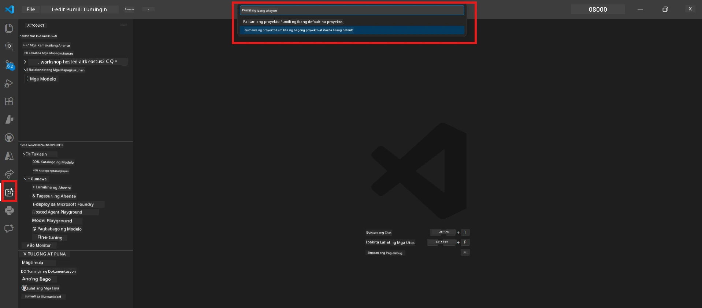

# Module 0 - Panimula

⏱️ ~10 min

> [!WARNING]
> **Preview at Mga Limitasyon:** Ang [Hosted Agents](https://learn.microsoft.com/azure/foundry/agents/concepts/hosted-agents) ay kasalukuyang nasa **pampublikong preview** - hindi inirerekomenda para sa mga production workloads. Ang ilang mga tampok na ipinakita sa workshop na ito ay maaaring magbago habang papalapit ang serbisyo sa GA.

## Ano ang iyong bubuuin

Sa lab na ito, pinalalawak mo ang mga kasanayan ng single-agent mula sa Lab 01 upang bumuo ng **multi-agent workflow** - ang Resume → Job Fit Evaluator.

Ipipaste mo ang isang **resume** at isang **job description**. Apat na specialized na mga ahente ang sunud-sunod na ipoproseso ang input, pagkatapos ay magbabalik ng:
- Isang fit score (0–100 na may breakdown ng scoring)
- Isang listahan ng skill at certification gap
- Isang personalized na roadmap ng pag-aaral na may mga totoong link mula sa Microsoft Learn para sa bawat gap

**Ginagamit ng workflow:**
- **Microsoft Agent Framework** - `WorkflowBuilder` para sa sunud-sunod na pag-orchestrate ng pipeline
- **Foundry Toolkit para sa VS Code** - scaffold, test nang lokal, deploy
- **Isang AI model** (hal., `gpt-4.1-mini`) - ginagamit ng lahat ng apat na ahente
- **Microsoft Learn MCP server** - nagbibigay ng totoong mga learning resource link para sa bawat skill gap

---

## Piliin ang iyong landas

> ⚠️ **Ipagpatuloy gamit ang parehong landas na ginamit mo sa Lab 01.**

<details open>
<summary><strong>🅰️ Landas A - Azure cloud (kailangan ang Azure subscription)</strong></summary>

| | Detalye |
|---|---|
| **Para kanino ito?** | Natapos mo ang Lab 01 gamit ang Azure subscription |
| **Model** | Azure OpenAI via Foundry (hal., `gpt-4.1-mini`) |
| **Mga module na sakop** | Lahat ng module (00–09) |
| **Magde-deploy sa cloud?** | ✅ Oo - buong end-to-end deployment |

</details>

<details open>
<summary><strong>🅱️ Landas B - Foundry Local (hindi kailangan ang Azure subscription)</strong></summary>

| | Detalye |
|---|---|
| **Para kanino ito?** | Natapos mo ang Lab 01 gamit ang Foundry Local |
| **Model** | Foundry Local (libre, tumatakbo sa iyong makina) |
| **Mga module na sakop** | Mga module 00–05 (laktawan ang 06–07 - deploy at cloud verify) |
| **Magde-deploy sa cloud?** | ❌ Hindi - lokal na pagsubok lang gamit ang Agent Inspector |

</details>

---

## Pag-check ng Lab 01

Diretso na itinatayo ng Lab 02 ang Lab 01. Tapusin muna ang Lab 01 bago magsimula dito.

Hindi pa nagawa ang Lab 01? Magsimula dito: [Lab 01 - Panimula](../../lab01-single-agent/docs/00-prerequisites.md)

<details open>
<summary><strong>🅰️ Landas A - Azure cloud</strong></summary>

```powershell
az account show --query "{name:name, id:id}" --output table
```

Kung hiwalay ito, patakbuhin ang `az login`. Tapos tiyakin sa VS Code:

1. `Ctrl+Shift+P` → i-type ang **Foundry Toolkit** → kumpirmahin na lumalabas ang mga utos.
2. I-click ang icon ng **Foundry Toolkit** → lumalabas ang iyong proyekto at deployed na modelo na may **Succeeded**.



> **RBAC:** Inassign mo ang **Foundry User** sa Lab 01. Kung kailangan mo itong i-reassign, tingnan ang [Lab 01, Module 1](../../lab01-single-agent/docs/01-setup.md#deploy-a-model--assign-rbac). Dati itong tinawag na **Azure AI User** - parehas ang mga permiso.

</details>

<details open>
<summary><strong>🅱️ Landas B - Foundry Local</strong></summary>

```powershell
Invoke-WebRequest -Uri "http://localhost:5273/v1/health" -UseBasicParsing | Select-Object StatusCode
```

Inaasahan: `StatusCode: 200`. Kung hindi, i-restart ang Foundry Local mula sa Foundry Toolkit sidebar.

> Lahat ng inference ay tumatakbo sa iyong makina. Ang iisang outbound call lang ay ang MCP tool papunta sa `https://learn.microsoft.com/api/mcp`.

</details>

---

## Ano ang bago sa Lab 02

| | Lab 01 | Lab 02 |
|--|--------|--------|
| Mga ahente | 1 | 4 (naka-chain gamit ang WorkflowBuilder) |
| Scaffold template | Basic - Agent Framework | Workflows - Agent Framework |
| Bagong package | - | `mcp` |
| Orchestration | Isang conversational agent | Sunud-sunod na pipeline (WorkflowBuilder) |
| Bagong tool | - | `search_microsoft_learn_for_plan` (MCP) |

---

**Susunod:** [01 - Unawain ang Arkitektura →](01-understand-multi-agent.md)

---

<!-- CO-OP TRANSLATOR DISCLAIMER START -->
**Pagtatanggi**:
Ang dokumentong ito ay isinalin gamit ang serbisyo ng AI translation na [Co-op Translator](https://github.com/Azure/co-op-translator). Bagama't nagsusumikap kami para sa katumpakan, pakatandaan na ang awtomatikong pagsasalin ay maaaring maglaman ng mga pagkakamali o hindi pagkakatugma. Ang orihinal na dokumento sa orihinal nitong wika ang dapat ituring na pangunahing sanggunian. Para sa mahahalagang impormasyon, inirerekomenda ang propesyonal na pagsasalin ng tao. Hindi kami mananagot sa anumang maling pagkakaintindi o maling interpretasyon na nagmula sa paggamit ng pagsasaling ito.
<!-- CO-OP TRANSLATOR DISCLAIMER END -->