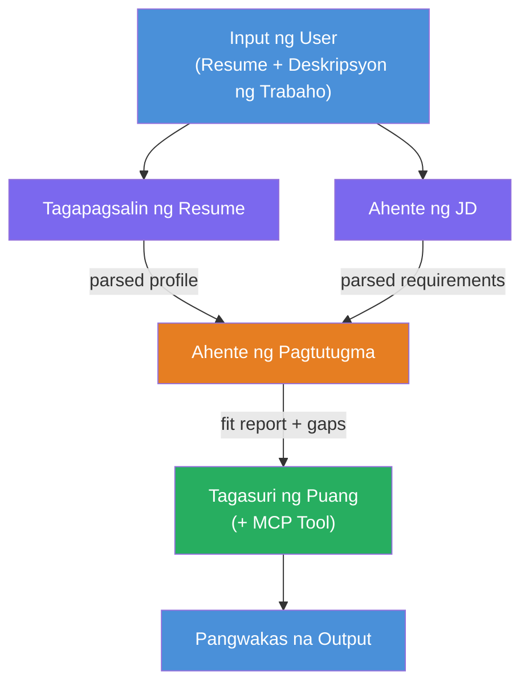
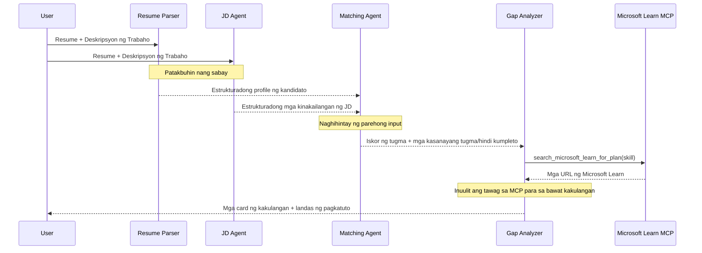
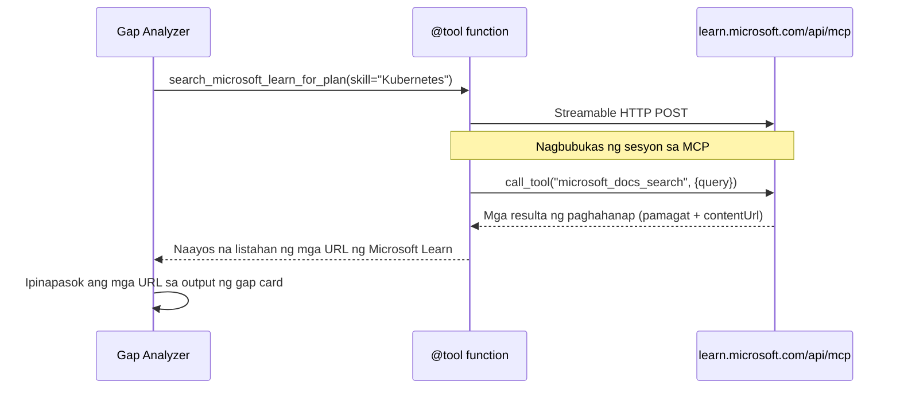

# Module 1 - Unawain ang Multi-Agent Architecture

Sa module na ito, malalaman mo ang arkitektura ng Resume → Job Fit Evaluator bago ka magsulat ng anumang code. Ang pag-unawa sa orchestration graph, mga tungkulin ng mga ahente, at daloy ng data ay kritikal para sa debugging at pagpapalawak ng [multi-agent workflows](https://learn.microsoft.com/azure/architecture/ai-ml/idea/multiple-agent-workflow-automation).

---

## Ang problemang nilulutas nito

Ang pagtutugma ng resume sa isang job description ay nangangailangan ng maraming magkakaibang kasanayan:

1. **Parsing** - Kunin ang estrukturadong data mula sa hindi estrukturadong teksto (resume)
2. **Analysis** - Kunin ang mga kinakailangan mula sa isang job description
3. **Comparison** - I-score ang pag-align ng dalawa
4. **Planning** - Bumuo ng learning roadmap upang punan ang mga kakulangan

Ang isang solong ahente na gumagawa ng apat na gawain sa isang prompt ay kadalasang nagreresulta sa:
- Hindi kumpletong pagkuha (nilalakad nito ng mabilis ang parsing upang makuha ang score)
- Mababaw na scoring (walang ebidensyang pag-aanalisa)
- Pangkalahatang roadmaps (hindi nakatuon sa partikular na mga kakulangan)

Sa pamamagitan ng paghahati sa **apat na espesyal na ahente**, bawat isa ay nakatuon sa kanyang gawain gamit ang dedikadong mga tagubilin, na nagreresulta ng mas mataas na kalidad na output sa bawat yugto.

---

## Ang apat na ahente

Ang bawat ahente ay isang buong [Microsoft Foundry](https://learn.microsoft.com/azure/foundry/agents/concepts/hosted-agents) agent na nilikha gamit ang `AzureAIAgentClient.as_agent()`. Pareho silang gumagamit ng parehong model deployment ngunit may magkakaibang tagubilin at (opsyonal) iba't ibang mga tools.

| # | Pangalan ng Ahente | Tungkulin | Input | Output |
|---|--------------------|-----------|-------|--------|
| 1 | **ResumeParser** | Kinukuha ang estrukturadong profile mula sa teksto ng resume | Raw na teksto ng resume (mula sa user) | Profile ng Kandidato, Teknikal na Kasanayan, Soft Skills, Sertipikasyon, Karanasang Domain, Mga Nagawa |
| 2 | **JobDescriptionAgent** | Kinukuha ang estrukturadong mga kinakailangan mula sa isang JD | Raw na teksto ng JD (mula sa user, ipinapasa mula sa ResumeParser) | Pangkalahatang Impormasyon ng Role, Mga Kinakailangang Kasanayan, Mga Inirerekomendang Kasanayan, Karanasan, Sertipikasyon, Edukasyon, Mga Responsibilidad |
| 3 | **MatchingAgent** | Kinakalkula ang ebidensyang-based na fit score | Mga output mula sa ResumeParser + JobDescriptionAgent | Fit Score (0-100 na may breakdown), Mga Tugmang Kasanayan, Kulang na Kasanayan, Mga Gap |
| 4 | **GapAnalyzer** | Gumagawa ng personalisadong learning roadmap | Output mula sa MatchingAgent | Mga gap card (bawat kasanayan), Learning Order, Timeline, Mga Resource mula sa Microsoft Learn |

---

## Ang orchestration graph

Ang workflow ay gumagamit ng **parallel fan-out** na sinusundan ng **sequential aggregation**:


> **Legend:** Purple = parallel na mga ahente, Orange = puntong pagsasama, Green = huling ahente na may mga tools

### Kung paano dumadaloy ang data


1. **Nagpapadala ang user** ng mensahe na naglalaman ng resume at job description.
2. **ResumeParser** tumatanggap ng buong input mula sa user at kinukuha ang estrukturadong profile ng kandidato.
3. **JobDescriptionAgent** tumatanggap ng input mula sa user nang sabay at kinukuha ang estrukturadong mga kinakailangan.
4. **MatchingAgent** tumatanggap ng mga output mula sa **parehong** ResumeParser at JobDescriptionAgent (hinihintay ng framework ang dalawang ito bago patakbuhin ang MatchingAgent).
5. **GapAnalyzer** tumatanggap ng output mula sa MatchingAgent at tinatawagan ang **Microsoft Learn MCP tool** para kumuha ng tunay na learning resources para sa bawat gap.
6. Ang **huling output** ay ang tugon mula sa GapAnalyzer, na naglalaman ng fit score, mga gap card, at kumpletong learning roadmap.

### Bakit mahalaga ang parallel fan-out

Ang ResumeParser at JobDescriptionAgent ay tumatakbo **nang sabay** dahil walang umaasa sa isa't isa. Ito ay:
- Nakakabawas ng kabuuang latency (pareho silang tumatakbo nang sabay imbes na magkakasunod)
- Isang natural na paghihiwalay (independyenteng mga gawain ang parsing ng resume at parsing ng JD)
- Nagpapakita ng isang karaniwang pattern ng multi-agent: **fan-out → aggregate → act**

---

## WorkflowBuilder sa code

Ganito nagmamapa ang graph sa itaas sa mga [`WorkflowBuilder`](https://learn.microsoft.com/agent-framework/workflows/agents-in-workflows) na tawag ng API sa `main.py`:

```python
from agent_framework import WorkflowBuilder

workflow = (
    WorkflowBuilder(
        name="ResumeJobFitEvaluator",
        start_executor=resume_parser,       # Unang ahente na tumatanggap ng input mula sa gumagamit
        output_executors=[gap_analyzer],     # Huling ahente na ang output ang ibinabalik
    )
    .add_edge(resume_parser, jd_agent)      # ResumeParser → JobDescriptionAgent
    .add_edge(resume_parser, matching_agent) # ResumeParser → MatchingAgent
    .add_edge(jd_agent, matching_agent)      # JobDescriptionAgent → MatchingAgent
    .add_edge(matching_agent, gap_analyzer)  # MatchingAgent → GapAnalyzer
    .build()
)
```

**Pag-unawa sa mga edges:**

| Edge | Kahulugan |
|------|-----------|
| `resume_parser → jd_agent` | Tumatanggap ang JD Agent ng output mula sa ResumeParser |
| `resume_parser → matching_agent` | Tumatanggap ang MatchingAgent ng output mula sa ResumeParser |
| `jd_agent → matching_agent` | Tumatanggap din ang MatchingAgent ng output mula sa JD Agent (hinihintay ang parehong output) |
| `matching_agent → gap_analyzer` | Tumatanggap ang GapAnalyzer ng output mula sa MatchingAgent |

Dahil ang `matching_agent` ay may **dalawang papasok na edges** (`resume_parser` at `jd_agent`), awtomatikong hinihintay ng framework ang dalawang ito bago patakbuhin ang Matching Agent.

---

## Ang MCP tool

Ang GapAnalyzer na ahente ay may isang tool: `search_microsoft_learn_for_plan`. Ito ay isang **[MCP tool](https://learn.microsoft.com/agent-framework/agents/tools/hosted-mcp-tools)** na tumatawag sa Microsoft Learn API upang kumuha ng mga curated na learning resources.

### Paano ito gumagana

```python
@tool
async def search_microsoft_learn_for_plan(
    skill: str, role: str = "", max_results: int = 5
) -> str:
    """Search Microsoft Learn MCP and return curated official links."""
    # Kumokonekta sa https://learn.microsoft.com/api/mcp gamit ang Streamable HTTP
    # Tinatawag ang 'microsoft_docs_search' na tool sa MCP server
    # Nagbabalik ng naka-format na listahan ng mga URL ng Microsoft Learn
```

### Daloy ng tawag sa MCP


1. Nagpapasya ang GapAnalyzer na kailangan nito ng learning resources para sa isang kasanayan (hal., "Kubernetes")
2. Tumatawag ang framework ng `search_microsoft_learn_for_plan(skill="Kubernetes")`
3. Binubuksan ng function ang isang [Streamable HTTP](https://learn.microsoft.com/agent-framework/agents/tools/hosted-mcp-tools) na koneksyon sa `https://learn.microsoft.com/api/mcp`
4. Tinatawag nito ang `microsoft_docs_search` na tool sa [MCP server](https://learn.microsoft.com/azure/foundry/agents/how-to/tools/model-context-protocol)
5. Nagbabalik ang MCP server ng mga resulta ng paghahanap (pamagat + URL)
6. Inaayos ng function ang mga resulta at ibinabalik bilang string
7. Ginagamit ng GapAnalyzer ang mga ibinalik na URL sa output ng mga gap card nito

### Inaasahang MCP logs

Kapag tumatakbo ang tool, makikita mo ang mga log entries tulad ng:

```
GET https://learn.microsoft.com/api/mcp → 405 (Method Not Allowed)
POST https://learn.microsoft.com/api/mcp → 200
DELETE https://learn.microsoft.com/api/mcp → 405 (Method Not Allowed)
```

**Normal ito.** Ang MCP client ay nagsasagawa ng mga GET at DELETE na mga probe sa panahon ng initialization — inaasahan ang pagbabalik ng 405 dito. Ang aktwal na tawag ng tool ay POST at nagbabalik ng 200. Mag-alala ka lang kung mabigo ang POST calls.

---

## Pattern ng paglikha ng ahente

Ang bawat ahente ay nilikha gamit ang **[`AzureAIAgentClient.as_agent()`](https://learn.microsoft.com/python/api/overview/azure/ai-agents-readme) na async context manager**. Ito ang Foundry SDK pattern para makalikha ng mga ahente na awtomatikong nililinis:

```python
async with (
    get_credential() as credential,
    AzureAIAgentClient(
        project_endpoint=PROJECT_ENDPOINT,
        model_deployment_name=MODEL_DEPLOYMENT_NAME,
        credential=credential,
    ).as_agent(
        name="ResumeParser",
        instructions=RESUME_PARSER_INSTRUCTIONS,
    ) as resume_parser,
    # ... ulitin para sa bawat ahente ...
):
    # Lahat ng 4 na ahente ay nandito
    workflow = create_workflow(resume_parser, jd_agent, matching_agent, gap_analyzer)
```

**Mga mahahalagang punto:**
- Bawat ahente ay nakakakuha ng sarili nitong `AzureAIAgentClient` na instance (nangangailangan ang SDK na ang pangalan ng ahente ay nakapaloob sa client)
- Lahat ng mga ahente ay gumagamit ng parehong `credential`, `PROJECT_ENDPOINT`, at `MODEL_DEPLOYMENT_NAME`
- Sinisigurado ng `async with` block na malilinis ang lahat ng ahente kapag nagsara ang server
- Dagdag pa, tumatanggap ang GapAnalyzer ng `tools=[search_microsoft_learn_for_plan]`

---

## Pagsisimula ng server

Pagkatapos malikha ang mga ahente at mabuo ang workflow, nagsisimula ang server:

```python
from azure.ai.agentserver.agentframework import from_agent_framework

agent = create_workflow(resume_parser, jd_agent, matching_agent, gap_analyzer)
await from_agent_framework(agent).run_async()
```

`from_agent_framework()` ay nag-wrap sa workflow bilang isang HTTP server na naglalathala ng `/responses` endpoint sa port 8088. Ito ang parehong pattern tulad ng Lab 01, ngunit ang "ahente" ay ngayon ang buong [workflow graph](https://learn.microsoft.com/agent-framework/workflows/as-agents).

---

### Checkpoint

- [ ] Naiintindihan mo ang 4-agent na arkitektura at ang tungkulin ng bawat ahente
- [ ] Kaya mong subaybayan ang daloy ng data: User → ResumeParser → (parallel) JD Agent + MatchingAgent → GapAnalyzer → Output
- [ ] Naiintindihan mo kung bakit hinihintay ng MatchingAgent ang parehong ResumeParser at JD Agent (dalawang papasok na edges)
- [ ] Naiintindihan mo ang MCP tool: ano ang ginagawa nito, paano ito tinatawag, at normal lamang ang mga GET 405 logs
- [ ] Naiintindihan mo ang `AzureAIAgentClient.as_agent()` pattern at kung bakit may sariling client instance ang bawat ahente
- [ ] Kaya mong basahin ang `WorkflowBuilder` code at i-map ito sa visual na graph

---

**Nakaraan:** [00 - Prerequisites](00-prerequisites.md) · **Susunod:** [02 - Scaffold the Multi-Agent Project →](02-scaffold-multi-agent.md)

---

<!-- CO-OP TRANSLATOR DISCLAIMER START -->
**Paunawa**:  
Ang dokumentong ito ay isinalin gamit ang AI translation service na [Co-op Translator](https://github.com/Azure/co-op-translator). Bagamat nagsusumikap kami para sa katumpakan, pakatandaan na ang mga automated na pagsasalin ay maaaring maglaman ng mga pagkakamali o mali. Ang orihinal na dokumento sa kanyang katutubong wika ang dapat ituring na pinagkakatiwalaang sanggunian. Para sa mahahalagang impormasyon, inirerekomenda ang propesyonal na pagsasalin ng tao. Hindi kami mananagot sa anumang hindi pagkakaintindihan o maling interpretasyon na maaaring magmula sa paggamit ng pagsasaling ito.
<!-- CO-OP TRANSLATOR DISCLAIMER END -->