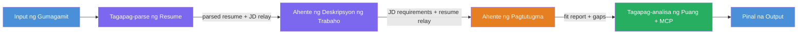

# Module 1 - Unawain ang Arkitektura

⏱️ ~5 min

Bago magsulat ng kahit anong code, narito ang mabilisang pangkalahatang-ideya ng iyong binubuo at kung paano ito gumagana.

---

## Ang iyong binubuo

Ipipaste mo ang isang **resume** at isang **deskripsyon ng trabaho**. Ang workflow ay magbabalik ng:

- Isang fit score (0–100 na may breakdown)
- Isang listahan ng mga kakulangan sa kasanayan at sertipikasyon
- Isang personalized na learning roadmap na may mga link mula sa Microsoft Learn para sa bawat kakulangan

---

## Ang apat na ahente

Ang isang ahente na sumusubok na mag-parse, mag-score, at magplano nang sabay-sabay ay madalas magmadali at magbigay ng mababaw na output. Ang paghahati ng trabaho sa apat na espesyal na ahente ay nagbibigay ng mas magagandang resulta:

| Ahente | Ano ang ginagawa nito |
|-------|-------------|
| **ResumeParser** | Nagpa-parse ng resume; kinokopya ang JD verbatim sa `[JOB DESCRIPTION PASS-THROUGH]` para sa mga downstream agent |
| **JobDescriptionAgent** | Kinukuha ang mga requirement ng JD mula sa pass-through; ipinapasa ang `[PARSED RESUME]` pasulong bilang `[PARSED RESUME PASS-THROUGH]` |
| **MatchingAgent** | Inihahambing ang parehong labeled na seksyon; gumagawa ng 0–100 fit score at listahan ng gap |
| **GapAnalyzer** | Gumagawa ng learning roadmap; naghahanap sa Microsoft Learn para sa bawat gap |

---

## Ang orchestration graph

Ang workflow ay isang **sequential pipeline** - bawat ahente ay ipinapasa ang output sa susunod:


```mermaid
flowchart LR
    A["Input ng Gumagamit"] --> B["Tagapag-parse ng Resume"]
    B -- "parsed resume + JD relay" --> C["Ahente ng Deskripsyon ng Trabaho"]
    C -- "JD requirements + resume relay" --> D["Ahente ng Pagtutugma"]
    D -- "fit report + gaps" --> E["Tagapag-analisa ng Puang + MCP"]
    E --> F["Pinal na Output"]

    style A fill:#4A90D9,color:#fff
    style B fill:#7B68EE,color:#fff
    style C fill:#7B68EE,color:#fff
    style D fill:#E67E22,color:#fff
    style E fill:#27AE60,color:#fff
    style F fill:#4A90D9,color:#fff
```

1. Tinatanggap ng **ResumeParser** ang input ng user, ini-parse ang resume, at kinokopya ang JD sa `[JOB DESCRIPTION PASS-THROUGH]`.
2. Kinukuha ng **JD Agent** ang mga structured na requirement at ipinapasa ang `[PARSED RESUME PASS-THROUGH]` pasulong.
3. Inihahambing ng **MatchingAgent** ang parehong seksyon at gumagawa ng fit score at listahan ng gap.
4. Gumagawa ang **GapAnalyzer** ng roadmap at tinatawagan ang Microsoft Learn MCP tool para sa bawat gap.

---

## Paano ito naipapakita sa code

Sa `main.py`, inilalarawan mo ang graph na ito gamit ang `WorkflowBuilder`:

```python
workflow_agent = (
    WorkflowBuilder(
        start_executor=resume_executor,       # unang ahente na tumatanggap ng input mula sa user
        output_executors=[gap_executor],      # huling ahente - ang output nito ang sagot
    )
    .add_edge(resume_executor, jd_executor)       # ResumeParser → Ahenteng JD
    .add_edge(jd_executor, matching_executor)     # Ahenteng JD → MatchingAgent
    .add_edge(matching_executor, gap_executor)    # MatchingAgent → GapAnalyzer
    .build()
    .as_agent()
)
```

Ang bawat `Agent` ay nakabalot sa isang `AgentExecutor`. Ang mga tawag sa `add_edge()` ay nagtatakda ng isang mahigpit na sequential pipeline - ang bawat ahente ay tumatanggap lamang ng output mula sa direktang nauna nito.

> Ang `context_mode="last_agent"` ay nangangahulugang nakikita lang ng bawat executor ang output ng direktang nauna nito. Ang ResumeParser at JD Agent ay nagpapasa ng data pasulong sa mga labeled na seksyon upang ang bawat downstream agent ay may eksaktong kailangan nito.

---

## Ang MCP tool

Ang GapAnalyzer ay may isang tool: `search_microsoft_learn_for_plan`. Kumokonekta ito sa `https://learn.microsoft.com/api/mcp` at nagbabalik ng tunay na mga link ng Microsoft Learn para sa bawat gap sa kasanayan.

Kapag tumakbo ang tool makikita mo ang mga log na ito - lahat ay inaasahan:

```
GET  https://learn.microsoft.com/api/mcp → 405   ← connection probe, normal
POST https://learn.microsoft.com/api/mcp → 200   ← actual tool call
DELETE https://learn.microsoft.com/api/mcp → 405 ← cleanup probe, normal
```

Mag-alala ka lang kung nagbalik ang `POST` ng error.

---

**Nuna:** [00 - Prerequisites](00-prerequisites.md) · **Susunod:** [02 - Scaffold the Project →](02-scaffold-multi-agent.md)

---

<!-- CO-OP TRANSLATOR DISCLAIMER START -->
**Pagtatanggi**:
Ang dokumentong ito ay isinalin gamit ang serbisyo ng AI translation na [Co-op Translator](https://github.com/Azure/co-op-translator). Bagama't nagsusumikap kami para sa katumpakan, pakatandaan na ang awtomatikong pagsasalin ay maaaring maglaman ng mga pagkakamali o hindi pagkakatugma. Ang orihinal na dokumento sa orihinal nitong wika ang dapat ituring na pangunahing sanggunian. Para sa mahahalagang impormasyon, inirerekomenda ang propesyonal na pagsasalin ng tao. Hindi kami mananagot sa anumang maling pagkakaintindi o maling interpretasyon na nagmula sa paggamit ng pagsasaling ito.
<!-- CO-OP TRANSLATOR DISCLAIMER END -->