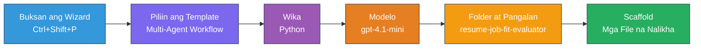
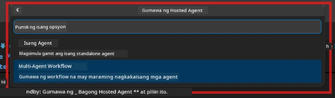

# Module 2 - I-scaffold ang Proyektong Multi-Agent

Sa module na ito, gagamitin mo ang [Microsoft Foundry extension](https://marketplace.visualstudio.com/items?itemName=TeamsDevApp.vscode-ai-foundry) upang **i-scaffold ang isang proyekto para sa multi-agent workflow**. Ginagawa ng extension ang buong istruktura ng proyekto - `agent.yaml`, `main.py`, `Dockerfile`, `requirements.txt`, `.env`, at debug configuration. Pagkatapos ay iko-customize mo ang mga file na ito sa Mga Module 3 at 4.

> **Tandaan:** Ang folder na `PersonalCareerCopilot/` sa lab na ito ay isang kumpleto, gumagana na halimbawa ng isang custom na proyekto para sa multi-agent. Maaari kang mag-scaffold ng bagong proyekto (inirerekomenda para sa pag-aaral) o pag-aralan ang umiiral na code nang direkta.

---

## Hakbang 1: Buksan ang Create Hosted Agent wizard


1. Pindutin ang `Ctrl+Shift+P` upang buksan ang **Command Palette**.
2. I-type: **Microsoft Foundry: Create a New Hosted Agent** at piliin ito.
3. Magbubukas ang hosted agent creation wizard.

> **Alternatibo:** I-click ang **Microsoft Foundry** icon sa Activity Bar → i-click ang **+** na icon sa tabi ng **Agents** → **Create New Hosted Agent**.

---

## Hakbang 2: Piliin ang Multi-Agent Workflow na template

Tatanungin ka ng wizard na pumili ng template:

| Template | Paglalarawan | Kailan gagamitin |
|----------|--------------|------------------|
| Single Agent | Isang agent na may instructions at mga opsyonal na tools | Lab 01 |
| **Multi-Agent Workflow** | Maraming agents na nagtutulungan gamit ang WorkflowBuilder | **Ito ang lab na ito (Lab 02)** |

1. Piliin ang **Multi-Agent Workflow**.
2. I-click ang **Next**.



---

## Hakbang 3: Piliin ang programming language

1. Piliin ang **Python**.
2. I-click ang **Next**.

---

## Hakbang 4: Piliin ang iyong modelo

1. Ipinapakita ng wizard ang mga modelong naka-deploy sa iyong Foundry project.
2. Piliin ang parehong modelo na ginamit mo sa Lab 01 (halimbawa, **gpt-4.1-mini**).
3. I-click ang **Next**.

> **Tip:** Inirerekomenda ang [`gpt-4.1-mini`](https://learn.microsoft.com/azure/foundry/foundry-models/concepts/models-sold-directly-by-azure#gpt-41-series) para sa development - mabilis ito, mura, at mahusay sa multi-agent workflows. Lumipat sa `gpt-4.1` para sa panghuling production deployment kung gusto mo ng mas mataas na kalidad ng output.

---

## Hakbang 5: Piliin ang lokasyon ng folder at pangalan ng agent

1. Magbubukas ang file dialog. Piliin ang target na folder:
   - Kung sumusunod ka sa workshop repo: mag-navigate sa `workshop/lab02-multi-agent/` at gumawa ng bagong subfolder
   - Kung nagsisimula mula sa simula: pumili ng anumang folder
2. I-type ang **pangalan** para sa hosted agent (halimbawa, `resume-job-fit-evaluator`).
3. I-click ang **Create**.

---

## Hakbang 6: Maghintay hanggang matapos ang scaffolding

1. Magbubukas ang VS Code ng bagong window (o mag-a-update ang kasalukuyang window) na may scaffolded project.
2. Dapat mong makita ang istruktura ng mga file na ito:

```
resume-job-fit-evaluator/
├── .env                ← Environment variables (placeholders)
├── .vscode/
│   └── launch.json     ← Debug configuration
├── agent.yaml          ← Agent definition (kind: hosted)
├── Dockerfile          ← Container configuration
├── main.py             ← Multi-agent workflow code (scaffold)
└── requirements.txt    ← Python dependencies
```

> **Tandaan sa workshop:** Sa workshop repository, ang `.vscode/` folder ay nasa **workspace root** na may mga shared na `launch.json` at `tasks.json`. Kasama ang mga debug configuration para sa Lab 01 at Lab 02. Kapag pinindot mo ang F5, piliin ang **"Lab02 - Multi-Agent"** mula sa dropdown.

---

## Hakbang 7: Unawain ang mga na-scaffold na files (mga partikular sa multi-agent)

Ang multi-agent scaffold ay naiiba sa single-agent scaffold sa ilang mahahalagang paraan:

### 7.1 `agent.yaml` - Paglalarawan ng Agent

```yaml
kind: hosted
name: resume-job-fit-evaluator
description: >
  A multi-agent workflow that evaluates resume-to-job fit.
metadata:
  authors:
    - Microsoft
  tags:
    - Multi-Agent Workflow
    - Resume Evaluator
protocols:
  - protocol: responses
    version: v1
environment_variables:
  - name: PROJECT_ENDPOINT
    value: ${PROJECT_ENDPOINT}
  - name: MODEL_DEPLOYMENT_NAME
    value: ${MODEL_DEPLOYMENT_NAME}
```

**Pangunahing kaibahan mula sa Lab 01:** Ang seksyon na `environment_variables` ay maaaring may dagdag na mga variable para sa MCP endpoints o iba pang tool configuration. Ang `name` at `description` ay sumasalamin sa use case ng multi-agent.

### 7.2 `main.py` - Code ng multi-agent workflow

Kasama sa scaffold ang:
- **Maraming instruction strings ng agent** (isang const kada agent)
- **Maraming [`AzureAIAgentClient.as_agent()`](https://learn.microsoft.com/python/api/overview/azure/ai-agents-readme) context managers** (isa para sa bawat agent)
- **[`WorkflowBuilder`](https://learn.microsoft.com/agent-framework/workflows/agents-in-workflows)** upang pagdugtung-dugtungin ang mga agent
- **`from_agent_framework()`** para ihain ang workflow bilang HTTP endpoint

```python
from agent_framework import WorkflowBuilder, tool
from agent_framework.azure import AzureAIAgentClient
from azure.ai.agentserver.agentframework import from_agent_framework
```

Ang dagdag na import na [`WorkflowBuilder`](https://learn.microsoft.com/agent-framework/workflows/agents-in-workflows) ay bago kumpara sa Lab 01.

### 7.3 `requirements.txt` - Karagdagang dependencies

Ang multi-agent project ay gumagamit ng parehong base packages mula sa Lab 01, kasama ang mga MCP-related na packages:

```
agent-framework-azure-ai==1.0.0rc3
agent-framework-core==1.0.0rc3
azure-ai-agentserver-agentframework==1.0.0b16
azure-ai-agentserver-core==1.0.0b16
debugpy
agent-dev-cli --pre
```

> **Mahalagang tala sa bersyon:** Ang package na `agent-dev-cli` ay nangangailangan ng `--pre` flag sa `requirements.txt` para mai-install ang pinakabagong preview na bersyon. Kailangan ito para sa compatibility ng Agent Inspector sa `agent-framework-core==1.0.0rc3`. Tingnan ang [Module 8 - Troubleshooting](08-troubleshooting.md) para sa mga detalye ng bersyon.

| Package | Bersyon | Layunin |
|---------|---------|---------|
| [`agent-framework-azure-ai`](https://learn.microsoft.com/agent-framework/overview/) | `1.0.0rc3` | Azure AI integration para sa [Microsoft Agent Framework](https://github.com/microsoft/agent-framework) |
| [`agent-framework-core`](https://learn.microsoft.com/agent-framework/overview/) | `1.0.0rc3` | Core runtime (kasama ang WorkflowBuilder) |
| `azure-ai-agentserver-agentframework` | `1.0.0b16` | Hosted agent server runtime |
| `azure-ai-agentserver-core` | `1.0.0b16` | Core agent server abstractions |
| `debugpy` | latest | Python debugging (F5 sa VS Code) |
| `agent-dev-cli` | `--pre` | Local dev CLI + Agent Inspector backend |

### 7.4 `Dockerfile` - Kapareho ng sa Lab 01

Ang Dockerfile ay pareho sa Lab 01 - kinokopya nito ang mga file, ini-install ang mga dependencies mula sa `requirements.txt`, inilalabas ang port 8088, at pinapatakbo ang `python main.py`.

```dockerfile
FROM python:3.14-slim
WORKDIR /app
COPY ./ .
RUN pip install --upgrade pip && \
    if [ -f requirements.txt ]; then \
        pip install -r requirements.txt; \
    else \
      echo "No requirements.txt found" >&2; exit 1; \
    fi
EXPOSE 8088
CMD ["python", "main.py"]
```

---

### Checkpoint

- [ ] Natapos ang scaffold wizard → nakikita ang bagong istruktura ng proyekto
- [ ] Nakikita mo lahat ng mga files: `agent.yaml`, `main.py`, `Dockerfile`, `requirements.txt`, `.env`
- [ ] Kasama sa `main.py` ang import ng `WorkflowBuilder` (nagpapatunay na napili ang multi-agent template)
- [ ] Kasama sa `requirements.txt` ang parehong `agent-framework-core` at `agent-framework-azure-ai`
- [ ] Naiintindihan mo kung paano naiiba ang multi-agent scaffold mula sa single-agent scaffold (maraming agents, WorkflowBuilder, MCP tools)

---

**Nuna:** [01 - Alamin ang Multi-Agent Architecture](01-understand-multi-agent.md) · **Susunod:** [03 - I-configure ang mga Agents at Kapaligiran →](03-configure-agents.md)

---

<!-- CO-OP TRANSLATOR DISCLAIMER START -->
**Pagsasabi ng Paalala**:  
Ang dokumentong ito ay isinalin gamit ang AI translation service na [Co-op Translator](https://github.com/Azure/co-op-translator). Bagama't nagsusumikap kami para sa katumpakan, pakitandaan na ang mga awtomatikong pagsasalin ay maaaring maglaman ng mga error o pagkakamali. Ang orihinal na dokumento sa orihinal nitong wika ang dapat ituring na pangunahing sanggunian. Para sa mahahalagang impormasyon, inirerekomenda ang propesyonal na pagsasalin ng tao. Hindi kami mananagot sa anumang hindi pagkakaunawaan o maling interpretasyon na nagmumula sa paggamit ng pagsasaling ito.
<!-- CO-OP TRANSLATOR DISCLAIMER END -->