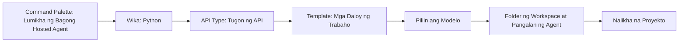
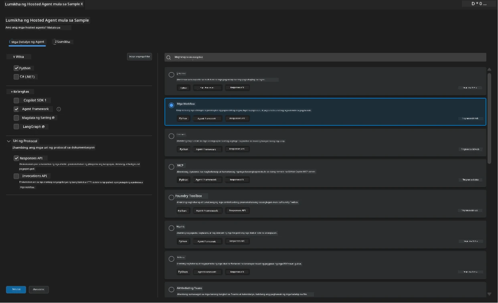
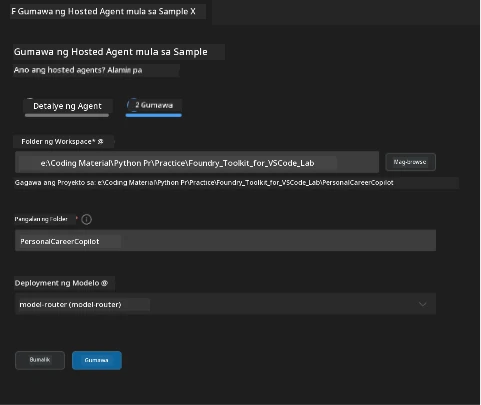

# Module 2 - I-scaffold ang Multi-Agent na Proyekto

⏱️ ~5 min

Sa module na ito, gagamitin mo ang [Foundry Toolkit para sa VS Code](https://aka.ms/foundrytk) upang **i-scaffold ang isang multi-agent na proyekto**. Ang wizard ay bumubuo ng `agent.yaml`, `main.py`, `Dockerfile`, `requirements.txt`, `.env`, at VS Code debug configuration - upang makapag-focus ka sa pag-wire ng 4-agent na workflow sa Module 3.

> **Pangunahing konsepto:** Ang scaffold ay isang gumaganang stub na may isang agent. Papalitan mo ang placeholder logic gamit ang `WorkflowBuilder` graph sa Module 3. Hindi mo kailangang isulat ang boilerplate mula sa simula.

> **Sanggunian na implementasyon:** Ang [`PersonalCareerCopilot/`](../../../../../workshop/lab02-multi-agent/PersonalCareerCopilot) ay isang kumpletong gumaganang halimbawa. Gamitin ito upang i-compare ang iyong ginagawa habang nagpapatuloy ka.

### Daloy ng scaffold wizard


```mermaid
flowchart LR
    A[Command Palette: Lumikha ng Bagong Hosted Agent] --> B[Wika: Python]
    B --> C[API Type: Tugon ng API]
    C --> D[Template: Mga Daloy ng Trabaho]
    D --> E[Piliin ang Modelo]
    E --> F[Folder ng Workspace at Pangalan ng Agent]
    F --> G[Nalikha na Proyekto]
```

---

## Hakbang 1: Buksan ang Create Hosted Agent wizard

1. Pindutin ang `Ctrl+Shift+P` upang buksan ang **Command Palette**.
2. I-type: **Foundry Toolkit: Create a New Hosted Agent** at piliin ito.
3. Magbubukas ang wizard sa tab na **Agent Details**.

> **Alternatibo:** I-click ang **Foundry Toolkit** icon sa Activity Bar → i-click ang **+** icon sa tabi ng **Hosted Agents** → **Create New Hosted Agent**.

---

## Hakbang 2: Piliin ang mga setting



1. Sa kaliwang bahagi ng navigation/options section piliin ang mga sumusunod:

| Menu | Pinili | Mga Tala |
|--------|-----------|-------|
| **Language** | Python | Suportado rin ang C# (.NET) |
| **Framework** | Agent Framework | Nagbibigay ng `Agent`, `AgentExecutor`, `WorkflowBuilder` |
| **API type** | Response API | `POST /responses` - platform-managed na history, suporta sa streaming |
| **Template** | **Workflows** | Pinoproseso ang mga kahilingan sa pamamagitan ng maraming agents nang sunud-sunod |

2. Kapag napili, i-click ang **Next**



3. Sa susunod na window, piliin ang mga sumusunod:

| Menu | Pinili | Mga Tala |
|--------|-----------|-------|
| **Workspace folder** | I-browse ang target na folder | hal., `workshop/lab02-multi-agent/` sa repo na ito |
| **Agent name** | `PersonalCareerCopilot` | Ito ang magiging pangalan ng directory ng proyekto |
| **Model Deployment** | Piliin ang na-deploy mong modelo | hal., `gpt-4.1-mini` mula sa Lab 01 |

4. I-click ang **Create** upang i-scaffold ang proyekto. Bibigyan ng VS Code ang mga files at bubuksan ang folder.

> **Tip:** Ang [`gpt-4.1-mini`](https://learn.microsoft.com/azure/foundry/foundry-models/concepts/models-sold-directly-by-azure#gpt-41-series) ay mahusay sa balanse ng bilis at kalidad para sa multi-agent na pag-develop.

---

## Hakbang 3: Inspeksyunin ang nabuo na proyekto

Pagkatapos makumpleto ang scaffolding, tiyaking nakikita mo ang mga sumusunod na files sa Explorer (`Ctrl+Shift+E`):

```
📂 <your-agent-name>/
├── .azdignore          ← Files excluded from Azure Developer CLI deployments
├── .dockerignore       ← Files excluded from Docker builds
├── .env                ← Environment variables (placeholders - fill in Module 3)
├── .vscode/
│   ├── launch.json     ← Debug config (F5 → run + Agent Inspector)
│   └── tasks.json      ← VS Code task definitions
├── agent.yaml          ← Agent definition (kind: hosted, protocol: responses)
├── Dockerfile          ← Container config for deployment
├── main.py             ← Stub agent entry point (replace with WorkflowBuilder in Module 3)
└── requirements.txt    ← Python dependencies
```

> **Mahalaga:** Direktang buksan ang scaffolded folder na ito sa VS Code upang ang `.vscode/launch.json` at `tasks.json` ay maayos na mailapat para sa F5 debugging.

### Paliwanag sa mga pangunahing files

| File | Layunin |
|------|---------|
| `agent.yaml` | Nagdeklara ng `kind: hosted`, nagmamapa ng env vars, nagdedetalye ng `/responses` protocol |
| `main.py` | Stub: isang `FoundryChatClient` → `Agent` → `ResponsesHostServer`. Papalitan mo ito ng 4 agents + `WorkflowBuilder` sa Module 3 |
| `Dockerfile` | `python:3.12-slim`, nag-iinstall ng `requirements.txt`, nag-eexpose ng port 8088, nagpapatakbo ng `python main.py` |
| `requirements.txt` | `agent-framework-foundry`, `agent-framework-foundry-hosting`, `mcp<2,>=1.24.0`, `debugpy` |

> **Sanggunian:** Tingnan ang [`PersonalCareerCopilot/agent.yaml`](../../../../../workshop/lab02-multi-agent/PersonalCareerCopilot/agent.yaml) at [`PersonalCareerCopilot/requirements.txt`](../../../../../workshop/lab02-multi-agent/PersonalCareerCopilot/requirements.txt) para sa kumpletong nilalaman ng nabuo.

---

### ✅ Checkpoint

- [ ] Natapos ang scaffold wizard - ang bagong project folder ay makikita sa Explorer
- [ ] Lahat ng inaasahang files ay naroroon: `agent.yaml`, `main.py`, `Dockerfile`, `requirements.txt`, `.env`
- [ ] Ang `agent.yaml` ay nagpapakita ng `kind: hosted` at `protocol: responses`
- [ ] Ang `main.py` ay nag-iimport ng `Agent`, `FoundryChatClient`, `ResponsesHostServer`
- [ ] Ang na-scaffold na folder ay bukas bilang root ng VS Code workspace
- [ ] Naiintindihan mo na ang `main.py` ay isang stub - dinagdag ang `WorkflowBuilder` sa Module 3

---

**Nakaraan:** [01 - Unawain ang Multi-Agent Architecture](01-understand-multi-agent.md) · **Susunod:** [03 - I-configure ang Agents & Environment →](03-configure-agents.md)

---

<!-- CO-OP TRANSLATOR DISCLAIMER START -->
**Pagtatanggi**:
Ang dokumentong ito ay isinalin gamit ang serbisyo ng AI translation na [Co-op Translator](https://github.com/Azure/co-op-translator). Bagama't nagsusumikap kami para sa katumpakan, pakatandaan na ang awtomatikong pagsasalin ay maaaring maglaman ng mga pagkakamali o hindi pagkakatugma. Ang orihinal na dokumento sa orihinal nitong wika ang dapat ituring na pangunahing sanggunian. Para sa mahahalagang impormasyon, inirerekomenda ang propesyonal na pagsasalin ng tao. Hindi kami mananagot sa anumang maling pagkakaintindi o maling interpretasyon na nagmula sa paggamit ng pagsasaling ito.
<!-- CO-OP TRANSLATOR DISCLAIMER END -->