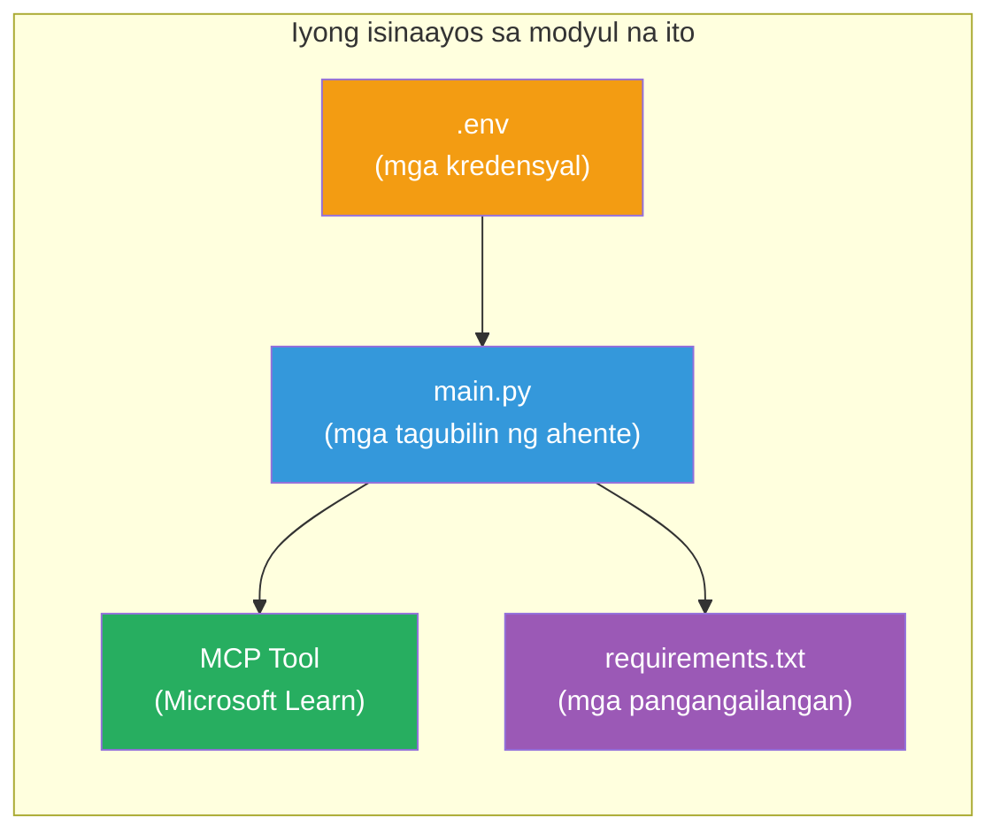

# Module 3 - I-configure ang mga Ahente, MCP Tool at Kapaligiran

Sa module na ito, iaangkop mo ang na-scaffold na multi-agent na proyekto. Maglalagay ka ng mga tagubilin para sa apat na ahente, isaayos ang MCP tool para sa Microsoft Learn, i-configure ang mga environment variables, at mag-install ng mga dependencies.


> **Tukoy:** Ang kumpletong gumaganang code ay nasa [`PersonalCareerCopilot/main.py`](../../../../../workshop/lab02-multi-agent/PersonalCareerCopilot/main.py). Gamitin ito bilang sanggunian habang binubuo mo ang sarili mo.

---

## Hakbang 1: I-configure ang mga environment variables

1. Buksan ang **`.env`** na file sa root ng iyong proyekto.
2. Ilagay ang mga detalye ng iyong Foundry project:

   ```env
   PROJECT_ENDPOINT=https://<your-account>.services.ai.azure.com/api/projects/<your-project>
   MODEL_DEPLOYMENT_NAME=gpt-4.1-mini
   ```

3. I-save ang file.

### Saan mahahanap ang mga halagang ito

| Halaga | Paano ito hanapin |
|-------|-------------------|
| **Project endpoint** | Microsoft Foundry sidebar → i-click ang iyong proyekto → endpoint URL sa detalye ng view |
| **Model deployment name** | Foundry sidebar → i-expand ang proyekto → **Models + endpoints** → pangalan sa tabi ng na-deploy na modelo |

> **Seguridad:** Huwag kailanman i-commit ang `.env` sa version control. Idagdag ito sa `.gitignore` kung wala pa doon.

### Pagmamapa ng environment variable

Binabasa ng multi-agent `main.py` ang parehong standard at workshop-specific na mga pangalan ng env var:

```python
PROJECT_ENDPOINT = os.getenv("AZURE_AI_PROJECT_ENDPOINT") or os.getenv("PROJECT_ENDPOINT")
MODEL_DEPLOYMENT_NAME = os.getenv(
    "AZURE_AI_MODEL_DEPLOYMENT_NAME",
    os.getenv("MODEL_DEPLOYMENT_NAME", "gpt-4.1-mini"),
)
MICROSOFT_LEARN_MCP_ENDPOINT = os.getenv(
    "MICROSOFT_LEARN_MCP_ENDPOINT", "https://learn.microsoft.com/api/mcp"
)
```

Ang MCP endpoint ay may makatwirang default - hindi mo kailangang itakda ito sa `.env` maliban kung gusto mo itong i-override.

---

## Hakbang 2: Sumulat ng mga tagubilin sa ahente

Ito ang pinaka-mahalagang hakbang. Kailangan ng bawat ahente ng maingat na ginawa na mga tagubilin na nagde-define ng tungkulin nito, format ng output, at mga panuntunan. Buksan ang `main.py` at lumikha (o baguhin) ang mga instruction constants.

### 2.1 Resume Parser Agent

```python
RESUME_PARSER_INSTRUCTIONS = """\
You are the Resume Parser.
Extract resume text into a compact, structured profile for downstream matching.

Output exactly these sections:
1) Candidate Profile
2) Technical Skills (grouped categories)
3) Soft Skills
4) Certifications & Awards
5) Domain Experience
6) Notable Achievements

Rules:
- Use only explicit or strongly implied evidence.
- Do not invent skills, titles, or experience.
- Keep concise bullets; no long paragraphs.
- If input is not a resume, return a short warning and request resume text.
"""
```

**Bakit ang mga seksyong ito?** Kailangan ng MatchingAgent ng naka-istruktura na datos para ma-score. Ang mga magkakatugmang seksyon ay nagpapasiguro ng maaasahang palitan sa pagitan ng mga ahente.

### 2.2 Job Description Agent

```python
JOB_DESCRIPTION_INSTRUCTIONS = """\
You are the Job Description Analyst.
Extract a structured requirement profile from a JD.

Output exactly these sections:
1) Role Overview
2) Required Skills
3) Preferred Skills
4) Experience Required
5) Certifications Required
6) Education
7) Domain / Industry
8) Key Responsibilities

Rules:
- Keep required vs preferred clearly separated.
- Only use what the JD states; do not invent hidden requirements.
- Flag vague requirements briefly.
- If input is not a JD, return a short warning and request JD text.
"""
```

**Bakit hiwalay ang required vs preferred?** Gumagamit ang MatchingAgent ng magkaibang timbang para sa bawat isa (Required Skills = 40 puntos, Preferred Skills = 10 puntos).

### 2.3 Matching Agent

```python
MATCHING_AGENT_INSTRUCTIONS = """\
You are the Matching Agent.
Compare parsed resume output vs JD output and produce an evidence-based fit report.

Scoring (100 total):
- Required Skills 40
- Experience 25
- Certifications 15
- Preferred Skills 10
- Domain Alignment 10

Output exactly these sections:
1) Fit Score (with breakdown math)
2) Matched Skills
3) Missing Skills
4) Partially Matched
5) Experience Alignment
6) Certification Gaps
7) Overall Assessment

Rules:
- Be objective and evidence-only.
- Keep partial vs missing separate.
- Keep Missing Skills precise; it feeds roadmap planning.
"""
```

**Bakit tahasang paggagawa ng score?** Ang reproducible na pag-score ay nagpapahintulot na maikumpara ang mga takbo at ma-debug ang mga isyu. Madaling i-interpret ng mga end-user ang 100-point scale.

### 2.4 Gap Analyzer Agent

```python
GAP_ANALYZER_INSTRUCTIONS = """\
You are the Gap Analyzer and Roadmap Planner.
Create a practical upskilling plan from the matching report.

Microsoft Learn MCP usage (required):
- For EVERY High and Medium priority gap, call tool `search_microsoft_learn_for_plan`.
- Use returned Learn links in Suggested Resources.
- Prefer Microsoft Learn for free resources.

CRITICAL: You MUST produce a SEPARATE detailed gap card for EVERY skill listed in
the Missing Skills and Certification Gaps sections of the matching report. Do NOT
skip or combine gaps. Do NOT summarize multiple gaps into one card.

Output format:
1) Personalized Learning Roadmap for [Role Title]
2) One DETAILED card per gap (produce ALL cards, not just the first):
   - Skill
   - Priority (High/Medium/Low)
   - Current Level
   - Target Level
   - Suggested Resources (include Learn URL from tool results)
   - Estimated Time
   - Quick Win Project
3) Recommended Learning Order (numbered list)
4) Timeline Summary (week-by-week)
5) Motivational Note

Rules:
- Produce every gap card before writing the summary sections.
- Keep it specific, realistic, and actionable.
- Tailor to candidate's existing stack.
- If fit >= 80, focus on polish/interview readiness.
- If fit < 40, be honest and provide a staged path.
"""
```

**Bakit ang diin sa "CRITICAL"?** Kapag walang tahasang tagubilin para gumawa ng LAHAT ng gap cards, madalas ang modelo ay gumagawa lang ng 1-2 cards at sinusuma ang iba pa. Pinipigilan ng "CRITICAL" block ang truncation na ito.

---

## Hakbang 3: Tukuyin ang MCP tool

Gumagamit ang GapAnalyzer ng isang tool na tumatawag sa [Microsoft Learn MCP server](https://learn.microsoft.com/azure/foundry/agents/how-to/tools/model-context-protocol). Idagdag ito sa `main.py`:

```python
import json
from agent_framework import tool
from mcp.client.session import ClientSession
from mcp.client.streamable_http import streamable_http_client

@tool
async def search_microsoft_learn_for_plan(
    skill: str, role: str = "", max_results: int = 5
) -> str:
    """Search Microsoft Learn MCP and return curated official links for roadmap planning."""
    query = " ".join(part for part in [skill, role, "learning path module"] if part).strip()
    query = query or "job skills learning path"

    try:
        async with streamable_http_client(MICROSOFT_LEARN_MCP_ENDPOINT) as (
            read_stream, write_stream, _,
        ):
            async with ClientSession(read_stream, write_stream) as session:
                await session.initialize()
                result = await session.call_tool(
                    "microsoft_docs_search", {"query": query}
                )

        if not result.content:
            return (
                "No results returned from Microsoft Learn MCP. "
                "Fallback: https://learn.microsoft.com/training/support/catalog-api"
            )

        payload_text = getattr(result.content[0], "text", "")
        data = json.loads(payload_text) if payload_text else {}
        items = data.get("results", [])[:max(1, min(max_results, 10))]

        if not items:
            return f"No direct Microsoft Learn results found for '{skill}'."

        lines = [f"Microsoft Learn resources for '{skill}':"]
        for i, item in enumerate(items, start=1):
            title = item.get("title") or item.get("url") or "Microsoft Learn Resource"
            url = item.get("url") or item.get("link") or ""
            lines.append(f"{i}. {title} - {url}".rstrip(" -"))
        return "\n".join(lines)
    except Exception as ex:
        return (
            f"Microsoft Learn MCP lookup unavailable. Reason: {ex}. "
            "Fallbacks: https://learn.microsoft.com/api/mcp"
        )
```

### Paano gumagana ang tool

| Hakbang | Nangyayari |
|---------|------------|
| 1 | Nagpasya ang GapAnalyzer na kailangan nito ng mga resources para sa isang skill (hal., "Kubernetes") |
| 2 | Tinatawag ng Framework ang `search_microsoft_learn_for_plan(skill="Kubernetes")` |
| 3 | Binubuksan ng function ang [Streamable HTTP](https://learn.microsoft.com/agent-framework/agents/tools/hosted-mcp-tools) na koneksyon sa `https://learn.microsoft.com/api/mcp` |
| 4 | Tinatawag ang `microsoft_docs_search` sa [MCP server](https://learn.microsoft.com/azure/foundry/agents/how-to/tools/model-context-protocol) |
| 5 | Nagbabalik ang MCP server ng mga resulta ng paghahanap (pamagat + URL) |
| 6 | Ini-format ng function ang mga resulta bilang naka-numero na listahan |
| 7 | Isinasama ng GapAnalyzer ang mga URL sa gap card |

### Mga dependency ng MCP

Kasama ang MCP client libraries sa pamamagitan ng [`agent-framework-core`](https://learn.microsoft.com/agent-framework/overview/). Hindi mo kailangang idagdag ang mga ito nang hiwalay sa `requirements.txt`. Kung makakuha ka ng mga import error, tiyaking:

```powershell
pip list | Select-String "mcp"
```

Inaasahan: naka-install ang `mcp` package (bersyon 1.x o mas bago).

---

## Hakbang 4: I-wire ang mga ahente at workflow

### 4.1 Lumikha ng mga ahente gamit ang context managers

```python
from contextlib import asynccontextmanager

@asynccontextmanager
async def create_agents():
    async with (
        get_credential() as credential,
        AzureAIAgentClient(
            project_endpoint=PROJECT_ENDPOINT,
            model_deployment_name=MODEL_DEPLOYMENT_NAME,
            credential=credential,
        ).as_agent(
            name="ResumeParser",
            instructions=RESUME_PARSER_INSTRUCTIONS,
        ) as resume_parser,
        AzureAIAgentClient(
            project_endpoint=PROJECT_ENDPOINT,
            model_deployment_name=MODEL_DEPLOYMENT_NAME,
            credential=credential,
        ).as_agent(
            name="JobDescriptionAgent",
            instructions=JOB_DESCRIPTION_INSTRUCTIONS,
        ) as jd_agent,
        AzureAIAgentClient(
            project_endpoint=PROJECT_ENDPOINT,
            model_deployment_name=MODEL_DEPLOYMENT_NAME,
            credential=credential,
        ).as_agent(
            name="MatchingAgent",
            instructions=MATCHING_AGENT_INSTRUCTIONS,
        ) as matching_agent,
        AzureAIAgentClient(
            project_endpoint=PROJECT_ENDPOINT,
            model_deployment_name=MODEL_DEPLOYMENT_NAME,
            credential=credential,
        ).as_agent(
            name="GapAnalyzer",
            instructions=GAP_ANALYZER_INSTRUCTIONS,
            tools=[search_microsoft_learn_for_plan],
        ) as gap_analyzer,
    ):
        yield resume_parser, jd_agent, matching_agent, gap_analyzer
```

**Pangunahing punto:**
- May sariling `AzureAIAgentClient` instance ang bawat ahente
- Tanging ang GapAnalyzer lang ang may `tools=[search_microsoft_learn_for_plan]`
- Nagbabalik ng [`ManagedIdentityCredential`](https://learn.microsoft.com/python/api/overview/azure/identity-readme#managed-identity-support) sa Azure, at [`DefaultAzureCredential`](https://learn.microsoft.com/azure/developer/python/sdk/authentication/credential-chains#defaultazurecredential-overview) kapag lokal ang `get_credential()`

### 4.2 Bumuo ng workflow graph

```python
def create_workflow(resume_parser, jd_agent, matching_agent, gap_analyzer):
    workflow = (
        WorkflowBuilder(
            name="ResumeJobFitEvaluator",
            start_executor=resume_parser,
            output_executors=[gap_analyzer],
        )
        .add_edge(resume_parser, jd_agent)
        .add_edge(resume_parser, matching_agent)
        .add_edge(jd_agent, matching_agent)
        .add_edge(matching_agent, gap_analyzer)
        .build()
    )
    return workflow.as_agent()
```

> Tingnan ang [Workflows as Agents](https://learn.microsoft.com/agent-framework/workflows/as-agents) para maunawaan ang `.as_agent()` na pattern.

### 4.3 Simulan ang server

```python
async def main() -> None:
    validate_configuration()
    async with create_agents() as (resume_parser, jd_agent, matching_agent, gap_analyzer):
        agent = create_workflow(resume_parser, jd_agent, matching_agent, gap_analyzer)
        from azure.ai.agentserver.agentframework import from_agent_framework
        await from_agent_framework(agent).run_async()

if __name__ == "__main__":
    asyncio.run(main())
```

---

## Hakbang 5: Gumawa at i-activate ang virtual environment

### 5.1 Gumawa ng environment

```powershell
cd workshop\lab02-multi-agent\PersonalCareerCopilot
python -m venv .venv
```

### 5.2 I-activate ito

**PowerShell (Windows):**
```powershell
.\.venv\Scripts\Activate.ps1
```

**macOS/Linux:**
```bash
source .venv/bin/activate
```

### 5.3 I-install ang dependencies

```powershell
pip install -r requirements.txt
```

> **Tandaan:** Ang linya na `agent-dev-cli --pre` sa `requirements.txt` ay nagsisiguro na naka-install ang pinakabagong preview version. Kailangan ito para sa compatibility sa `agent-framework-core==1.0.0rc3`.

### 5.4 Suriin ang pag-install

```powershell
pip list | Select-String "agent-framework|agentserver|agent-dev"
```

Inaasahang output:
```
agent-dev-cli                  0.0.1b260316
agent-framework-azure-ai       1.0.0rc3
agent-framework-core            1.0.0rc3
azure-ai-agentserver-agentframework 1.0.0b16
azure-ai-agentserver-core      1.0.0b16
```

> **Kung ang `agent-dev-cli` ay nagpapakita ng lumang bersyon** (hal., `0.0.1b260119`), mabibigo ang Agent Inspector na may 403/404 na error. Mag-upgrade: `pip install agent-dev-cli --pre --upgrade`

---

## Hakbang 6: Suriin ang authentication

Patakbuhin ang parehong auth check mula sa Lab 01:

```powershell
az account show --query "{name:name, id:id}" --output table
```

Kung mapalya ito, patakbuhin ang [`az login`](https://learn.microsoft.com/cli/azure/authenticate-azure-cli-interactively).

Para sa multi-agent workflows, pareho ang credential ng apat na ahente. Kapag gumana ang authentication para sa isa, gagana ito para sa lahat.

---

### Checkpoint

- [ ] May valid na `PROJECT_ENDPOINT` at `MODEL_DEPLOYMENT_NAME` sa `.env`
- [ ] Nakadefine ang lahat ng 4 na agent instruction constants sa `main.py` (ResumeParser, JD Agent, MatchingAgent, GapAnalyzer)
- [ ] Nakadefine at narehistro ang `search_microsoft_learn_for_plan` MCP tool sa GapAnalyzer
- [ ] Gumagawa ang `create_agents()` ng apat na ahente na may individual na `AzureAIAgentClient` instances
- [ ] Bumubuo ang `create_workflow()` ng tamang graph gamit ang `WorkflowBuilder`
- [ ] Nilikha at na-activate ang virtual environment (`(.venv)` ay nakikita)
- [ ] Nakakatapos ang `pip install -r requirements.txt` nang walang error
- [ ] Ipinapakita ng `pip list` ang lahat ng inaasahang packages sa tamang bersyon (rc3 / b16)
- [ ] Nagbabalik ng iyong subscription ang `az account show`

---

**Nakaraan:** [02 - Scaffold Multi-Agent Project](02-scaffold-multi-agent.md) · **Susunod:** [04 - Orchestration Patterns →](04-orchestration-patterns.md)

---

<!-- CO-OP TRANSLATOR DISCLAIMER START -->
**Pahayag ng Pagtanggi**:
Ang dokumentong ito ay isinalin gamit ang serbisyong AI na pagsasalin na [Co-op Translator](https://github.com/Azure/co-op-translator). Bagama't nagsusumikap kami para sa katumpakan, pakatandaan na ang mga awtomatikong pagsasalin ay maaaring maglaman ng mga pagkakamali o di-tumpak na impormasyon. Ang orihinal na dokumento sa orihinal nitong wika ang dapat ituring na opisyal na sanggunian. Para sa mga mahahalagang impormasyon, inirerekomenda ang propesyonal na pagsasalin ng tao. Hindi kami mananagot sa anumang hindi pagkakaunawaan o maling interpretasyon na nagmumula sa paggamit ng pagsasaling ito.
<!-- CO-OP TRANSLATOR DISCLAIMER END -->