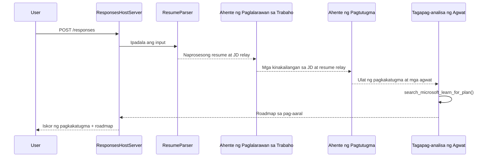

# Module 3 - I-configure ang Instructions, Kapaligiran at I-install ang mga Dependencies

⏱️ ~15 min

Sa module na ito, babaguhin mo ang scaffolded stub upang maging **inyong** multi-agent workflow - sa pamamagitan ng pagtatakda ng mga environment variables, pagsulat ng mga instructions para sa agent, pagdagdag ng MCP tool, pagkonekta ng workflow graph, at pag-install ng mga dependencies.

> **Sanggunian:** Ang kumpletong gumaganang code ay nasa [`PersonalCareerCopilot/main.py`](../../../../../workshop/lab02-multi-agent/PersonalCareerCopilot/main.py). Gamitin ito bilang sanggunian habang binubuo ang sarili mong workflow graph at prompt blocks.

---

## Paano nagkakabit-kabit ang apat na agent


```mermaid
sequenceDiagram
    participant User
    participant Server as ResponsesHostServer
    participant RP as ResumeParser
    participant JD as Ahente ng Paglalarawan sa Trabaho
    participant MA as Ahente ng Pagtutugma
    participant GA as Tagapag-analisa ng Agwat

    User->>Server: POST /responses
    Server->>RP: Ipadala ang input
    RP-->>JD: Naprosesong resume at JD relay
    JD-->>MA: Mga kinakailangan sa JD at resume relay
    MA-->>GA: Ulat ng pagkakatugma at mga agwat
    GA->>GA: search_microsoft_learn_for_plan()
    GA-->>Server: Roadmap sa pag-aaral
    Server-->>User: Iskor ng pagkakatugma + roadmap
```

---

## Hakbang 1: I-configure ang mga environment variables

1. Buksan ang **`.env`** file sa root ng iyong proyekto (na nilikha ng scaffold wizard).
2. Palitan ang mga placeholders ng iyong mga aktual na halaga mula sa Lab 01.

<details open>
<summary><strong>🅰️ Path A - Foundry subscription</strong></summary>

```env
FOUNDRY_PROJECT_ENDPOINT=https://<your-account>.services.ai.azure.com/api/projects/<your-project>
AZURE_AI_MODEL_DEPLOYMENT_NAME=gpt-4.1-mini
```

> **Saan kukunin ang mga halaga:** Tingnan ang [Lab 01, Module 1](../../lab01-single-agent/docs/01-setup.md#deploy-a-model--assign-rbac).

</details>

<details open>
<summary><strong>🅱️ Path B - Foundry Local</strong></summary>

```env
FOUNDRY_PROJECT_ENDPOINT=http://localhost:5273/v1
AZURE_AI_MODEL_DEPLOYMENT_NAME=phi-4-mini
```

> Lahat ng inference ay tumatakbo sa iyong makina - walang data na lumalabas sa iyong device. Patakbuhin ang `foundry model list` para kumpirmahin ang eksaktong alias ng modelo. Ang tanging outbound request ay ang tawag ng MCP tool sa `https://learn.microsoft.com/api/mcp`.

> **Saan kukunin ang mga halaga:** Tingnan ang [Lab 01, Module 1 - local path](../../lab01-single-agent/docs/01-setup.md#step-2-set-up-based-on-your-access).

</details>

> **Seguridad:** Huwag kailanman i-commit ang `.env` sa version control. Dapat ay kasama na ito sa `.gitignore`.

---

## Hakbang 2: Isulat ang mga instructions ng agent

Ang mga instructions ang nagtutukoy ng papel ng bawat agent, format ng output, at mga patakaran. Buksan ang `main.py` at idefine (o palitan) ang apat na instruction constants - ang buong mga string ay nasa [`PersonalCareerCopilot/main.py`](../../../../../workshop/lab02-multi-agent/PersonalCareerCopilot/main.py).

### 2.1 `RESUME_PARSER_INSTRUCTIONS`
Ini-parse ang resume sa isang naka-istrukturang profile ng kandidato **at** kinokopya ang job description nang eksakto sa `[JOB DESCRIPTION PASS-THROUGH]`. Ang parehong nakalabel na bahagi ay dapat lumabas sa output.

> **Bakit kailangang may pass-through?** Sa `context_mode="last_agent"`, ang ResumeParser lang ang **tanging** agent na nakakakita ng orihinal na mensahe ng user. Kung hindi nito makopya ang JD pasulong, hindi ito makikita ng mga kasunod na agents.

### 2.2 `JOB_DESCRIPTION_INSTRUCTIONS`
Binabasa ang `[PARSED RESUME]` at `[JOB DESCRIPTION PASS-THROUGH]` mula sa output ng ResumeParser. Nagbibigay ng `[JD REQUIREMENTS]` (mga naka-istrukturang requirements) at `[PARSED RESUME PASS-THROUGH]` (eksaktong kopya ng resume para sa MatchingAgent).

### 2.3 `MATCHING_AGENT_INSTRUCTIONS`
Binabasa ang `[JD REQUIREMENTS]` at `[PARSED RESUME PASS-THROUGH]`. Gumagawa ng scored fit report (0–100) na may breakdown math, mga matching skills, mga kulang na skills, at alignment ng karanasan.

### 2.4 `GAP_ANALYZER_INSTRUCTIONS`
Binabasa ang fit report. Para sa **bawat** kulang na skill, tinatawagan ang `search_microsoft_learn_for_plan` para kumuha ng mga Microsoft Learn resources. Gumagawa ng isang detalyadong gap card para sa bawat skill pati na rin ng week-by-week learning roadmap.

---

## Hakbang 3: Idagdag ang MCP tool

Tinutawagan ng GapAnalyzer ang [Microsoft Learn MCP server](https://learn.microsoft.com/azure/foundry/agents/how-to/tools/model-context-protocol) para kumuha ng totoong learning resources para sa bawat skill gap. Ang buong `search_microsoft_learn_for_plan` function ay nasa [`PersonalCareerCopilot/main.py`](../../../../../workshop/lab02-multi-agent/PersonalCareerCopilot/main.py).

Irehistro ang tool sa GapAnalyzer kapag nililikha ang agent:

```python
gap_analyzer = Agent(
    client=client,
    instructions=GAP_ANALYZER_INSTRUCTIONS,
    name="GapAnalyzer",
    tools=[search_microsoft_learn_for_plan],
)
```

> Tingnan ang [`PersonalCareerCopilot/main.py`](../../../../../workshop/lab02-multi-agent/PersonalCareerCopilot/main.py) para sa kumpletong `WorkflowBuilder` graph na may `FoundryChatClient`, `AgentExecutor`, at lahat ng `add_edge()` calls.

---

## Hakbang 4: Gumawa ng virtual environment at i-install ang mga dependencies

> ⚠️ **Huwag laktawan ang hakbang na ito.** Kung hindi naka-install ang dependencies, hindi gagana ang F5 debugging.

### 4.1 Gumawa ng virtual environment

```powershell
python -m venv .venv
```

### 4.2 I-activate ito

| OS | Command |
|----|---------|
| **Windows (PowerShell)** | `.\.venv\Scripts\Activate.ps1` |
| **Windows (CMD)** | `.venv\Scripts\activate.bat` |
| **macOS / Linux** | `source .venv/bin/activate` |

Dapat makita ang `(.venv)` sa iyong terminal prompt.

### 4.3 I-install ang mga dependencies

```powershell
pip install -r requirements.txt
```

### 4.4 Suriin

```powershell
pip list | Select-String "agent-framework|mcp|debugpy"
```

Inaasahan: `agent-framework-foundry`, `agent-framework-foundry-hosting`, `mcp`, at `debugpy` ay nakalista.

---

## Hakbang 5: Suriin ang authentication

<details open>
<summary><strong>🅰️ Path A - Azure credential</strong></summary>

```powershell
az account show --query "{name:name, id:id}" --output table
```

Kung nabigo ito, patakbuhin ang [`az login`](https://learn.microsoft.com/cli/azure/authenticate-azure-cli-interactively).

Ang apat na agents ay gumagamit ng isang `FoundryChatClient` at isang `DefaultAzureCredential`. Kung gumagana ang authentication sa isa, gagana sa lahat.

</details>

<details open>
<summary><strong>🅱️ Path B - Foundry Local</strong></summary>

Walang kinakailangang authentication para sa local testing.

</details>

---

### ✅ Checkpoint

> Huwag **magpatuloy** sa Module 04 hangga't: **(1)** makikita ang `(.venv)` sa prompt MO AT **(2)** matagumpay na natapos ang `pip install -r requirements.txt`.

- [ ] May valid na endpoint at pangalan ng model deployment sa `.env` (hindi mga placeholders)
- [ ] Naidefine lahat ng 4 na agent instruction constants sa `main.py` (ResumeParser, JD Agent, MatchingAgent, GapAnalyzer)
- [ ] Naidefine at narehistro ang `search_microsoft_learn_for_plan` MCP tool sa GapAnalyzer
- [ ] Nakagawa ng `FoundryChatClient` + 4 `Agent` + 4 `AgentExecutor` objects sa `main()`
- [ ] Tama ang pagkakagawa ng `WorkflowBuilder` sequential graph pati na lahat ng 3 `add_edge()` calls
- [ ] Nalikha at na-activate ang virtual environment (nakikita ang `(.venv)` sa prompt)
- [ ] Matagumpay ang `pip install -r requirements.txt` nang walang error
- [ ] **Path A:** Matagumpay ang `az account show` O nagpapakita ang VS Code Accounts icon ng naka-sign-in na account

---

**Nakaraan:** [02 - Scaffold Multi-Agent Project](02-scaffold-multi-agent.md) · **Susunod:** [04 - Orchestration Patterns →](04-orchestration-patterns.md)

---

<!-- CO-OP TRANSLATOR DISCLAIMER START -->
**Pagtatanggi**:
Ang dokumentong ito ay isinalin gamit ang serbisyo ng AI translation na [Co-op Translator](https://github.com/Azure/co-op-translator). Bagama't nagsusumikap kami para sa katumpakan, pakatandaan na ang awtomatikong pagsasalin ay maaaring maglaman ng mga pagkakamali o hindi pagkakatugma. Ang orihinal na dokumento sa orihinal nitong wika ang dapat ituring na pangunahing sanggunian. Para sa mahahalagang impormasyon, inirerekomenda ang propesyonal na pagsasalin ng tao. Hindi kami mananagot sa anumang maling pagkakaintindi o maling interpretasyon na nagmula sa paggamit ng pagsasaling ito.
<!-- CO-OP TRANSLATOR DISCLAIMER END -->