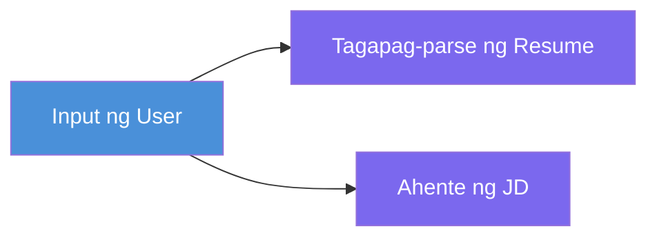
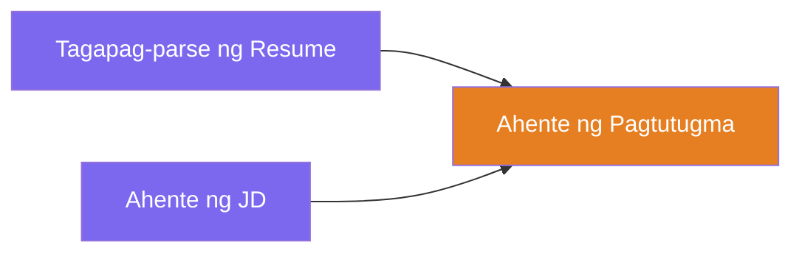
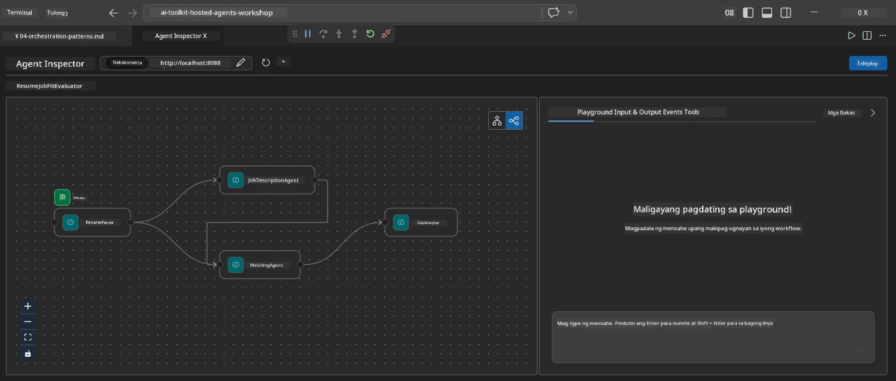
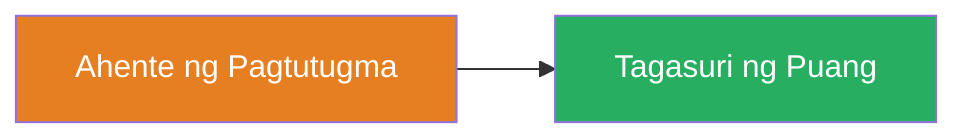
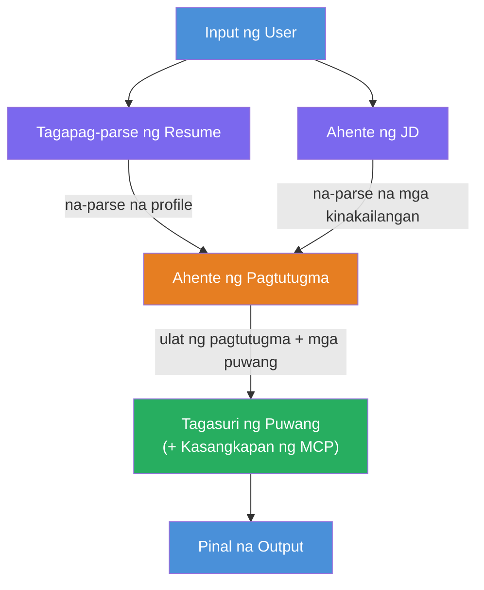
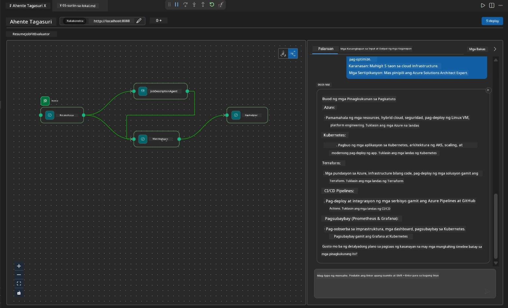

# Module 4 - Mga Pattern ng Orkestrasyon

Sa module na ito, susuriin mo ang mga pattern ng orkestrasyon na ginamit sa Resume Job Fit Evaluator at matutunan kung paano basahin, baguhin, at pahabain ang workflow graph. Mahalaga ang pag-unawa sa mga pattern na ito para sa pag-debug ng mga isyu sa daloy ng data at para makabuo ng sarili mong [multi-agent workflows](https://learn.microsoft.com/agent-framework/workflows/).

---

## Pattern 1: Fan-out (parallel split)

Ang unang pattern sa workflow ay **fan-out** - isang input lang ang ipinapadala sa maraming ahente nang sabay-sabay.


Sa code, nangyayari ito dahil ang `resume_parser` ang `start_executor` - ito ang tumatanggap ng mensahe ng user muna. Pagkatapos, dahil parehong may mga edge mula sa `resume_parser` ang `jd_agent` at `matching_agent`, nire-route ng framework ang output ng `resume_parser` papunta sa parehong mga ahente:

```python
.add_edge(resume_parser, jd_agent)         # Output ng ResumeParser → Ahente ng JD
.add_edge(resume_parser, matching_agent)   # Output ng ResumeParser → MatchingAgent
```

**Bakit ito gumagana:** Pinoproseso ng ResumeParser at JD Agent ang magkaibang aspeto ng parehong input. Ang pagpapatakbo nila nang parallel ay nagpapababa ng kabuuang latency kumpara sa pagsunod-sunod.

### Kailan gagamitin ang fan-out

| Gamit | Halimbawa |
|----------|---------|
| Mga independiyenteng subtasks | Pag-parse ng resume vs. pag-parse ng JD |
| Redundancy / pagboto | Dalawang ahente ang nagsusuri ng parehong data, ang pangatlo ang pumipili ng pinakamahusay na sagot |
| Multi-format na output | Isang ahente ang gumagawa ng teksto, ang isa naman ay gumagawa ng structured JSON |

---

## Pattern 2: Fan-in (aggregation)

Ang pangalawang pattern ay **fan-in** - maraming output ng ahente ang kinokolekta at ipinapadala sa isang downstream agent.


Sa code:

```python
.add_edge(resume_parser, matching_agent)   # Output ng ResumeParser → MatchingAgent
.add_edge(jd_agent, matching_agent)        # Output ng JD Agent → MatchingAgent
```

**Pangunahing gawi:** Kapag ang isang ahente ay may **dalawa o higit pang papasok na edge**, automatic na naghihintay ang framework para sa **lahat** ng mga upstream agent na matapos bago patakbuhin ang downstream agent. Hindi magsisimula ang MatchingAgent hanggang sa matapos ang parehong ResumeParser at JD Agent.

### Ano ang natatanggap ng MatchingAgent

Pinagsasama-sama ng framework ang mga output mula sa lahat ng upstream agent. Ang input ng MatchingAgent ay ganito:

```
[ResumeParser output]
---
Candidate Profile:
  Name: Jane Doe
  Technical Skills: Python, Azure, Kubernetes, ...
  ...

[JobDescriptionAgent output]
---
Role Overview: Senior Cloud Engineer
Required Skills: Python, Azure, Terraform, ...
...
```

> **Tandaan:** Ang eksaktong format ng pagsasama ay nakadepende sa bersyon ng framework. Dapat nakasulat ang mga instruksyon ng ahente upang kayanin parehong structured at unstructured na output mula sa upstream.



---

## Pattern 3: Sequential chain

Ang pangatlong pattern ay **sequential chaining** - output ng isang ahente ay direktang pumapasok sa susunod.


Sa code:

```python
.add_edge(matching_agent, gap_analyzer)    # Output ng MatchingAgent → GapAnalyzer
```

Ito ang pinakasimpleng pattern. Tinatanggap ng GapAnalyzer ang fit score, matched/missing na skills, at gaps mula sa MatchingAgent. Pagkatapos ay tumatawag ito sa [MCP tool](https://learn.microsoft.com/azure/foundry/agents/how-to/tools/model-context-protocol) para sa bawat gap upang kunin ang mga Microsoft Learn resources.

---

## Buong graph

Ang pagsasama ng tatlong pattern ay bumubuo ng buong workflow:


### Timeline ng pagpapatupad

```mermaid
gantt
    title Takdang Oras ng Pagpapatupad ng Ahente
    dateFormat X
    axisFormat %s

    section Sabay-sabay
    Tagapag-parse ng Resume       :rp, 0, 3
    Ahente ng JD                  :jd, 0, 2

    section sunud-sunod
    Ahente ng Pagtutugma          :ma, 3, 5
    Tagapag-analisa ng Agwat      :ga, 5, 9
```


> Ang kabuuang wall-clock time ay humigit-kumulang `max(ResumeParser, JD Agent) + MatchingAgent + GapAnalyzer`. Karaniwan pinakamabagal ang GapAnalyzer dahil sa maraming MCP tool calls (isa bawat gap).

---

## Pagbasa ng WorkflowBuilder code

Narito ang buong `create_workflow()` function mula sa `main.py`, may mga anotasyon:

```python
def create_workflow(resume_parser, jd_agent, matching_agent, gap_analyzer):
    workflow = (
        WorkflowBuilder(
            name="ResumeJobFitEvaluator",

            # Unang ahente na tumatanggap ng input mula sa user
            start_executor=resume_parser,

            # Ang ahente/ahente na ang output ay nagiging huling sagot
            output_executors=[gap_analyzer],
        )
        # Fan-out: Ang output ng ResumeParser ay napupunta sa parehong JD Agent at MatchingAgent
        .add_edge(resume_parser, jd_agent)
        .add_edge(resume_parser, matching_agent)

        # Fan-in: Ang MatchingAgent ay naghihintay sa parehong ResumeParser at JD Agent
        .add_edge(jd_agent, matching_agent)

        # Sequential: Ang output ng MatchingAgent ay pinapakain sa GapAnalyzer
        .add_edge(matching_agent, gap_analyzer)

        .build()
    )
    return workflow.as_agent()
```

### Talaan ng mga edge

| # | Edge | Pattern | Epekto |
|---|------|---------|--------|
| 1 | `resume_parser → jd_agent` | Fan-out | Natatanggap ng JD Agent ang output ng ResumeParser (kasama ang orihinal na input ng user) |
| 2 | `resume_parser → matching_agent` | Fan-out | Natatanggap ng MatchingAgent ang output ng ResumeParser |
| 3 | `jd_agent → matching_agent` | Fan-in | Natatanggap din ng MatchingAgent ang output ng JD Agent (naghihintay sa pareho) |
| 4 | `matching_agent → gap_analyzer` | Sequential | Natatanggap ng GapAnalyzer ang fit report + listahan ng gap |

---

## Pagbabago ng graph

### Pagdagdag ng bagong ahente

Para magdagdag ng ikalimang ahente (halimbawa, isang **InterviewPrepAgent** na gumagawa ng mga tanong sa panayam base sa gap analysis):

```python
# 1. Tukuyin ang mga tagubilin
INTERVIEW_PREP_INSTRUCTIONS = """\
You are the Interview Prep Agent.
Given a gap analysis and fit report, generate 10 targeted interview questions
the candidate should prepare for.
"""

# 2. Lumikha ng ahente (sa loob ng async with block)
AzureAIAgentClient(
    project_endpoint=PROJECT_ENDPOINT,
    model_deployment_name=MODEL_DEPLOYMENT_NAME,
    credential=credential,
).as_agent(
    name="InterviewPrepAgent",
    instructions=INTERVIEW_PREP_INSTRUCTIONS,
) as interview_prep,

# 3. Magdagdag ng mga gilid sa create_workflow()
.add_edge(matching_agent, interview_prep)   # tumatanggap ng ulat ng fit
.add_edge(gap_analyzer, interview_prep)     # tumatanggap din ng mga gap card

# 4. I-update ang output_executors
output_executors=[interview_prep],  # ngayon ang panghuling ahente
```

### Pagbabago ng pagkakasunod-sunod ng pagpapatupad

Para patakbuhin ang JD Agent **matapos** ang ResumeParser (sequential imbes na parallel):

```python
# Alisin: .add_edge(resume_parser, jd_agent) ← umiiral na, panatilihin ito
# Alisin ang implicit parallel sa pamamagitan ng HINDI pagpapadala ng user input direkta sa jd_agent
# Ang start_executor ay unang nagpapadala sa resume_parser, at ang jd_agent ay nakakakuha lamang
# ng output ng resume_parser sa pamamagitan ng edge. Ginagawa nitong sunud-sunod sila.
```

> **Mahalaga:** Ang `start_executor` lang ang tumatanggap ng raw user input. Lahat ng ibang ahente ay tumatanggap ng output mula sa kanilang upstream edges. Kung gusto mong makatanggap rin ng raw user input ang isang ahente, dapat may edge ito mula sa `start_executor`.

---

## Karaniwang mga pagkakamali sa graph

| Pagkakamali | Sintomas | Ayos |
|---------|---------|-----|
| Walang edge papunta sa `output_executors` | Tumakbo ang ahente pero walang output | Siguraduhing may path mula sa `start_executor` papunta sa bawat ahente sa `output_executors` |
| Circular dependency | Infinite loop o timeout | Siguraduhing walang ahente na nagpapasa pabalik sa isang upstream agent |
| Ahente sa `output_executors` na walang papasok na edge | Walang output | Magdagdag ng kahit isang `add_edge(source, that_agent)` |
| Maraming `output_executors` na walang fan-in | Ang output ay mula lamang sa isang ahente | Gumamit ng isang output agent na nag-aaggregate, o tanggapin ang maraming output |
| Walang `start_executor` | `ValueError` kapag nagbuo | Palaging tukuyin ang `start_executor` sa `WorkflowBuilder()` |

---

## Pag-debug ng graph

### Paggamit ng Agent Inspector

1. Simulan ang ahente nang lokal (F5 o terminal - tingnan ang [Module 5](05-test-locally.md)).
2. Buksan ang Agent Inspector (`Ctrl+Shift+P` → **Foundry Toolkit: Open Agent Inspector**).
3. Magpadala ng test na mensahe.
4. Sa panel ng sagot ng Inspector, hanapin ang **streaming output** - ipinapakita nito ang kontribusyon ng bawat ahente nang sunud-sunod.



### Paggamit ng logging

Magdagdag ng logging sa `main.py` upang subaybayan ang daloy ng data:

```python
import logging
logger = logging.getLogger("resume-job-fit")

# Sa create_workflow(), pagkatapos ng pagbuo:
logger.info("Workflow graph built with edges: RP→JD, RP→MA, JD→MA, MA→GA")
```

Ipinapakita sa server logs ang execution order ng ahente at mga MCP tool calls:

```
INFO:resume-job-fit:Starting Resume -> Job Fit Evaluator HTTP server...
INFO:resume-job-fit:Server running on http://localhost:8088
INFO:agent_framework:Executing agent: ResumeParser
INFO:agent_framework:Executing agent: JobDescriptionAgent
INFO:agent_framework:Waiting for upstream agents: ResumeParser, JobDescriptionAgent
INFO:agent_framework:Executing agent: MatchingAgent
INFO:agent_framework:Executing agent: GapAnalyzer
INFO:agent_framework:Tool call: search_microsoft_learn_for_plan(skill="Kubernetes")
POST https://learn.microsoft.com/api/mcp → 200
INFO:agent_framework:Tool call: search_microsoft_learn_for_plan(skill="Terraform")
POST https://learn.microsoft.com/api/mcp → 200
```

---

### Checkpoint

- [ ] Nakikilala mo ang tatlong pattern ng orkestrasyon sa workflow: fan-out, fan-in, at sequential chain
- [ ] Naiintindihan mo na ang mga ahente na may maraming papasok na edge ay naghihintay na matapos ang lahat ng upstream agents
- [ ] Nakakabasa ka ng `WorkflowBuilder` code at natutukoy ang bawat `add_edge()` call sa visual graph
- [ ] Naiintindihan mo ang execution timeline: una ang parallel agents, pagkatapos aggregation, saka sequential
- [ ] Alam mo kung paano magdagdag ng bagong ahente sa graph (tukuyin ang mga instruksyon, gumawa ng ahente, magdagdag ng edges, i-update ang output)
- [ ] Nakikilala mo ang mga karaniwang pagkakamali sa graph at ang kanilang sintomas

---

**Nakaraan:** [03 - Configure Agents & Environment](03-configure-agents.md) · **Susunod:** [05 - Test Locally →](05-test-locally.md)

---

<!-- CO-OP TRANSLATOR DISCLAIMER START -->
**Pahayag ng Pagtatanggi**:  
Ang dokumentong ito ay isinalin gamit ang AI translation service na [Co-op Translator](https://github.com/Azure/co-op-translator). Bagama't nagsusumikap kaming maging tumpak, pakatandaan na ang mga awtomatikong salin ay maaari pa ring maglaman ng mga pagkakamali o di-tumpak na impormasyon. Ang orihinal na dokumento sa kanyang orihinal na wika ang dapat ituring na pangunahing sanggunian. Para sa mahahalagang impormasyon, inirerekomenda ang propesyonal na salin ng tao. Hindi kami mananagot sa anumang hindi pagkakaunawaan o maling interpretasyon na maaaring magmula sa paggamit ng salin na ito.
<!-- CO-OP TRANSLATOR DISCLAIMER END -->