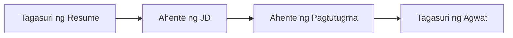
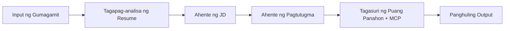

# Module 4 - Mga Pattern ng Orkestrasyon

⏱️ ~10 min

Sa modulong ito, susuriin mo ang mga pattern ng orkestrasyon na ginamit sa Resume Job Fit Evaluator at matutunan kung paano basahin, baguhin, at palawakin ang grap ng workflow. Mahalaga ang pag-unawa sa mga pattern na ito para mag-debug ng mga isyu sa daloy ng datos at makabuo ng sarili mong [multi-agent workflows](https://learn.microsoft.com/agent-framework/workflows/).

---

## Pattern 1: Sunud-sunod na kadena

Ang pangunahing pattern sa workflow ay isang **sunud-sunod na kadena** - ang output ng bawat ahente ay direktang ipinapasok sa susunod.


```mermaid
flowchart LR
    RP[Tagasuri ng Resume] --> JD[Ahente ng JD]
    JD --> MA[Ahente ng Pagtutugma]
    MA --> GA[Tagasuri ng Agwat]
```

Sa code, ang bawat tawag na `add_edge()` ay lumikha ng isang hakbang sa kadena:

```python
.add_edge(resume_executor, jd_executor)       # Output ng ResumeParser → JD Agent
.add_edge(jd_executor, matching_executor)     # Output ng JD Agent → MatchingAgent
.add_edge(matching_executor, gap_executor)    # Output ng MatchingAgent → GapAnalyzer
```

> **Bakit sunud-sunod, hindi fan-out/fan-in?** Gumagamit ang `WorkflowBuilder` ng **OR-semantics** para sa mga dumarating na gilid: ang downstream executor ay magsisimula kapag ang **anumang** nauna nito ay natapos na. Kung ang `matching_executor` ay may dalawang dumarating na gilid (mula sa `resume_executor` at `jd_executor`), tatakbo ito ng dalawang beses - isang beses kapag natapos ang ResumeParser at muli kapag natapos ang JD Agent - na magdudulot din na tatakbo ng dalawang beses ang GapAnalyzer at magmumukhang dalawang beses ang output. Naiiwasan ng sunud-sunod na pipeline ang ganito nang lubusan.

## Pattern 2: Pagpapasa ng Nilalaman

Dahil ang `context_mode="last_agent"` ay nangangahulugang ang bawat executor ay nakakakita lamang ng output ng **direktang nauna nito**, ang mga ahente sa sunud-sunod na kadena ay kailangang malinaw na ipasa ang anumang datos na kailangan ng mga downstream agents.

Sa workflow na ito:
- **ResumeParser** kinokopya ang JD nang literal sa `[JOB DESCRIPTION PASS-THROUGH]` (upang makita ito ng JD Agent).
- **JD Agent** kinokopya ang `[PARSED RESUME]` nang literal sa `[PARSED RESUME PASS-THROUGH]` (upang maikumpara ito ng MatchingAgent sa parehong mga profile).

```
ResumeParser output
└─ [PARSED RESUME]               ← extracted by JD Agent
└─ [JOB DESCRIPTION PASS-THROUGH] ← extracted by JD Agent

JD Agent output
└─ [JD REQUIREMENTS]             ← extracted by MatchingAgent
└─ [PARSED RESUME PASS-THROUGH]  ← extracted by MatchingAgent
```

Ang bawat seksyon ng pagpapasa ay kailangang kopyahin nang **literal** - ang pagsasummarize o paraphrasing nito ay sisirain ang downstream agent na nakadepende dito.

---

## Ang kumpletong grap

Pinagsasama ang mga pattern ng sunud-sunod na kadena at pagpapasa ng nilalaman upang mabuo ang buong workflow:


```mermaid
flowchart LR
    U[Input ng Gumagamit] --> RP[Tagapag-analisa ng Resume]
    RP --> JD[Ahente ng JD]
    JD --> MA[Ahente ng Pagtutugma]
    MA --> GA[Tagasuri ng Puang Panahon + MCP]
    GA --> O[Panghuling Output]
```

Ipinapakita ng Agent Inspector ang ganitong estruktura ng grap kapag tumatakbo ang agent nang lokal. Tingnan ang [Module 5 - Test Locally](05-test-locally.md) para sa mga screenshot.

---

## Pagbabasa ng WorkflowBuilder code

Ang buong `create_workflow()` function ay nasa [`PersonalCareerCopilot/main.py`](../../../../../workshop/lab02-multi-agent/PersonalCareerCopilot/main.py). Ang tatlong tawag na `add_edge()` ay bumubuo sa sunud-sunod na pipeline:

| # | Gilid | Epekto |
|---|------|--------|
| 1 | `resume_executor → jd_executor` | Natatanggap ng JD Agent ang `[PARSED RESUME]` + `[JOB DESCRIPTION PASS-THROUGH]` |
| 2 | `jd_executor → matching_executor` | Natatanggap ng MatchingAgent ang `[JD REQUIREMENTS]` + `[PARSED RESUME PASS-THROUGH]` |
| 3 | `matching_executor → gap_executor` | Natatanggap ng GapAnalyzer ang ulat ng fit + listahan ng mga puwang |

---

## Pagbabago ng grap

### Pagdaragdag ng bagong ahente

Para magdagdag ng ikalimang ahente (halimbawa, isang **InterviewPrepAgent** pagkatapos ng GapAnalyzer):

1. Tukuyin ang isang `INTERVIEW_PREP_INSTRUCTIONS` constant.
2. Gumawa ng `Agent` + `AgentExecutor` na mga bagay (parehong pattern tulad ng apat na kasalukuyang ahente).
3. Magdagdag ng `.add_edge(gap_executor, interview_exec)` sa `WorkflowBuilder`.
4. I-update ang `output_executors=[interview_exec]`.

> **Mahalaga:** Ang `start_executor` lamang ang tumatanggap ng hilaw na input mula sa gumagamit. Lahat ng ibang ahente ay tumatanggap ng output mula sa kanilang upstream na gilid.

---

## Mga Karaniwang Mali sa Grap

| Mali | Sintomas | Ayusin |
|---------|---------|-----|
| Nawawalang gilid papunta sa `output_executors` | Tumakbo ang ahente pero walang output | Siguraduhing may daan mula `start_executor` papunta sa bawat ahente sa `output_executors` |
| Paikot-ikot na dependency | Walang katapusang loop o timeout | Suriin na walang ahente na bumabalik sa isang naunang ahente |
| Ahente sa `output_executors` na walang dumarating na gilid | Walang output | Magdagdag ng kahit isang `add_edge(source, that_agent)` |
| Maraming `output_executors` na walang fan-in | Output ay naglalaman lamang ng tugon ng isang ahente | Gumamit ng isang output ahente na nag-iipon, o tanggapin ang maraming output |
| Nawawalang `start_executor` | `ValueError` sa build time | Palaging tukuyin ang `start_executor` sa `WorkflowBuilder()` |

---

## Pag-debug ng grap

### Paggamit ng Agent Inspector

1. Simulan ang ahente nang lokal gamit ang F5.
2. Buksan ang Agent Inspector (`Ctrl+Shift+P` → **Foundry Toolkit: Open Agent Inspector**).
3. Magpadala ng test message.
4. Sa response panel ng Inspector, hanapin ang **streaming output** - ipinapakita nito ang kontribusyon ng bawat ahente sa pagkakasunod-sunod.


### Paggamit ng logging

Magdagdag ng logging sa `main.py` upang subaybayan ang daloy ng datos:

```python
import logging
logger = logging.getLogger("resume-job-fit")

# Sa main(), pagkatapos i-build ang workflow:
logger.info("Workflow graph built with edges: RP→JD, JD→MA, MA→GA")
```

Ipinapakita ng mga log ng server ang pagkakasunod ng pagpapatupad ng ahente at ang mga tawag sa MCP tool:

```
INFO:agent_framework:Executing agent: ResumeParser
INFO:agent_framework:Executing agent: JobDescriptionAgent
INFO:agent_framework:Executing agent: MatchingAgent
INFO:agent_framework:Executing agent: GapAnalyzer
INFO:agent_framework:Tool call: search_microsoft_learn_for_plan(skill="Kubernetes")
POST https://learn.microsoft.com/api/mcp → 200
INFO:agent_framework:Tool call: search_microsoft_learn_for_plan(skill="Terraform")
POST https://learn.microsoft.com/api/mcp → 200
```

---

### Checkpoint

- [ ] Naitukoy mo ang dalawang pattern ng orkestrasyon sa workflow: sunud-sunod na kadena at pagpapasa ng nilalaman
- [ ] Naiintindihan mo kung bakit ang `context_mode="last_agent"` ay nangangailangan ng malinaw na pagpapasa ng datos sa pagitan ng mga ahente
- [ ] Marunong kang basahin ang code ng `WorkflowBuilder` at iugnay ang bawat tawag na `add_edge()` sa visual na grap
- [ ] Alam mo kung paano magdagdag ng bagong ahente sa dulo ng pipeline
- [ ] Naitukoy mo ang mga karaniwang mali sa grap pati na ang kanilang mga sintomas

---

**Nakaraan:** [03 - Configure Agents & Environment](03-configure-agents.md) · **Susunod:** [05 - Test Locally →](05-test-locally.md)

---

<!-- CO-OP TRANSLATOR DISCLAIMER START -->
**Pagtatanggi**:
Ang dokumentong ito ay isinalin gamit ang serbisyo ng AI translation na [Co-op Translator](https://github.com/Azure/co-op-translator). Bagama't nagsusumikap kami para sa katumpakan, pakatandaan na ang awtomatikong pagsasalin ay maaaring maglaman ng mga pagkakamali o hindi pagkakatugma. Ang orihinal na dokumento sa orihinal nitong wika ang dapat ituring na pangunahing sanggunian. Para sa mahahalagang impormasyon, inirerekomenda ang propesyonal na pagsasalin ng tao. Hindi kami mananagot sa anumang maling pagkakaintindi o maling interpretasyon na nagmula sa paggamit ng pagsasaling ito.
<!-- CO-OP TRANSLATOR DISCLAIMER END -->