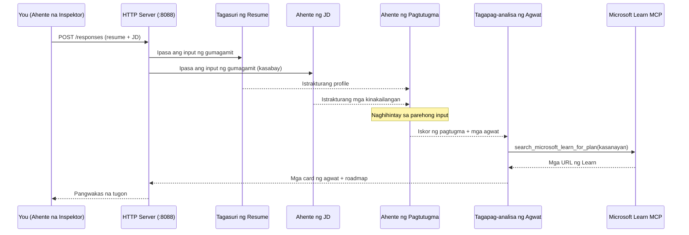
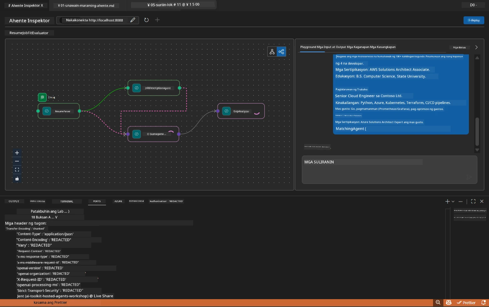

# Module 5 - Subukan Nang Lokal (Multi-Agent)

Sa modyul na ito, patakbuhin mo ang multi-agent na workflow nang lokal, subukan ito gamit ang Agent Inspector, at tiyakin na ang apat na agents at ang MCP tool ay gumagana nang maayos bago i-deploy sa Foundry.

### Ano ang nangyayari sa local test run


---

## Hakbang 1: Simulan ang agent server

### Opsyon A: Gamitin ang VS Code task (inirerekomenda)

1. Pindutin ang `Ctrl+Shift+P` → i-type ang **Tasks: Run Task** → piliin ang **Run Lab02 HTTP Server**.
2. Sisimula ang server na may debugpy na nakakabit sa port na `5679` at ang agent sa port na `8088`.
3. Hintayin lumabas ang output na ganito:

```
INFO:resume-job-fit:Starting Resume -> Job Fit Evaluator HTTP server...
INFO:resume-job-fit:Server running on http://localhost:8088
```

### Opsyon B: Gamitin ang terminal nang manu-mano

```powershell
cd workshop\lab02-multi-agent\PersonalCareerCopilot
```

I-activate ang virtual environment:

**PowerShell (Windows):**
```powershell
.\.venv\Scripts\Activate.ps1
```

**macOS/Linux:**
```bash
source .venv/bin/activate
```

Simulan ang server:

```powershell
python -m debugpy --listen 127.0.0.1:5679 -m agentdev run main.py --verbose --port 8088
```

### Opsyon C: Gamitin ang F5 (debug mode)

1. Pindutin ang `F5` o pumunta sa **Run and Debug** (`Ctrl+Shift+D`).
2. Piliin ang **Lab02 - Multi-Agent** na launch configuration mula sa dropdown.
3. Sisimula ang server na may buong suporta sa breakpoint.

> **Tip:** Pinapayagan ka ng debug mode na mag-set ng breakpoints sa loob ng `search_microsoft_learn_for_plan()` para i-inspect ang MCP responses, o sa loob ng mga instruction string ng agent upang makita kung ano ang natatanggap ng bawat agent.

---

## Hakbang 2: Buksan ang Agent Inspector

1. Pindutin ang `Ctrl+Shift+P` → i-type ang **Foundry Toolkit: Open Agent Inspector**.
2. Magbubukas ang Agent Inspector sa tab ng browser sa `http://localhost:5679`.
3. Makikita mo na handa na ang agent interface para tumanggap ng mga mensahe.

> **Kung hindi magbukas ang Agent Inspector:** Tiyakin na ganap nang nagsimula ang server (makikita mo ang log na "Server running"). Kung abala ang port 5679, tingnan ang [Module 8 - Troubleshooting](08-troubleshooting.md).

---

## Hakbang 3: Patakbuhin ang mga smoke test

Patakbuhin ang tatlong pagsubok na ito nang sunod-sunod. Bawat isa ay sumusuri nang mas progresibo sa workflow.

### Pagsubok 1: Basic resume + job description

I-paste ang sumusunod sa Agent Inspector:

```
Resume:
Jane Doe
Senior Software Engineer with 5 years of experience in Python, Django, and AWS.
Built microservices handling 10K+ requests/second. Led a team of 4 developers.
Certifications: AWS Solutions Architect Associate.
Education: B.S. Computer Science, State University.

Job Description:
Senior Cloud Engineer at Contoso Ltd.
Required: Python, Azure, Kubernetes, Terraform, CI/CD pipelines.
Preferred: Go, monitoring (Prometheus/Grafana), cost optimization.
Experience: 5+ years in cloud infrastructure.
Certifications: Azure Solutions Architect Expert preferred.
```

**Inaasahang istruktura ng output:**

Dapat maglaman ang tugon ng output mula sa apat na agents nang sunod-sunod:

1. **Resume Parser output** - Nakasistematikong profile ng kandidato na ang mga kakayahan ay naka-grupo ayon sa kategorya
2. **JD Agent output** - Nakasistematikong mga kinakailangan na naka-hiwalay ang mga kailangang kasanayan at mga nais na kasanayan
3. **Matching Agent output** - Fit score (0-100) na may breakdown, mga matched na kasanayan, mga kulang na kasanayan, mga gaps
4. **Gap Analyzer output** - Indibidwal na mga gap card para sa bawat kulang na kasanayan, bawat isa ay may Microsoft Learn URLs



### Ano ang i-verify sa Pagsubok 1

| Suriin | Inaasahan | Pasa? |
|-------|----------|-------|
| Naglalaman ang tugon ng fit score | Numero mula 0-100 na may breakdown | |
| Naka-lista ang mga matched na kasanayan | Python, CI/CD (partial), atbp. | |
| Naka-lista ang mga kulang na kasanayan | Azure, Kubernetes, Terraform, atbp. | |
| May gap card para sa bawat kulang na kasanayan | Isang card kada kasanayan | |
| Naroroon ang Microsoft Learn URLs | Totoong mga link na `learn.microsoft.com` | |
| Walang error message sa tugon | Malinis at sistematikong output | |

### Pagsubok 2: I-verify ang pagtakbo ng MCP tool

Habang tumatakbo ang Pagsubok 1, tingnan ang **server terminal** para sa mga MCP log entry:

```
GET https://learn.microsoft.com/api/mcp → 405 (Method Not Allowed)
POST https://learn.microsoft.com/api/mcp → 200
DELETE https://learn.microsoft.com/api/mcp → 405 (Method Not Allowed)
```

| Log entry | Kahulugan | Inaasahan? |
|-----------|---------|-----------|
| `GET ... → 405` | MCP client probe gamit ang GET habang nag-i-initialize | Oo - normal |
| `POST ... → 200` | Totoong tawag sa Microsoft Learn MCP server | Oo - ito ang totoong tawag |
| `DELETE ... → 405` | MCP client probe gamit ang DELETE habang naglilinis | Oo - normal |
| `POST ... → 4xx/5xx` | Nabigo ang tawag sa tool | Hindi - tingnan ang [Troubleshooting](08-troubleshooting.md) |

> **Pangunahing punto:** Ang mga linyang `GET 405` at `DELETE 405` ay **inaasahan na pag-uugali**. Mag-alala lamang kung ang `POST` calls ay hindi nagbabalik ng status code na 200.

### Pagsubok 3: Edge case - mataas ang fit na kandidato

I-paste ang resume na malapit na tumutugma sa JD upang i-verify na kayang hawakan ng GapAnalyzer ang mga high-fit na senaryo:

```
Resume:
Alex Chen
Senior Cloud Engineer with 7 years of experience.
Skills: Python, Azure (AKS, Functions, DevOps), Kubernetes, Terraform, CI/CD (GitHub Actions, Azure Pipelines), Go, Prometheus, Grafana, cost optimization.
Certifications: Azure Solutions Architect Expert, Azure DevOps Engineer Expert.
Led infrastructure migration to Azure for 3 enterprise clients.
Education: M.S. Computer Science, Tech University.

Job Description:
Senior Cloud Engineer at Contoso Ltd.
Required: Python, Azure, Kubernetes, Terraform, CI/CD pipelines.
Preferred: Go, monitoring (Prometheus/Grafana), cost optimization.
Experience: 5+ years in cloud infrastructure.
Certifications: Azure Solutions Architect Expert preferred.
```

**Inaasahang galaw:**
- Dapat ang fit score ay **80+** (karamihan ng kasanayan ay tumutugma)
- Ang mga gap card ay dapat nakatuon sa polish/interview readiness kaysa sa pundasyong pag-aaral
- Sinasabi ng GapAnalyzer instructions: "If fit >= 80, focus on polish/interview readiness"

---

## Hakbang 4: I-verify ang kumpletong output

Pagkatapos patakbuhin ang mga pagsubok, tiyaking ang output ay tumutugon sa mga sumusunod na pamantayan:

### Checklist ng istruktura ng output

| Seksyon | Agent | Naroon? |
|---------|-------|----------|
| Candidate Profile | Resume Parser | |
| Technical Skills (naka-grupo) | Resume Parser | |
| Role Overview | JD Agent | |
| Required vs. Preferred Skills | JD Agent | |
| Fit Score na may breakdown | Matching Agent | |
| Matched / Missing / Partial skills | Matching Agent | |
| Gap card para sa bawat kulang na kasanayan | Gap Analyzer | |
| Microsoft Learn URLs sa mga gap card | Gap Analyzer (MCP) | |
| Ayos ng pag-aaral (naka-number) | Gap Analyzer | |
| Timeline summary | Gap Analyzer | |

### Mga karaniwang isyu sa yugtong ito

| Isyu | Sanhi | Solusyon |
|-------|-------|-----|
| Isang gap card lang (ang iba ay napurol) | Kulang ang CRITICAL na block sa GapAnalyzer instructions | Idagdag ang paragraph na `CRITICAL:` sa `GAP_ANALYZER_INSTRUCTIONS` - tingnan ang [Module 3](03-configure-agents.md) |
| Walang Microsoft Learn URLs | Hindi maabot ang MCP endpoint | Suriin ang internet connection. Tiyakin na ang `MICROSOFT_LEARN_MCP_ENDPOINT` sa `.env` ay `https://learn.microsoft.com/api/mcp` |
| Walang sagot | Hindi na-set ang `PROJECT_ENDPOINT` o `MODEL_DEPLOYMENT_NAME` | Suriin ang mga value sa `.env`. Patakbuhin ang `echo $env:PROJECT_ENDPOINT` sa terminal |
| Fit score ay 0 o nawawala | Walang natanggap na datos ang MatchingAgent | Suriin na nandiyan ang `add_edge(resume_parser, matching_agent)` at `add_edge(jd_agent, matching_agent)` sa `create_workflow()` |
| Nagsisimula ang agent pero agad lumalabas | Import error o kulang na dependency | Patakbuhin ulit ang `pip install -r requirements.txt`. Tingnan ang terminal para sa mga stack trace |
| Error sa `validate_configuration` | Nawawala ang env vars | Gumawa ng `.env` na may `PROJECT_ENDPOINT=<your-endpoint>` at `MODEL_DEPLOYMENT_NAME=<your-model>` |

---

## Hakbang 5: Subukan gamit ang sarili mong data (opsyonal)

Subukang i-paste ang sarili mong resume at totoong job description. Nakakatulong ito para matiyak na:

- Kaya ng mga agent ang iba't ibang format ng resume (chronological, functional, hybrid)
- Kaya ng JD Agent ang iba't ibang istilo ng JD (bullet points, paragraphs, structured)
- Nagbibigay ang MCP tool ng kaugnay na mga resources para sa totoong kasanayan
- Ang mga gap card ay personalized sa iyong partikular na background

> **Paalala tungkol sa privacy:** Kapag nagte-test nang lokal, nananatili ang iyong data sa iyong makina lang at ipapadala lamang sa iyong Azure OpenAI deployment. Hindi ito nilalagay sa log o iniimbak ng workshop infrastructure. Gumamit ng placeholder names kung nais mo (hal., "Jane Doe" sa halip na iyong tunay na pangalan).

---

### Checkpoint

- [ ] Matagumpay na nagsimula ang server sa port na `8088` (may log na "Server running")
- [ ] Nabuksan ang Agent Inspector at nakakonekta sa agent
- [ ] Pagsubok 1: Kumpletong tugon na may fit score, matched/missing skills, gap cards, at Microsoft Learn URLs
- [ ] Pagsubok 2: MCP logs ay nagpapakita ng `POST ... → 200` (matagumpay ang mga tawag sa tool)
- [ ] Pagsubok 3: Ang mataas ang fit ng kandidato ay nakakuha ng score na 80+ na may mga rekomendasyong nakatuon sa polish
- [ ] Lahat ng gap card ay naroroon (isa para sa bawat kulang na kasanayan, walang napurol)
- [ ] Walang error o stack trace sa server terminal

---

**Nakaraan:** [04 - Orchestration Patterns](04-orchestration-patterns.md) · **Susunod:** [06 - Deploy to Foundry →](06-deploy-to-foundry.md)

---

<!-- CO-OP TRANSLATOR DISCLAIMER START -->
**Pahayag ng Pagsasantabi**:
Ang dokumentong ito ay isinalin gamit ang serbisyong AI na pagsasalin [Co-op Translator](https://github.com/Azure/co-op-translator). Bagamat aming pinagsisikapang maging tumpak, pakatandaan na ang mga awtomatikong pagsasalin ay maaaring maglaman ng mga pagkakamali o di-katangian. Ang orihinal na dokumento sa orihinal nitong wika ang dapat ituring na sangguniang opisyal. Para sa mahahalagang impormasyon, inirerekomenda ang propesyonal na pagsasaling-tao. Hindi kami mananagot sa anumang hindi pagkakaunawaan o maling interpretasyon na maaaring magmula sa paggamit ng pagsasaling ito.
<!-- CO-OP TRANSLATOR DISCLAIMER END -->