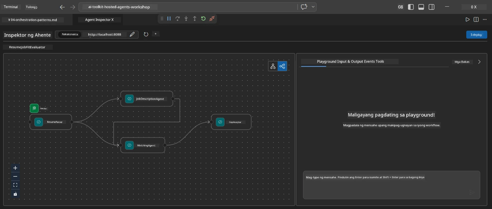
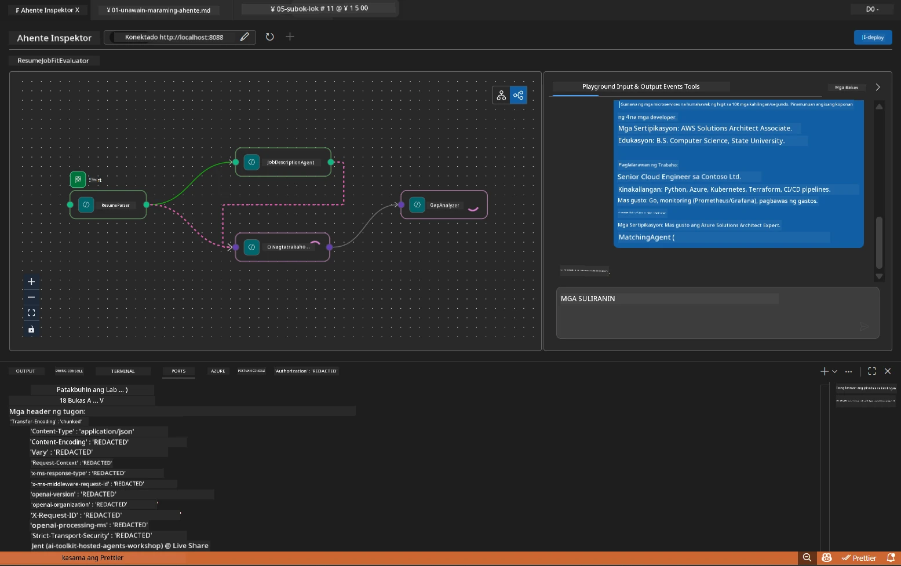
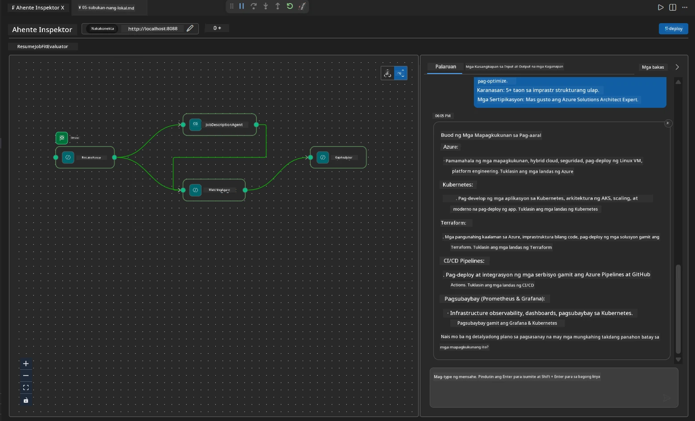

# Module 5 - Subukan Nang Lokal

⏱️ ~15 min

Sa module na ito, patatakbuhin mo ang multi-agent workflow nang lokal, susubukan ito gamit ang Agent Inspector, at tiyakin na gumagana nang tama ang apat na ahente at ang MCP tool bago mag-deploy.

---

## Hakbang 1: Simulan ang agent server

### Opsyon A: Gamit ang VS Code task (inirerekomenda)

1. Buksan ang `workshop/lab02-multi-agent/PersonalCareerCopilot/` bilang iyong VS Code folder.
2. Pindutin ang `Ctrl+Shift+P` → i-type ang **Tasks: Run Task** → piliin ang **Run Agent HTTP Server**.
3. Sisimulan ng task ang server na may nakalakip na debugpy sa port `5679` at ang agent sa port `8088`.
4. Maghintay hanggang lumabas ang output na:

```
INFO:resume-job-fit:Starting Resume -> Job Fit Evaluator HTTP server...
INFO:resume-job-fit:Server running on http://localhost:8088
```

### Opsyon B: Gamit ang F5 (debug mode)

1. Pindutin ang `F5` → piliin ang **Debug Local Agent HTTP Server**.
2. Sisimulan ang server na may buong suporta sa breakpoint - kapaki-pakinabang para siyasatin ang mga tugon ng MCP o outputs ng ahente.

---

## Hakbang 2: Buksan ang Agent Inspector

1. Pindutin ang `Ctrl+Shift+P` → i-type ang **Foundry Toolkit: Open Agent Inspector**.
2. Magbubukas ang Agent Inspector bilang panel ng VS Code na nakakonecta sa `http://localhost:8088`.
3. Dapat makita mo ang interface ng ahente na handang tumanggap ng mga mensahe.



> **Kung hindi bumukas ang Agent Inspector:** Siguraduhing tuluyang nagsimula ang server (nakikita mo ang "Server running" na log). Kung abala ang port 5679, tingnan ang [Module 8 - Troubleshooting](08-troubleshooting.md).

---

## Hakbang 2b: (Opsyonal) Buksan ang Workflow Visualizer

Kasama sa Foundry Toolkit ang real-time na **Workflow Visualizer** na nagpapakita kung paano nakikipag-ugnayan ang mga ahente habang tumatakbo ang graph. Lalo itong kapaki-pakinabang para sa multi-agent debugging.

1. Pindutin ang `Ctrl+Shift+P` → i-type ang **Foundry Toolkit: Open Visualizer for Hosted Agents**.
2. Magbubukas ang bagong tab sa VS Code na nagpapakita ng live execution graph.
3. Habang nagpapadala ka ng mga mensahe sa Agent Inspector, awtomatikong nag-a-update ang visualizer - ang mga berdeng nodes ay nagpapahiwatig ng natapos na ahente, at ang mga animated edges ay nagpapakita ng daloy ng datos sa pagitan nila.

> **Port conflict:** Kung ang visualizer port ay ginagamit na, palitan ito sa VS Code Settings → **Extensions** → **Microsoft Foundry Configuration** → **Hosted Agents: Visualizer Port**.

---

## Hakbang 3: Patakbuhin ang smoke tests

Patakbuhin ang tatlong pagsusuring ito nang sunud-sunod. Bawat isa ay sumusubok ng unti-unting mas malawak ng workflow.

### Pagsusuri 1: Basic resume + job description

I-paste ang sumusunod sa Agent Inspector:

```
Resume:
Jane Doe
Senior Software Engineer with 5 years of experience in Python, Django, and AWS.
Built microservices handling 10K+ requests/second. Led a team of 4 developers.
Certifications: AWS Solutions Architect Associate.
Education: B.S. Computer Science, State University.

Job Description:
Senior Cloud Engineer at Contoso Ltd.
Required: Python, Azure, Kubernetes, Terraform, CI/CD pipelines.
Preferred: Go, monitoring (Prometheus/Grafana), cost optimization.
Experience: 5+ years in cloud infrastructure.
Certifications: Azure Solutions Architect Expert preferred.
```

**Inaasahang estruktura ng output:**

Ang tugon ay dapat maglaman ng output mula sa apat na ahente sa sunod-sunod:

1. **Resume Parser output** - Dalawang may label na seksyon: `[PARSED RESUME]` (profile ng kandidato na may pinagsamang skills) at `[JOB DESCRIPTION PASS-THROUGH]` (salin sa kabuuan ng JD text na pinapakain sa JD Agent)
2. **JD Agent output** - Istrakturadong mga pangangailangan na pinaghiwalay ang kinakailangan at mas nais na mga kakayahan
3. **Matching Agent output** - Fit score (0-100) na may pagsira, mga naitugmang kakayahan, nawawalang kakayahan, gaps
4. **Gap Analyzer output** - Mga hiwalay na gap cards para sa bawat nawawalang kakayahan, bawat isa na may mga URL ng Microsoft Learn





### Ano ang dapat i-verify sa Pagsusuri 1

| Suriin | Inaasahan | Pasa? |
|-------|----------|-------|
| Ang tugon ay may fit score | Numero mula 0-100 na may breakdown | |
| Nakalista ang mga naitugmang kakayahan | Python, CI/CD (bahagyang), atbp. | |
| Nakalista ang mga nawawalang kakayahan | Azure, Kubernetes, Terraform, atbp. | |
| May mga gap card para sa bawat nawawalang kakayahan | Isang card bawat kakayahan | |
| Naroroon ang mga URL ng Microsoft Learn | Totoong mga link ng `learn.microsoft.com` | |
| Walang mga error message sa tugon | Malinis at istrakturadong output | |

### Pagsusuri 2: Edge case - kandidato na may mataas na fit

I-paste ang isang resume na malapit ang tugma sa JD upang tiyakin na kaya ng GapAnalyzer ang mga senaryong mataas ang fit:

```
Resume:
Alex Chen
Senior Cloud Engineer with 7 years of experience.
Skills: Python, Azure (AKS, Functions, DevOps), Kubernetes, Terraform, CI/CD (GitHub Actions, Azure Pipelines), Go, Prometheus, Grafana, cost optimization.
Certifications: Azure Solutions Architect Expert, Azure DevOps Engineer Expert.
Led infrastructure migration to Azure for 3 enterprise clients.
Education: M.S. Computer Science, Tech University.

Job Description:
Senior Cloud Engineer at Contoso Ltd.
Required: Python, Azure, Kubernetes, Terraform, CI/CD pipelines.
Preferred: Go, monitoring (Prometheus/Grafana), cost optimization.
Experience: 5+ years in cloud infrastructure.
Certifications: Azure Solutions Architect Expert preferred.
```

**Inaasahang kilos:**
- Ang fit score ay dapat **80+** (karamihan ng mga kakayahan ay tugma)
- Ang mga gap card ay magtutuon ng pansin sa polish/interview readiness sa halip na pangunahin na pag-aaral
- Sinasabi ng mga tagubilin ng GapAnalyzer: "Kung fit >= 80, ituon sa polish/interview readiness"

---

## Hakbang 4: Subukan gamit ang iyong sariling data (opsyonal)

Subukang i-paste ang iyong sariling resume at isang totoong job description. Nakakatulong ito upang tiyakin:

- Kaya ng mga ahente na hawakan ang iba't ibang format ng resume (chronological, functional, hybrid)
- Kaya ng JD Agent na hawakan ang iba't ibang estilo ng JD (bullet points, paragraphs, structured)
- Ang MCP tool ay nagbabalik ng mga kaugnay na resources para sa totoong kakayahan
- Ang mga gap card ay personalized ayon sa iyong partikular na background

> **Privacy - Path A (Foundry cloud):** Ang Resume at JD text ay ipinapadala sa iyong Azure OpenAI deployment para sa inference. Hindi ito ini-log o iniimbak ng workshop infrastructure. Gumamit ng mga placeholder na pangalan (hal., "Jane Doe") kung nais mo.
>
> **Privacy - Path B (Foundry Local):** Ang lahat ng apat na inferensya ng ahente ay tumatakbo ng buo sa iyong device. Ang iyong resume at job description na teksto **hindi kailanman umaalis sa iyong makina**. Ang tanging outbound call ay ang MCP tool na kumukuha ng mga resources mula sa `https://learn.microsoft.com/api/mcp`; ang query na iyon ay naglalaman lamang ng pangalan ng kakayahan, hindi ng iyong personal na data.

---

### Checkpoint

- [ ] Matagumpay na naisagawa ang server sa port `8088` (ipinapakita ng log ang "Server running")
- [ ] Nabukas ang Agent Inspector at nakakonecta sa ahente
- [ ] Pagsusuri 1: Kumpletong tugon na may fit score, matched/missing skills, gap cards, at mga URL ng Microsoft Learn
- [ ] Pagsusuri 2: Kandidato na may mataas na fit ay nakakakuha ng score na 80+ na may mga rekomendasyong naka-pokus sa polish
- [ ] Lahat ng gap cards ay naroon (isa bawat nawawalang kakayahan, walang pagputol)
- [ ] Walang error o stack trace sa terminal ng server

---

**Nakaraan:** [04 - Orchestration Patterns](04-orchestration-patterns.md) · **Susunod:** [06 - Deploy to Foundry →](06-deploy-to-foundry.md)

---

<!-- CO-OP TRANSLATOR DISCLAIMER START -->
**Pagtatanggi**:
Ang dokumentong ito ay isinalin gamit ang serbisyo ng AI translation na [Co-op Translator](https://github.com/Azure/co-op-translator). Bagama't nagsusumikap kami para sa katumpakan, pakatandaan na ang awtomatikong pagsasalin ay maaaring maglaman ng mga pagkakamali o hindi pagkakatugma. Ang orihinal na dokumento sa orihinal nitong wika ang dapat ituring na pangunahing sanggunian. Para sa mahahalagang impormasyon, inirerekomenda ang propesyonal na pagsasalin ng tao. Hindi kami mananagot sa anumang maling pagkakaintindi o maling interpretasyon na nagmula sa paggamit ng pagsasaling ito.
<!-- CO-OP TRANSLATOR DISCLAIMER END -->