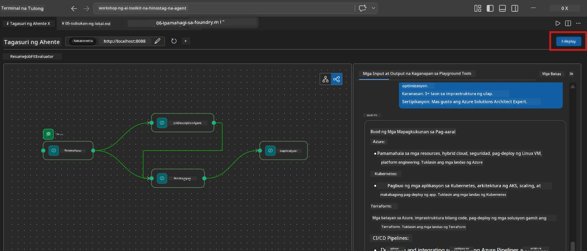
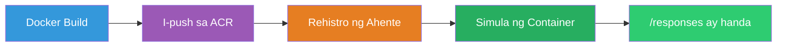
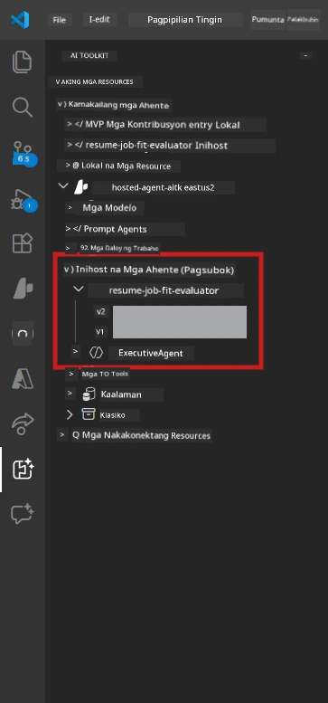

# Module 6 - I-deploy sa Foundry Agent Service

Sa module na ito, ide-deploy mo ang locally-tested na multi-agent workflow mo sa [Microsoft Foundry](https://learn.microsoft.com/azure/foundry/agents/concepts/hosted-agents) bilang isang **Hosted Agent**. Ang proseso ng deployment ay bumubuo ng isang Docker container image, pini-push ito sa [Azure Container Registry (ACR)](https://learn.microsoft.com/azure/container-registry/container-registry-intro), at lumilikha ng isang hosted agent version sa [Foundry Agent Service](https://learn.microsoft.com/azure/foundry/agents/how-to/publish-agent).

> **Pangunahing pagkakaiba mula sa Lab 01:** Pareho ang proseso ng deployment. Tinitingnan ng Foundry ang multi-agent workflow mo bilang isang solong hosted agent - ang komplikasyon ay nasa loob ng container, ngunit ang deployment surface ay pareho pa rin na `/responses` endpoint.

---

## Prerequisites check

Bago mag-deploy, tiyaking ang bawat item sa ibaba ay tama:

1. **Pumasa ang agent sa mga local smoke tests:**
   - Natapos mo ang lahat ng 3 tests sa [Module 5](05-test-locally.md) at ang workflow ay nagbigay ng kumpletong output na may gap cards at Microsoft Learn URLs.

2. **Mayroon kang [Azure AI User](https://learn.microsoft.com/azure/foundry/concepts/rbac-foundry) role:**
   - Na-assign sa [Lab 01, Module 2](../../lab01-single-agent/docs/02-create-foundry-project.md). I-verify:
   - [Azure Portal](https://portal.azure.com) → ang iyong Foundry **project** resource → **Access control (IAM)** → **Role assignments** → kumpirmahin na nakalista ang **[Azure AI User](https://aka.ms/foundry-ext-project-role)** para sa iyong account.

3. **Nakapasok ka sa Azure sa VS Code:**
   - Tingnan ang Accounts icon sa ibabang-kaliwang bahagi ng VS Code. Dapat makita ang pangalan ng iyong account.

4. **Tamang mga halaga sa `agent.yaml`:**
   - Buksan ang `PersonalCareerCopilot/agent.yaml` at i-verify:
     ```yaml
     environment_variables:
       - name: PROJECT_ENDPOINT
         value: ${PROJECT_ENDPOINT}
       - name: MODEL_DEPLOYMENT_NAME
         value: ${MODEL_DEPLOYMENT_NAME}
     ```
   - Dapat tugma ito sa mga env vars na binabasa ng `main.py` mo.

5. **Tamang mga bersyon sa `requirements.txt`:**
   ```
   agent-framework-azure-ai==1.0.0rc3
   agent-framework-core==1.0.0rc3
   azure-ai-agentserver-agentframework==1.0.0b16
   azure-ai-agentserver-core==1.0.0b16
   debugpy
   agent-dev-cli --pre
   ```

---

## Step 1: Simulan ang deployment

### Option A: Mag-deploy mula sa Agent Inspector (inirerekomenda)

Kung tumatakbo ang agent gamit ang F5 at bukas ang Agent Inspector:

1. Tumingin sa **itaas-kanang sulok** ng Agent Inspector panel.
2. I-click ang **Deploy** na button (cloud icon na may pataas na arrow ↑).
3. Magbubukas ang deployment wizard.



### Option B: Mag-deploy mula sa Command Palette

1. Pindutin ang `Ctrl+Shift+P` para buksan ang **Command Palette**.
2. I-type: **Microsoft Foundry: Deploy Hosted Agent** at piliin ito.
3. Magbubukas ang deployment wizard.

---

## Step 2: I-configure ang deployment

### 2.1 Piliin ang target na proyekto

1. May lalabas na dropdown na nagpapakita ng iyong mga Foundry projects.
2. Piliin ang project na ginamit mo sa buong workshop (hal., `workshop-agents`).

### 2.2 Piliin ang container agent file

1. Hihilingin sa’yo na piliin ang entry point ng agent.
2. Pumunta sa `workshop/lab02-multi-agent/PersonalCareerCopilot/` at piliin ang **`main.py`**.

### 2.3 I-configure ang mga resources

| Setting | Recommended value | Tala |
|---------|------------------|-------|
| **CPU** | `0.25` | Default. Hindi kailangan ng multi-agent workflows ng mas maraming CPU dahil I/O-bound ang model calls |
| **Memory** | `0.5Gi` | Default. Dagdagan sa `1Gi` kung maglalagay ka ng malalaking data processing tools |

---

## Step 3: Kumpirmahin at i-deploy

1. Ipinapakita ng wizard ang deployment summary.
2. Suriin at i-click ang **Confirm and Deploy**.
3. Panoorin ang progreso sa VS Code.

### Ano ang nangyayari habang nagde-deploy

Panoorin ang VS Code **Output** panel (piliin ang "Microsoft Foundry" dropdown):


1. **Docker build** - Binubuo ang container mula sa iyong `Dockerfile`:
   ```
   Step 1/6 : FROM python:3.14-slim
   Step 2/6 : WORKDIR /app
   ...
   Successfully built abc123def456
   ```

2. **Docker push** - Pinipush ang image sa ACR (1-3 minuto sa unang deploy).

3. **Agent registration** - Gumagawa ang Foundry ng hosted agent gamit ang `agent.yaml` metadata. Ang pangalan ng agent ay `resume-job-fit-evaluator`.

4. **Container start** - Nagsisimula ang container sa managed infrastructure ng Foundry gamit ang system-managed identity.

> **Mas mabagal ang unang deployment** (pinipush ang lahat ng layers ng Docker). Ang mga susunod na deployment ay gumagamit ng naka-cache na layers at mas mabilis.

### Mga tala na pang-multi-agent

- **Lahat ng apat na agent ay nasa loob lamang ng isang container.** Nakikita ng Foundry ang isang solong hosted agent. Tumutakbo ang WorkflowBuilder graph sa loob ng container.
- **Ang MCP calls ay lumalabas ng container.** Kailangan ng container ng internet access para maabot ang `https://learn.microsoft.com/api/mcp`. Ang managed infrastructure ng Foundry ay nagbibigay nito bilang default.
- **[Managed Identity](https://learn.microsoft.com/python/api/overview/azure/identity-readme#managed-identity-support).** Sa hosted environment, ang `get_credential()` sa `main.py` ay nagbabalik ng `ManagedIdentityCredential()` (dahil naka-set ang `MSI_ENDPOINT`). Ito ay awtomatiko.

---

## Step 4: I-verify ang deployment status

1. Buksan ang **Microsoft Foundry** sidebar (i-click ang Foundry icon sa Activity Bar).
2. I-expand ang **Hosted Agents (Preview)** sa ilalim ng iyong proyekto.
3. Hanapin ang **resume-job-fit-evaluator** (o ang pangalan ng iyong agent).
4. I-click ang pangalan ng agent → i-expand ang mga versions (hal., `v1`).
5. I-click ang version → tingnan ang **Container Details** → **Status**:



| Status | Kahulugan |
|--------|---------|
| **Started** / **Running** | Nakatakbo ang container, handa ang agent |
| **Pending** | Nagsisimula pa ang container (maghintay ng 30-60 segundo) |
| **Failed** | Nabigong magsimula ang container (tingnan ang mga logs - nasa ibaba) |

> **Mas matagal magsimula ang multi-agent** kaysa sa single-agent dahil lumilikha ang container ng 4 agent instances sa pagsisimula. Normal ang "Pending" na tumagal hanggang 2 minuto.

---

## Mga karaniwang error sa deployment at mga solusyon

### Error 1: Permission denied - `agents/write`

```
Error: lacks the required data action 
Microsoft.CognitiveServices/accounts/AIServices/agents/write
```

**Solusyon:** Mag-assign ng **[Azure AI User](https://learn.microsoft.com/azure/foundry/concepts/rbac-foundry)** role sa antas ng **project**. Tingnan ang [Module 8 - Troubleshooting](08-troubleshooting.md) para sa step-by-step na mga tagubilin.

### Error 2: Hindi tumatakbo ang Docker

```
Error: Docker build failed / Cannot connect to Docker daemon
```

**Solusyon:**
1. Simulan ang Docker Desktop.
2. Maghintay hanggang lumabas ang "Docker Desktop is running".
3. I-verify: `docker info`
4. **Windows:** Siguraduhing naka-enable ang WSL 2 backend sa Docker Desktop settings.
5. Subukan muli.

### Error 3: Pip install nabibigo habang nagbu-build ng Docker

```
Error: Could not find a version that satisfies the requirement agent-dev-cli
```

**Solusyon:** Ang `--pre` flag sa `requirements.txt` ay ibang handling sa Docker. Siguraduhing ang `requirements.txt` mo ay may:
```
agent-dev-cli --pre
```

Kung hindi pa rin pumasa ang Docker, gumawa ng `pip.conf` o ipasa ang `--pre` bilang build argument. Tingnan ang [Module 8](08-troubleshooting.md).

### Error 4: Nagkakaproblema ang MCP tool sa hosted agent

Kung huminto ang Gap Analyzer sa pag-produce ng Microsoft Learn URLs pagkatapos i-deploy:

**Sanhi:** Maaaring may network policy na nagba-block ng outbound HTTPS mula sa container.

**Solusyon:**
1. Kadalasang hindi ito problema sa default na configuration ng Foundry.
2. Kung nangyari, tingnan kung ang virtual network ng Foundry project ay may NSG na nagba-block ng outbound HTTPS.
3. May built-in na fallback URLs ang MCP tool, kaya magpapatuloy pa rin gumawa ng output ang agent (kahit walang live URLs).

---

### Checkpoint

- [ ] Natapos ang deployment command nang walang error sa VS Code
- [ ] Lumitaw ang agent sa ilalim ng **Hosted Agents (Preview)** sa Foundry sidebar
- [ ] Ang pangalan ng agent ay `resume-job-fit-evaluator` (o ang pinili mong pangalan)
- [ ] Ipinapakita ng container status ang **Started** o **Running**
- [ ] (Kung may error) Natukoy mo ang error, na-apply ang solusyon, at na-deploy ulit ng maayos

---

**Nakaraan:** [05 - Test Locally](05-test-locally.md) · **Susunod:** [07 - Verify in Playground →](07-verify-in-playground.md)

---

<!-- CO-OP TRANSLATOR DISCLAIMER START -->
**Paunawa**:
Ang dokumentong ito ay isinalin gamit ang AI translation service na [Co-op Translator](https://github.com/Azure/co-op-translator). Bagama't nagsusumikap kami para sa katumpakan, pakatandaan na ang mga automated na pagsasalin ay maaaring maglaman ng mga pagkakamali o di-tumpak na impormasyon. Ang orihinal na dokumento sa wikang kinabibilangan nito ang dapat ituring na pangunahing sanggunian. Para sa mahahalagang impormasyon, inirerekomenda ang propesyonal na pagsasalin ng tao. Hindi kami mananagot sa anumang hindi pagkakaunawaan o maling interpretasyon na sanhi ng paggamit ng pagsasaling ito.
<!-- CO-OP TRANSLATOR DISCLAIMER END -->