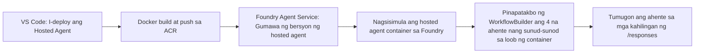
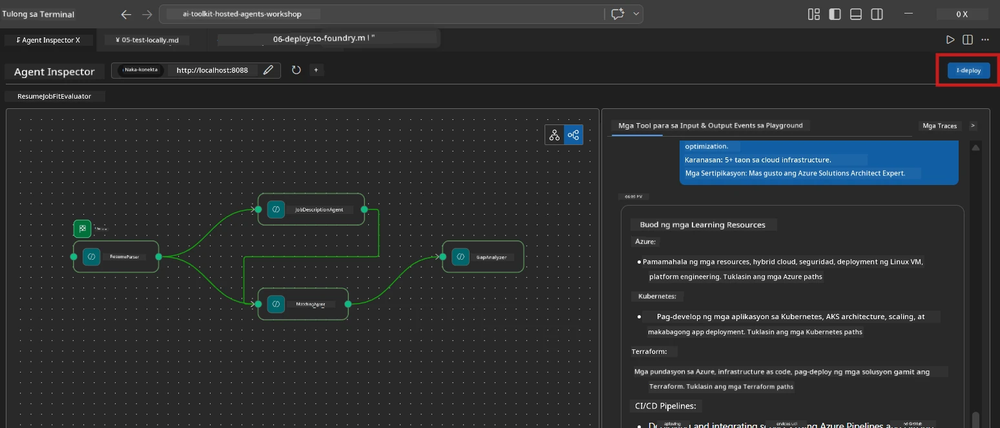

# Module 6 - I-deploy sa Foundry Agent Service

⏱️ ~10 min

Sa module na ito, i-de-deploy mo ang iyong locally-tested multi-agent workflow sa [Microsoft Foundry](https://learn.microsoft.com/azure/foundry/agents/concepts/hosted-agents) bilang isang **Hosted Agent**. Ang proseso ng deployment ay bumubuo ng Docker container image, itinutulak ito sa [Azure Container Registry (ACR)](https://learn.microsoft.com/azure/container-registry/container-registry-intro), at lumilikha ng isang hosted agent na bersyon sa [Foundry Agent Service](https://learn.microsoft.com/azure/foundry/agents/how-to/publish-agent).

> **Pangunahing kaibahan mula sa Lab 01:** Pareho lamang ang proseso ng deployment. Tinitingnan ng Foundry ang iyong multi-agent workflow bilang isang hosted agent lamang - ang kumplikado ay nasa loob ng container, ngunit ang deployment surface ay pareho pa ring `/responses` endpoint.

### Deployment pipeline


```mermaid
flowchart LR
    A[VS Code: I-deploy ang Hosted Agent] --> B[Docker build at push sa ACR]
    B --> C[Foundry Agent Service: Gumawa ng bersyon ng hosted agent]
    C --> D[Nagsisimula ang hosted agent container sa Foundry]
    D --> E[Pinapatakbo ng WorkflowBuilder ang 4 na ahente nang sunud-sunod sa loob ng container]
    E --> F[Tumugon ang ahente sa mga kahilingan ng /responses]
```

---

## Prerequisites check

Bago mag-deploy, siguraduhing kumpleto ang bawat item sa ibaba:

1. **Ang Agent ay pumasa sa lokal na smoke tests:**
   - Natapos mo ang lahat ng 3 tests sa [Module 5](05-test-locally.md) at ang workflow ay nagbigay ng kumpletong output na may gap cards at Microsoft Learn URLs.

2. **Mayroon kang [Foundry User](https://learn.microsoft.com/azure/foundry/concepts/rbac-foundry) role** (para makapag-deploy, kailangan mo ng minimum na **Foundry Project Manager** sa project scope):

   > **Tandaan:** Kamakailan lang ay pinalitan ang pangalan ng Foundry RBAC roles - ang **Foundry User**, **Foundry Owner**, at **Foundry Project Manager** ay dating tinatawag na Azure AI User, Azure AI Owner, at Azure AI Project Manager. Hindi nagbago ang Role IDs at mga permiso.

   - Siguraduhing tingnan sa [Azure Portal](https://portal.azure.com) → iyong Foundry **project** resource → **Access control (IAM)** → **Role assignments** → tiyaking nakalista ang **Foundry User** (o mas mataas) para sa iyong account.

3. **Nakalog-in ka sa Azure sa VS Code:**
   - Tingnan ang Accounts icon sa ibabang kaliwa ng VS Code. Dapat makita ang pangalan ng iyong account.

4. **May tamang mga value ang `agent.yaml`:**
   - Buksan ang `PersonalCareerCopilot/agent.yaml` at siguraduhing:
     ```yaml
     environment_variables:
       - name: AZURE_AI_MODEL_DEPLOYMENT_NAME
         value: ${AZURE_AI_MODEL_DEPLOYMENT_NAME}
     ```
   - Hindi naka-lista rito ang `FOUNDRY_PROJECT_ENDPOINT` - ini-inject ito ng Foundry sa runtime. Tanging `AZURE_AI_MODEL_DEPLOYMENT_NAME` lang ang kailangang ideklara.

5. **May tamang mga bersyon ang `requirements.txt`:**
   ```
   agent-framework-foundry
   agent-framework-foundry-hosting
   mcp<2,>=1.24.0
   debugpy
   ```

---

## Hakbang 1: Simulan ang deployment

### Opsyon A: Mag-deploy mula sa Agent Inspector (inirerekomenda)

Kung tumatakbo ang agent gamit ang F5 at nakabukas ang Agent Inspector:

1. Tingnan ang **kanang itaas na sulok** ng Agent Inspector panel.
2. I-click ang **Deploy** button (cloud icon na may pataas na arrow ↑).
3. Lalabas ang deployment wizard.



### Opsyon B: Mag-deploy mula sa Command Palette

1. Pindutin ang `Ctrl+Shift+P` para buksan ang **Command Palette**.
2. I-type: **Foundry Toolkit: Deploy Hosted Agent** at piliin ito.
3. Lalabas ang deployment wizard.

---

## Hakbang 2: I-configure ang deployment

### 2.1 Piliin ang target na proyekto

1. Lalabas ang dropdown ng iyong mga Foundry projects.
2. Piliin ang proyekto na ginamit mo sa buong workshop (hal. `workshop-agents`).

### 2.2 Piliin ang container agent file

1. Hihilingin kang piliin ang agent entry point.
2. Pumunta sa `workshop/lab02-multi-agent/PersonalCareerCopilot/` at piliin ang **`main.py`**.

### 2.3 I-configure ang mga resources

| Setting | Inirerekomendang value | Mga Tala |
|---------|------------------|-------|
| **Deployment Method** | **Container** (inirerekomenda) o **Code** | Ang Container ay nagtayo ng Docker image; ang Code ay nagpapadala ng source bilang ZIP (preview) |
| **Container Registry** | **Default ACR** | Gumagawa at nangangasiwa ang Foundry ng isa para sa iyo |
| **CPU** | `0.25` | Default. Hindi kailangan ng multi-agent workflows ng mas malaking CPU dahil nakatuon sa I/O ang mga tawag sa modelo |
| **Memory** | `0.5Gi` | Default. Palakihin sa `1Gi` kung magdadagdag ka ng malalaking data processing tools |

---

## Hakbang 3: Kumpirmahin at i-deploy

1. Ipinapakita ng wizard ang deployment summary.
2. Suriin at i-click ang **Confirm and Deploy**.
3. Panoorin ang progreso sa VS Code.

### Ano ang nangyayari habang nagde-deploy

Panoorin ang VS Code **Output** panel (piliin ang "Microsoft Foundry" dropdown):

1. **Docker build** - Bumubuo ng container mula sa iyong `Dockerfile`
   ```
   Step 1/6 : FROM python:3.12-slim
   Step 2/6 : WORKDIR /app
   ...
   Successfully built abc123def456
   ```

2. **Docker push** - Itinutulak ang image sa ACR (1-3 minuto sa unang deploy).

3. **Agent registration** - Gumagawa ang Foundry ng hosted agent gamit ang `agent.yaml` na metadata. Ang pangalan ng agent ay `resume-job-fit-evaluator`.

4. **Container start** - Nagsisimula ang container sa pinangangasiwaang imprastraktura ng Foundry na may system-managed identity.

> **Mas mabagal ang unang deployment** (itinutulak ng Docker ang lahat ng layers). Ginagamit ulit ang naka-cache na layers sa mga susunod na deployment kaya mas mabilis ito.

### Mga tala na partikular sa multi-agent

- **Lahat ng apat na agents ay nasa iisang container.** Nakikita ng Foundry ang isang hosted agent lamang. Ang WorkflowBuilder graph ay tumatakbo sa loob.
- **Pumapalabas ang mga tawag ng MCP.** Nangangailangan ng internet access ang container para maabot ang `https://learn.microsoft.com/api/mcp`. Ang pinangangasiwaang imprastraktura ng Foundry ay nagbibigay nito bilang default.
- **[Managed Identity](https://learn.microsoft.com/azure/foundry/agents/concepts/agent-identity).** Awtomatikong lumilikha ang Foundry ng **dedicated per-agent Entra identity** para sa bawat Hosted agent sa oras ng deployment. Sa hosted environment, ang `DefaultAzureCredential` ay automatic na nagreresolve sa identitad ng agent na ito - hindi kailangan ng manwal na configuration ng managed identity.

---

## Hakbang 4: Suriin ang status ng deployment

1. Buksan ang **Microsoft Foundry** sidebar (i-click ang Foundry icon sa Activity Bar).
2. Palawakin ang **Hosted Agents (Preview)** sa ilalim ng iyong proyekto.
3. Hanapin ang **resume-job-fit-evaluator** (o ang pangalan ng iyong agent).
4. I-click ang pangalan ng agent → palawakin ang mga bersyon (hal. `v1`).
5. I-click ang bersyon → tingnan ang **Container Details** → **Status**:


| Status | Kahulugan |
|--------|---------|
| **active** | Tumatakbo ang agent at handa nang tumanggap ng mga request |
| **creating** | Nagsisimula ang container (maghintay ng 30–60 segundo) |
| **failed** | Nabigo ang container na magsimula (tingnan ang mga log - mabasa sa ibaba) |

> **Tanda:** Maaring magpakita ang VS Code sidebar ng mga label tulad ng "Running" o "Started" habang ang status sa ilalim ng API ay gumagamit ng `active`/`creating`. Parehong estado ang ipinapakita ng mga ito.

> **Mas matagal ang pagsisimula ng multi-agent** kumpara sa single-agent dahil lumilikha ang container ng 4 na agent instances kapag nagsisimula. Ang `creating` na status nang hanggang 2 minuto ay normal.

---

## Karaniwang mga error sa deployment at mga solusyon

### Error 1: Permission denied - `agents/write`

```
Error: lacks the required data action 
Microsoft.CognitiveServices/accounts/AIServices/agents/write
```

**Ayusin:** Mag-assign ng **[Foundry User](https://learn.microsoft.com/azure/foundry/concepts/rbac-foundry)** role (dati ay **Azure AI User**) sa antas ng **proyekto**. Tingnan ang [Module 8 - Troubleshooting](08-troubleshooting.md) para sa gabay hakbang-hakbang.

### Error 2: Hindi tumatakbo ang Docker

```
Error: Docker build failed / Cannot connect to Docker daemon
```

**Ayusin:**
1. Simulan ang Docker Desktop.
2. Maghintay para sa "Docker Desktop is running".
3. Siguraduhing gumagana: `docker info`
4. **Windows:** Siguraduhing naka-enable ang WSL 2 backend sa mga setting ng Docker Desktop.
5. Subukang muli.

### Error 3: Nabibigo ang pip install habang bumubuo ng Docker

```
Error: Could not find a version that satisfies the requirement agent-framework-foundry
```

**Ayusin:** Siguraduhing tugma ang `requirements.txt`:
```
agent-framework-foundry
agent-framework-foundry-hosting
mcp<2,>=1.24.0
debugpy
```

Kung nangyayari pa rin ang error sa build, maaaring hinaharangan ng iyong Docker network ang PyPI. Tingnan ang `docker info` para sa mga proxy setting.

### Error 4: Nabibigo ang MCP tool sa hosted agent

Kung humihinto ang Gap Analyzer sa paggawa ng Microsoft Learn URLs pagkatapos ng deployment:

**Ulat ng sanhi:** Maaaring hinaharangan ng network policy ang outbound HTTPS mula sa container.

**Ayusin:**
1. Kadalasan, hindi ito problema sa default na configuration ng Foundry.
2. Kung nangyari ito, tingnan kung ang virtual network ng Foundry project ay may NSG na humaharang sa outbound HTTPS.
3. May built-in fallback URLs ang MCP tool kaya magpapatuloy pa rin ang agent na gumawa ng output (kahit walang live URLs).

---

### Checkpoint

- [ ] Natapos ang deployment command nang walang error sa VS Code
- [ ] Lumabas ang agent sa ilalim ng **Hosted Agents (Preview)** sa Foundry sidebar
- [ ] Ang pangalan ng agent ay `resume-job-fit-evaluator` (o ang pinili mong pangalan)
- [ ] Ipinapakita ng container status ang **Started** o **Running**
- [ ] (Kung may mga error) Nakatukoy ka ng error, naipatupad ang solusyon, at na-deploy muli nang matagumpay

---

**Previous:** [05 - Test Locally](05-test-locally.md) · **Next:** [07 - Verify in Playground →](07-verify-in-playground.md)

---

<!-- CO-OP TRANSLATOR DISCLAIMER START -->
**Pagtatanggi**:
Ang dokumentong ito ay isinalin gamit ang serbisyo ng AI translation na [Co-op Translator](https://github.com/Azure/co-op-translator). Bagama't nagsusumikap kami para sa katumpakan, pakatandaan na ang awtomatikong pagsasalin ay maaaring maglaman ng mga pagkakamali o hindi pagkakatugma. Ang orihinal na dokumento sa orihinal nitong wika ang dapat ituring na pangunahing sanggunian. Para sa mahahalagang impormasyon, inirerekomenda ang propesyonal na pagsasalin ng tao. Hindi kami mananagot sa anumang maling pagkakaintindi o maling interpretasyon na nagmula sa paggamit ng pagsasaling ito.
<!-- CO-OP TRANSLATOR DISCLAIMER END -->