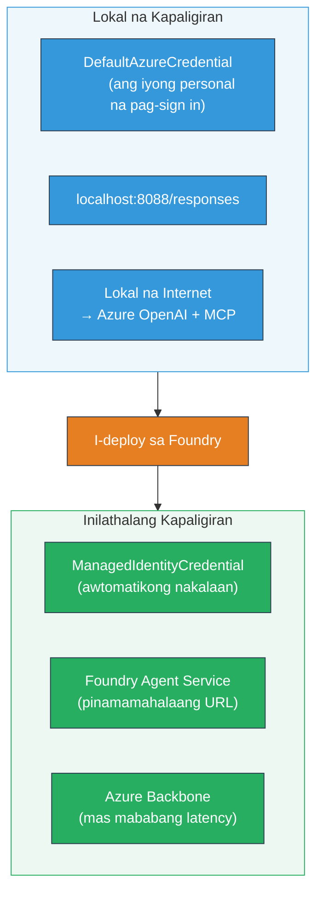

# Module 7 - Beripikahin sa Playground

Sa modyul na ito, susubukan mo ang iyong na-deploy na multi-agent workflow sa parehong **VS Code** at **[Foundry Portal](https://ai.azure.com)**, na pinatutunayan na kumikilos ang agent nang katulad ng pagsusuri sa lokal.

---

## Bakit kailangang beripikahin pagkatapos ng deployment?

Tumakbo nang perpekto ang iyong multi-agent workflow sa lokal, kaya bakit susubukan muli? Ang naka-host na kapaligiran ay naiiba sa ilang aspeto:


| Kaibahan | Lokal | Hosted |
|-----------|-------|--------|
| **Identity** | [`DefaultAzureCredential`](https://learn.microsoft.com/azure/developer/python/sdk/authentication/credential-chains#defaultazurecredential-overview) (iyong personal na pag-sign-in) | [`ManagedIdentityCredential`](https://learn.microsoft.com/python/api/overview/azure/identity-readme#managed-identity-support) (auto-provisioned) |
| **Endpoint** | `http://localhost:8088/responses` | [Foundry Agent Service](https://learn.microsoft.com/azure/foundry/agents/concepts/hosted-agents) endpoint (managed URL) |
| **Network** | Lokal na makina → Azure OpenAI + MCP outbound | Backbone ng Azure (mas mababang latency sa pagitan ng mga serbisyo) |
| **MCP connectivity** | Lokal na internet → `learn.microsoft.com/api/mcp` | Container outbound → `learn.microsoft.com/api/mcp` |

Kung may maling pagkakaayos ng environment variable, nagkakaiba ang RBAC, o na-block ang MCP outbound, mahuhuli mo ito dito.

---

## Opsyon A: Subukan sa VS Code Playground (inirerekomenda muna)

Ang [Foundry extension](https://marketplace.visualstudio.com/items?itemName=TeamsDevApp.vscode-ai-foundry) ay may kasamang integrated Playground na nagpapahintulot sa iyo na makipag-chat sa iyong na-deploy na agent nang hindi lumalabas ng VS Code.

### Hakbang 1: Puntahan ang iyong naka-host na agent

1. I-click ang **Microsoft Foundry** icon sa VS Code **Activity Bar** (kaliwa sidebar) para buksan ang Foundry panel.
2. Palawakin ang iyong konektadong proyekto (hal., `workshop-agents`).
3. Palawakin ang **Hosted Agents (Preview)**.
4. Makikita mo ang pangalan ng iyong agent (hal., `resume-job-fit-evaluator`).

### Hakbang 2: Piliin ang isang bersyon

1. I-click ang pangalan ng agent para palawakin ang mga bersyon nito.
2. I-click ang bersyon na na-deploy mo (hal., `v1`).
3. Bubukas ang **detail panel** na nagpapakita ng Container Details.
4. Beripikahin kung ang status ay **Started** o **Running**.

### Hakbang 3: Buksan ang Playground

1. Sa detail panel, i-click ang **Playground** button (o i-right-click ang bersyon → **Open in Playground**).
2. Bubukas ang chat interface sa isang tab ng VS Code.

### Hakbang 4: Patakbuhin ang iyong smoke tests

Gamitin ang parehong 3 tests mula sa [Module 5](05-test-locally.md). I-type ang bawat mensahe sa input box ng Playground at pindutin ang **Send** (o **Enter**).

#### Test 1 - Buong resume + JD (standard flow)

I-paste ang buong resume + JD prompt mula sa Module 5, Test 1 (Jane Doe + Senior Cloud Engineer sa Contoso Ltd).

**Inaasahan:**
- Fit score na may breakdown math (100-point scale)
- Matched Skills na seksyon
- Missing Skills na seksyon
- **Isang gap card bawat nawawalang kasanayan** na may mga Microsoft Learn URLs
- Learning roadmap na may timeline

#### Test 2 - Mabilis na maikling test (minimal input)

```
RESUME: 3 years Python developer, knows Django and PostgreSQL, no cloud experience.

JOB: Cloud DevOps Engineer requiring AWS, Kubernetes, Terraform, CI/CD. 5 years needed.
```

**Inaasahan:**
- Mas mababang fit score (< 40)
- Tapat na pagtatasa na may staged learning path
- Maraming gap cards (AWS, Kubernetes, Terraform, CI/CD, karanasan na kulang)

#### Test 3 - Kandidato na mataas ang fit

```
RESUME:
10 years Azure Cloud Architect. AZ-305 certified. Expert in AKS, Terraform, Azure DevOps, 
Azure Functions, Helm, Prometheus, Grafana, Python, Go. Led platform team of 8.

JOB:
Senior Cloud Engineer. Required: AKS, Terraform, Azure DevOps, Python. Preferred: Helm, Go.
5+ years experience. AZ-305 preferred.
```

**Inaasahan:**
- Mataas na fit score (≥ 80)
- Pokus sa kahandaan sa interbyu at paghasa
- Kaunti o walang gap cards
- Maikling timeline na nakasentro sa paghahanda

### Hakbang 5: Ihambing sa lokal na resulta

Buksan ang iyong mga tala o browser tab mula sa Module 5 kung saan tinago mo ang mga lokal na sagot. Para sa bawat test:

- Pareho ba ang **istruktura** ng sagot (fit score, gap cards, roadmap)?
- Sinusunod ba nito ang **parehong scoring rubric** (100-point breakdown)?
- Nandyan pa ba ang **Microsoft Learn URLs** sa mga gap cards?
- May **isang gap card bawat nawawalang kasanayan** ba (hindi pinaikli)?

> **Normal lamang ang mga kaunting pagkakaiba sa salita** - non-deterministic ang modelo. Ituon ang pansin sa istruktura, pagkakapareho ng scoring, at paggamit ng MCP tool.

---

## Opsyon B: Subukan sa Foundry Portal

Ang [Foundry Portal](https://ai.azure.com) ay nagbibigay ng playground na web-based na kapaki-pakinabang para sa pagbabahagi sa mga kasama sa koponan o stakeholders.

### Hakbang 1: Buksan ang Foundry Portal

1. Buksan ang iyong browser at pumunta sa [https://ai.azure.com](https://ai.azure.com).
2. Mag-sign in gamit ang parehong Azure account na ginagamit mo sa buong workshop.

### Hakbang 2: Puntahan ang iyong proyekto

1. Sa home page, hanapin ang **Recent projects** sa kaliwang sidebar.
2. I-click ang pangalan ng iyong proyekto (hal., `workshop-agents`).
3. Kung hindi mo ito makita, i-click ang **All projects** at hanapin.

### Hakbang 3: Hanapin ang iyong na-deploy na agent

1. Sa kaliwang navigation ng proyekto, i-click ang **Build** → **Agents** (o hanapin ang seksyong **Agents**).
2. Dapat makakita ka ng listahan ng mga agent. Hanapin ang na-deploy mo (hal., `resume-job-fit-evaluator`).
3. I-click ang pangalan ng agent para buksan ang detail page nito.

### Hakbang 4: Buksan ang Playground

1. Sa agent detail page, tingnan ang toolbar sa itaas.
2. I-click ang **Open in playground** (o **Try in playground**).
3. Bubukas ang chat interface.

### Hakbang 5: Patakbuhin ang parehong smoke tests

Ulitin ang lahat ng 3 tests mula sa VS Code Playground na seksyon sa itaas. Ihambing ang bawat sagot sa parehong lokal na resulta (Module 5) at VS Code Playground results (Opsyon A sa itaas).

---

## Multi-agent na espesipikong beripikasyon

Bukod sa pangkalahatang pagiging tama, beripikahin ang mga sumusunod na multi-agent na espesipikong gawi:

### MCP tool execution

| Suriin | Paano beripikahin | Kundisyon ng pagpasa |
|-------|-------------------|---------------------|
| Nagtagumpay ang MCP calls | May `learn.microsoft.com` URLs ang mga gap cards | Totoong URLs, hindi fallback na mensahe |
| Maramihang MCP calls | Bawat High/Medium priority gap ay may resources | Hindi lang ang unang gap card |
| Gumagana ang MCP fallback | Kung nawawala ang URLs, tingnan kung may fallback na teksto | Gumagawa pa rin ng gap cards ang agent (may o walang URLs) |

### Pakikipag-ugnayan ng Agent

| Suriin | Paano beripikahin | Kundisyon ng pagpasa |
|-------|-------------------|---------------------|
| Lahat ng 4 na agent ay tumakbo | Output ay naglalaman ng fit score AT gap cards | Score mula sa MatchingAgent, cards mula sa GapAnalyzer |
| Parallel fan-out | Katanggap-tanggap ang oras ng pag-responde (< 2 min) | Kung > 3 min, maaaring hindi gumagana ang parallel execution |
| Integridad ng data flow | Ang gap cards ay tumutukoy sa mga kasanayan mula sa matching report | Walang halusinadong kasanayan na wala sa JD |

---

## Validation rubric

Gamitin ang rubric na ito para suriin ang hosted behavior ng iyong multi-agent workflow:

| # | Pamantayan | Kundisyon ng pagpasa | Passed? |
|---|------------|----------------------|---------|
| 1 | **Functional correctness** | Tumugon ang agent sa resume + JD na may fit score at gap analysis | |
| 2 | **Scoring consistency** | Gumamit ng 100-point scale ang fit score na may breakdown math | |
| 3 | **Gap card completeness** | Isang card bawat nawawalang kasanayan (hindi pinaikli o pinagsama) | |
| 4 | **MCP tool integration** | Ang mga gap cards ay may totoong Microsoft Learn URLs | |
| 5 | **Structural consistency** | Kapareho ang istruktura ng output sa lokal at hosted na pagtakbo | |
| 6 | **Response time** | Tumugon ang hosted agent sa loob ng 2 minuto para sa buong assessment | |
| 7 | **No errors** | Walang HTTP 500 errors, timeouts, o walang lamang sagot | |

> Ang "pass" ay nangangahulugang lahat ng 7 pamantayan ay natugunan para sa lahat ng 3 smoke tests sa kahit isang playground (VS Code o Portal).

---

## Pag-ayos ng problema sa playground

| Sintomas | Posibleng sanhi | Ayusin |
|---------|----------------|--------|
| Hindi naglo-load ang Playground | Hindi "Started" ang estado ng container | Bumalik sa [Module 6](06-deploy-to-foundry.md), beripikahin ang deployment status. Maghintay kung "Pending" |
| Walang sagot na ibinabalik ang Agent | Mismatch ang pangalan ng model deployment | Suriin ang `agent.yaml` → `environment_variables` → `MODEL_DEPLOYMENT_NAME` na tumutugma sa deployed model |
| Nagbabalik ng error message ang Agent | Nawawala ang pahintulot sa [RBAC](https://learn.microsoft.com/azure/foundry/concepts/rbac-foundry) | I-assign ang **[Azure AI User](https://aka.ms/foundry-ext-project-role)** sa saklaw ng proyekto |
| Walang Microsoft Learn URLs sa gap cards | Na-block ang MCP outbound o hindi available ang MCP server | Suriin kung maabot ng container ang `learn.microsoft.com`. Tingnan ang [Module 8](08-troubleshooting.md) |
| Isa lang ang gap card (pinaikli) | Nawawala ang "CRITICAL" block sa GapAnalyzer instructions | Balikan ang [Module 3, Step 2.4](03-configure-agents.md) |
| Malayo ang fit score sa lokal | Iba ang model o instructions na na-deploy | Ihambing ang `agent.yaml` env vars sa lokal na `.env`. Mag-redeploy kung kailangan |
| "Agent not found" sa Portal | Patuloy ang propagation ng deployment o nag-fail | Maghintay ng 2 minuto, i-refresh. Kung wala pa rin, mag-redeploy mula sa [Module 6](06-deploy-to-foundry.md) |

---

### Checkpoint

- [ ] Nasubukan ang agent sa VS Code Playground - lahat ng 3 smoke tests ay pumasa
- [ ] Nasubukan ang agent sa [Foundry Portal](https://ai.azure.com) Playground - lahat ng 3 smoke tests ay pumasa
- [ ] Ang mga sagot ay istrukturang pare-pareho sa lokal na pagsusuri (fit score, gap cards, roadmap)
- [ ] Nandiyan ang Microsoft Learn URLs sa gap cards (gumagana ang MCP tool sa hosted na kapaligiran)
- [ ] Isang gap card bawat nawawalang kasanayan (walang pagpapaikli)
- [ ] Walang error o timeout habang sinusubukan
- [ ] Nakumpleto ang validation rubric (lahat ng 7 pamantayan ay pumasa)

---

**Nauna:** [06 - Deploy to Foundry](06-deploy-to-foundry.md) · **Susunod:** [08 - Troubleshooting →](08-troubleshooting.md)

---

<!-- CO-OP TRANSLATOR DISCLAIMER START -->
**Paunawa**:  
Ang dokumentong ito ay isinalin gamit ang AI translation service na [Co-op Translator](https://github.com/Azure/co-op-translator). Bagamat nagsusumikap kami para sa katumpakan, mangyaring tandaan na ang mga awtomatikong pagsasalin ay maaaring maglaman ng mga pagkakamali o di-tumpak na impormasyon. Ang orihinal na dokumento sa orihinal nitong wika ang dapat ituring na pangunahing sanggunian. Para sa mga mahalagang impormasyon, inirerekomenda ang propesyonal na pagsasalin ng tao. Hindi kami mananagot sa anumang hindi pagkakaintindihan o maling interpretasyon na maaaring mangyari mula sa paggamit ng pagsasaling ito.
<!-- CO-OP TRANSLATOR DISCLAIMER END -->