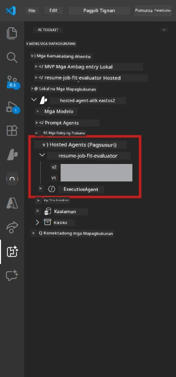

# Module 7 - Beripikahin sa Playground

⏱️ ~10 min

Sa module na ito, tinetest mo ang iyong na-deploy na multi-agent workflow sa VS Code at Foundry Portal, kinukumpirma na ang agent ay kumikilos tulad ng lokal na pag-test.

---

## Bakit kailangang mag-test ulit pagkatapos i-deploy?

Ang hosted environment ay naiiba sa lokal sa ilang mahahalagang paraan:

| | Lokal | Hosted |
|--|-------|--------|
| **Identity** | Ang iyong personal na sign-in (`DefaultAzureCredential`) | Nakalaang Entra identity bawat agent (awtomatikong ipinrovide pag-deploy) |
| **Endpoint** | `http://localhost:8088/responses` | Foundry Agent Service na pinamamahalaang URL |
| **Network** | Iyong makina → Azure OpenAI + MCP | Azure backbone (mas mababang latency) |

Isang maling configuration ng env var, RBAC issue, o nakaharang na MCP outbound call ay unang lalabas dito.

---

## Opsyon A: Mag-test sa VS Code Playground (unang inirerekomenda)

### Hakbang 1: Puntahan ang iyong hosted agent

1. I-click ang **Foundry Toolkit** icon sa Activity Bar.
2. Palawakin ang iyong proyekto → **Hosted Agents (Preview)** → hanapin ang iyong agent.



### Hakbang 2: Piliin ang isang bersyon

1. I-click ang agent para palawakin ang mga bersyon nito.
2. I-click ang `v1` → tiyakin na ang status ay **active** (maaaring magpakita ang sidebar ng "Running" o "Started" - parehong nangangahulugang handa na).

### Hakbang 3: Buksan ang Playground

1. I-click ang **Playground** (o i-right-click ang bersyon → **Open in Playground**).
2. Bubukas ang isang chat window sa VS Code tab.

### Hakbang 4: Patakbuhin ang mga smoke tests mo

Gamitin ang parehong 3 tests mula sa [Module 5](05-test-locally.md). I-type ang bawat mensahe sa Playground input box at pindutin ang **Send** (o **Enter**).

#### Test 1 - Buong resume + JD (karaniwang daloy)

I-paste ang buong resume + JD prompt mula sa Module 5, Test 1 (Jane Doe + Senior Cloud Engineer sa Contoso Ltd).

**Inaasahan:**
- Fit score na may paliwanag sa math (100-point scale)
- Matched Skills section
- Missing Skills section
- **Isang gap card bawat kulang na kasanayan** na may Microsoft Learn URLs
- Learning roadmap na may timeline

#### Test 2 - Mabilis at maikling test (minimal na input)

```
RESUME: 3 years Python developer, knows Django and PostgreSQL, no cloud experience.

JOB: Cloud DevOps Engineer requiring AWS, Kubernetes, Terraform, CI/CD. 5 years needed.
```

**Inaasahan:**
- Mas mababang fit score (< 40)
- Tapat na pagtatasa na may staged learning path
- Maramihang gap cards (AWS, Kubernetes, Terraform, CI/CD, kulang na karanasan)

#### Test 3 - Kandidato na may mataas na fit

```
RESUME:
10 years Azure Cloud Architect. AZ-305 certified. Expert in AKS, Terraform, Azure DevOps, 
Azure Functions, Helm, Prometheus, Grafana, Python, Go. Led platform team of 8.

JOB:
Senior Cloud Engineer. Required: AKS, Terraform, Azure DevOps, Python. Preferred: Helm, Go.
5+ years experience. AZ-305 preferred.
```

**Inaasahan:**
- Mataas na fit score (≥ 80)
- Pokus sa kahandaan sa interbyu at pag-pino
- Kaunti o walang gap cards
- Maikling timeline nakatuon sa paghahanda

### Hakbang 5: Ihambing sa lokal na resulta

Bukasan ang iyong mga tala o browser tab mula sa Module 5 kung saan mo sinave ang mga lokal na sagot. Para sa bawat test:

- Pareho ba ang **istruktura** ng tugon (fit score, gap cards, roadmap)?
- Sumusunod ba ito sa **parehong scoring rubric** (100-point na breakdown)?
- Nandiyan pa ba ang **Microsoft Learn URLs** sa gap cards?
- Mayroon bang **isang gap card bawat kulang na kasanayan** (hindi pinaikli)?

> **Normal lang ang maliliit na pagkakaiba sa mga salita** - ang modelo ay non-deterministic. Magtuon sa istruktura, konsistensya sa scoring, at paggamit ng MCP tool.

---

## Opsyon B: Mag-test sa Foundry Portal

Ang [Foundry Portal](https://ai.azure.com) ay nagbibigay ng web-based na playground na kapaki-pakinabang para sa pagbabahagi sa mga kasama sa koponan o stakeholders.

### Hakbang 1: Buksan ang Foundry Portal

1. Buksan ang iyong browser at pumunta sa [https://ai.azure.com](https://ai.azure.com).
2. Mag-sign in gamit ang parehong Azure account na ginagamit mo sa buong workshop.

### Hakbang 2: Puntahan ang iyong proyekto

1. Sa home page, hanapin ang **Recent projects** sa kaliwang sidebar.
2. I-click ang pangalan ng proyekto mo (e.g., `workshop-agents`).
3. Kung hindi mo ito makita, i-click ang **All projects** at hanapin ito.

### Hakbang 3: Hanapin ang iyong na-deploy na agent

1. Sa kaliwang navigation ng proyekto, i-click ang **Build** → **Agents** (o hanapin ang seksyon na **Agents**).
2. Dapat makita mo ang listahan ng mga agents. Hanapin ang iyong na-deploy na agent (e.g., `resume-job-fit-evaluator`).
3. I-click ang pangalan ng agent para buksan ang detail page nito.

### Hakbang 4: Buksan ang Playground

1. Sa agent detail page, tingnan ang top toolbar.
2. I-click ang **Open in playground** (o **Try in playground**).
3. Bubukas ang chat interface.

### Hakbang 5: Patakbuhin ang parehong smoke tests

Ulitin ang lahat ng 3 tests mula sa VS Code Playground section sa itaas. Ihambing ang bawat tugon sa parehong lokal na resulta (Module 5) at VS Code Playground results (Opsyon A sa itaas).

---

## Multi-agent na partikular na beripikasyon

Bukod sa pangkalahatang tama, beripikahin ang mga sumusunod na multi-agent-specific na kilos:

### Pagpapatupad ng MCP tool

| Suriin | Paano magberipika | Kundisyon ng pagdaan |
|-------|---------------|----------------|
| Tagumpay ng MCP calls | Ang mga gap card ay may `learn.microsoft.com` URLs | Totoong URLs, hindi mga fallback message |
| Maramihang MCP calls | Bawat High/Medium priority gap ay may mga resources | Hindi lang unang gap card |
| Gumagana ang MCP fallback | Kung nawawala ang URLs, tingnan ang fallback na teksto | Patuloy pa ring gumagawa ang agent ng gap cards (may o walang URLs) |

### Koordinasyon ng mga agent

| Suriin | Paano magberipika | Kundisyon ng pagdaan |
|-------|---------------|----------------|
| Naipatupad ang lahat ng 4 agents | Ang output ay naglalaman ng fit score AT gap cards | Ang score ay mula sa MatchingAgent, ang cards mula sa GapAnalyzer |
| Sunud-sunod na pagpapatupad | Ang oras ng tugon ay makatwiran (< 2 min) | Kung > 3 min, tingnan ang mga error sa terminal log |
| Integridad ng daloy ng data | Ang mga gap card ay tumutukoy sa mga kasanayan mula sa matching report | Walang hallucinated skills na wala sa JD |

---

## Rubrik para sa beripikasyon

Gamitin ang rubric na ito para suriin ang hosted behavior ng iyong multi-agent workflow:

| # | Pamantayan | Kundisyon ng pagdaan | Nakapasa? |
|---|----------|---------------|-------|
| 1 | **Functional correctness** | Ang agent ay tumutugon sa resume + JD na may fit score at gap analysis | |
| 2 | **Scoring consistency** | Ang fit score ay gumagamit ng 100-point scale na may paliwanag sa math | |
| 3 | **Kompletong gap card** | Isang card bawat kulang na kasanayan (hindi pinaikli o pinagsama) | |
| 4 | **Pagsasama ng MCP tool** | Ang mga gap card ay may totoong Microsoft Learn URLs | |
| 5 | **Konsistensya ng istruktura** | Tugma ang istruktura ng output sa pagitan ng lokal at hosted na mga run | |
| 6 | **Oras ng tugon** | Ang hosted agent ay tumutugon sa loob ng 2 minuto para sa buong pagtatasa | |
| 7 | **Walang error** | Walang HTTP 500 errors, timeouts, o walang sagot | |

> Ang "pass" ay nangangahulugan na natugunan ang lahat ng 7 pamantayan para sa lahat ng 3 smoke tests sa kahit alin sa mga playground (VS Code o Portal).

---

## Pag-troubleshoot ng mga isyu sa playground

| Sintomas | Posibleng dahilan | Ayusin |
|---------|-------------|-----|
| Hindi naglo-load ang Playground | Ang container ay hindi nasa `active` state | Bumalik sa [Module 6](06-deploy-to-foundry.md), beripikahin ang status ng deployment. Maghintay kung `creating` pa |
| Walang sagot ang agent | Mismatch sa pangalan ng model deployment | Tingnan ang `agent.yaml` → `environment_variables` → `AZURE_AI_MODEL_DEPLOYMENT_NAME` na tugma sa model na na-deploy |
| Nagbibigay ng error message ang agent | Nawawalang [RBAC](https://learn.microsoft.com/azure/foundry/concepts/rbac-foundry) permission | Mag-assign ng **[Foundry User](https://aka.ms/foundry-ext-project-role)** (dating Azure AI User) sa scope ng proyekto |
| Walang Microsoft Learn URLs sa gap cards | MCP outbound blocked o MCP server hindi available | Suriin kung maabot ng container ang `learn.microsoft.com`. Tingnan ang [Module 8](08-troubleshooting.md) |
| Isang gap card lang (pinaikli) | Nawawala ang "CRITICAL" na block sa GapAnalyzer instructions | Balikan ang [Module 3, Hakbang 2.4](03-configure-agents.md) |
| Malaki ang pagkakaiba ng fit score mula sa lokal | Ibang model o instructions ang na-deploy | Ihambing ang `agent.yaml` env vars sa lokal `.env`. I-redeploy kung kailangan |
| "Agent not found" sa Portal | Nagpapalaganap pa o nabigo ang deployment | Maghintay ng 2 minuto, i-refresh. Kung wala pa rin, i-redeploy mula sa [Module 6](06-deploy-to-foundry.md) |

---

### Checkpoint

- [ ] Na-test ang agent sa VS Code Playground - lahat ng 3 smoke tests ay pumasa
- [ ] Na-test ang agent sa [Foundry Portal](https://ai.azure.com) Playground - lahat ng 3 smoke tests ay pumasa
- [ ] Tugma ang istruktura ng mga sagot sa lokal na pag-test (fit score, gap cards, roadmap)
- [ ] Nandiyan ang Microsoft Learn URLs sa gap cards (gumagana ang MCP tool sa hosted environment)
- [ ] Isang gap card bawat kulang na kasanayan (walang pagpapaikli)
- [ ] Walang error o timeout habang nagte-test
- [ ] Nakumpleto ang validation rubric (lahat ng 7 pamantayan ay pumasa)

---

**Nauna:** [06 - Deploy to Foundry](06-deploy-to-foundry.md) · **Susunod:** [08 - Troubleshooting →](08-troubleshooting.md)

---

<!-- CO-OP TRANSLATOR DISCLAIMER START -->
**Pagtatanggi**:
Ang dokumentong ito ay isinalin gamit ang serbisyo ng AI translation na [Co-op Translator](https://github.com/Azure/co-op-translator). Bagama't nagsusumikap kami para sa katumpakan, pakatandaan na ang awtomatikong pagsasalin ay maaaring maglaman ng mga pagkakamali o hindi pagkakatugma. Ang orihinal na dokumento sa orihinal nitong wika ang dapat ituring na pangunahing sanggunian. Para sa mahahalagang impormasyon, inirerekomenda ang propesyonal na pagsasalin ng tao. Hindi kami mananagot sa anumang maling pagkakaintindi o maling interpretasyon na nagmula sa paggamit ng pagsasaling ito.
<!-- CO-OP TRANSLATOR DISCLAIMER END -->