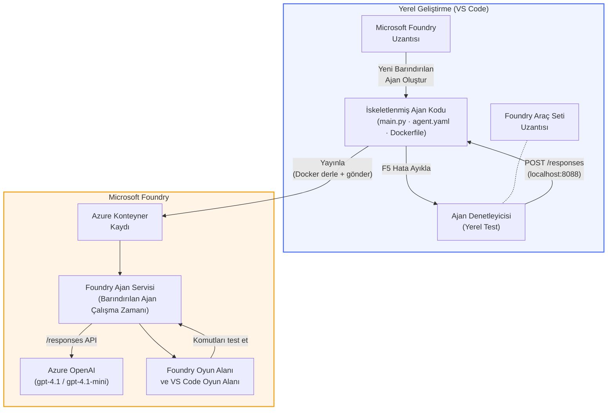

# Foundry Araç Seti + Foundry Barındırılan Ajanlar Atölyesi

[](https://www.python.org/)
[](https://github.com/microsoft/agents)
[](https://learn.microsoft.com/azure/ai-foundry/agents/concepts/hosted-agents/)
[](https://ai.azure.com/)
[](https://learn.microsoft.com/azure/ai-services/openai/)
[](https://learn.microsoft.com/cli/azure/install-azure-cli)
[](https://learn.microsoft.com/azure/developer/azure-developer-cli/install-azd)
[](https://www.docker.com/)
[](https://marketplace.visualstudio.com/items?itemName=ms-windows-ai-studio.windows-ai-studio)
[](LICENSE)

**Microsoft Foundry Agent Service** üzerinde **Barındırılan Ajanlar** olarak Yapay Zeka ajanları oluşturun, test edin ve dağıtın - tümü VS Code’dan **Microsoft Foundry eklentisi** ve **Foundry Araç Seti** kullanılarak yapılır.

> **Barındırılan Ajanlar şu anda önizleme aşamasındadır.** Desteklenen bölgeler sınırlıdır - bkz. [bölge kullanılabilirliği](https://learn.microsoft.com/azure/foundry/agents/concepts/hosted-agents#region-availability).

> Her laboratuvarın içindeki `agent/` klasörü **Foundry eklentisi tarafından otomatik olarak oluşturulur** - ardından kodu özelleştirir, yerel olarak test eder ve dağıtırsınız.

### 🌐 Çok Dilli Destek

#### GitHub Action ile Desteklenir (Otomatik & Her Zaman Güncel)

<!-- CO-OP TRANSLATOR LANGUAGES TABLE START -->
[Arapça](../ar/README.md) | [Bengalce](../bn/README.md) | [Bulgarca](../bg/README.md) | [Burma (Myanmar)](../my/README.md) | [Çince (Basitleştirilmiş)](../zh-CN/README.md) | [Çince (Geleneksel, Hong Kong)](../zh-HK/README.md) | [Çince (Geleneksel, Makao)](../zh-MO/README.md) | [Çince (Geleneksel, Tayvan)](../zh-TW/README.md) | [Hırvatça](../hr/README.md) | [Çekçe](../cs/README.md) | [Danca](../da/README.md) | [Flemenkçe](../nl/README.md) | [Estonca](../et/README.md) | [Fince](../fi/README.md) | [Fransızca](../fr/README.md) | [Almanca](../de/README.md) | [Yunanca](../el/README.md) | [İbranice](../he/README.md) | [Hintçe](../hi/README.md) | [Macarca](../hu/README.md) | [Endonezce](../id/README.md) | [İtalyanca](../it/README.md) | [Japonca](../ja/README.md) | [Kannada](../kn/README.md) | [Khmer](../km/README.md) | [Korece](../ko/README.md) | [Litvanca](../lt/README.md) | [Malayca](../ms/README.md) | [Malayalamca](../ml/README.md) | [Marathi](../mr/README.md) | [Nepalce](../ne/README.md) | [Nijerya Pidgin](../pcm/README.md) | [Norveççe](../no/README.md) | [Farsça](../fa/README.md) | [Lehçe](../pl/README.md) | [Portekizce (Brezilya)](../pt-BR/README.md) | [Portekizce (Portekiz)](../pt-PT/README.md) | [Pencapça (Gurmukhi)](../pa/README.md) | [Rumence](../ro/README.md) | [Rusça](../ru/README.md) | [Sırpça (Kiril)](../sr/README.md) | [Slovakça](../sk/README.md) | [Slovence](../sl/README.md) | [İspanyolca](../es/README.md) | [Svahili](../sw/README.md) | [İsveççe](../sv/README.md) | [Tagalog (Filipince)](../tl/README.md) | [Tamilce](../ta/README.md) | [Telugu](../te/README.md) | [Tayca](../th/README.md) | [Türkçe](./README.md) | [Ukraynaca](../uk/README.md) | [Urduca](../ur/README.md) | [Vietnamca](../vi/README.md)

> **Tercihiniz Yerelde Klonlamak mı?**
>
> Bu depo 50+ dil çevirisi içerir ve bu da indirme boyutunu önemli ölçüde artırır. Çeviriler olmadan klonlamak için sparse checkout kullanın:
>
> **Bash / macOS / Linux:**
> ```bash
> git clone --filter=blob:none --sparse https://github.com/microsoft-foundry/Foundry_Toolkit_for_VSCode_Lab.git
> cd Foundry_Toolkit_for_VSCode_Lab
> git sparse-checkout set --no-cone '/*' '!translations' '!translated_images'
> ```
>
> **CMD (Windows):**
> ```cmd
> git clone --filter=blob:none --sparse https://github.com/microsoft-foundry/Foundry_Toolkit_for_VSCode_Lab.git
> cd Foundry_Toolkit_for_VSCode_Lab
> git sparse-checkout set --no-cone "/*" "!translations" "!translated_images"
> ```
>
> Bu, kursu tamamlamak için ihtiyacınız olan her şeye çok daha hızlı bir indirme ile sahip olmanızı sağlar.
<!-- CO-OP TRANSLATOR LANGUAGES TABLE END -->

---

## Mimari


**Akış:** Foundry eklentisi ajanı oluşturur → kodu ve talimatları özelleştirirsiniz → Agent Inspector ile yerel test yapılır → Foundry’e dağıtılır (Docker görüntüsü ACR’ye gönderilir) → Playground’da doğrulanır.

---

## Neler İnşa Edeceksiniz

| Laboratuvar | Açıklama | Durum |
|-------------|-----------|-------|
| **Lab 01 - Tek Ajan** | **"Yönetici Gibi Açıkla" Ajanı** oluşturun, yerel test yapın ve Foundry’e dağıtın | ✅ Mevcut |
| **Lab 02 - Çoklu Ajan İş Akışı** | **"Özgeçmiş → İş Uygunluk Değerlendiricisi"** oluşturun - 4 ajan birlikte özgeçmiş uyum skorlaması yapar ve öğrenme yol haritası oluşturur | ✅ Mevcut |

---

## Yönetici Ajan ile Tanışın

Bu atölyede, karmaşık teknik terimleri sakin, yönetim toplantısına hazır özetlere çeviren bir Yapay Zeka ajanı olan **"Yönetici Gibi Açıkla" Ajanı**nı oluşturacaksınız. Çünkü dürüst olalım, yönetim kademesindekiler "v3.2’de tanıtılan senkron çağrılar yüzünden oluşan iş parçacığı havuzu tükenmesi" gibi şeyler duymak istemez.

Bu ajanı, mükemmel hazırlanmış ölüm sonrası raporlarıma gelen "*Öyleyse... site kapan mı?"* cevabından sonra yaptım.

### Nasıl çalışır

Teknik bir güncelleme verirsiniz. Size jargonsuz, istif izi olmayan, varoluşsal korku içermeyen üç maddelik bir yönetici özeti verir: **ne oldu**, **iş etkisi** ve **bir sonraki adım**.

### Canlı gör

**Siz söylersiniz:**
> "API gecikmesi, v3.2’de tanıtılan senkron çağrılar nedeniyle iş parçacığı havuzu tükenmesi yüzünden arttı."

**Ajan cevap verir:**

> **Yönetici Özeti:**
> - **Ne oldu:** En son sürüm sonrası sistem yavaşladı.
> - **İş etkisi:** Bazı kullanıcılar hizmeti kullanırken gecikme yaşadı.
> - **Bir sonraki adım:** Değişiklik geri alındı ve yeniden dağıtımdan önce bir düzeltme hazırlanıyor.

### Neden bu ajan?

Bu, karmaşık araç zincirlerine takılmadan barındırılan ajan iş akışını baştan sona öğrenmek için mükemmel, tek amaçlı, çok basit bir ajandır. Ve dürüst olmak gerekirse? Her mühendislik ekibinin buna ihtiyacı var.

---

## Atölye Yapısı

```
📂 Foundry_Toolkit_for_VSCode_Lab/
├── 📄 README.md                      ← You are here
├── 📂 ExecutiveAgent/                ← Standalone hosted agent project
│   ├── agent.yaml
│   ├── Dockerfile
│   ├── main.py
│   └── requirements.txt
└── 📂 workshop/
    ├── 📂 lab01-single-agent/        ← Full lab: docs + agent code
    │   ├── README.md                 ← Hands-on lab instructions
    │   ├── 📂 docs/                  ← Step-by-step tutorial modules
    │   │   ├── 00-prerequisites.md
    │   │   ├── 01-install-foundry-toolkit.md
    │   │   ├── 02-create-foundry-project.md
    │   │   ├── 03-create-hosted-agent.md
    │   │   ├── 04-configure-and-code.md
    │   │   ├── 05-test-locally.md
    │   │   ├── 06-deploy-to-foundry.md
    │   │   ├── 07-verify-in-playground.md
    │   │   └── 08-troubleshooting.md
    │   └── 📂 agent/                 ← Reference solution (auto-scaffolded by Foundry extension)
    │       ├── agent.yaml
    │       ├── Dockerfile
    │       ├── main.py
    │       └── requirements.txt
    └── 📂 lab02-multi-agent/         ← Resume → Job Fit Evaluator
        ├── README.md                 ← Hands-on lab instructions (end-to-end)
        ├── 📂 docs/                  ← Step-by-step tutorial modules
        │   ├── 00-prerequisites.md
        │   ├── 01-understand-multi-agent.md
        │   ├── 02-scaffold-multi-agent.md
        │   ├── 03-configure-agents.md
        │   ├── 04-orchestration-patterns.md
        │   ├── 05-test-locally.md
        │   ├── 06-deploy-to-foundry.md
        │   ├── 07-verify-in-playground.md
        │   └── 08-troubleshooting.md
        └── 📂 PersonalCareerCopilot/ ← Reference solution (multi-agent workflow)
            ├── agent.yaml
            ├── Dockerfile
            ├── main.py
            └── requirements.txt
```

> **Not:** Her laboratuvar içindeki `agent/` klasörü, Komut Paletinden `Microsoft Foundry: Create a New Hosted Agent` komutu çalıştırıldığında **Microsoft Foundry eklentisi** tarafından oluşturulur. Dosyalar daha sonra ajanın talimatları, araçları ve konfigürasyonları ile özelleştirilir. Lab 01, bunu baştan nasıl yapacağınızı adım adım gösterir.

---

## Başlarken

### 1. Depoyu klonlayın

```bash
git clone https://github.com/microsoft-foundry/Foundry_Toolkit_for_VSCode_Lab.git
cd Foundry_Toolkit_for_VSCode_Lab
```

### 2. Python sanal ortamı kurun

```bash
python -m venv venv
```

Aktifleştirin:

- **Windows (PowerShell):**
  ```powershell
  .\venv\Scripts\Activate.ps1
  ```
- **macOS / Linux:**
  ```bash
  source venv/bin/activate
  ```

### 3. Bağımlılıkları yükleyin

```bash
pip install -r workshop/lab01-single-agent/agent/requirements.txt
```

### 4. Ortam değişkenlerini yapılandırın

Ajan klasörünün içindeki örnek `.env` dosyasını kopyalayın ve kendi değerlerinizle doldurun:

```bash
cp workshop/lab01-single-agent/agent/.env.example workshop/lab01-single-agent/agent/.env
```

`workshop/lab01-single-agent/agent/.env` dosyasını düzenleyin:

```env
AZURE_AI_PROJECT_ENDPOINT=https://<your-account>.services.ai.azure.com/api/projects/<your-project>
MODEL_DEPLOYMENT_NAME=<your-model-deployment-name>
```

### 5. Atölye laboratuvarlarını takip edin

Her laboratuvar kendi modülleriyle bağımsızdır. Temelleri öğrenmek için **Lab 01** ile başlayın, ardından çoklu ajan iş akışları için **Lab 02**’ye geçin.

#### Lab 01 - Tek Ajan ([tam talimatlar](workshop/lab01-single-agent/README.md))

| # | Modül | Bağlantı |
|---|--------|----------|
| 1 | Önkoşulları okuyun | [00-prerequisites.md](workshop/lab01-single-agent/docs/00-prerequisites.md) |
| 2 | Foundry Araç Seti & Foundry eklentisini yükleyin | [01-install-foundry-toolkit.md](workshop/lab01-single-agent/docs/01-install-foundry-toolkit.md) |
| 3 | Bir Foundry projesi oluşturun | [02-create-foundry-project.md](workshop/lab01-single-agent/docs/02-create-foundry-project.md) |
| 4 | Barındırılan bir ajan oluşturun | [03-create-hosted-agent.md](workshop/lab01-single-agent/docs/03-create-hosted-agent.md) |
| 5 | Talimatları ve ortamı yapılandırın | [04-configure-and-code.md](workshop/lab01-single-agent/docs/04-configure-and-code.md) |
| 6 | Yerel test yapın | [05-test-locally.md](workshop/lab01-single-agent/docs/05-test-locally.md) |
| 7 | Foundry’e dağıtın | [06-deploy-to-foundry.md](workshop/lab01-single-agent/docs/06-deploy-to-foundry.md) |
| 8 | Playground’da doğrulayın | [07-verify-in-playground.md](workshop/lab01-single-agent/docs/07-verify-in-playground.md) |
| 9 | Sorun giderme | [08-troubleshooting.md](workshop/lab01-single-agent/docs/08-troubleshooting.md) |

#### Lab 02 - Çoklu Ajan İş Akışı ([tam talimatlar](workshop/lab02-multi-agent/README.md))

| # | Modül | Bağlantı |
|---|--------|----------|
| 1 | Önkoşullar (Lab 02) | [00-prerequisites.md](workshop/lab02-multi-agent/docs/00-prerequisites.md) |
| 2 | Çoklu ajan mimarisini anlayın | [01-understand-multi-agent.md](workshop/lab02-multi-agent/docs/01-understand-multi-agent.md) |
| 3 | Çoklu ajan projesini oluşturun | [02-scaffold-multi-agent.md](workshop/lab02-multi-agent/docs/02-scaffold-multi-agent.md) |
| 4 | Ajanları ve ortamı yapılandırın | [03-configure-agents.md](workshop/lab02-multi-agent/docs/03-configure-agents.md) |
| 5 | Orkestrasyon desenleri | [04-orchestration-patterns.md](workshop/lab02-multi-agent/docs/04-orchestration-patterns.md) |
| 6 | Yerel test yapın (çoklu ajan) | [05-test-locally.md](workshop/lab02-multi-agent/docs/05-test-locally.md) |
| 7 | Foundry'e Dağıt | [06-deploy-to-foundry.md](workshop/lab02-multi-agent/docs/06-deploy-to-foundry.md) |
| 8 | Oyun Alanında Doğrula | [07-verify-in-playground.md](workshop/lab02-multi-agent/docs/07-verify-in-playground.md) |
| 9 | Sorun Giderme (çoklu ajan) | [08-troubleshooting.md](workshop/lab02-multi-agent/docs/08-troubleshooting.md) |

---

## Bakıcı

<table>
<tr>
    <td align="center"><a href="https://github.com/ShivamGoyal03">
        <br />
        <sub><b>Shivam Goyal</b></sub>
    </a><br />
    </td>
</tr>
</table>

---

## Gerekli izinler (hızlı referans)

| Senaryo | Gerekli roller |
|----------|---------------|
| Yeni Foundry projesi oluştur | Foundry kaynağında **Azure AI Sahibi** |
| Mevcut projeye dağıtım (yeni kaynaklar) | Abonelikte **Azure AI Sahibi** + **Katkıda Bulunan** |
| Tam yapılandırılmış projeye dağıtım | Hesapta **Okuyucu** + projede **Azure AI Kullanıcısı** |

> **Önemli:** Azure `Sahibi` ve `Katkıda Bulunan` rolleri yalnızca *yönetim* izinlerini içerir, *geliştirme* (veri işlemi) izinlerini içermez. Ajanları oluşturmak ve dağıtmak için **Azure AI Kullanıcısı** veya **Azure AI Sahibi** olmanız gerekir.

---

## Referanslar

- [Hızlı başlangıç: İlk barındırılan ajanınızı dağıtın (VS Code)](https://learn.microsoft.com/azure/foundry/agents/quickstarts/quickstart-hosted-agent)
- [Barındırılan ajanlar nedir?](https://learn.microsoft.com/azure/foundry/agents/concepts/hosted-agents)
- [VS Code'da barındırılan ajan iş akışları oluşturma](https://learn.microsoft.com/azure/foundry/agents/how-to/vs-code-agents-workflow-pro-code)
- [Barındırılan ajan dağıtımı](https://learn.microsoft.com/azure/foundry/agents/how-to/deploy-hosted-agent)
- [Microsoft Foundry için RBAC](https://learn.microsoft.com/azure/foundry/concepts/rbac-foundry)
- [Mimari İnceleme Ajan Örneği](https://github.com/Azure-Samples/agent-architecture-review-sample) - MCP araçları, Excalidraw diyagramları ve çift dağıtımlı gerçek dünya barındırılan ajanı

---


## Lisans

[MIT](../../LICENSE)

---

<!-- CO-OP TRANSLATOR DISCLAIMER START -->
**Feragatname**:  
Bu belge, AI çeviri hizmeti [Co-op Translator](https://github.com/Azure/co-op-translator) kullanılarak çevrilmiştir. Doğruluk için çaba göstersek de, otomatik çevirilerin hatalar veya yanlışlıklar içerebileceğini lütfen unutmayın. Orijinal belge, kendi ana dilinde yetkili kaynak olarak kabul edilmelidir. Kritik bilgiler için profesyonel insan çevirisi önerilir. Bu çevirinin kullanımıyla doğabilecek herhangi bir yanlış anlama veya yorum hatasından sorumlu değiliz.
<!-- CO-OP TRANSLATOR DISCLAIMER END -->