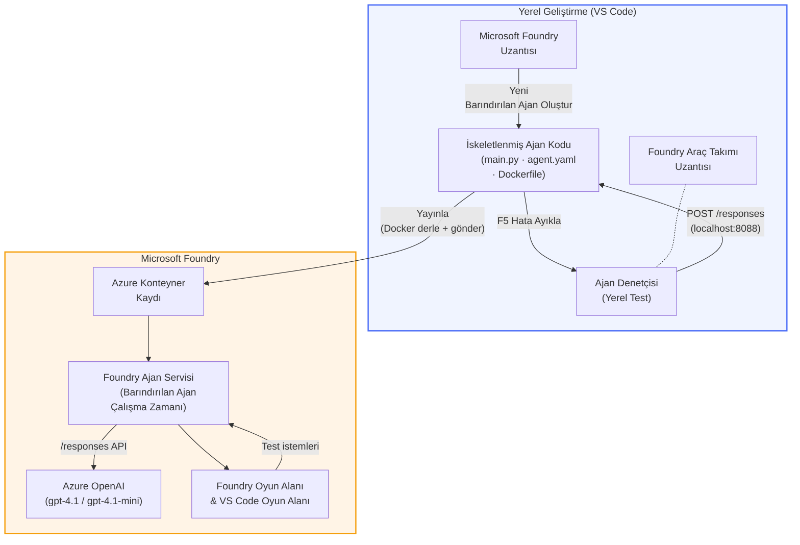

# Foundry Araç Kiti + Foundry Barındırılan Ajanlar Atölyesi

[](https://www.python.org/)
[](https://github.com/microsoft/agents)
[](https://learn.microsoft.com/azure/ai-foundry/agents/concepts/hosted-agents/)
[](https://ai.azure.com/)
[](https://learn.microsoft.com/azure/ai-services/openai/)
[](https://learn.microsoft.com/cli/azure/install-azure-cli)
[](https://learn.microsoft.com/azure/developer/azure-developer-cli/install-azd)
[](https://www.docker.com/)
[](https://marketplace.visualstudio.com/items?itemName=ms-windows-ai-studio.windows-ai-studio)
[](LICENSE)

Yapay zeka ajanlarını **Microsoft Foundry Agent Service**'ye **Barındırılan Ajanlar** olarak oluşturun, test edin ve dağıtın - tamamı VS Code'dan **Microsoft Foundry uzantısı** ve **Foundry Araç Kiti** kullanılarak yapılır.

> **Barındırılan Ajanlar şu anda önizleme aşamasındadır.** Desteklenen bölgeler sınırlıdır - bkz. [bölge uygunluğu](https://learn.microsoft.com/azure/foundry/agents/concepts/hosted-agents#region-availability).

> Her laboratuvar içindeki `agent/` klasörü **otomatik olarak Foundry uzantısı tarafından oluşturulur** - ardından kodu özelleştirir, yerel olarak test eder ve dağıtırsınız.

<!-- CO-OP TRANSLATOR LANGUAGES TABLE START -->
[Arabic](../ar/README.md) | [Bengali](../bn/README.md) | [Bulgarian](../bg/README.md) | [Burmese (Myanmar)](../my/README.md) | [Chinese (Simplified)](../zh-CN/README.md) | [Chinese (Traditional, Hong Kong)](../zh-HK/README.md) | [Chinese (Traditional, Macau)](../zh-MO/README.md) | [Chinese (Traditional, Taiwan)](../zh-TW/README.md) | [Croatian](../hr/README.md) | [Czech](../cs/README.md) | [Danish](../da/README.md) | [Dutch](../nl/README.md) | [Estonian](../et/README.md) | [Finnish](../fi/README.md) | [French](../fr/README.md) | [German](../de/README.md) | [Greek](../el/README.md) | [Hebrew](../he/README.md) | [Hindi](../hi/README.md) | [Hungarian](../hu/README.md) | [Indonesian](../id/README.md) | [Italian](../it/README.md) | [Japanese](../ja/README.md) | [Kannada](../kn/README.md) | [Khmer](../km/README.md) | [Korean](../ko/README.md) | [Lithuanian](../lt/README.md) | [Malay](../ms/README.md) | [Malayalam](../ml/README.md) | [Marathi](../mr/README.md) | [Nepali](../ne/README.md) | [Nigerian Pidgin](../pcm/README.md) | [Norwegian](../no/README.md) | [Persian (Farsi)](../fa/README.md) | [Polish](../pl/README.md) | [Portuguese (Brazil)](../pt-BR/README.md) | [Portuguese (Portugal)](../pt-PT/README.md) | [Punjabi (Gurmukhi)](../pa/README.md) | [Romanian](../ro/README.md) | [Russian](../ru/README.md) | [Serbian (Cyrillic)](../sr/README.md) | [Slovak](../sk/README.md) | [Slovenian](../sl/README.md) | [Spanish](../es/README.md) | [Swahili](../sw/README.md) | [Swedish](../sv/README.md) | [Tagalog (Filipino)](../tl/README.md) | [Tamil](../ta/README.md) | [Telugu](../te/README.md) | [Thai](../th/README.md) | [Turkish](./README.md) | [Ukrainian](../uk/README.md) | [Urdu](../ur/README.md) | [Vietnamese](../vi/README.md)

> **Yerelde Klonlamayı Tercih Ediyor musunuz?**
>
> Bu depo 50+ dil çevirisi içerdiğinden indirme boyutunu önemli ölçüde artırır. Çeviriler olmadan klonlamak için sparse checkout kullanın:
>
> **Bash / macOS / Linux:**
> ```bash
> git clone --filter=blob:none --sparse https://github.com/microsoft-foundry/Foundry_Toolkit_for_VSCode_Lab.git
> cd Foundry_Toolkit_for_VSCode_Lab
> git sparse-checkout set --no-cone '/*' '!translations' '!translated_images'
> ```
>
> **CMD (Windows):**
> ```cmd
> git clone --filter=blob:none --sparse https://github.com/microsoft-foundry/Foundry_Toolkit_for_VSCode_Lab.git
> cd Foundry_Toolkit_for_VSCode_Lab
> git sparse-checkout set --no-cone "/*" "!translations" "!translated_images"
> ```
>
> Bu size kursu tamamlamak için gereken her şeyi çok daha hızlı bir indirme ile sağlar.
<!-- CO-OP TRANSLATOR LANGUAGES TABLE END -->

---

## Mimari


**Akış:** Foundry uzantısı ajanı oluşturur → siz kodu ve talimatları özelleştirirsiniz → Agent Inspector ile yerel test → Foundry’e dağıtım (Docker görüntüsü ACR'ye itilir) → Playground'da doğrulama.

---

## Neler inşa edeceksiniz

| Laboratuvar | Açıklama | Durum |
|-------------|----------|-------|
| **Laboratuvar 01 - Tek Ajan** | **“Yönetici Gibi Açıkla” Ajanı** oluşturun, yerelde test edin ve Foundry’ye dağıtın | ✅ Mevcut |
| **Laboratuvar 02 - Çoklu Ajan İş Akışı** | **“Özgeçmiş → İş Uyumu Değerlendiricisi”** oluşturun - 4 ajan özgeçmiş uyumunu puanlamak ve öğrenme yol haritası oluşturmak için iş birliği yapar | ✅ Mevcut |

---

## Yönetici Ajan ile tanışın

Bu atölyede **“Yönetici Gibi Açıkla” Ajanı** oluşturacaksınız - karmaşık teknik jargonları alıp sakin, yönetim kurulu için uygun özetlere dönüştüren bir yapay zeka ajanı. Çünkü dürüst olalım, C-seviyesinde kim “v3.2’de tanıtılan eşzamanlı çağrılar nedeniyle oluşan iş parçacığı havuzu tükenmesi” hakkında duymak ister ki?

Bu ajanı, kusursuz hazırlanmış post-mortem’lerime karşılık olarak bir kaç kez aldığım "*Yani... site çalışıyor mu çalışmıyor mu?*" tepkileri sonrası oluşturdum.

### Nasıl çalışır

Bir teknik güncelleme verirsiniz. O, jargon ve karmaşa olmadan, sadece üç madde halinde yönetici özeti verir: **ne oldu**, **iş etkisi** ve **sonraki adım**.

### Canlı örnek

**Siz söylersiniz:**
> "API gecikmesi, v3.2’de tanıtılan eşzamanlı çağrılar nedeniyle oluşan iş parçacığı havuzu tükenmesi sebebiyle arttı."

**Ajan yanıt verir:**

> **Yönetici Özeti:**
> - **Ne oldu:** Son sürümden sonra sistem yavaşladı.
> - **İş etkisi:** Bazı kullanıcılar hizmeti kullanırken gecikmeler yaşadı.
> - **Sonraki adım:** Değişiklik geri alındı ve yeniden dağıtımdan önce bir düzeltme hazırlanıyor.

### Neden bu ajan?

Bu, amaç odaklı, basit bir ajandır - karmaşık araç zincirlerine takılmadan barındırılan ajan iş akışını baştan sona öğrenmek için mükemmeldir. Ve açıkçası? Her mühendislik ekibinin böyle bir ajana ihtiyacı var.

---

## Atölye yapısı

```
📂 Foundry_Toolkit_for_VSCode_Lab/
├── 📄 README.md                      ← You are here
├── 📂 ExecutiveAgent/                ← Standalone hosted agent project
│   ├── agent.yaml
│   ├── Dockerfile
│   ├── main.py
│   └── requirements.txt
└── 📂 workshop/
    ├── 📂 lab01-single-agent/        ← Full lab: docs + agent code
    │   ├── README.md                 ← Hands-on lab instructions
    │   ├── 📂 docs/                  ← Step-by-step tutorial modules
    │   │   ├── 00-prerequisites.md
    │   │   ├── 01-install-foundry-toolkit.md
    │   │   ├── 02-create-foundry-project.md
    │   │   ├── 03-create-hosted-agent.md
    │   │   ├── 04-configure-and-code.md
    │   │   ├── 05-test-locally.md
    │   │   ├── 06-deploy-to-foundry.md
    │   │   ├── 07-verify-in-playground.md
    │   │   └── 08-troubleshooting.md
    │   └── 📂 agent/                 ← Reference solution (auto-scaffolded by Foundry extension)
    │       ├── agent.yaml
    │       ├── Dockerfile
    │       ├── main.py
    │       └── requirements.txt
    └── 📂 lab02-multi-agent/         ← Resume → Job Fit Evaluator
        ├── README.md                 ← Hands-on lab instructions (end-to-end)
        ├── 📂 docs/                  ← Step-by-step tutorial modules
        │   ├── 00-prerequisites.md
        │   ├── 01-understand-multi-agent.md
        │   ├── 02-scaffold-multi-agent.md
        │   ├── 03-configure-agents.md
        │   ├── 04-orchestration-patterns.md
        │   ├── 05-test-locally.md
        │   ├── 06-deploy-to-foundry.md
        │   ├── 07-verify-in-playground.md
        │   └── 08-troubleshooting.md
        └── 📂 PersonalCareerCopilot/ ← Reference solution (multi-agent workflow)
            ├── agent.yaml
            ├── Dockerfile
            ├── main.py
            └── requirements.txt
```

> **Not:** Her laboratuvar içindeki `agent/` klasörü, Komut Paleti'nden `Microsoft Foundry: Yeni Barındırılan Ajan Oluştur` komutunu çalıştırdığınızda **Microsoft Foundry uzantısı** tarafından oluşturulur. Dosyalar daha sonra ajanın talimatları, araçları ve yapılandırmasıyla özelleştirilir. Laboratuvar 01, bunu sıfırdan yeniden oluşturmanızda sizi yönlendirir.

---

## Başlangıç

### 1. Depoyu klonlayın

```bash
git clone https://github.com/microsoft-foundry/Foundry_Toolkit_for_VSCode_Lab.git
cd Foundry_Toolkit_for_VSCode_Lab
```

### 2. Python sanal ortamı oluşturun

```bash
python -m venv venv
```

Aktif edin:

- **Windows (PowerShell):**
  ```powershell
  .\venv\Scripts\Activate.ps1
  ```
- **macOS / Linux:**
  ```bash
  source venv/bin/activate
  ```

### 3. Bağımlılıkları yükleyin

```bash
pip install -r workshop/lab01-single-agent/agent/requirements.txt
```

### 4. Ortam değişkenlerini yapılandırın

Agent klasörü içindeki örnek `.env` dosyasını kopyalayın ve değerlerinizi doldurun:

```bash
cp workshop/lab01-single-agent/agent/.env.example workshop/lab01-single-agent/agent/.env
```

`workshop/lab01-single-agent/agent/.env` dosyasını düzenleyin:

```env
AZURE_AI_PROJECT_ENDPOINT=https://<your-account>.services.ai.azure.com/api/projects/<your-project>
MODEL_DEPLOYMENT_NAME=<your-model-deployment-name>
```

### 5. Atölye laboratuvarlarını takip edin

Her laboratuvar kendi modülleriyle bağımsızdır. Temelleri öğrenmek için **Laboratuvar 01** ile başlayın, ardından çok ajanlı iş akışları için **Laboratuvar 02**'ye geçin.

#### Laboratuvar 01 - Tek Ajan ([tam talimatlar](workshop/lab01-single-agent/README.md))

| # | Modül | Bağlantı |
|---|-------|----------|
| 1 | Ön koşulları okuyun | [00-prerequisites.md](workshop/lab01-single-agent/docs/00-prerequisites.md) |
| 2 | Foundry Araç Kiti & Foundry uzantısını yükleyin | [01-install-foundry-toolkit.md](workshop/lab01-single-agent/docs/01-install-foundry-toolkit.md) |
| 3 | Foundry projesi oluşturun | [02-create-foundry-project.md](workshop/lab01-single-agent/docs/02-create-foundry-project.md) |
| 4 | Barındırılan ajan oluşturun | [03-create-hosted-agent.md](workshop/lab01-single-agent/docs/03-create-hosted-agent.md) |
| 5 | Talimatları ve ortamı yapılandırın | [04-configure-and-code.md](workshop/lab01-single-agent/docs/04-configure-and-code.md) |
| 6 | Yerelde test edin | [05-test-locally.md](workshop/lab01-single-agent/docs/05-test-locally.md) |
| 7 | Foundry’ye dağıtın | [06-deploy-to-foundry.md](workshop/lab01-single-agent/docs/06-deploy-to-foundry.md) |
| 8 | Oyun alanında doğrulayın | [07-verify-in-playground.md](workshop/lab01-single-agent/docs/07-verify-in-playground.md) |
| 9 | Sorun giderme | [08-troubleshooting.md](workshop/lab01-single-agent/docs/08-troubleshooting.md) |

#### Laboratuvar 02 - Çoklu Ajan İş Akışı ([tam talimatlar](workshop/lab02-multi-agent/README.md))

| # | Modül | Bağlantı |
|---|-------|----------|
| 1 | Ön koşullar (Laboratuvar 02) | [00-prerequisites.md](workshop/lab02-multi-agent/docs/00-prerequisites.md) |
| 2 | Çoklu ajan mimarisini anlayın | [01-understand-multi-agent.md](workshop/lab02-multi-agent/docs/01-understand-multi-agent.md) |
| 3 | Çoklu ajan projesini oluşturun | [02-scaffold-multi-agent.md](workshop/lab02-multi-agent/docs/02-scaffold-multi-agent.md) |
| 4 | Ajanları ve ortamı yapılandırın | [03-configure-agents.md](workshop/lab02-multi-agent/docs/03-configure-agents.md) |
| 5 | Orkestrasyon kalıpları | [04-orchestration-patterns.md](workshop/lab02-multi-agent/docs/04-orchestration-patterns.md) |
| 6 | Yerelde test edin (çoklu ajan) | [05-test-locally.md](workshop/lab02-multi-agent/docs/05-test-locally.md) |
| 7 | Foundry'e Dağıt | [06-deploy-to-foundry.md](workshop/lab02-multi-agent/docs/06-deploy-to-foundry.md) |
| 8 | Playground'da Doğrula | [07-verify-in-playground.md](workshop/lab02-multi-agent/docs/07-verify-in-playground.md) |
| 9 | Sorun Giderme (çoklu ajan) | [08-troubleshooting.md](workshop/lab02-multi-agent/docs/08-troubleshooting.md) |

---

## Bakımcı

<table>
<tr>
    <td align="center"><a href="https://github.com/ShivamGoyal03">
        <br />
        <sub><b>Shivam Goyal</b></sub>
    </a><br />
    </td>
</tr>
</table>

---

## Gerekli izinler (hızlı referans)

| Senaryo | Gerekli roller |
|----------|---------------|
| Yeni Foundry projesi oluştur | Foundry kaynağında **Azure AI Sahibi** |
| Var olan projeye dağıtım (yeni kaynaklar) | Abonelikte **Azure AI Sahibi** + **Katılımcı** |
| Tam yapılandırılmış projeye dağıtım | Hesapta **Okuyucu** + projede **Azure AI Kullanıcısı** |

> **Önemli:** Azure `Sahibi` ve `Katılımcı` rolleri yalnızca *yönetim* izinlerini içerir, *geliştirme* (veri işlemi) izinlerini içermez. Ajanları oluşturmak ve dağıtmak için **Azure AI Kullanıcısı** veya **Azure AI Sahibi** olmanız gerekir.

---

## Referanslar

- [Hızlı başlangıç: İlk barındırılan ajanınızı dağıtın (VS Code)](https://learn.microsoft.com/azure/foundry/agents/quickstarts/quickstart-hosted-agent)
- [Barındırılan ajanlar nedir?](https://learn.microsoft.com/azure/foundry/agents/concepts/hosted-agents)
- [VS Code'da barındırılan ajan iş akışları oluşturun](https://learn.microsoft.com/azure/foundry/agents/how-to/vs-code-agents-workflow-pro-code)
- [Barındırılan ajan dağıtma](https://learn.microsoft.com/azure/foundry/agents/how-to/deploy-hosted-agent)
- [Microsoft Foundry için RBAC](https://learn.microsoft.com/azure/foundry/concepts/rbac-foundry)
- [Mimari İnceleme Ajanı Örneği](https://github.com/Azure-Samples/agent-architecture-review-sample) - MCP araçları, Excalidraw diyagramları ve çift dağıtımlı gerçek dünya barındırılan ajanı

---

## Lisans

[MIT](../../LICENSE)

---

<!-- CO-OP TRANSLATOR DISCLAIMER START -->
**Feragatname**:  
Bu belge, AI çeviri hizmeti [Co-op Translator](https://github.com/Azure/co-op-translator) kullanılarak çevrilmiştir. Doğruluk için çaba göstersek de, otomatik çevirilerin hata veya yanlışlık içerebileceğini lütfen unutmayın. Orijinal belge, kendi ana dilindeki versiyonu yetkili kaynak olarak kabul edilmelidir. Kritik bilgiler için profesyonel insan çevirisi önerilir. Bu çevirinin kullanılması sonucu oluşabilecek yanlış anlamalar veya yorum hatalarından sorumlu değiliz.
<!-- CO-OP TRANSLATOR DISCLAIMER END -->