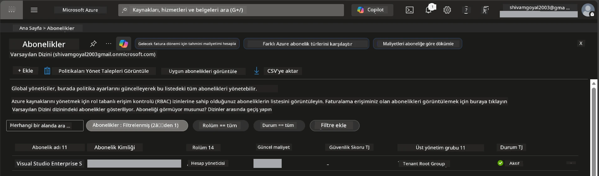

# Modül 0 - Ön Koşullar

Atölyeye başlamadan önce, aşağıdaki araçların, erişimin ve ortamın hazır olduğundan emin olun. Aşağıdaki her adımı takip edin - ileri atlamayın.

---

## 1. Azure hesabı ve aboneliği

### 1.1 Azure aboneliğinizi oluşturun veya doğrulayın

1. Bir tarayıcı açın ve [https://azure.microsoft.com/free/](https://azure.microsoft.com/free/) adresine gidin.
2. Henüz Azure hesabınız yoksa, **Ücretsiz Başlayın** butonuna tıklayın ve kayıt akışını takip edin. Bir Microsoft hesabına ihtiyacınız olacak (veya bir tane oluşturun) ve kimlik doğrulaması için kredi kartı gereklidir.
3. Zaten bir hesabınız varsa, [https://portal.azure.com](https://portal.azure.com) adresinden oturum açın.
4. Portal'da, sol navigasyondaki **Abonelikler** paneline tıklayın (veya üst arama çubuğuna "Abonelikler" yazın).
5. En az bir **Aktif** aboneliği doğrulayın. Daha sonra ihtiyaç duyacağınız **Abonelik Kimliği** not edin.



### 1.2 Gerekli RBAC rollerini anlayın

[Hosted Agent](https://learn.microsoft.com/azure/foundry/agents/concepts/hosted-agents) dağıtımı, standart Azure `Sahip` ve `Katkıda Bulunan` rollerinin içermediği **veri işlemi** izinlerini gerektirir. Aşağıdaki [rol kombinasyonlarından](https://learn.microsoft.com/azure/foundry/concepts/rbac-foundry#built-in-roles) biri gerektiğini unutmayın:

| Senaryo | Gerekli roller | Atanacağı yer |
|----------|---------------|----------------------|
| Yeni Foundry projesi oluşturma | Foundry kaynağında **Azure AI Sahibi** | Azure Portal'da Foundry kaynağı |
| Mevcut projeye (yeni kaynaklar) dağıtım | Abonelikte **Azure AI Sahibi** + **Katkıda Bulunan** | Abonelik + Foundry kaynağı |
| Tam yapılandırılmış projeye dağıtım | Hesapta **Okuyucu** + projede **Azure AI Kullanıcısı** | Azure Portal'da Hesap + Proje |

> **Önemli nokta:** Azure `Sahip` ve `Katkıda Bulunan` rolleri sadece *yönetim* izinlerini (ARM işlemleri) kapsar. Agent oluşturmak ve dağıtmak için gereken `agents/write` gibi *veri işlemleri* için [**Azure AI Kullanıcısı**](https://learn.microsoft.com/azure/foundry/concepts/rbac-foundry#built-in-roles) (veya daha yüksek) gerekir. Bu rolleri [Modül 2](02-create-foundry-project.md)'de atayacaksınız.

---

## 2. Yerel araçları yükleyin

Aşağıdaki her aracı yükleyin. Yüklemeyi tamamladıktan sonra, çalıştığını doğrulamak için kontrol komutunu çalıştırın.

### 2.1 Visual Studio Code

1. [https://code.visualstudio.com/](https://code.visualstudio.com/) adresine gidin.
2. İşletim sisteminize uygun yükleyici dosyasını indirin (Windows/macOS/Linux).
3. Yükleyiciyi varsayılan ayarlarla çalıştırın.
4. VS Code'u açarak başlatıldığını doğrulayın.

### 2.2 Python 3.10+

1. [https://www.python.org/downloads/](https://www.python.org/downloads/) adresine gidin.
2. Python 3.10 veya üstünü indirin (3.12+ önerilir).
3. **Windows:** Kurulum sırasında ilk ekranda **"Python'u PATH'e ekle"** seçeneğini işaretleyin.
4. Bir terminal açın ve şunu doğrulayın:

   ```powershell
   python --version
   ```

   Beklenen çıktı: `Python 3.10.x` veya daha yüksek.

### 2.3 Azure CLI

1. [https://learn.microsoft.com/cli/azure/install-azure-cli](https://learn.microsoft.com/cli/azure/install-azure-cli) adresine gidin.
2. İşletim sisteminiz için kurulum talimatlarını izleyin.
3. Doğrulayın:

   ```powershell
   az --version
   ```

   Beklenen: `azure-cli 2.80.0` veya daha yüksek.

4. Oturum açın:

   ```powershell
   az login
   ```

### 2.4 Azure Developer CLI (azd)

1. [https://learn.microsoft.com/azure/developer/azure-developer-cli/install-azd](https://learn.microsoft.com/azure/developer/azure-developer-cli/install-azd) adresine gidin.
2. İşletim sisteminiz için kurulum talimatlarını izleyin. Windows'ta:

   ```powershell
   winget install microsoft.azd
   ```

3. Doğrulayın:

   ```powershell
   azd version
   ```

   Beklenen: `azd version 1.x.x` veya daha yüksek.

4. Oturum açın:

   ```powershell
   azd auth login
   ```

### 2.5 Docker Desktop (isteğe bağlı)

Docker, yalnızca dağıtımdan önce konteyner görüntüsünü yerel olarak oluşturup test etmek istiyorsanız gereklidir. Foundry eklentisi, dağıtım sırasında konteyner inşa süreçlerini otomatik olarak yönetir.

1. [https://docs.docker.com/get-docker/](https://docs.docker.com/get-docker/) adresine gidin.
2. İşletim sisteminiz için Docker Desktop'u indirin ve yükleyin.
3. **Windows:** Kurulum sırasında WSL 2 alt yapısının seçili olduğundan emin olun.
4. Docker Desktop'u başlatın ve sistem tepsisindeki ikonun **"Docker Desktop çalışıyor"** şeklinde göründüğünü bekleyin.
5. Bir terminal açın ve doğrulayın:

   ```powershell
   docker info
   ```

   Bu komut Docker sistem bilgilerini hata olmadan yazdırmalıdır. Eğer `Docker daemon'a bağlanılamıyor` hatası görürseniz, Docker tamamen başlaması için birkaç saniye bekleyin.

---

## 3. VS Code eklentilerini yükleyin

Atölye başlamadan önce üç eklentiyi yüklemeniz gerekiyor.

### 3.1 Microsoft Foundry for VS Code

1. VS Code'u açın.
2. `Ctrl+Shift+X` tuşlarına basarak Eklentiler panelini açın.
3. Arama kutusuna **"Microsoft Foundry"** yazın.
4. **Microsoft Foundry for Visual Studio Code** (yayımcı: Microsoft, ID: `TeamsDevApp.vscode-ai-foundry`) eklentisini bulun.
5. **Yükle** butonuna tıklayın.
6. Yükleme tamamlandığında, Aktivite Çubuğunda (sol yan menü) **Microsoft Foundry** simgesini görün.

### 3.2 Foundry Toolkit

1. Eklentiler panelinde (`Ctrl+Shift+X`), **"Foundry Toolkit"** araması yapın.
2. **Foundry Toolkit** (yayımcı: Microsoft, ID: `ms-windows-ai-studio.windows-ai-studio`) eklentisini bulun.
3. **Yükle** butonuna tıklayın.
4. Aktivite Çubuğunda **Foundry Toolkit** simgesi görünmelidir.

### 3.3 Python

1. Eklentiler panelinde, **"Python"** araması yapın.
2. **Python** (yayımcı: Microsoft, ID: `ms-python.python`) eklentisini bulun.
3. **Yükle** butonuna tıklayın.

---

## 4. VS Code üzerinden Azure'a giriş yapın

[Microsoft Agent Framework](https://learn.microsoft.com/agent-framework/overview/) kimlik doğrulama için [`DefaultAzureCredential`](https://learn.microsoft.com/azure/developer/python/sdk/authentication/credential-chains#defaultazurecredential-overview) kullanır. VS Code içinde Azure'a giriş yapmış olmanız gerekiyor.

### 4.1 VS Code üzerinden oturum açma

1. VS Code'un sol alt köşesine bakın ve **Hesaplar** simgesine (insan silueti) tıklayın.
2. **Microsoft Foundry kullanmak için oturum aç** (ya da **Azure ile oturum aç**) seçeneğine tıklayın.
3. Bir tarayıcı penceresi açılır - aboneliğe erişimi olan Azure hesabınızla oturum açın.
4. VS Code'a geri döndüğünüzde hesabınızın adının sol alt köşede göründüğünü doğrulayın.

### 4.2 (İsteğe bağlı) Azure CLI ile oturum açma

Azure CLI yüklediyseniz ve CLI tabanlı kimlik doğrulamayı tercih ediyorsanız:

```powershell
az login
```

Bu, oturum açmak için bir tarayıcı açar. Oturum açtıktan sonra doğru aboneliği ayarlayın:

```powershell
az account set --subscription "<your-subscription-id>"
```

Doğrulayın:

```powershell
az account show --query "{name:name, id:id, state:state}" --output table
```

Abonelik adınızı, kimliğinizi ve durumu = `Enabled` olarak görmelisiniz.

### 4.3 (Alternatif) Hizmet prensibi ile kimlik doğrulama

CI/CD veya paylaşılan ortamlar için aşağıdaki ortam değişkenlerini ayarlayın:

```powershell
$env:AZURE_TENANT_ID = "<your-tenant-id>"
$env:AZURE_CLIENT_ID = "<your-client-id>"
$env:AZURE_CLIENT_SECRET = "<your-client-secret>"
```

---

## 5. Önizleme sınırlamaları

İlerlemeden önce mevcut sınırlamaların farkında olun:

- [**Hosted Agents**](https://learn.microsoft.com/azure/foundry/agents/concepts/hosted-agents) şu anda **genel önizlemede** - üretim iş yükleri için önerilmez.
- **Desteklenen bölgeler sınırlıdır** - kaynak oluşturmadan önce [bölge uygunluğunu](https://learn.microsoft.com/azure/foundry/agents/concepts/hosted-agents#region-availability) kontrol edin. Desteklenmeyen bir bölge seçerseniz, dağıtım başarısız olur.
- `azure-ai-agentserver-agentframework` paketi ön sürümdedir (`1.0.0b16`) - API'lerde değişiklik olabilir.
- Ölçek sınırları: hosted agentlar 0-5 çoğaltma (scale-to-zero dahil) destekler.

---

## 6. Ön kontrol listesi

Aşağıdaki her maddeyi çalıştırın. Herhangi bir adım başarısız olursa, devam etmeden önce geri dönüp düzeltin.

- [ ] VS Code sorunsuz açılıyor
- [ ] Python 3.10+ PATH içinde (`python --version` çıktısı `3.10.x` veya üzeri)
- [ ] Azure CLI yüklü (`az --version` çıktısı `2.80.0` veya üzeri)
- [ ] Azure Developer CLI yüklü (`azd version` sürüm bilgisi yazıyor)
- [ ] Microsoft Foundry eklentisi yüklü (Aktivite Çubuğunda simge görünür)
- [ ] Foundry Toolkit eklentisi yüklü (Aktivite Çubuğunda simge görünür)
- [ ] Python eklentisi yüklü
- [ ] VS Code’da Azure’a giriş yapılmış (sol alt Hesaplar simgesini kontrol edin)
- [ ] `az account show` aboneliğinizi döndürüyor
- [ ] (İsteğe bağlı) Docker Desktop çalışıyor (`docker info` sistem bilgisini hatasız gösteriyor)

### Kontrol noktası

VS Code Aktivite Çubuğunu açın ve hem **Foundry Toolkit** hem de **Microsoft Foundry** yan menü görünümlerini görebildiğinizi teyit edin. Her birine tıklayarak hatasız yüklendiklerini doğrulayın.

---

**Sonraki:** [01 - Foundry Toolkit & Foundry Eklentisi Yükleme →](01-install-foundry-toolkit.md)

---

<!-- CO-OP TRANSLATOR DISCLAIMER START -->
**Feragatname**:  
Bu belge, AI çeviri hizmeti [Co-op Translator](https://github.com/Azure/co-op-translator) kullanılarak çevrilmiştir. Doğruluk için çaba sarf etsek de, otomatik çevirilerin hatalar veya yanlışlıklar içerebileceğini lütfen unutmayınız. Orijinal belge, kendi dilinde yetkili kaynak olarak kabul edilmelidir. Kritik bilgiler için, profesyonel insan çevirisi önerilir. Bu çevirinin kullanımı nedeniyle oluşabilecek herhangi bir yanlış anlama veya yanlış yorumlama nedeniyle sorumluluk kabul edilmemektedir.
<!-- CO-OP TRANSLATOR DISCLAIMER END -->